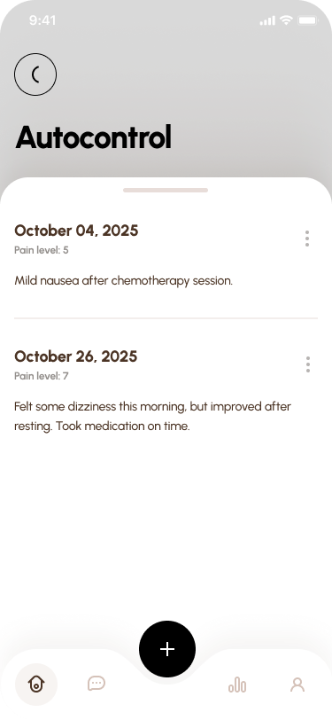

<h1 style="text-align: center;"> Informe del Trabajo Final </h1>
<h3 style="text-align: center;"> Universidad Peruana de Ciencias Aplicadas </h3>


<h5 style="text-align: center"> Área: Ingeniería de Software </h5>

<h5 style="text-align: center"> Curso: Diseño de Experimentos de Ingeniería de Software  </h5>
<h5 style="text-align: center"> NRC: 7491 </h5>

<h5 style="text-align: center"> Docente: Robles Fernández, Ivan </h5>

<h5 style="text-align: center"> Startup: OncoTech  </h5>

<h5 style="text-align: center"> Producto: OnControl  </h5>

## Team members:

  
|                Nombre                 |   Código   |
| :-----------------------------------: | :--------: |
|  Gongora Castillejos, Williams        | u20221c186 |
| Quiñones Tintaya, Johan Jorge         | u202218183 |
|  Huanaco Huayta, Elizabeth Lucero     | u20211g522 |
|  Huapaya Cuevas, Anthony              | u202220235 |
|  Uribe Quispe, Jesús Guillermo        | u202221876 |


<h5 style="text-align: center"> Ciclo 2025-20 </h5>

</div>

# Registro de Versiones del Informe

El objetivo de esta sección es resumir las modificaciones relevantes que se realizan al informe durante el ciclo de vida del proyecto. Esta sección inicia en una página nueva y se incluye un cuadro con la siguiente estructura:

| Versión | Fecha | Autor | Descripción de modificación |
| :-----: | :---: | :---: | --------------------------- |
|    TB1    |   19/09/2025   |   Jesús Uribe Quispe   | Adición del contenido de startup profile, needfinding, user stories, UX/UI Design & Software configuration development                        |

# Project Report Collaboration Insights

URL del repositorio para el reporte del proyecto: [https://github.com/ControlUPC/report/](https://github.com/ControlUPC/report/)

**TB1**

<div align="">
  
</div>


Para el desarrollo del informe perteneciente a la entrega TF, se dividió la implementación de secciones de la siguiente forma para cada integrante del equipo:

| Integrante | Tareas Asignadas |
| ---------- | ---------------- |
|Góngora Castillejos Williams | Startup Profile, NeedFinding |
| Huapaya Cuevas Anthony       |Startup Profile, desarrollo UX/UI |
|Huanaco Huayta Elizabeth | Startup Profile, desarrollo UX/UI |
|Quiñones Quintaya, Johan | Startup Profile, desarrollo UX/UI |
|Uribe Quispe Jesús | Arquitectura de software del producto, Documentación de implementación de producto |

**Github Collaboration Insights**

Github también presenta un timeline de las ramas principales y los procesos de merge a los que se han sometido. Todas las ramas se crearon tomando en cuenta el diseño de GitFlow para una buena organización cuando se usa un software de control de versiones.

Los integrantes son:

- Gongora Castillejos, Williams (WiJeGo)
- Huanaco Huayta, Elizabeth Lucero (lucerohh)
- Huapaya Cuevas, Anthony Martin (AnthonyHuapaya)
- Quiñones Quintaya, Johan Jorge (johaanq)
- Uribe Quispe, Jesús Guillermo(JesusU27)

# Contenido

# Contenido

1. [**Capítulo I: Introducción.**](#1.) <br>
   1.1. [Startup Profile.](#1.1.) <br>
   1.1.1. [Descripción del startup.](#1.1.1.)<br>
   1.1.2.[Perfiles de los integrantes del equipo.](#1.1.2.)<br>
   1.2. [Solution Profile.](#1.2.)<br>
   1.2.1. [Antecedentes y Problemática.](#1.2.1.)<br>
   1.2.2. [Lean UX Process.](#1.2.2.)<br>
   1.2.2.1 [Lean UX Problem Statements.](#1.2.2.1.)<br>
   1.2.2.2. [Lean UX Assumptions.](#1.2.2.2.)<br>
   1.2.2.3 [Lean UX Hypothesis Statements.](#1.2.2.3.)<br>
   1.2.2.4 [Lean UX Canvas.](#1.2.2.4.)<br>
   1.3. [Segmentos objetivo.](#1.3.)<br>
2. [**Capítulo II: Requirements Elicitation & Analysis.**](#2.)<br>
   2.1. [Competidores.](#2.1.)<br>
   2.1.1. [Análisis competitivo.](#2.1.1.)<br>
   2.1.2. [Estrategias y tácticas frente a competidores.](#2.1.2.)<br>
   2.2. [Entrevistas.](#2.2.)<br>
   2.2.1. [Diseño de entrevistas.](#2.2.1.)<br>
   2.2.2. [Registro de entrevistas.](#2.2.2.)<br>
   2.2.3. [Análisis de entrevistas.](#2.2.3.)<br>
   2.3. [Needfinding.](#2.3.)<br>
   2.3.1. [User Personas.](#2.3.1.)<br>
   2.3.2. [User Task Matrix.](#2.3.2.)<br>
   2.3.3. [User Journey Mapping.](#2.3.3.)<br>
   2.3.4. [Empathy Mapping.](#2.3.4.)<br>
   2.3.5. [As-is Scenario Mapping.](#2.3.5.)<br>
   2.4. [Ubiquitous Language](#2.4.)<br>
3. [**Capítulo III: Requirements Specification.**](#3.)<br>
   3.1. [To-Be Scenario Mapping.](#3.1.)<br>
   3.2. [User Stories.](#3.2.)<br>
   3.3. [Product Backlog.](#3.3.)<br>
   3.4. [Impact Mapping.](#3.4.)<br>

4. [**Capítulo IV: Product Design.**](#4.)<br>
   4.1. [Style Guidelines.](#4.1.)<br>
   4.1.1. [General Style Guidelines.](#4.1.1.)<br>
   4.1.2. [Web Style Guidelines.](#4.1.2.)<br>
   4.1.3. [Mobile Style Guidelines.](#4.1.3.)<br>
   4.1.3.1. [iOS Mobile Style Guidelines.](#4.1.3.1.)<br>
   4.1.3.2. [Android Mobile Style Guidelines.](#4.1.3.2.)<br>
   4.2. [Information Architecture.](#4.2.)<br>
   4.2.1. [Organization Systems.](#4.2.1.)<br>
   4.2.2. [Labeling Systems.](#4.2.2.)<br>
   4.2.3. [SEO Tags and Meta Tags.](#4.2.3.)<br>
   4.2.4. [Searching Systems.](#4.2.4.)<br>
   4.2.5. [Navigation Systems.](#4.2.5.)<br>
   4.3. [Landing Page UI Design.](#4.3.)<br>
   4.3.1. [Landing Page Wireframe.](#4.3.1.)<br>
   4.3.2. [Landing Page Mock-up.](#4.3.2.)<br>
   4.4. [Mobile Applications UX/UI Design.](#4.4.)<br>
   4.4.1. [Mobile Applications Wireframes.](#4.4.1.)<br>
   4.4.2. [Mobile Applications Wireflow Diagrams.](#4.4.2.)<br>
   4.4.3. [Mobile Applications Mock-ups.](#4.4.3.)<br>
   4.4.4. [Mobile Applications User Flow Diagrams.](#4.4.4.)<br>
   4.5. [Mobile Applications Prototyping.](#4.5.)<br>
   4.5.1. [Android Mobile Applications Prototyping.](#4.5.1.)<br>
   4.5.2. [iOS Mobile Applications Prototyping.](#4.5.2.)<br>
   4.6. [Web Applications UX/UI Design.](#4.6.)<br>
   4.6.1. [Web Applications Wireframes.](#4.6.1.)<br>
   4.6.2. [Web Applications Wireflow Diagrams.](#4.6.2.)<br>
   4.6.3. [Web Applications Mock-ups.](#4.6.3.)<br>
   4.6.4. [Web Applications User Flow Diagrams.](#4.6.4.)<br>
   4.7. [Web Applications Prototyping.](#4.7.)<br>
   4.8. [Domain-Driven Software Architecture.](#4.8.)<br>
   4.8.1. [Software Architecture Context Diagram.](#4.8.1.)<br>
   4.8.2. [Software Architecture Container Diagrams.](#4.8.2.)<br>
   4.8.3. [Software Architecture Components Diagrams.](#4.8.3.)<br>
   4.9. [Software Object-Oriented Design.](#4.9.)<br>
   4.9.1. [Class Diagrams.](#4.9.1.)<br>
   4.9.2. [Class Dictionary.](#4.9.2.)<br>
   4.10. [Database Design.](#4.10.)<br>
   4.10.1. [Relational/Non-Relational Database Diagram.](#4.10.1.)<br>

5. [**Capítulo V: Product Implementation.**](#5.)<br>
   5.1. [Software Configuration Management.](#5.1.)<br>
   5.1.1. [Software Development Environment Configuration.](#5.1.1.)<br>
   5.1.2. [Source Code Management.](#5.1.2.)<br>
   5.1.3. [Source Code Style Guide & Conventions.](#5.1.3.)<br>
   5.1.4. [Software Deployment Configuration.](#5.1.4.)<br>
   5.2. [Product Implementation & Deployment.](#5.2.)<br>
   5.2.1.1. [Sprint Backlogs.](#5.2.1.1)<br>
   5.2.1.2. [Implemented Landing Page Evidence.](#5.2.1.2.)<br>
   5.2.1.3. [Implemented Frontend-Web Application Evidence.](#5.2.1.3.)<br>
   5.2.1.4. [Acuerdo de Servicio - SaaS](#5.2.1.4.)<br>
   5.2.1.5. [Implemented Native-Mobile Application Evidence.](#5.2.1.5.)<br>
   5.2.1.6. [Implemented RESTful API and/or Serverless Backend Evidence.](#5.2.1.6.)<br>
   5.2.1.7 [RESTful API documentation.](#5.2.1.7.)<br>
   5.2.1.8. [Team Collaboration Insights.](#5.2.1.8.)<br>
   5.3. [Video About-the-Product.](#5.3.)<br>

6. [**Capítulo VI: Product Verification & Validation.**](#6.)<br>
   6.1. [Testing Suites & Validation.](#6.1.)<br>
   6.1.1. [Core Entities Unit Tests.](#6.1.1.)<br>
   6.1.2. [Core Integration Tests.](#6.1.2.)<br>
   6.1.3. [Core Behavior-Driven Development.](#6.1.3.)<br>
   6.1.4. [Core System Tests.](#6.1.4.)<br>

7. [**Capítulo VII: DevOps Practices.**](#7.)<br>
   7.1. [Continuous Integration.](#7.1.)<br>
   7.1.1. [Tools and Practices.](#7.1.1.)<br>
   7.1.2. [Build & Test Suite Pipeline Components.](#7.1.2.)<br>
   7.2. [Continuous Delivery.](#7.2.)<br>
   7.2.1. [Tools and Practices.](#7.2.1.)<br>
   7.2.2. [Stages Deployment Pipeline Components.](#7.2.2.)<br>
   7.3. [Continuous Deployment.](#7.3.)<br>
   7.3.1. [Tools and Practices.](#7.3.1.)<br>
   7.3.2. [Production Deployment Pipeline Components.](#7.3.2.)<br>

8. [Conclusiones](#8.)<br>
9. [Bibliografía](#9.)<br>
10. [Anexo](#10.)<br>


# STUDENT OUTCOME

**ABET – EAC - Student Outcome 4**<br>
La capacidad de reconocer responsabilidades éticas y profesionales en situaciones de ingeniería y hacer juicios informados, que deben considerar el impacto de las soluciones de ingeniería en contextos globales, económicos, ambientales y sociales.

<table>
  <thead>
    <tr>
      <th>Criterio específico</th>
      <th>Acciones realizadas</th>
      <th>Conclusiones</th>
    </tr>
  </thead>
  <tbody>
    <tr>
      <td style="font-weight:bold">4.C.1 Reconoce responsabilidad ética y profesional en situaciones de ingeniería de software</td>
      <td>
      <strong>Huanaco Huayta, Elizabeth Lucero</strong> <br> 
      <strong>TB1:</strong> <p align="justify">El desarrollo de wireframes, wireflows, mock-ups, user flows y prototipos móviles me permitió reconocer mi responsabilidad ética y profesional en la ingeniería de software. Estas tareas me ayudaron a diseñar interfaces centradas en la experiencia del usuario, priorizando la claridad, la accesibilidad y la usabilidad. Asimismo, al trabajar en el prototipado para Android e iOS, comprendí la importancia de seguir estándares de calidad y adaptar la aplicación a cada plataforma. Todo este proceso reforzó mi compromiso con crear soluciones confiables y útiles, considerando siempre el impacto que tienen las decisiones de diseño en la vida de pacientes y doctores. <br><br>
      <strong>Huapaya Cuevas, Anthony Martin</strong> <br>
      <strong>TB1:</strong> <p align="justify">La elaboración de wireframes, wireflows, mock-ups, user flows y prototipos móviles me permitió reflexionar sobre mi responsabilidad ética y profesional en el ámbito de la ingeniería de software. Estas actividades fueron clave para diseñar interfaces centradas en la experiencia del usuario, donde se priorizó la claridad, la accesibilidad y la facilidad de uso. Además, al desarrollar prototipos tanto para Android como para iOS, comprendí la relevancia de cumplir con los estándares de calidad y de adaptar la aplicación a las particularidades de cada plataforma. En conjunto, este proceso fortaleció mi compromiso con la creación de soluciones confiables y efectivas, teniendo siempre en cuenta el impacto que las decisiones de diseño generan en la vida de pacientes y profesionales de la salud. </p><br>
      <strong>Uribe Quispe, Jesús Guillermo</strong> <br>
      <strong>TB1:</strong> <p align="justify"> Durante el desarrollo del proyecto, asumí la responsabilidad ética y profesional al diseñar la arquitectura de software, elaborando el diagrama de contenedores, de componentes, de clases y el modelo de bases de datos, asegurándome de que cada decisión fuera clara, documentada y trazable para facilitar la comprensión del equipo y garantizar la mantenibilidad del sistema. </p><br>
      <strong>Gongora Castillejos, Williams</strong> <br>
      <strong>TB1:</strong> <p align="justify">Durante el desarrollo de los capítulos 1 y 2, reconocí mi responsabilidad ética y profesional al definir claramente el Startup Profile, la problemática real y los segmentos objetivo, asegurando que la solución responda a necesidades genuinas de médicos y pacientes. Asimismo, en el análisis competitivo, entrevistas y construcción de artefactos de Needfinding, apliqué buenas prácticas de ingeniería de software, priorizando la transparencia, la privacidad de los datos y la utilidad social de la aplicación, lo que refleja un compromiso ético con los usuarios y la sociedad. </p><br>
      <strong>Quiñones Tintaya, Johan Jorge</strong> <br>
      <strong>TB1:</strong> <p align="justify"> En el desarrollo de los Wireframes, Wireflows, Mock-ups y User Flows de OnControl, reconocí la importancia de la responsabilidad ética y profesional en el diseño de soluciones dirigidas al sector salud. Durante este proceso, tomé decisiones orientadas a garantizar la seguridad de la información médica, la usabilidad para médicos y pacientes y la precisión en la representación de datos sensibles como historiales clínicos, tratamientos y síntomas. Este trabajo reflejó mi compromiso de que las interfaces no solo sean funcionales, sino que también respeten principios de confidencialidad, accesibilidad y confiabilidad, aspectos éticos esenciales en la ingeniería de software aplicada a contextos médicos. </p><br>
      </td>
      <td>
        <p> <strong>TB1:</strong>
        El desarrollo de interfaces y la construcción de la arquitectura del sistema permitieron reconocer la importancia de la responsabilidad ética y profesional en la ingeniería de software. Al priorizar la claridad, accesibilidad, usabilidad y estandarización en las decisiones de diseño y documentación, se consolidó el compromiso con la creación de soluciones confiables, adaptadas a las plataformas y sostenibles en el tiempo, siempre considerando el bienestar de pacientes y profesionales de la salud.
        </p>
      </td>
    </tr>
    <tr>
      <td  style="font-weight:bold">4.C.2 Emite juicios informados considerando el impacto de las soluciones de ingeniería de software en contextos globales, económicos, ambientales y sociales</td>
      <td>
      <strong>Huanaco Huayta, Elizabeth Lucero</strong> <br> 
      <strong>TB1:</strong> <p align="justify">El desarrollo de wireframes, wireflows, mock-ups, user flows y prototipos móviles me ayudó a emitir juicios informados sobre el impacto de la aplicación. Al diseñar las vistas pensé en el efecto social, facilitando la comunicación y accesibilidad para pacientes y doctores. También en el aspecto económico, al optimizar la gestión de citas y tratamientos. Consideré el impacto global, al crear un diseño adaptable a diferentes plataformas. Estas tareas me permitieron entender que las decisiones de diseño tienen consecuencias más allá de lo técnico, influyendo directamente en la vida de los usuarios y en el contexto en el que se aplica la solución.</p><br><br>
      <strong>Huapaya Cuevas, Anthony Martin</strong> <br>
      <strong>TB1:</strong> <p align="justify">La creación de wireframes, wireflows, mock-ups, user flows y prototipos móviles me permitió reflexionar sobre el impacto que puede generar la aplicación. Durante el diseño de las vistas tuve en cuenta el efecto social, al fomentar una comunicación más fluida y accesible entre pacientes y doctores. También consideré la dimensión económica, al proponer una solución que optimiza la gestión de citas y tratamientos. Asimismo, valoré el alcance global al diseñar una interfaz adaptable a distintas plataformas. Este proceso me hizo comprender que las decisiones de diseño trascienden lo técnico, pues influyen directamente en la vida de los usuarios y en el entorno donde se implementa la solución. </p><br>
      <strong>Uribe Quispe, Jesús Guillermo</strong> <br>
      <strong>TB1:</strong> <p align="justify"> Al preparar la documentación de implementación del producto, emití juicios informados considerando el impacto que las soluciones de software podrían tener en el contexto global, económico, ambiental y social. Esto me llevó a priorizar decisiones que promuevan la eficiencia en el uso de recursos, la escalabilidad y la accesibilidad del sistema, contribuyendo a un producto sostenible y con potencial de adaptarse a diferentes escenarios. </p><br>
      <strong>Gongora Castillejos, Williams</strong> <br>
      <strong>TB1:</strong> <p align="justify">En los capítulos 1 y 2 emití juicios informados al analizar la problemática oncológica en el Perú, considerando el impacto social de facilitar la comunicación entre médicos y pacientes, el potencial económico de un modelo de negocio sostenible, y la escalabilidad global hacia otras especialidades médicas. Además, evalué la importancia de la seguridad y privacidad de datos como un factor crítico con repercusiones éticas y sociales en el uso responsable de la tecnología. </p><br>
      <strong>Quiñones Tintaya, Johan Jorge</strong> <br>
      <strong>TB1:</strong> <p align="justify"> Al diseñar y documentar las interfaces de OnControl (wireframes, wireflows, mock-ups y user flows), emití juicios informados sobre cómo estas soluciones pueden impactar global y socialmente. Reconocí que una plataforma enfocada en oncología contribuye a mejorar el acceso a la salud digital, optimiza la gestión médica y reduce costos administrativos, lo cual tiene un impacto económico positivo en instituciones de salud. Asimismo, consideré que el diseño debía ser escalable y adaptable a distintos entornos, lo que abre la posibilidad de replicarse en contextos globales con similares necesidades. Además, busqué minimizar el uso excesivo de recursos físicos al digitalizar procesos antes manejados en papel, aportando indirectamente a un impacto ambiental positivo. </p><br>
      </td>
      <td>
        <p><strong>TB1:</strong>
        La reflexión sobre los impactos globales, sociales, económicos y ambientales del software permitió emitir juicios informados que guían el desarrollo hacia la sostenibilidad y la eficiencia. Al diseñar interfaces accesibles, optimizar recursos y contemplar la escalabilidad, se comprendió que las soluciones de ingeniería no se limitan a lo técnico, sino que influyen directamente en la vida de los usuarios y en el contexto donde son implementadas.
        </p>
      </td>
    </tr>
  </tbody>
</table>

<div id='1.'><h2>1. Capítulo I: Introducción</h2></div>

<div id='1.1.'><h3>1.1. Startup Profile</h3></div>
<div id='1.1.1.'><h4>1.1.1. Descripción del startup</h4></div>
OnControl es una aplicación creada por alumnos de Ingeniería de Software de la Universidad Peruana de Ciencias Aplicadas (UPC), con el objetivo de ofrecer apoyo y organización tanto a pacientes oncológicos como a médicos oncólogos en el sector de la salud. Reconocemos las complejidades y desafíos que enfrentan estos dos grupos en el proceso de tratamiento del cáncer, por lo que buscamos darles la importancia debida.

OnControl ofrece una plataforma integral que facilita la gestión de pacientes y la organización de su información. Los médicos pueden administrar eficientemente los datos de sus pacientes, asignar tratamientos y procedimientos. Los pacientes, por su parte, pueden agendar sus citas médicas, además de consultarlas como los procedimientos y tratamientos que lleva.

Como valor diferencial, OnControl integra sensores IoT que permiten medir parámetros vitales como saturación de oxígeno, ritmo cardíaco y temperatura corporal. Estos datos se registran y muestran en la aplicación del paciente y en la plataforma web del médico, generando alertas cuando se exceden los rangos saludables y contribuyendo a una atención más segura y oportuna.

- **Misión:** Mejorar la calidad de vida de pacientes oncológicos y optimizar el seguimiento médico mediante herramientas tecnológicas innovadoras.

- **Visión:** Ser la plataforma líder en salud oncológica digital en el Perú, reconocida por nuestra innovación, accesibilidad y compromiso con la atención integral.

</ul>
<div id='1.1.2.'><h4>1.1.2. Perfiles de los integrantes del equipo</h4></div>

<table>
  <tr>
    <th>Miembro del equipo</th>
    <th>Descripción</th>
    <th>Codigo de usuario</th>
  </tr>
  <tr>
    <td></td>
    <td>Mi nombre es Johan Jorge Quiñones Tintaya, tengo 19 años y soy estudiante de ingeniería de software en la UPC, cursando el quinto ciclo. He adquirido una base sólida en algoritmos y programación orientada a objetos, lo que me permite enfrentar desafíos de desarrollo con eficacia. Además, me destaco por mi capacidad para trabajar en equipo, manteniendo una comunicación clara y efectiva que facilita la colaboración. Estoy comprometido con mi crecimiento profesional y busco constantemente mejorar mis habilidades para contribuir de manera significativa en proyectos y equipos, ofreciendo soluciones innovadoras.</td>
    <td>U202218183</td>
  </tr>
  <tr>
    <td></td>
    <td>Estoy en el séptimo ciclo de Ingeniería de Software en la Universidad Peruana de Ciencias Aplicadas. Me considero una persona organizada, resiliente y asertiva. Elegí enfocarme en esta carrera por el interés que tengo en el desarrollo de software, ya que considero que es un área clave para el futuro de la innovación tecnológica. Actualmente tengo conocimientos de tecnologías como Java, SQL y desarrollo de aplicaciones modernas con el enfoque Domain Driven Design. En este proyecto, me comprometo a aplicar mis conocimientos y a contribuir con el logro de los objetivos de mi equipo, fomentando un ambiente colaborativo.</td>
    <td>U20211G522</td>
  </tr>
  <tr>
    <td></td>
    <td>Mi nombre es Anthony Huapaya y soy estudiante de la carrera de Ingeniería de Software, cursando el séptimo ciclo. Mis conocimientos con respecto a tecnologías son Java, SQL y un poco de Python, aplicando esto al modelo de Domain Driven Design. Me considero una persona que apoya constantemente al grupo, mantiene un ambiente laboral estable, me gusta escuchar las opiniones o puntos de vista de los demás y soy alguien que se adapta a cualquier forma de trabajo.</td>
    <td>U202220235</td>
  </tr>
  <tr>
    <td></td>
    <td>Mi nombre es Williams Jesús Góngora Castillejos y soy estudiante del quinto ciclo de la carrera de Ingeniería de Software. Me considero una persona inteligente en todo lo que conlleva a números y razonamiento intuitivo, además de ser creativo para generar soluciones como ingeniero. Cuento con conocimientos en SQL, C++ y Python. Dentro de mis habilidades interpersonales, soy amable, empático y trato de establecer confianza entre mis compañeros para realizar un mejor trabajo en equipo.</td>
    <td>U20221C186</td>
  </tr>
  <tr>
    <td></td>
    <td>Soy estudiante de Ingenieria de Software en la UPC y actualmente estoy en el 7to ciclo. Elegí esta carrera porque me interesó el campo del software y la matemáticas. Me comprometo a ayudar a mis compañeros con el trabajo asi como también fuera de este.</td>
    <td>U202221876</td>
  </tr>
</table>

<div id='1.2.'><h3>1.2. Solution Profile</h3></div>
<div id='1.2.1.'><h4>1.2.1. Antecedentes y Problemática</h4></div>

* **What – ¿Cuál es el problema?** <br>
  El cuidado oncológico en el Perú presenta deficiencias en la gestión de citas médicas, el seguimiento de tratamientos y la organización de la información clínica, generando ineficiencia en la atención y disminuyendo la calidad del servicio.

* **When – ¿Cuándo sucede el problema?** <br>
  El problema es recurrente y persistente, ya que los pacientes y médicos deben enfrentarlo diariamente debido a la falta de herramientas digitales de soporte en el proceso oncológico.

* **Where – ¿Dónde surge el problema?** <br>
  Esta situación se presenta en pacientes que padecen cáncer al no tener un buen control de seguimiento, citas, medicamentos, etc.

* **Who – ¿Quiénes son afectados?** <br>
  Los principales afectados son los pacientes oncológicos y sus familias, quienes experimentan mayor ansiedad y desinformación; y los médicos oncólogos, que enfrentan sobrecarga laboral y riesgo de agotamiento profesional. También repercute en el desempeño de equipos médicos multidisciplinarios.

* **Why – ¿Cuál es la causa?** <br>
  La raíz del problema se encuentra en la ausencia de soluciones tecnológicas integrales y procesos optimizados que permitan centralizar la información, facilitar el seguimiento del tratamiento y mejorar la comunicación entre los distintos actores del cuidado oncológico.

* **How – ¿Cómo ocurre?** <br>
  La gestión continúa realizándose mediante métodos manuales o fragmentados, lo que conlleva a retrasos, duplicación de esfuerzos, errores en la administración de medicamentos y dificultades para mantener una comunicación fluida entre médicos y pacientes.

* **How much – ¿Cuál es la magnitud?** <br>
  La magnitud es considerable: en Perú, más del 60 % de los casos de cáncer son diagnosticados en etapas avanzadas (MINSA, 2023), lo que refleja la falta de seguimiento temprano. Además, más del 45 % de oncólogos reportan síntomas de agotamiento profesional (Shanafelt et al., 2014), lo que evidencia el impacto negativo tanto en la calidad de vida de los pacientes como en la capacidad operativa del personal de salud.
  <br>

<div align="center">
  
  <p><em>Grafica 1: Tendencias de mortalidad por cáncer en el Perú.</em></p>
</div>

<div id='1.2.2.'><h4>1.2.2. Lean UX Process</h4></div>

<div id='1.2.2.1.'><h5>1.2.2.1. Lean UX Problem Statements</h5></div>

El tratamiento y cuidado de los pacientes con cáncer suele ser un proceso agotador y complejo. La falta de información clara, organización adecuada y comprensión del proceso terapéutico incrementa significativamente la ansiedad y el estrés tanto en los pacientes como en sus familiares. En el Perú, más del 60 % de los casos son diagnosticados en etapas avanzadas, lo que agrava aún más esta situación (MINSA, 2023).

Al mismo tiempo, los médicos oncólogos enfrentan una elevada carga asistencial, gestionando múltiples pacientes con horarios y tratamientos altamente específicos que requieren un seguimiento constante. Esta realidad contribuye a la sobrecarga laboral y al desgaste profesional, con estudios que señalan que más del 45 % de oncólogos presentan síntomas de agotamiento (Shanafelt et al., 2014).

Frente a la falta de herramientas que faciliten el acceso a información sobre medicamentos, la organización de citas y la coordinación del tratamiento, surge una interrogante fundamental:

<br><br><div align="center">
**¿Qué soluciones tecnológicas pueden contribuir a mejorar la coordinación en la atención oncológica y garantizar un proceso más claro y menos estresante para pacientes, familiares y médicos?**

</div>

<div id='1.2.2.2.'><h5>1.2.2.2. Lean UX Assumptions</h5></div>

**Features (Características):**

* Interfaz intuitiva y de fácil acceso para médicos y pacientes.
* Aplicación móvil gratuita para pacientes.
* Calendario digital para visualizar citas y tratamientos.
* Herramientas de planificación para el seguimiento clínico.
* Monitoreo de signos vitales mediante sensores IoT (ritmo cardíaco, temperatura y oxigenación).
* Alertas automáticas cuando los parámetros vitales sobrepasen los rangos saludables.

**Business Assumptions (Supuestos de negocio):**

* Creemos que los pacientes oncológicos valoran una plataforma que centralice información confiable sobre sus citas, tratamientos y monitoreo de salud.
* Creemos que los familiares se beneficiarán de una mayor claridad sobre el estado del paciente, lo que generará confianza y reducirá su ansiedad.
* Creemos que la digitalización del seguimiento y el monitoreo de parámetros vitales permitirá a los pacientes optimizar su tiempo.

**Business Outcomes (Resultados esperados):**

* Los usuarios incrementarán el uso de la aplicación al percibir mayor facilidad de acceso a información y a su estado de salud.
* Los pacientes experimentarán una mejor gestión y seguimiento de sus citas y tratamientos.
* Se contribuirá a mejorar el estado emocional de pacientes y familiares, lo que impactará positivamente en la adherencia al tratamiento.

**User Benefits (Beneficios para el usuario):**

* Mayor seguridad y confianza al contar con un monitoreo constante de signos vitales.
* Reducción del estrés y la ansiedad de pacientes y familiares gracias a un sistema más claro y organizado.
* Organización más eficiente para los médicos tratantes, al poder gestionar múltiples casos y recibir alertas tempranas.

<div id='1.2.2.3.'><h5>1.2.2.3. Lean UX Hypothesis Statements</h5></div>

* **Hypothesis 1:**
Creemos que el monitoreo de signos vitales (ritmo cardíaco, temperatura y oxigenación) mediante sensores IoT ayudará a los pacientes a sentirse más protegidos y permitirá a los médicos detectar posibles alertas tempranas. Será exitoso cuando al menos el 65 % de los usuarios expresen que la aplicación les da una sensación de mayor seguridad en su cuidado.

* **Hypothesis 2:**
Creemos que los médicos oncólogos mejorarán la organización de sus pacientes al centralizar en una sola plataforma la información de citas, tratamientos y parámetros vitales. Consideraremos alcanzado el objetivo cuando, en entrevistas posteriores, al menos el 70 % de los médicos reporten una disminución en los errores organizativos o en la duplicidad de esfuerzos.

* **Hypothesis 3:**
Creemos que el envío de alertas automáticas cuando los parámetros vitales sobrepasen los rangos saludables permitirá reaccionar con mayor rapidez ante situaciones de riesgo. Será considerado un éxito cuando al menos el 60 % de los usuarios reconozcan que las alertas les ayudaron a tomar decisiones preventivas oportunas.

<div id='1.2.2.4.'><h5>1.2.2.4. Lean UX Canvas</h5></div>
En esta sección se presenta el Lean UX Canvas de la propuesta, donde se detallan los supuestos clave del proyecto, las necesidades de los usuarios, las posibles soluciones y las hipótesis que guiarán el proceso de validación.
<br>
<br>

<div align="center">
  
</div>
  <p><em>Grafica 2: Lean UX Canvas Control</em></p>


<div id='1.3.'><h3>1.3. Segmentos objetivo</h3></div>

Nuestra aplicación está dirigida principalmente a facilitar la gestión de responsabilidades de los pacientes oncológicos en el Perú, creando un espacio digital que facilite la organización, el seguimiento del tratamiento y la comunicación en la atención oncológica.

Los médicos oncólogos requieren herramientas para optimizar la gestión de citas, el registro de historias clínicas y el monitoreo del progreso de sus pacientes, además de concientizar a través de un portal como blogs y artículos.


| Segmento                  | Característica principal                              | Rango de edad | Necesidades clave                                                                                     | Nivel tecnológico                                                                    |
| ------------------------- | ----------------------------------------------------- | ------------- | ----------------------------------------------------------------------------------------------------- | ------------------------------------------------------------------------------------ |
| **Médicos oncólogos**     | Profesionales de la salud especializados en oncología | 30 – 55 años  | Gestión de pacientes y citas, registro de historias clínicas, monitoreo del progreso de pacientes     | Familiarizados con dispositivos móviles y computadoras                               |
| **Pacientes oncológicos** | Personas en tratamiento o seguimiento oncológico      | 25 – 65 años  | Reserva de citas, recordatorios de tratamiento, registro de signos vitales, acceso a historial médico | Varía según el caso, pero en general utilizan smartphones como principal dispositivo, gestión de tratamientos y medicamentos. |


<div id='2.'><h2>2. Capítulo II: Requirements Elicitation & Analysis</h2></div>

<div id='2.1.'><h3>2.1. Competidores</h3></div>

<div id='2.1.1.'><h4>2.1.1. Análisis competitivo</h4></div>

<table>
  <tr>
    <th colspan="6" valign="top"><b>Análisis Competitivo</b></th>
  </tr>
  <tr>
    <td colspan="1" rowspan="2" valign="top">¿Por qué llevar a cabo este Análisis?</td>
    <td colspan="5" valign="top">Este análisis nos ayudará a comprender mejor a nuestra competencia, identificando sus debilidades y fortalezas. Esto nos permitirá desarrollar estrategias para mejorar nuestro producto.</td>
  </tr>
  <tr></tr>
 <tr>
  <td colspan="2" valign="top"></td>
  <td colspan="1" valign="top" style="vertical-align: middle; text-align: center;">
    
  </td>
  <td colspan="1" valign="top" style="vertical-align: middle; text-align: center;">
    
  </td>
  <td colspan="1" valign="top" style="vertical-align: middle; text-align: center;">
    
  </td>
  <td colspan="1" valign="top" style="vertical-align: middle; text-align: center;">
    
  </td>
</tr>

  <tr>
    <td rowspan="2" valign="top">Perfil</td>
    <td valign="top">Overview</td>
    <td valign="top">Aplicación móvil que ofrece información y consejos de cuidado emocional, nutricional y físico para pacientes con cáncer.</td>
    <td valign="top">Aplicación que brinda apoyo personalizado a pacientes con cáncer.</td>
    <td valign="top">Aplicación que permite a los médicos monitorear pacientes mediante encuestas diarias.</td>
    <td valign="top">Aplicación móvil para pacientes y aplicación web para médicos, con herramientas de organización y planificación de tratamientos oncológicos.</td>
  </tr>
  <tr>
    <td valign="top">¿Qué valor ofrece a los clientes?</td>
    <td valign="top">Brinda consejos y ejercicios para la salud física y mental durante el tratamiento.</td>
    <td valign="top">Ofrece seguimiento de la salud del paciente y recomienda clínicas para exámenes y tratamientos.</td>
    <td valign="top">Proporciona herramientas para el monitoreo continuo del estado del paciente.</td>
    <td valign="top">Facilita la organización de citas y tratamientos, así como calendarios personalizados que reducen la carga de pacientes y médicos.</td>
  </tr>
  <tr>
    <td rowspan="2" valign="top">Perfil de Marketing</td>
    <td valign="top">Mercado objetivo</td>
    <td valign="top">Personas que inician o continúan tratamiento oncológico.</td>
    <td valign="top">Pacientes que buscan o ya reciben tratamiento.</td>
    <td valign="top">Pacientes que requieren acompañamiento en todo su tratamiento.</td>
    <td valign="top">Médicos oncólogos con alta carga laboral y pacientes que necesitan una mejor organización.</td>
  </tr>
  <tr>
    <td valign="top">Estrategias de marketing</td>
    <td valign="top">Promoción en su sitio web.</td>
    <td valign="top">Webinars y videos en su sitio web.</td>
    <td valign="top">Prueba gratuita para luego migrar a planes pagos.</td>
    <td valign="top">Landing page informativa y difusión en canales digitales de salud.</td>
  </tr>
  <tr>
    <td rowspan="3" valign="top">Perfil de Producto</td>
    <td valign="top">Productos & Servicios</td>
    <td valign="top">Consejos de nutrición, ejercicios físicos y apoyo emocional durante el tratamiento.</td>
    <td valign="top">Monitoreo del paciente y acceso a información sobre tipos de cáncer y clínicas recomendadas.</td>
    <td valign="top">Monitoreo diario, consejos de nutrición, ejercicio y manejo del estrés.</td>
    <td valign="top">Calendarios de citas, alarmas y recordatorios, además de una plataforma web para médicos y móvil para pacientes.</td>
  </tr>
  <tr>
    <td valign="top">Precios y costos</td>
    <td valign="top">Gratuita.</td>
    <td valign="top">De uso gratuito y sin restricciones.</td>
    <td valign="top">Modelos de suscripción con opciones gratuitas y de pago.</td>
    <td valign="top">Planes Free, Premium y Pro Service.</td>
  </tr>
  <tr>
    <td valign="top">Canales de distribución</td>
    <td valign="top">Aplicación móvil (Google Play y App Store).</td>
    <td valign="top">Aplicación móvil (Google Play y App Store) + Web App.</td>
    <td valign="top">Aplicación móvil (Google Play y App Store).</td>
    <td valign="top">Aplicación móvil (pacientes), Aplicación web (médicos) y landing page de acceso.</td>
  </tr>
  <tr>
    <td rowspan="4" valign="top">Análisis SWOT</td>
    <td valign="top">Fortalezas</td>
    <td valign="top">Variedad de información científica validada.</td>
    <td valign="top">Apoyo de especialistas y amplia información de clínicas.</td>
    <td valign="top">Gran variedad de herramientas, gestión de síntomas e información de tratamientos.</td>
    <td valign="top">Facilita la comunicación y organización de citas con un calendario interactivo.</td>
  </tr>
  <tr>
    <td valign="top">Debilidades</td>
    <td valign="top">Carece de interacción directa con usuarios.</td>
    <td valign="top">Limitada a ciertos tipos de cáncer.</td>
    <td valign="top">No ofrece comunicación directa con un médico.</td>
    <td valign="top">Carece de videollamadas integradas para consultas.</td>
  </tr>
  <tr>
    <td valign="top">Oportunidades</td>
    <td valign="top">Pocas apps consideran la salud física y mental al mismo nivel.</td>
    <td valign="top">Respaldo de inversionistas en oncología.</td>
    <td valign="top">Posible adopción en hospitales como complemento.</td>
    <td valign="top">Escasa competencia en plataformas médico-paciente integradas.</td>
  </tr>
  <tr>
    <td valign="top">Amenazas</td>
    <td valign="top">Aparición de apps multiplataforma.</td>
    <td valign="top">Usuarios con tipos de cáncer no cubiertos.</td>
    <td valign="top">Nuevas apps con funcionalidades similares.</td>
    <td valign="top">Competencia indirecta de apps generales como WhatsApp, Telegram o Google Calendar.</td>
  </tr>
</table>


<div id='2.1.2.'><h4>2.1.2. Estrategias y tácticas frente a competidores</h4></div>

**1. Experiencia diferenciada por perfil**

* **Estrategia:** Diseñar una experiencia optimizada para cada segmento: médicos (plataforma web) y pacientes (aplicación móvil).
* **Táctica:** Implementar dashboards clínicos para médicos y una app para pacientes con funciones de accesibilidad, recordatorios, gestión de citas, tratamientos, progreso y registro de signos vitales.

**2. Modelo de negocio sostenible y escalable**

* **Estrategia:** Garantizar la sostenibilidad financiera mediante un esquema freemium y servicios premium.
* **Táctica:** Ofrecer suscripciones para médicos que incluyan reportes avanzados, integración con historias clínicas y soporte técnico; mantener funciones básicas gratuitas para pacientes.

**3. Posicionamiento especializado en oncología**

* **Estrategia:** Diferenciarse como la primera plataforma digital enfocada en oncología en el Perú.
* **Táctica:** Generar alianzas con instituciones médicas y campañas dirigidas a especialistas para impulsar confianza y adopción.

**4. Seguridad y cumplimiento normativo**

* **Estrategia:** Cumplir con regulaciones de protección de datos médicos y asegurar la confidencialidad.
* **Táctica:** Implementar cifrado de extremo a extremo, políticas estrictas de manejo de datos y auditorías periódicas.

**5. Innovación continua con retroalimentación**

* **Estrategia:** Evolucionar constantemente el producto en base a las necesidades reales de médicos y pacientes.
* **Táctica:** Aplicar metodologías ágiles y recoger feedback continuo para mejorar usabilidad, escalabilidad y relevancia de la solución.

<div id='2.2.'><h3>2.2. Entrevistas</h3></div>

En esta sección se presentan las entrevistas diseñadas para médicos oncólogos, con el objetivo de comprender en profundidad sus necesidades, frustraciones y expectativas en relación con la gestión de pacientes oncológicos. Estas entrevistas permitirán identificar los principales desafíos en su práctica diaria y explorar cómo una solución digital podría optimizar la organización de citas, tratamientos y seguimientos, contribuyendo a reducir la sobrecarga laboral y mejorar la calidad del servicio.

<div id='2.2.1.'><h4>2.2.1. Diseño de entrevistas</h4></div>

### Preguntas Generales

Estas preguntas buscan conocer el perfil y la relación de los entrevistados con la tecnología:

* ¿Cuál es su edad?
* ¿En qué institución recibe tratamiento o trabaja actualmente (hospital, clínica privada, centro especializado)?
* ¿Qué dispositivos digitales utiliza con más frecuencia (computadora, tablet, smartphone)?
* ¿Ha usado antes alguna aplicación de salud o de gestión de pacientes? ¿Cómo fue su experiencia?

---

### Preguntas Específicas para Médicos Oncólogos

**Perfil Profesional y Práctica Clínica**

* ¿Cuántos pacientes oncológicos atiende en promedio por semana/mes?
* ¿Qué tipo de tratamientos supervisa con mayor frecuencia?

**Organización y Gestión de Pacientes**

* ¿Cómo organiza actualmente las citas, tratamientos y seguimientos de sus pacientes?
* ¿Qué dificultades encuentra en este proceso (ej. sobrecarga de trabajo, errores humanos, falta de integración de información)?

**Necesidades y Expectativas**

* ¿Qué funcionalidades considera más valiosas en una aplicación diseñada para oncología?
* ¿Qué tan útil sería recibir reportes consolidados sobre el estado y evolución de sus pacientes?
* ¿Le interesaría que la aplicación permita monitorear de forma remota ciertos signos vitales de los pacientes?

---

### Preguntas Específicas para Pacientes Oncológicos

**Perfil Personal y Tratamiento**

* ¿Hace cuánto tiempo recibe tratamiento oncológico y de qué tipo?
* ¿Con qué frecuencia tiene citas médicas o controles?

**Gestión del Tratamiento**

* ¿Cómo organiza actualmente sus citas, recordatorios de medicación y controles médicos?
* ¿Qué problemas encuentra (olvidos, retrasos, confusión con medicamentos, dificultad para contactar a su médico)?

**Necesidades y Expectativas**

* ¿Qué funcionalidades considera más útiles en una aplicación (ej. recordatorios, conexión directa con médicos, registro de síntomas, historial de tratamientos)?
* ¿Le resultaría valioso compartir con su médico sus signos vitales y evolución desde una aplicación?
* ¿Qué tan dispuesto estaría a usar una aplicación todos los días como apoyo en su tratamiento?

<div id='2.2.2.'><h4>2.2.2. Registro de entrevistas</h4></div>

* **Segmento 1: Médicos Oncológicos**

|Entevistado 1|Sebastián Silva|
|-|-|
|Edad|27|
|Distrito|San Isidro|
|Foto||
|Link|[Enlace de la entrevista](https://upcedupe-my.sharepoint.com/:v:/g/personal/u202220235_upc_edu_pe/EaLKPHgZ0b5PqTvfCB6MDkQB93evnDKGf300qhOaOZDn7A?nav=eyJwbGF5YmFja09wdGlvbnMiOnsic3RhcnRUaW1lSW5TZWNvbmRzIjoxMDU3LCJ0aW1lc3RhbXBlZExpbmtSZWZlcnJlckluZm8iOnsic2NlbmFyaW8iOiJDaGFwdGVyU2hhcmUiLCJhZGRpdGlvbmFsSW5mbyI6eyJpc1NoYXJlZENoYXB0ZXJBdXRvIjpmYWxzZX19fSwicmVmZXJyYWxJbmZvIjp7InJlZmVycmFsQXBwIjoiU3RyZWFtV2ViQXBwIiwicmVmZXJyYWxWaWV3IjoiU2hhcmVDaGFwdGVyTGluayIsInJlZmVycmFsQXBwUGxhdGZvcm0iOiJXZWIiLCJyZWZlcnJhbE1vZGUiOiJ2aWV3In19&e=hgVNiJ)|
|Time | 17:37 - 22:13 |
|Analisis de Entrevista| Sebastián trabaja actualmente en una clínica privada en San Isidro, utiliza normalmente la computadora para realizar algunos registros y una tablet por comodidad. Usa un sistema simple para gestionar lo justo y necesario, pero necesita que sea más eficiente. Atiende entre 5 a 6 pacientes a la semana, ya que le dedica tiempo para ellos. Realiza diagnósticos y pruebas para descartar si tiene alguna enfermedad cancerígena. Organiza las citas mediante correos o mensajes por la aplicación Whatsapp, donde presenta dificultades con respecto al recordatorio para la cita de los pacientes. Desea un mejor gestor dedicado para que le pueda ayudar a sus pacientes, indicando más rapidez y eficiencia. También le parece interesante realizar un control continuo para el paciente.|

|Entevistado 2|Edith Gutierrez|
|-|-|
|Edad|37|
|Distrito|España, Madrid|
|Foto||
|Link|[Enlace de la entrevista](https://upcedupe-my.sharepoint.com/:v:/g/personal/u202220235_upc_edu_pe/EaLKPHgZ0b5PqTvfCB6MDkQB93evnDKGf300qhOaOZDn7A?nav=eyJwbGF5YmFja09wdGlvbnMiOnsic3RhcnRUaW1lSW5TZWNvbmRzIjoxMzMzLCJ0aW1lc3RhbXBlZExpbmtSZWZlcnJlckluZm8iOnsic2NlbmFyaW8iOiJDaGFwdGVyU2hhcmUiLCJhZGRpdGlvbmFsSW5mbyI6eyJpc1NoYXJlZENoYXB0ZXJBdXRvIjpmYWxzZX19fSwicmVmZXJyYWxJbmZvIjp7InJlZmVycmFsQXBwIjoiU3RyZWFtV2ViQXBwIiwicmVmZXJyYWxWaWV3IjoiU2hhcmVDaGFwdGVyTGluayIsInJlZmVycmFsQXBwUGxhdGZvcm0iOiJXZWIiLCJyZWZlcnJhbE1vZGUiOiJ2aWV3In19&e=aPFBYp)|
|Time | 22:13 - 28:33 |
|Analisis de Entrevista| Edith es médico general en Perú y actualmente se encuentra en Madrid, España, ocupando el cargo de médico geriatra. Ella usa actualmente el IDoctus y el Memsa, también usa a veces la IA. Antes usaba algunas aplicaciones y tuve una buena experiencia, pero uso más los programas que ofrece la institución. Atiende en promedio entre 20 a 25 en un turno de 8 horas. Supervisa normalmente enfermedades crónicas, pacientes oncológicos, pacientes terminales; cada uno teniendo que supervisar cómo sobrelleva la enfermedad, dando un control constante de ello. Usa un software que le ayuda a gestionar las citas de los pacientes, donde se le da un aviso al paciente o familiares mediante una alerta a su dispositivo móvil. La principal dificultad son los pacientes, quienes se pueden olvidar o no llegaron a ver la alerta de la cita. Ella desea un recordatorio para sus pacientes que les avise con 2 días de antelación. Le resultaría útil el estado del paciente para investigar el progreso del paciente, pero a nivel grupal, por lo que le interesa un monitoreo constante de los signos vitales de los pacientes.|

|Entevistado 3| Christian Matos |
|-|-|
|Edad| 20 |
|Distrito| San Juan de Lurigancho|
|Foto | |
|Link|[Enlace de la entrevista](https://upcedupe-my.sharepoint.com/:v:/g/personal/u202220235_upc_edu_pe/EaLKPHgZ0b5PqTvfCB6MDkQBL4AQsZX9orPOC3url-801w?nav=eyJwbGF5YmFja09wdGlvbnMiOnsic3RhcnRUaW1lSW5TZWNvbmRzIjoxNzEzLCJ0aW1lc3RhbXBlZExpbmtSZWZlcnJlckluZm8iOnsic2NlbmFyaW8iOiJDaGFwdGVyU2hhcmUiLCJhZGRpdGlvbmFsSW5mbyI6eyJpc1NoYXJlZENoYXB0ZXJBdXRvIjpmYWxzZX19fSwicmVmZXJyYWxJbmZvIjp7InJlZmVycmFsQXBwIjoiU3RyZWFtV2ViQXBwIiwicmVmZXJyYWxWaWV3IjoiU2hhcmVDaGFwdGVyTGluayIsInJlZmVycmFsQXBwUGxhdGZvcm0iOiJXZWIiLCJyZWZlcnJhbE1vZGUiOiJ2aWV3In19&e=KJ9Snb)|
|Time | 28:33 - 31:57 |
|Analisis de Entrevista| El médico entrevistado refleja una práctica con alta carga asistencial (40–50 pacientes semanales) y procesos poco integrados, lo que genera pains como duplicidad de esfuerzos, sobrecarga administrativa y riesgo de errores en citas y tratamientos al depender de agendas, Excel y sistemas hospitalarios aislados. La falta de centralización limita su capacidad de seguimiento eficiente y le resta tiempo a la atención clínica. Frente a esto, reconoce como gains de OnControl la posibilidad de contar con un dashboard en tiempo real para visualizar pacientes activos y citas pendientes, un historial clínico digital unificado que reduzca la dispersión de datos, reportes consolidados exportables que faciliten auditorías y comités, así como el monitoreo remoto de signos vitales, que le permitiría actuar con rapidez ante complicaciones. En conjunto, la entrevista valida que OnControl responde a una necesidad real del médico: optimizar tiempo, reducir errores y mejorar la calidad del seguimiento clínico. |

* **Segmento 2: Pacientes Oncológicos**

|Entrevistado 1|Jesus Sanchez|
|-|-|
|Edad|27|
|Distrito|San Juan de Miraflores|
|Foto||
|Link|[Enlace de la entrevista](https://upcedupe-my.sharepoint.com/:v:/g/personal/u202220235_upc_edu_pe/EaLKPHgZ0b5PqTvfCB6MDkQB93evnDKGf300qhOaOZDn7A?nav=eyJwbGF5YmFja09wdGlvbnMiOnsic3RhcnRUaW1lSW5TZWNvbmRzIjo3MDksInRpbWVzdGFtcGVkTGlua1JlZmVycmVySW5mbyI6eyJzY2VuYXJpbyI6IkNoYXB0ZXJTaGFyZSIsImFkZGl0aW9uYWxJbmZvIjp7ImlzU2hhcmVkQ2hhcHRlckF1dG8iOmZhbHNlfX19LCJyZWZlcnJhbEluZm8iOnsicmVmZXJyYWxBcHAiOiJTdHJlYW1XZWJBcHAiLCJyZWZlcnJhbFZpZXciOiJTaGFyZUNoYXB0ZXJMaW5rIiwicmVmZXJyYWxBcHBQbGF0Zm9ybSI6IldlYiIsInJlZmVycmFsTW9kZSI6InZpZXcifX0&e=clQyNe)|
|Time | 11:49 - 17:30 |
|Analisis de Entrevista| Jesús, paciente oncológico diagnosticado con cáncer de estómago, comenta que está siguiendo un tratamiento oncológico desde hace 4 meses. Señala que sufre de altos niveles de estrés debido a la complejidad del proceso y la falta de organización en el registro de citas médicas, lo que le genera retrasos y confusiones. Además, menciona la dificultad para recordar horarios de medicamentos y para acceder a información confiable sobre su tratamiento. Expresa que un sistema que centralice la gestión de citas, recordatorios y el seguimiento del tratamiento sería de gran ayuda para reducir su ansiedad y mejorar su adherencia al proceso médico.|

|Entrevistado 2|Fabrisio Belahonia|
|-|-|
|Edad|30|
|Distrito|San Juan de Lurigancho|
|Foto||
|Link|[Enlace de la entrevista](https://upcedupe-my.sharepoint.com/:v:/g/personal/u202220235_upc_edu_pe/EaLKPHgZ0b5PqTvfCB6MDkQB93evnDKGf300qhOaOZDn7A?nav=eyJwbGF5YmFja09wdGlvbnMiOnsic3RhcnRUaW1lSW5TZWNvbmRzIjo1LCJ0aW1lc3RhbXBlZExpbmtSZWZlcnJlckluZm8iOnsic2NlbmFyaW8iOiJDaGFwdGVyU2hhcmUiLCJhZGRpdGlvbmFsSW5mbyI6eyJpc1NoYXJlZENoYXB0ZXJBdXRvIjpmYWxzZX19fSwicmVmZXJyYWxJbmZvIjp7InJlZmVycmFsQXBwIjoiU3RyZWFtV2ViQXBwIiwicmVmZXJyYWxWaWV3IjoiU2hhcmVDaGFwdGVyTGluayIsInJlZmVycmFsQXBwUGxhdGZvcm0iOiJXZWIiLCJyZWZlcnJhbE1vZGUiOiJ2aWV3In19&e=lUXNgm)|
|Time | 0:05 - 6:23 |
|Analisis de Entrevista| Fabrisio, paciente oncológico diagnosticado con cáncer de estómago, comenta que está siguiendo un tratamiento oncológico en el hospital Rebagliati desde hace una año y medio. Señala que usualmente usa su celular para gestionar las actividades, como citas, exámenes y medicamentos mediante una agenda física o una aplicación básica que no tiene las funcionalidades esenciales para este tipo de tratamiento, lo que le genera malestar y confusiones ya que usualmente olvida fechas importantes durante su tratamiento. Además, menciona la dificultad para gestionar sus citas con diferentes especialistas y para acceder a información centralizada sobre su tratamiento. Este paciente menciona que un sistema práctico que centralice la gestión de citas, recordatorios y el seguimiento del tratamiento integral supervisado con médicos de distintas especialidades sería valioso y le brindaría mayor tranquilidad.|

|Entrevistado 3|Anthony Urbano|
|-|-|
|Edad|24|
|Distrito|Ate|
|Foto||
|Link|[Enlace de la entrevista](https://upcedupe-my.sharepoint.com/:v:/g/personal/u202220235_upc_edu_pe/EaLKPHgZ0b5PqTvfCB6MDkQB93evnDKGf300qhOaOZDn7A?nav=eyJwbGF5YmFja09wdGlvbnMiOnsic3RhcnRUaW1lSW5TZWNvbmRzIjozODMsInRpbWVzdGFtcGVkTGlua1JlZmVycmVySW5mbyI6eyJzY2VuYXJpbyI6IkNoYXB0ZXJTaGFyZSIsImFkZGl0aW9uYWxJbmZvIjp7ImlzU2hhcmVkQ2hhcHRlckF1dG8iOmZhbHNlfX19LCJyZWZlcnJhbEluZm8iOnsicmVmZXJyYWxBcHAiOiJTdHJlYW1XZWJBcHAiLCJyZWZlcnJhbFZpZXciOiJTaGFyZUNoYXB0ZXJMaW5rIiwicmVmZXJyYWxBcHBQbGF0Zm9ybSI6IldlYiIsInJlZmVycmFsTW9kZSI6InZpZXcifX0&e=UuWYs1)|
|Time | 6:23 - 11:49 |
|Analisis de Entrevista| Anthony, paciente oncológico diagnosticado con cáncer de colon de 24 años, comenta que está siguiendo un tratamiento oncológico en el Hospital Nacional Guillermo Almenara desde hace aproximadamente ocho meses, incluyendo quimioterapia y consultas con nutrición y psicología. Señala que principalmente utiliza su smartphone para gestionar recordatorios de medicación, citas y resultados de laboratorio, complementando con notas en papel y su laptop para organizar fechas importantes. Indica que las herramientas actuales, como agendas o aplicaciones básicas de recordatorios, no le permiten registrar síntomas ni efectos secundarios, lo que genera confusión y estrés, especialmente cuando olvida citas o cambios en el tratamiento. Además, menciona la dificultad encontrar un sistema centralizado que integre toda la información de su tratamiento. Este paciente considera que una aplicación práctica que centralice la gestión de citas, recordatorios, registro de síntomas y evolución supervisada por su médico le brindaría mayor organización, seguridad y tranquilidad.|

<div id='2.2.3.'><h4>2.2.3. Análisis de entrevistas</h4></div>

Las entrevistas realizadas revelan que tanto médicos oncólogos como pacientes oncológicos enfrentan limitaciones en la gestión y organización de sus procesos de atención.

Los **médicos oncólogos** destacaron la dificultad de manejar citas y tratamientos de manera eficiente, ya que muchos aún dependen de métodos manuales como agendas físicas o archivos dispersos. Coincidieron en la necesidad de una plataforma que centralice **historias clínicas**, facilite **recordatorios automáticos** y permita un **seguimiento más ordenado del paciente**.

Los **pacientes oncológicos**, por su parte, señalaron que suelen olvidar citas o medicamentos durante su tratamiento y que requieren un espacio confiable para registrar su **información médica**, acceder a **orientación clara** y llevar un **seguimiento de síntomas y progresos**. El uso extendido del smartphone entre ellos confirma la viabilidad de una aplicación móvil.

En conjunto, ambos grupos validan la necesidad de una solución digital con **interfaz diferenciada** (web para médicos y móvil para pacientes), que integre las siguientes funcionalidades:

* Gestión de citas y recordatorios.
* Registro y consulta de información clínica.
* Seguimiento de tratamientos y evolución del paciente.
* Acceso a información confiable y organizada.
* Proyección futura hacia el **monitoreo de signos vitales**.

<div id='2.3.'><h3>2.3. Needfinding</h3></div>
<div id='2.3.1.'><h4>2.3.1. User Personas</h4></div>

La construcción de los User Personas se basa en la información recopilada a partir de entrevistas con médicos oncólogos y pacientes oncológicos, así como en el análisis de soluciones digitales disponibles en el sector salud. Estos arquetipos permiten representar de manera clara las características, motivaciones y necesidades de los principales segmentos objetivos, asegurando que el diseño de la aplicación responda a expectativas reales.

* **Segmento objetivo: Paciente Oncológico**

Link de UXPressia: https://uxpressia.com/w/mDdvz/p/tViVP


* **Segmento objetivo: Médico Oncólogo**

Link de UXPressia: https://uxpressia.com/w/mDdvz/p/mxqb4


<div id='2.3.2.'><h4>2.3.2. User Task Matrix</h4></div>

En esta sección se presenta el **User Task Matrix**, que resume las tareas principales realizadas por los dos segmentos objetivo: **pacientes oncológicos** y **médicos oncólogos**. Estas tareas fueron identificadas a partir del análisis de entrevistas y no dependen de la existencia de la aplicación, sino de las actividades reales que cada segmento debe realizar para alcanzar sus objetivos.

| **Tareas**                              | **Paciente: Frecuencia** | **Paciente: Importancia** | **Médico: Frecuencia** | **Médico: Importancia** |
| --------------------------------------- | ------------------------ | ------------------------- | ---------------------- | ----------------------- |
| Buscar información sobre el cáncer      | Alta                     | Alta                      | Media                  | Alta                    |
| Gestionar citas médicas                 | Alta                     | Alta                      | Alta                   | Alta                    |
| Comunicarse con especialistas           | Alta                     | Alta                      | Alta                   | Alta                    |
| Registrar y monitorear medicamentos     | Alta                     | Alta                      | Alta                   | Alta                    |
| Seguimiento del progreso del paciente   | Media                    | Alta                      | Alta                   | Alta                    |
| Coordinar con otros especialistas       | Baja                     | Media                     | Alta                   | Alta                    |
| Gestionar pagos y citas especiales      | Media                    | Media                     | Media                  | Media                   |
| Buscar apoyo psicológico                | Media                    | Alta                      | Baja                   | Media                   |
| Revisar tratamientos anteriores         | Baja                     | Alta                      | Alta                   | Alta                    |
| Acceder a recordatorios de tratamientos | Alta                     | Alta                      | Alta                   | Alta                    |

#### Análisis

* **Coincidencias:** Tanto pacientes como médicos consideran de **alta frecuencia e importancia** tareas como la **gestión de citas, comunicación con especialistas, registro de medicamentos y recordatorios de tratamientos**, lo que refleja la necesidad de mantener una coordinación constante.
* **Diferencias:**

  * Los **pacientes** otorgan más relevancia a la **búsqueda de información confiable y apoyo psicológico**, mientras que para los **médicos** estas actividades tienen un peso menor.
  * Los **médicos** priorizan más el **seguimiento del progreso del paciente y la coordinación con otros especialistas**, lo que corresponde a su rol clínico.
* **Hallazgos clave:**

  * Las tareas de **alta frecuencia y alta importancia en ambos segmentos** (citas, recordatorios, comunicación, medicamentos) deben ser el **foco central del diseño de la aplicación**.
  * Las tareas diferenciadoras (apoyo psicológico en pacientes, coordinación entre especialistas en médicos) pueden considerarse como **funcionalidades de valor agregado** que aumenten la utilidad de la plataforma.

<div id='2.3.3.'><h4>2.3.3. User Journey Mapping</h4></div>

En esta sección se presentan los User Journey Maps para los segmentos objetivo identificados: pacientes oncológicos y médicos oncólogos. Los journeys reflejan el proceso actual que realizan ambos actores sin la existencia de nuestra solución digital, evidenciando las dificultades, frustraciones y oportunidades de mejora.

* **Segmento objetivo: Paciente Oncológico**


* **Segmento objetivo: Médico Oncólogo**


<div id='2.3.4.'><h4>2.3.4. Empathy Mapping</h4></div>

En esta sección se presentan los Empathy Maps desarrollados para cada User Persona, con el propósito de profundizar en su experiencia, emociones y necesidades. El proceso de elaboración se llevó a cabo en la herramienta indicada, colocando en el centro a cada User Persona previamente definido (médico oncólogo y paciente oncológico).

* **Segmento objetivo: Paciente Oncológico**


* **Segmento objetivo: Médico Oncólogo**


<div id='2.3.5.'><h4>2.3.5. As-is Scenario Mapping</h4></div>

En esta sección se presentan los As-Is Scenario Maps elaborados para cada User Persona (médico oncólogo y paciente oncológico), con el objetivo de comprender cómo viven actualmente sus procesos relacionados con la gestión y seguimiento del tratamiento oncológico, antes de la implementación de nuestra solución.

* **Segmento objetivo: Paciente Oncológico**


* **Segmento objetivo: Médico Oncólogo**


<div id='2.4.'><h3>2.4. Ubiquitous Language</h3></div>

En esta sección se presenta un glosario de términos que forman parte del dominio de la aplicación. El objetivo es asegurar que tanto el equipo como los stakeholders tengan un entendimiento común y sin ambigüedades de los conceptos principales.

#### Glosario de términos

* **Oncologist (Oncólogo)**
  Médico especialista en la prevención, diagnóstico y tratamiento del cáncer.

* **Oncological Patient (Paciente oncológico)**
  Persona que ha sido diagnosticada con cáncer y se encuentra en tratamiento o en seguimiento médico.

* **Medical Appointment (Cita médica)**
  Encuentro programado entre un paciente y un oncólogo con el fin de diagnóstico, tratamiento o seguimiento.

* **Treatment Plan (Plan de tratamiento)**
  Conjunto de procedimientos, medicamentos y cuidados definidos por el oncólogo para atender la condición del paciente.

* **Medication Reminder (Recordatorio de medicación)**
  Notificación que ayuda al paciente a cumplir con la toma puntual de sus medicamentos.

* **Clinical History (Historia clínica)**
  Registro estructurado de los antecedentes, diagnósticos, tratamientos y evolución de un paciente.

* **Treatment Adherence (Adherencia al tratamiento)**
  Grado en que el paciente sigue las recomendaciones y el plan terapéutico indicado por el oncólogo.

* **Emotional Support (Apoyo emocional)**
  Acompañamiento que recibe el paciente en su proceso, destinado a reducir ansiedad, miedo y estrés relacionados al tratamiento.

* **Follow-up Consultation (Consulta de seguimiento)**
  Evaluación periódica realizada por el oncólogo para medir la efectividad del tratamiento y ajustar el plan si es necesario.

* **Early Detection (Detección temprana)**
  Identificación oportuna de signos y síntomas de cáncer para mejorar la eficacia del tratamiento.

<div id='3.'><h2>3. Capítulo III: Requirements Specification</h2></div>

En esta sección se presentan los requisitos del producto digital a partir del análisis de la información recopilada en las investigaciones previas. El objetivo es transformar las necesidades de los usuarios y de los stakeholders en requisitos claros y estructurados que guíen el diseño y desarrollo de la solución. Para ello, se incluyen artefactos que permiten comprender la situación futura deseada, las tareas clave de los usuarios y la priorización del trabajo.

<div id='3.1.'><h3>3.1. To-Be Scenario Mapping</h3></div>

En esta sección se presentan los To-Be Scenario Maps elaborados para cada uno de los User Personas identificados. Estos mapas representan la experiencia futura esperada al implementar la solución digital propuesta, mostrando cómo cambiará y mejorará la interacción del usuario en comparación con la situación actual.

* **Segmento objetivo: Paciente Oncológico**


* **Segmento objetivo: Médico Oncólogo**


<div id='3.2.'><h3>3.2. User Stories</h3></div>
<table class="table">
  <tr>
    <th class="th1" style="width: 25%;">Story ID</th>
    <th  class="th1" style="width: 35%;">User</th>
    <th  class="th1" style="width: 35%;">Priority</th>
    <th  class="th1" style="width: 25%;">Epic</th>
  </tr>
  <tr>
    <td class="td1">US001</td>
    <td class="td1">Usuario</td>
    <td class="td1">HIGH</td>
    <td class="td1">E001</td>
  </tr>
  <tr>
    <th colspan="4" class="section th1">Title</th>
  </tr>
  <tr>
    <td class="td1" colspan="4">Registrar cuenta </td>
  </tr>
  <tr>
    <th colspan="4" class="section th1">Description</th>
  </tr>
  <tr>
    <td class="td1" colspan="4">	Como usuario general, quiero registrarme para acceder a la aplicación OnControl.</td>
  </tr>
  <tr>
    <th colspan="4" class="section th1">Acceptance Criteria</th>
  </tr>
  <tr>
    <td class="td1" colspan="4">
    E01 – Registro exitoso: Dado que el usuario está en el formulario de registro Cuando completa todos los campos obligatorios con datos válidos Entonces el sistema crea la cuenta y se redirecciona al dashboard.<br>
    E02 – Datos inválidos: Dado que el usuario está en el formulario de registro Cuando falta algún campo obligatorio o el formato es incorrecto, Entonces el sistema muestra un mensaje de error y no crea la cuenta.
    </td>
  </tr>
</table>
<table class="table">
  <tr>
    <th class="th1" style="width: 25%;">Story ID</th>
    <th  class="th1" style="width: 35%;">User</th>
    <th  class="th1" style="width: 35%;">Priority</th>
    <th  class="th1" style="width: 25%;">Epic</th>
  </tr>
  <tr>
    <td class="td1">US002</td>
    <td class="td1">Usuario</td>
    <td class="td1">HIGH</td>
    <td class="td1">E001</td>
  </tr>
  <tr>
    <th colspan="4" class="section th1">Title</th>
  </tr>
  <tr>
    <td class="td1" colspan="4">Iniciar Sesión</td>
  </tr>
  <tr>
    <th colspan="4" class="section th1">Description</th>
  </tr>
  <tr>
    <td class="td1" colspan="4">Como usuario general, quiero iniciar sesión para acceder a las funciones de la app.</td>
  </tr>
  <tr>
    <th colspan="4" class="section th1">Acceptance Criteria</th>
  </tr>
  <tr>
    <td class="td1" colspan="4">E01 – Autenticación exitosa: Dado que el usuario está en la pantalla de login Cuando ingresa credenciales válidas Entonces el sistema lo autentica y muestra el dashboard.<br>
    E02 – Credenciales inválidas: Dado que el usuario está en la pantalla de login Cuando ingresa credenciales incorrectas Entonces el sistema muestra un mensaje de error.</td>
  </tr>
</table>
<table class="table">
  <tr>
    <th class="th1" style="width: 25%;">Story ID</th>
    <th  class="th1" style="width: 35%;">User</th>
    <th  class="th1" style="width: 35%;">Priority</th>
    <th  class="th1" style="width: 25%;">Epic</th>
  </tr>
  <tr>
    <td class="td1">US003</td>
    <td class="td1">Usuario</td>
    <td class="td1">HIGH</td>
    <td class="td1">E001</td>
  </tr>
  <tr>
    <th colspan="4" class="section th1">Title</th>
  </tr>
  <tr>
    <td class="td1" colspan="4">Cerrar sesión</td>
  </tr>
  <tr>
    <th colspan="4" class="section th1">Description</th>
  </tr>
  <tr>
    <td class="td1" colspan="4">Como usuario general, quiero cerrar mi sesión para proteger mi cuenta tras usar la app</td>
  </tr>
  <tr>
    <th colspan="4" class="section th1">Acceptance Criteria</th>
  </tr>
  <tr>
    <td class="td1" colspan="4">E01 – Cierre exitoso: Dado que el usuario está autenticado Cuando selecciona “Cerrar sesión” Entonces el sistema lo redirige a la landing page.<br>
    E02 – Prevención de acceso: Dado que el usuario cierra sesión Cuando intenta navegar con la sesión cerrada Entonces el sistema lo obliga a loguearse de nuevo.</td>
  </tr>
</table>

<table class="table">
  <tr>
    <th class="th1" style="width: 25%;">Story ID</th>
    <th  class="th1" style="width: 35%;">User</th>
    <th  class="th1" style="width: 35%;">Priority</th>
    <th  class="th1" style="width: 25%;">Epic</th>
  </tr>
  <tr>
    <td class="td1">US004</td>
    <td class="td1">Usuario</td>
    <td class="td1">HIGH</td>
    <td class="td1">E001</td>
  </tr>
  <tr>
    <th colspan="4" class="section th1">Title</th>
  </tr>
  <tr>
    <td class="td1" colspan="4">Recuperar cuenta</td>
  </tr>
  <tr>
    <th colspan="4" class="section th1">Description</th>
  </tr>
  <tr>
    <td class="td1" colspan="4">Como usuario general, quiero recuperar mi cuenta en caso de olvidar o perder mis credenciales de autenticación.</td>
  </tr>
  <tr>
    <th colspan="4" class="section th1">Acceptance Criteria</th>
  </tr>
  <tr>
    <td class="td1" colspan="4">E01 – Recuperación por email: Dado que el usuario no recuerda su contraseña Cuando elige “Recuperar por email” Entonces el sistema envía un enlace de restablecimiento.<br>
    E02 – Recuperación por SMS: Dado que el usuario no recuerda su contraseña Cuando elige “Recuperar por SMS” Entonces el sistema envía un código de verificación al móvil.</td>
  </tr>
</table>

<table class="table">
  <tr>
    <th class="th1" style="width: 25%;">Story ID</th>
    <th  class="th1" style="width: 35%;">User</th>
    <th  class="th1" style="width: 35%;">Priority</th>
    <th  class="th1" style="width: 25%;">Epic</th>
  </tr>
  <tr>
    <td class="td1">US005</td>
    <td class="td1">Usuario general</td>
    <td class="td1">HIGH</td>
    <td class="td1">E002</td>
  </tr>
  <tr>
    <th colspan="4" class="section th1">Title</th>
  </tr>
  <tr>
    <td class="td1" colspan="4">Cambio de número telefónico</td>
  </tr>
  <tr>
    <th colspan="4" class="section th1">Description</th>
  </tr>
  <tr>
    <td class="td1" colspan="4">Como usuario general, Quiero actualizar mi número de teléfono, Para recibir notificaciones correctamente.</td>
  </tr>
  <tr>
    <th colspan="4" class="section th1">Acceptance Criteria</th>
  </tr>
  <tr>
    <td class="td1" colspan="4">E01 – Cambio exitoso: Dado que el usuario está en su perfil Cuando ingresa un número válido Entonces el sistema actualiza el teléfono.<br>
    E02 – Número inválido: Dado que el usuario ingresa un formato incorrecto Cuando guarda cambios Entonces el sistema muestra un error y no lo actualiza.</td>
  </tr>
</table>
<table class="table">
  <tr>
    <th class="th1" style="width: 25%;">Story ID</th>
    <th  class="th1" style="width: 35%;">User</th>
    <th  class="th1" style="width: 35%;">Priority</th>
    <th  class="th1" style="width: 25%;">Epic</th>
  </tr>
  <tr>
    <td class="td1">US006</td>
    <td class="td1">Usuario general</td>
    <td class="td1">HIGH</td>
    <td class="td1">E002</td>
  </tr>
  <tr>
    <th colspan="4" class="section th1">Title</th>
  </tr>
  <tr>
    <td class="td1" colspan="4">Cambio de contraseña</td>
  </tr>
  <tr>
    <th colspan="4" class="section th1">Description</th>
  </tr>
  <tr>
    <td class="td1" colspan="4">	Como usuario general, Quiero cambiar mi contraseña Para mantener segura mi cuenta</td>
  </tr>
  <tr>
    <th colspan="4" class="section th1">Acceptance Criteria</th>
  </tr>
  <tr>
    <td class="td1" colspan="4">E01 – Contraseña actualizada: Dado que el usuario está en su perfil Cuando ingresa la contraseña actual y una nueva válida Entonces el sistema la actualiza y confirma el cambio.<br>
    E02 – Parámetros no cumplidos: Dado que la nueva contraseña no cumple requisitos Cuando intenta guardarla Entonces el sistema muestra un mensaje de error.</td>
  </tr>
</table>
<table class="table">
  <tr>
    <th class="th1" style="width: 25%;">Story ID</th>
    <th  class="th1" style="width: 35%;">User</th>
    <th  class="th1" style="width: 35%;">Priority</th>
    <th  class="th1" style="width: 25%;">Epic</th>
  </tr>
  <tr>
    <td class="td1">US007</td>
    <td class="td1">Usuario general</td>
    <td class="td1">HIGH</td>
    <td class="td1">E002</td>
  </tr>
  <tr>
    <th colspan="4" class="section th1">Title</th>
  </tr>
  <tr>
    <td class="td1" colspan="4">Cambio de Datos personales</td>
  </tr>
  <tr>
    <th colspan="4" class="section th1">Description</th>
  </tr>
  <tr>
    <td class="td1" colspan="4">Como usuario general, quiero cambiar mis datos personales para tenerlos actualizados en la plataforma.</td>
  </tr>
  <tr>
    <th colspan="4" class="section th1">Acceptance Criteria</th>
  </tr>
  <tr>
    <td class="td1" colspan="4">E01 - Datos personales actualizados: Dado que el usuario entra a su perfil, Cuando seleccione la opción de cambiar datos personales e ingrese los nuevos. Entonces el sistema confirmará el cambio.</td>
  </tr>
</table>

<table class="table"> <tr> <th class="th1" style="width: 25%;">Story ID</th> <th class="th1" style="width: 35%;">User</th> <th class="th1" style="width: 35%;">Priority</th> <th class="th1" style="width: 25%;">Epic</th> </tr> <tr> <td class="td1">US08</td> <td class="td1">Como paciente</td> <td class="td1">HIGH</td> <td class="td1">E003</td> </tr> <tr> <th colspan="4" class="section th1">Title</th> </tr> <tr> <td class="td1" colspan="4">Buscar especialidad y médico para cita</td> </tr> <tr> <th colspan="4" class="section th1">Description</th> </tr> <tr> <td class="td1" colspan="4">Quiero seleccionar una especialidad y ver la lista de médicos disponibles (con foto y nombre) para poder elegir a quién agendarle una cita.</td> </tr> <tr> <th colspan="4" class="section th1">Acceptance Criteria</th> </tr> <tr> <td class="td1" colspan="4"> Escenario 1: Filtrar médicos por especialidad<br> Cuando el paciente seleccione una especialidad <br> Y existan médicos registrados en esa especialidad <br> Entonces se mostrará la lista de médicos con foto y nombre.<br><br>
  Escenario 2: No hay médicos disponibles<br>
  Cuando el paciente seleccione una especialidad <br>
  Y no existan médicos en esa especialidad <br>
  Entonces se mostrará un mensaje de “No hay médicos disponibles”.<br><br>

  Escenario 3: Selección de médico<br>
  Cuando el paciente toque la tarjeta de un médico <br>
  Entonces se seleccionará ese médico y se podrá continuar al formulario de creación de cita.
</td>

</tr> </table> <br> <table class="table"> <tr> <th class="th1" style="width: 25%;">Story ID</th> <th class="th1" style="width: 35%;">User</th> <th class="th1" style="width: 35%;">Priority</th> <th class="th1" style="width: 25%;">Epic</th> </tr> <tr> <td class="td1">US09</td> <td class="td1">Como paciente</td> <td class="td1">HIGH</td> <td class="td1">EP003</td> </tr> <tr> <th colspan="4" class="section th1">Title</th> </tr> <tr> <td class="td1" colspan="4">Agendar una nueva cita médica</td> </tr> <tr> <th colspan="4" class="section th1">Description</th> </tr> <tr> <td class="td1" colspan="4">Quiero seleccionar el médico, la fecha, la hora y el motivo para crear una cita y guardarla en mi lista de citas.</td> </tr> <tr> <th colspan="4" class="section th1">Acceptance Criteria</th> </tr> <tr> <td class="td1" colspan="4"> Escenario 1: Crear cita exitosa<br> Cuando el paciente complete los campos obligatorios (doctor, fecha, hora, motivo) <br> Y presione el botón “Create Appointment” <br> Entonces la cita será registrada y aparecerá en la pantalla “My Appointments”.<br><br>
  Escenario 2: Campos obligatorios vacíos<br>
  Cuando el paciente deje algún campo obligatorio vacío <br>
  Y presione “Create Appointment” <br>
  Entonces se mostrará un mensaje de error indicando que debe completar los campos.<br><br>

  Escenario 3: Hora no disponible<br>
  Cuando el paciente seleccione una hora que ya está ocupada para ese doctor <br>
  Entonces se mostrará un mensaje “Hora no disponible” y no se permitirá crear la cita hasta elegir otra hora.
</td>

</tr> </table> <br> <table class="table"> <tr> <th class="th1" style="width: 25%;">Story ID</th> <th class="th1" style="width: 35%;">User</th> <th class="th1" style="width: 35%;">Priority</th> <th class="th1" style="width: 25%;">Epic</th> </tr> <tr> <td class="td1">US10</td> <td class="td1">Como paciente</td> <td class="td1">HIGH</td> <td class="td1">EP003</td> </tr> <tr> <th colspan="4" class="section th1">Title</th> </tr> <tr> <td class="td1" colspan="4">Visualizar mis citas agendadas</td> </tr> <tr> <th colspan="4" class="section th1">Description</th> </tr> <tr> <td class="td1" colspan="4">Quiero ver la lista de mis citas con el nombre del doctor, la fecha y la hora para llevar control de mis próximas consultas.</td> </tr> <tr> <th colspan="4" class="section th1">Acceptance Criteria</th> </tr> <tr> <td class="td1" colspan="4"> Escenario 1: Mostrar citas registradas<br> Cuando el paciente tenga citas agendadas <br> Entonces se listarán en la pantalla “My Appointments” mostrando el nombre del doctor, la fecha y la hora.<br><br>
  Escenario 2: No hay citas agendadas<br>
  Cuando el paciente no tenga citas registradas <br>
  Entonces se mostrará un mensaje de “No tienes citas agendadas”.<br><br>

  Escenario 3: Ver detalles de cita<br>
  Cuando el paciente toque una cita en la lista <br>
  Entonces se abrirá una vista con los detalles completos de la cita (doctor, fecha, hora, motivo).
</td>

</tr> </table> <br> <table class="table"> <tr> <th class="th1" style="width: 25%;">Story ID</th> <th class="th1" style="width: 35%;">User</th> <th class="th1" style="width: 35%;">Priority</th> <th class="th1" style="width: 25%;">Epic</th> </tr> <tr> <td class="td1">US11</td> <td class="td1">Como paciente</td> <td class="td1">MEDIUM</td> <td class="td1">EP003</td> </tr> <tr> <th colspan="4" class="section th1">Title</th> </tr> <tr> <td class="td1" colspan="4">Visualizar tratamientos asignados</td> </tr> <tr> <th colspan="4" class="section th1">Description</th> </tr> <tr> <td class="td1" colspan="4">Quiero consultar mis tratamientos (prescripciones) con dosis y frecuencia para seguir las indicaciones del médico.</td> </tr> <tr> <th colspan="4" class="section th1">Acceptance Criteria</th> </tr> <tr> <td class="td1" colspan="4"> Escenario 1: Ver tratamientos activos<br> Cuando el paciente acceda a “My Treatments” <br> Y existan tratamientos asignados <br> Entonces se mostrará la lista de tratamientos con medicamentos, dosis y frecuencia.<br><br>
  Escenario 2: No hay tratamientos<br>
  Cuando el paciente no tenga tratamientos asignados <br>
  Entonces se mostrará un mensaje de “No tienes tratamientos asignados”.<br><br>

  Escenario 3: Ver detalle de un tratamiento<br>
  Cuando el paciente seleccione un tratamiento de la lista <br>
  Entonces se mostrará la descripción completa del tratamiento y un botón “Go to my medications”.
</td>

</tr> </table> <br> <table class="table"> <tr> <th class="th1" style="width: 25%;">Story ID</th> <th class="th1" style="width: 35%;">User</th> <th class="th1" style="width: 35%;">Priority</th> <th class="th1" style="width: 25%;">Epic</th> </tr> <tr> <td class="td1">US12</td> <td class="td1">Como paciente</td> <td class="td1">HIGH</td> <td class="td1">E003</td> </tr> <tr> <th colspan="4" class="section th1">Title</th> </tr> <tr> <td class="td1" colspan="4">Visualizar mis medicamentos</td> </tr> <tr> <th colspan="4" class="section th1">Description</th> </tr> <tr> <td class="td1" colspan="4">Quiero ver la lista de mis medicamentos con hora, notas y secciones (Hoy, Última semana) para saber qué debo tomar y cuándo.</td> </tr> <tr> <th colspan="4" class="section th1">Acceptance Criteria</th> </tr> <tr> <td class="td1" colspan="4"> Escenario 1: Mostrar medicamentos<br> Cuando el paciente tenga medicamentos registrados <br> Entonces se listarán agrupados por “Today” y “Last Week”, mostrando nombre y hora de cada medicamento.<br><br>
  Escenario 2: No hay medicamentos<br>
  Cuando el paciente no tenga medicamentos registrados <br>
  Entonces se mostrará un mensaje de “No tienes medicamentos registrados”.<br><br>

  Escenario 3: Ver detalle de medicamento<br>
  Cuando el paciente seleccione un medicamento de la lista <br>
  Entonces se mostrará la pantalla de detalle con fecha, notas y opción para agregar recordatorio.
</td>

</tr> </table> <br> <table class="table"> <tr> <th class="th1" style="width: 25%;">Story ID</th> <th class="th1" style="width: 35%;">User</th> <th class="th1" style="width: 35%;">Priority</th> <th class="th1" style="width: 25%;">Epic</th> </tr> <tr> <td class="td1">US13</td> <td class="td1">Como paciente</td> <td class="td1">HIGH</td> <td class="td1">E003</td> </tr> <tr> <th colspan="4" class="section th1">Title</th> </tr> <tr> <td class="td1" colspan="4">Agregar recordatorio de medicamento</td> </tr> <tr> <th colspan="4" class="section th1">Description</th> </tr> <tr> <td class="td1" colspan="4">Quiero crear un recordatorio indicando nombre del medicamento, hora, días activos y notas para recibir alertas y no olvidar mis dosis.</td> </tr> <tr> <th colspan="4" class="section th1">Acceptance Criteria</th> </tr> <tr> <td class="td1" colspan="4"> Escenario 1: Crear recordatorio exitoso<br> Cuando el paciente complete nombre, hora y al menos un día activo <br> Y presione “Save” <br> Entonces el recordatorio se guardará y aparecerá en la lista de recordatorios.<br><br>
  Escenario 2: Campos obligatorios vacíos<br>
  Cuando el paciente intente guardar sin completar nombre u hora <br>
  Entonces se mostrará un mensaje de error indicando los campos obligatorios.<br><br>

  Escenario 3: Selección de días<br>
  Cuando el paciente toque los botones de días (Monday, Tuesday, ...) <br>
  Entonces esos días quedarán marcados/desmarcados según la selección antes de guardar.
</td>

</tr> </table>

<table class="table"> <tr> <th class="th1" style="width: 25%;">Story ID</th> <th class="th1" style="width: 35%;">User</th> <th class="th1" style="width: 35%;">Priority</th> <th class="th1" style="width: 25%;">Epic</th> </tr> <tr> <td class="td1">US14</td> <td class="td1">Como paciente</td> <td class="td1">HIGH</td> <td class="td1">E004</td> </tr> <tr> <th colspan="4" class="section th1">Title</th> </tr> <tr> <td class="td1" colspan="4">Acceder a la comunidad de pacientes</td> </tr> <tr> <th colspan="4" class="section th1">Description</th> </tr> <tr> <td class="td1" colspan="4">Quiero acceder a la comunidad de pacientes para leer y compartir publicaciones con otros usuarios.</td> </tr> <tr> <th colspan="4" class="section th1">Acceptance Criteria</th> </tr> <tr> <td class="td1" colspan="4"> Escenario 1: Ver publicaciones<br> Cuando el paciente acceda a “Patients Community”<br> Entonces se mostrarán las publicaciones con autor, fecha, texto, imágenes y hashtags.<br><br>
  Escenario 2: No hay publicaciones<br>
  Cuando no existan publicaciones en la comunidad<br>
  Entonces se mostrará un mensaje “Aún no hay publicaciones”.<br><br>

  Escenario 3: Crear nueva publicación<br>
  Cuando el paciente presione el botón “+”<br>
  Entonces será dirigido a la pantalla de creación de publicación.
</td>

</tr> </table>
<table class="table"> <tr> <th class="th1" style="width: 25%;">Story ID</th> <th class="th1" style="width: 35%;">User</th> <th class="th1" style="width: 35%;">Priority</th> <th class="th1" style="width: 25%;">Epic</th> </tr> <tr> <td class="td1">US15</td> <td class="td1">Como médico</td> <td class="td1">MEDIUM</td> <td class="td1">E004</td> </tr> <tr> <th colspan="4" class="section th1">Title</th> </tr> <tr> <td class="td1" colspan="4">Crear una publicación en la comunidad</td> </tr> <tr> <th colspan="4" class="section th1">Description</th> </tr> <tr> <td class="td1" colspan="4">Quiero redactar una publicación con texto e imágenes para compartir información o experiencias en la comunidad.</td> </tr> <tr> <th colspan="4" class="section th1">Acceptance Criteria</th> </tr> <tr> <td class="td1" colspan="4"> Escenario 1: Publicación exitosa<br> Cuando el médico escriba un texto válido<br> Y presione el botón “Post”<br> Entonces la publicación se guardará y aparecerá en la comunidad.<br><br>
  Escenario 2: Publicación con imagen<br>
  Cuando el médico agregue una imagen junto al texto<br>
  Entonces la publicación mostrará la imagen en la comunidad.<br><br>

  Escenario 3: Texto vacío<br>
  Cuando el médico intente publicar sin texto<br>
  Entonces se mostrará un mensaje de error indicando que debe escribir contenido.
</td>

</tr> </table>
<table class="table"> <tr> <th class="th1" style="width: 25%;">Story ID</th> <th class="th1" style="width: 35%;">User</th> <th class="th1" style="width: 35%;">Priority</th> <th class="th1" style="width: 25%;">Epic</th> </tr> <tr> <td class="td1">US16</td> <td class="td1">Como médico</td> <td class="td1">MEDIUM</td> <td class="td1">E004</td> </tr> <tr> <th colspan="4" class="section th1">Title</th> </tr> <tr> <td class="td1" colspan="4">Acceder a la comunidad de médicos</td> </tr> <tr> <th colspan="4" class="section th1">Description</th> </tr> <tr> <td class="td1" colspan="4">Quiero acceder a la comunidad de médicos para leer y compartir publicaciones solo entre profesionales de la salud.</td> </tr> <tr> <th colspan="4" class="section th1">Acceptance Criteria</th> </tr> <tr> <td class="td1" colspan="4"> Escenario 1: Ver publicaciones<br> Cuando el médico acceda a “Doctors Community”<br> Entonces se mostrarán publicaciones de otros médicos con autor, fecha, texto e imágenes.<br><br>
  Escenario 2: Crear publicación<br>
  Cuando el médico presione el botón “+”<br>
  Entonces podrá crear una publicación con texto e imágenes.<br><br>

  Escenario 3: Acceso restringido<br>
  Cuando un paciente intente acceder a la comunidad de médicos<br>
  Entonces se mostrará un mensaje de “Acceso no permitido”.
</td>

</tr> </table>

<table class="table"> <tr> <th class="th1" style="width: 25%;">Story ID</th> <th class="th1" style="width: 35%;">User</th> <th class="th1" style="width: 35%;">Priority</th> <th class="th1" style="width: 25%;">Epic</th> </tr> <tr> <td class="td1">US17</td> <td class="td1">Como paciente</td> <td class="td1">HIGH</td> <td class="td1">E005</td> </tr> <tr> <th colspan="4" class="section th1">Title</th> </tr> <tr> <td class="td1" colspan="4">Registrar entradas en mi diario personal</td> </tr> <tr> <th colspan="4" class="section th1">Description</th> </tr> <tr> <td class="td1" colspan="4">Quiero documentar mis emociones y experiencias diarias en un diario personal para llevar seguimiento de mi estado mental.</td> </tr> <tr> <th colspan="4" class="section th1">Acceptance Criteria</th> </tr> <tr> <td class="td1" colspan="4"> Escenario 1: Crear nueva entrada<br> Cuando el paciente ingrese un título, seleccione una emoción y escriba una nota<br> Y presione “Create Journal”<br> Entonces la entrada se guardará y aparecerá en “My Journal”.<br><br>
  Escenario 2: Campos obligatorios vacíos<br>
  Cuando el paciente intente guardar sin título o emoción seleccionada<br>
  Entonces se mostrará un mensaje de error.<br><br>

  Escenario 3: Consultar entradas<br>
  Cuando el paciente acceda a “My Journal”<br>
  Entonces se listarán todas las entradas previas ordenadas por fecha.
</td>

</tr> </table>
<table class="table"> <tr> <th class="th1" style="width: 25%;">Story ID</th> <th class="th1" style="width: 35%;">User</th> <th class="th1" style="width: 35%;">Priority</th> <th class="th1" style="width: 25%;">Epic</th> </tr> <tr> <td class="td1">US18</td> <td class="td1">Como paciente</td> <td class="td1">HIGH</td> <td class="td1">E005</td> </tr> <tr> <th colspan="4" class="section th1">Title</th> </tr> <tr> <td class="td1" colspan="4">Registrar nivel de dolor en autoseguimiento</td> </tr> <tr> <th colspan="4" class="section th1">Description</th> </tr> <tr> <td class="td1" colspan="4">Quiero registrar mi nivel de dolor y una breve descripción para hacer seguimiento de mi evolución durante el tratamiento.</td> </tr> <tr> <th colspan="4" class="section th1">Acceptance Criteria</th> </tr> <tr> <td class="td1" colspan="4"> Escenario 1: Crear entrada de dolor<br> Cuando el paciente seleccione un nivel de dolor del 1 al 10<br> Y escriba una descripción opcional<br> Y presione “Create Entry”<br> Entonces la entrada se guardará y aparecerá en “Autocontrol”.<br><br>
  Escenario 2: Sin nivel de dolor<br>
  Cuando el paciente intente guardar sin seleccionar un nivel de dolor<br>
  Entonces se mostrará un mensaje de error indicando que debe seleccionarlo.<br><br>

  Escenario 3: Consultar historial<br>
  Cuando el paciente acceda a “Autocontrol”<br>
  Entonces verá todas sus entradas previas con fecha y nivel de dolor.
</td>

</tr> </table>
<table class="table"> <tr> <th class="th1" style="width: 25%;">Story ID</th> <th class="th1" style="width: 35%;">User</th> <th class="th1" style="width: 35%;">Priority</th> <th class="th1" style="width: 25%;">Epic</th> </tr> <tr> <td class="td1">US19</td> <td class="td1">Como paciente</td> <td class="td1">MEDIUM</td> <td class="td1">E005</td> </tr> <tr> <th colspan="4" class="section th1">Title</th> </tr> <tr> <td class="td1" colspan="4">Registrar comidas en mi diario de alimentación</td> </tr> <tr> <th colspan="4" class="section th1">Description</th> </tr> <tr> <td class="td1" colspan="4">Quiero registrar lo que consumo diariamente en un diario de alimentación para llevar control de mi dieta.</td> </tr> <tr> <th colspan="4" class="section th1">Acceptance Criteria</th> </tr> <tr> <td class="td1" colspan="4"> Escenario 1: Crear nueva entrada de comida<br> Cuando el paciente ingrese el nombre del alimento<br> Y presione “Create Entry”<br> Entonces la comida se registrará en “Food Diary”.<br><br>
  Escenario 2: Campo vacío<br>
  Cuando el paciente intente guardar sin ingresar el nombre de la comida<br>
  Entonces se mostrará un mensaje de error.<br><br>

  Escenario 3: Consultar diario de alimentación<br>
  Cuando el paciente acceda a “Food Diary”<br>
  Entonces verá todas las entradas previas con fecha y lista de comidas registradas.
</td>

</tr> </table>

<table class="table"> <tr> <th class="th1" style="width: 25%;">Story ID</th> <th class="th1" style="width: 35%;">User</th> <th class="th1" style="width: 35%;">Priority</th> <th class="th1" style="width: 25%;">Epic</th> </tr> <tr> <td class="td1">US20</td> <td class="td1">Como médico</td> <td class="td1">HIGH</td> <td class="td1">E006</td> </tr> <tr> <th colspan="4" class="section th1">Title</th> </tr> <tr> <td class="td1" colspan="4">Consultar lista de mis pacientes</td> </tr> <tr> <th colspan="4" class="section th1">Description</th> </tr> <tr> <td class="td1" colspan="4">Quiero visualizar una lista de mis pacientes para poder acceder rápidamente a su información médica y diagnósticos.</td> </tr> <tr> <th colspan="4" class="section th1">Acceptance Criteria</th> </tr> <tr> <td class="td1" colspan="4"> Escenario 1: Ver listado de pacientes<br> Cuando el médico acceda a “My Patients”<br> Entonces verá la lista de pacientes asignados con nombre, foto y tipo de cáncer.<br><br>
  Escenario 2: Pacientes inexistentes<br>
  Cuando el médico no tenga pacientes registrados<br>
  Entonces se mostrará un mensaje “No hay pacientes asignados”.<br><br>
  
  Escenario 3: Acceso al perfil del paciente<br>
  Cuando el médico seleccione un paciente de la lista<br>
  Entonces será redirigido al perfil del paciente.
</td>

</tr> </table>
<table class="table"> <tr> <th class="th1" style="width: 25%;">Story ID</th> <th class="th1" style="width: 35%;">User</th> <th class="th1" style="width: 35%;">Priority</th> <th class="th1" style="width: 25%;">Epic</th> </tr> <tr> <td class="td1">US21</td> <td class="td1">Como médico</td> <td class="td1">HIGH</td> <td class="td1">E006</td> </tr> <tr> <th colspan="4" class="section th1">Title</th> </tr> <tr> <td class="td1" colspan="4">Consultar perfil del paciente</td> </tr> <tr> <th colspan="4" class="section th1">Description</th> </tr> <tr> <td class="td1" colspan="4">Quiero consultar el perfil completo de un paciente con información personal y clínica relevante.</td> </tr> <tr> <th colspan="4" class="section th1">Acceptance Criteria</th> </tr> <tr> <td class="td1" colspan="4"> Escenario 1: Acceso al perfil<br> Cuando el médico seleccione un paciente en “My Patients”<br> Entonces se mostrará su perfil con datos personales y clínicos (nombre, email, género, tipo de cáncer, ubicación).<br><br>
  Escenario 2: Acceso a historial médico<br>
  Cuando el médico seleccione la opción “Medical History”<br>
  Entonces será redirigido a la vista de historial médico del paciente.<br><br>
  
  Escenario 3: Validación de datos<br>
  Cuando el perfil no tenga información cargada<br>
  Entonces se mostrará un mensaje “Datos no disponibles”.
</td>

</tr> </table>
<table class="table"> <tr> <th class="th1" style="width: 25%;">Story ID</th> <th class="th1" style="width: 35%;">User</th> <th class="th1" style="width: 35%;">Priority</th> <th class="th1" style="width: 25%;">Epic</th> </tr> <tr> <td class="td1">US22</td> <td class="td1">Como médico</td> <td class="td1">HIGH</td> <td class="td1">E006</td> </tr> <tr> <th colspan="4" class="section th1">Title</th> </tr> <tr> <td class="td1" colspan="4">Consultar historial médico de un paciente</td> </tr> <tr> <th colspan="4" class="section th1">Description</th> </tr> <tr> <td class="td1" colspan="4">Quiero visualizar el historial médico de un paciente para dar seguimiento a sus citas y tratamientos previos.</td> </tr> <tr> <th colspan="4" class="section th1">Acceptance Criteria</th> </tr> <tr> <td class="td1" colspan="4"> Escenario 1: Ver historial<br> Cuando el médico acceda a la sección “Medical History”<br> Entonces verá una lista cronológica de entradas médicas con fecha y hora.<br><br>
  Escenario 2: Historial vacío<br>
  Cuando el paciente no tenga entradas médicas registradas<br>
  Entonces se mostrará el mensaje “No hay registros médicos”.<br><br>
  
  Escenario 3: Acceso a nueva entrada<br>
  Cuando el médico presione el botón “+”<br>
  Entonces podrá crear una nueva entrada en el historial médico.
</td>

</tr> </table>
<table class="table"> <tr> <th class="th1" style="width: 25%;">Story ID</th> <th class="th1" style="width: 35%;">User</th> <th class="th1" style="width: 35%;">Priority</th> <th class="th1" style="width: 25%;">Epic</th> </tr> <tr> <td class="td1">US23</td> <td class="td1">Como médico</td> <td class="td1">HIGH</td> <td class="td1">E006</td> </tr> <tr> <th colspan="4" class="section th1">Title</th> </tr> <tr> <td class="td1" colspan="4">Registrar nueva entrada en historial médico</td> </tr> <tr> <th colspan="4" class="section th1">Description</th> </tr> <tr> <td class="td1" colspan="4">Quiero crear una nueva entrada en el historial médico de un paciente para registrar detalles del tratamiento o evolución.</td> </tr> <tr> <th colspan="4" class="section th1">Acceptance Criteria</th> </tr> <tr> <td class="td1" colspan="4"> Escenario 1: Crear entrada exitosa<br> Cuando el médico ingrese una descripción<br> Y presione “Create Entry”<br> Entonces la entrada se guardará y se añadirá al historial médico del paciente.<br><br>
  Escenario 2: Campos vacíos<br>
  Cuando el médico intente guardar sin descripción<br>
  Entonces se mostrará un mensaje de error indicando que debe escribir información.<br><br>
  
  Escenario 3: Añadir tratamiento<br>
  Cuando el médico seleccione la opción “Add a treatment”<br>
  Entonces será redirigido a la pantalla de creación de tratamiento.
</td>

</tr> </table>
<table class="table"> <tr> <th class="th1" style="width: 25%;">Story ID</th> <th class="th1" style="width: 35%;">User</th> <th class="th1" style="width: 35%;">Priority</th> <th class="th1" style="width: 25%;">Epic</th> </tr> <tr> <td class="td1">US24</td> <td class="td1">Como médico</td> <td class="td1">MEDIUM</td> <td class="td1">E006</td> </tr> <tr> <th colspan="4" class="section th1">Title</th> </tr> <tr> <td class="td1" colspan="4">Registrar un tratamiento médico</td> </tr> <tr> <th colspan="4" class="section th1">Description</th> </tr> <tr> <td class="td1" colspan="4">Quiero registrar un tratamiento médico con nombre y detalles para incluirlo en el historial del paciente.</td> </tr> <tr> <th colspan="4" class="section th1">Acceptance Criteria</th> </tr> <tr> <td class="td1" colspan="4"> Escenario 1: Crear tratamiento exitoso<br> Cuando el médico ingrese nombre y detalles del tratamiento<br> Y presione “Create Treatment”<br> Entonces el tratamiento se guardará y se vinculará al historial médico correspondiente.<br><br>
  Escenario 2: Nombre vacío<br>
  Cuando el médico intente guardar sin nombre de tratamiento<br>
  Entonces se mostrará un mensaje de error.<br><br>
  
  Escenario 3: Tratamiento vinculado<br>
  Cuando el tratamiento sea guardado<br>
  Entonces aparecerá en la entrada médica donde fue añadido.
</td>

</tr> </table>
<table class="table">
  <tr>
    <th class="th1" style="width: 25%;">Story ID</th>
    <th  class="th1" style="width: 35%;">User</th>
    <th  class="th1" style="width: 35%;">Priority</th>
    <th  class="th1" style="width: 25%;">Epic</th>
  </tr>
  <tr>
    <td class="td1">US 25</td>
    <td class="td1">Usuario general</td>
    <td class="td1">MEDIUM</td>
    <td class="td1">E007</td>
  </tr>
  <tr>
    <th colspan="4" class="section th1">Title</th>
  </tr>
  <tr>
    <td class="td1" colspan="4">Ver información principal en la página inicial</td>
  </tr>
  <tr>
    <th colspan="4" class="section th1">Description</th>
  </tr>
  <tr>
    <td class="td1" colspan="4">Como visitante, quiero ver un mensaje claro sobre el propósito de OnControl en la página inicial, para entender de inmediato cómo me ayudará.</td>
  </tr>
  <tr>
    <th colspan="4" class="section th1">Acceptance Criteria</th>
  </tr>
  <tr>
    <td class="td1" colspan="4">Dado que estoy en la landing page

Cuando la página carga

Entonces debo visualizar un título destacado con el mensaje “Apoyo integral para pacientes oncológicos”

Y un subtítulo con la descripción del propósito de la aplicación.</td>
  </tr>
</table>

<table class="table">
  <tr>
    <th class="th1" style="width: 25%;">Story ID</th>
    <th  class="th1" style="width: 35%;">User</th>
    <th  class="th1" style="width: 35%;">Priority</th>
    <th  class="th1" style="width: 25%;">Epic</th>
  </tr>
  <tr>
    <td class="td1">US26</td>
    <td class="td1">Usuario General</td>
    <td class="td1">MEDIUM</td>
    <td class="td1">E007</td>
  </tr>
  <tr>
    <th colspan="4" class="section th1">Title</th>
  </tr>
  <tr>
    <td class="td1" colspan="4">Navegar entre secciones desde el menú superior</td>
  </tr>
  <tr>
    <th colspan="4" class="section th1">Description</th>
  </tr>
  <tr>
    <td class="td1" colspan="4">Como visitante, quiero navegar a distintas secciones (Características, Beneficios, Problemática, Acerca de, Testimonios, Contacto), para acceder a la información de forma rápida.</td>
  </tr>
  <tr>
    <th colspan="4" class="section th1">Acceptance Criteria</th>
  </tr>
  <tr>
    <td class="td1" colspan="4">Dado que estoy en la landing page

Cuando hago clic en un ítem del menú (ejemplo: "Características")

Entonces debo ser redirigido automáticamente a la sección correspondiente dentro de la misma página.</td>
  </tr>
</table>

<table class="table">
  <tr>
    <th class="th1" style="width: 25%;">Story ID</th>
    <th  class="th1" style="width: 35%;">User</th>
    <th  class="th1" style="width: 35%;">Priority</th>
    <th  class="th1" style="width: 25%;">Epic</th>
  </tr>
  <tr>
    <td class="td1">US27</td>
    <td class="td1">Usuario General</td>
    <td class="td1">MEDIUM</td>
    <td class="td1">E007</td>
  </tr>
  <tr>
    <th colspan="4" class="section th1">Title</th>
  </tr>
  <tr>
    <td class="td1" colspan="4">Descargar la aplicación</td>
  </tr>
  <tr>
    <th colspan="4" class="section th1">Description</th>
  </tr>
  <tr>
    <td class="td1" colspan="4">Como visitante, quiero tener la opción de descargar la aplicación, para comenzar a usar OnControl en mi dispositivo.</td>
  </tr>
  <tr>
    <th colspan="4" class="section th1">Acceptance Criteria</th>
  </tr>
  <tr>
    <td class="td1" colspan="4">Dado que estoy en la landing page

Cuando hago clic en el botón "Descargar" en el menú superior

Entonces debo ser redirigido a una página o enlace de descarga (App Store, Google Play o un archivo APK/instalador).</td>
  </tr>
</table>
<table class="table">
  <tr>
    <th class="th1" style="width: 25%;">Story ID</th>
    <th  class="th1" style="width: 35%;">User</th>
    <th  class="th1" style="width: 35%;">Priority</th>
    <th  class="th1" style="width: 25%;">Epic</th>
  </tr>
  <tr>
    <td class="td1">US28</td>
    <td class="td1">Usuario General</td>
    <td class="td1">MEDIUM</td>
    <td class="td1">E007</td>
  </tr>
  <tr>
    <th colspan="4" class="section th1">Title</th>
  </tr>
  <tr>
    <td class="td1" colspan="4">Contactar con el equipo</td>
  </tr>
  <tr>
    <th colspan="4" class="section th1">Description</th>
  </tr>
  <tr>
    <td class="td1" colspan="4">Como visitante, quiero poder contactar al equipo de OnControl, para resolver dudas o recibir información personalizada.</td>
  </tr>
  <tr>
    <th colspan="4" class="section th1">Acceptance Criteria</th>
  </tr>
  <tr>
    <td class="td1" colspan="4">Dado que estoy en la landing page

Cuando hago clic en el botón "Contáctanos"

Entonces debo ser redirigido a un formulario de contacto o a la sección de contacto de la página

Y debo poder enviar un mensaje con mis datos.</td>
  </tr>
</table>
<table class="table">
  <tr>
    <th class="th1" style="width: 25%;">Story ID</th>
    <th  class="th1" style="width: 35%;">User</th>
    <th  class="th1" style="width: 35%;">Priority</th>
    <th  class="th1" style="width: 25%;">Epic</th>
  </tr>
  <tr>
    <td class="td1">US29</td>
    <td class="td1">Usuario General</td>
    <td class="td1">MEDIUM</td>
    <td class="td1">E007</td>
  </tr>
  <tr>
    <th colspan="4" class="section th1">Title</th>
  </tr>
  <tr>
    <td class="td1" colspan="4">Visualizar imagen representativa</td>
  </tr>
  <tr>
    <th colspan="4" class="section th1">Description</th>
  </tr>
  <tr>
    <td class="td1" colspan="4">Como visitante, quiero ver imágenes que representen el uso de OnControl en contexto médico, para entender mejor su propósito.</td>
  </tr>
  <tr>
    <th colspan="4" class="section th1">Acceptance Criteria</th>
  </tr>
  <tr>
    <td class="td1" colspan="4">Dado que estoy en la landing page

Cuando la página carga

Entonces debo visualizar al costado del texto principal una imagen ilustrativa que muestre a un médico y paciente usando la aplicación.</td>
  </tr>
</table>
<table class="table">
  <tr>
    <th class="th1" style="width: 25%;">Story ID</th>
    <th  class="th1" style="width: 35%;">User</th>
    <th  class="th1" style="width: 35%;">Priority</th>
    <th  class="th1" style="width: 25%;">Epic</th>
  </tr>
  <tr>
    <td class="td1">US30</td>
    <td class="td1">Usuario General</td>
    <td class="td1">MEDIUM</td>
    <td class="td1">E007</td>
  </tr>
  <tr>
    <th colspan="4" class="section th1">Title</th>
  </tr>
  <tr>
    <td class="td1" colspan="4">Conocer las características de OnControl</td>
  </tr>
  <tr>
    <th colspan="4" class="section th1">Description</th>
  </tr>
  <tr>
    <td class="td1" colspan="4">Como visitante, quiero ver las características principales de OnControl, para entender qué funcionalidades ofrece.</td>
  </tr>
  <tr>
    <th colspan="4" class="section th1">Acceptance Criteria</th>
  </tr>
  <tr>
    <td class="td1" colspan="4">Dado que estoy en la landing page

Cuando hago clic en la sección "Características" del menú

Entonces debo visualizar una lista de funcionalidades explicadas de manera clara y concisa.</td>
  </tr>
</table>

<table class="table">
  <tr>
    <th class="th1" style="width: 25%;">Story ID</th>
    <th  class="th1" style="width: 35%;">User</th>
    <th  class="th1" style="width: 35%;">Priority</th>
    <th  class="th1" style="width: 25%;">Epic</th>
  </tr>
  <tr>
    <td class="td1">US31</td>
    <td class="td1">Usuario General</td>
    <td class="td1">MEDIUM</td>
    <td class="td1">E007</td>
  </tr>
  <tr>
    <th colspan="4" class="section th1">Title</th>
  </tr>
  <tr>
    <td class="td1" colspan="4">Ver los beneficios de usar OnControl</td>
  </tr>
  <tr>
    <th colspan="4" class="section th1">Description</th>
  </tr>
  <tr>
    <td class="td1" colspan="4">Como visitante, quiero ver los beneficios que OnControl ofrece a pacientes y médicos, para evaluar el valor que aporta.</td>
  </tr>
  <tr>
    <th colspan="4" class="section th1">Acceptance Criteria</th>
  </tr>
  <tr>
    <td class="td1" colspan="4">Dado que estoy en la landing page

Cuando accedo a la sección "Beneficios"

Entonces debo visualizar un listado de ventajas presentadas en un formato claro (ejemplo: íconos + texto).</td>
  </tr>
</table>

<table class="table">
  <tr>
    <th class="th1" style="width: 25%;">Story ID</th>
    <th  class="th1" style="width: 35%;">User</th>
    <th  class="th1" style="width: 35%;">Priority</th>
    <th  class="th1" style="width: 25%;">Epic</th>
  </tr>
  <tr>
    <td class="td1">US32</td>
    <td class="td1">Usuario General</td>
    <td class="td1">MEDIUM</td>
    <td class="td1">E007</td>
  </tr>
  <tr>
    <th colspan="4" class="section th1">Title</th>
  </tr>
  <tr>
    <td class="td1" colspan="4">Conocer la problemática que resuelve OnControl</td>
  </tr>
  <tr>
    <th colspan="4" class="section th1">Description</th>
  </tr>
  <tr>
    <td class="td1" colspan="4">Como visitante, quiero entender la problemática que aborda OnControl, para identificarme con las necesidades que soluciona.</td>
  </tr>
  <tr>
    <th colspan="4" class="section th1">Acceptance Criteria</th>
  </tr>
  <tr>
    <td class="td1" colspan="4">Dado que estoy en la landing page

Cuando hago scroll o clic en "Problemática"

Entonces debo visualizar un texto explicativo sobre los desafíos actuales en el tratamiento oncológico.</td>
  </tr>
</table>

<table class="table">
  <tr>
    <th class="th1" style="width: 25%;">Story ID</th>
    <th  class="th1" style="width: 35%;">User</th>
    <th  class="th1" style="width: 35%;">Priority</th>
    <th  class="th1" style="width: 25%;">Epic</th>
  </tr>
  <tr>
    <td class="td1">US33</td>
    <td class="td1">Usuario General</td>
    <td class="td1">MEDIUM</td>
    <td class="td1">E007</td>
  </tr>
  <tr>
    <th colspan="4" class="section th1">Title</th>
  </tr>
  <tr>
    <td class="td1" colspan="4">Conocer la sección "Acerca de"</td>
  </tr>
  <tr>
    <th colspan="4" class="section th1">Description</th>
  </tr>
  <tr>
    <td class="td1" colspan="4">Como visitante, quiero leer quiénes son y cuál es la misión de OnControl, para confiar en la seriedad del producto.</td>
  </tr>
  <tr>
    <th colspan="4" class="section th1">Acceptance Criteria</th>
  </tr>
  <tr>
    <td class="td1" colspan="4">Dado que estoy en la landing page

Cuando accedo a la sección "Acerca de"

Entonces debo visualizar información sobre el equipo, la misión y visión del proyecto.</td>
  </tr>
</table>

<table class="table">
  <tr>
    <th class="th1" style="width: 25%;">Story ID</th>
    <th  class="th1" style="width: 35%;">User</th>
    <th  class="th1" style="width: 35%;">Priority</th>
    <th  class="th1" style="width: 25%;">Epic</th>
  </tr>
  <tr>
    <td class="td1">US34</td>
    <td class="td1">Usuario General</td>
    <td class="td1">MEDIUM</td>
    <td class="td1">E007</td>
  </tr>
  <tr>
    <th colspan="4" class="section th1">Title</th>
  </tr>
  <tr>
    <td class="td1" colspan="4">Leer testimonios de pacientes y médicos</td>
  </tr>
  <tr>
    <th colspan="4" class="section th1">Description</th>
  </tr>
  <tr>
    <td class="td1" colspan="4">Como visitante, quiero ver testimonios de usuarios reales (pacientes/médicos), para validar la efectividad de OnControl.</td>
  </tr>
  <tr>
    <th colspan="4" class="section th1">Acceptance Criteria</th>
  </tr>
  <tr>
    <td class="td1" colspan="4">Dado que estoy en la landing page

Cuando hago scroll hasta la sección "Testimonios"

Entonces debo visualizar citas o reseñas de pacientes/médicos

Y cada testimonio debe estar acompañado del nombre o rol del testigo.</td>
  </tr>
</table>


<table class="table">
  <tr>
    <th class="th1" style="width: 25%;">Story ID</th>
    <th  class="th1" style="width: 35%;">User</th>
    <th  class="th1" style="width: 35%;">Priority</th>
    <th  class="th1" style="width: 25%;">Epic</th>
  </tr>
  <tr>
    <td class="td1">US35</td>
    <td class="td1">Usuario general</td>
    <td class="td1">LOW</td>
    <td class="td1">E007</td>
  </tr>
  <tr>
    <th colspan="4" class="section th1">Title</th>
  </tr>
  <tr>
    <td class="td1" colspan="4">Acceder a la sección de contacto</td>
  </tr>
  <tr>
    <th colspan="4" class="section th1">Description</th>
  </tr>
  <tr>
    <td class="td1" colspan="4">Como visitante, quiero ver la sección de contacto con formulario o información, para poder comunicarme con el equipo.</td>
  </tr>
  <tr>
    <th colspan="4" class="section th1">Acceptance Criteria</th>
  </tr>
  <tr>
    <td class="td1" colspan="4">Dado que estoy en la landing page

Cuando entro a la sección "Contacto"

Entonces debo visualizar un formulario de contacto con campos básicos (nombre, correo, mensaje)

Y debo poder enviar el formulario exitosamente.</td>
  </tr>
</table>

<table class="table">
  <tr>
    <th class="th1" style="width: 25%;">Story ID</th>
    <th  class="th1" style="width: 35%;">User</th>
    <th  class="th1" style="width: 35%;">Priority</th>
    <th  class="th1" style="width: 25%;">Epic</th>
  </tr>
  <tr>
    <td class="td1">US36</td>
    <td class="td1">Usuario General</td>
    <td class="td1">LOW</td>
    <td class="td1">E007</td>
  </tr>
  <tr>
    <th colspan="4" class="section th1">Title</th>
  </tr>
  <tr>
    <td class="td1" colspan="4">Navegar fácilmente por la landing page</td>
  </tr>
  <tr>
    <th colspan="4" class="section th1">Description</th>
  </tr>
  <tr>
    <td class="td1" colspan="4">Como visitante, quiero que el menú superior esté siempre visible, para acceder a cualquier sección sin necesidad de hacer scroll manualmente.</td>
  </tr>
  <tr>
    <th colspan="4" class="section th1">Acceptance Criteria</th>
  </tr>
  <tr>
    <td class="td1" colspan="4">Dado que estoy en la landing page

Cuando hago scroll hacia abajo

Entonces el menú superior debe permanecer fijo en la parte superior de la pantalla.</td>
  </tr>
</table>

<div id='3.3.'><h3>3.3. Product Backlog</h3></div>

<table border="1" cellpadding="6" cellspacing="0">
  <thead>
    <tr>
      <th>Orden</th>
      <th>User Story ID</th>
      <th>Título</th>
      <th>Descripción</th>
      <th>Story Points</th>
    </tr>
  </thead>
  <tbody>
    <tr>
      <td>1</td>
      <td>US09</td>
      <td>Agendar una nueva cita médica</td>
      <td>Quiero seleccionar el médico, la fecha, la hora y el motivo para crear una cita.</td>
      <td>5</td>
    </tr>
    <tr>
      <td>2</td>
      <td>US22</td>
      <td>Consultar historial médico de un paciente</td>
      <td>Quiero visualizar el historial médico de un paciente con entradas médicas.</td>
      <td>5</td>
    </tr>
    <tr>
      <td>3</td>
      <td>US23</td>
      <td>Registrar nueva entrada en historial médico</td>
      <td>Quiero crear una nueva entrada en el historial médico con detalles del tratamiento.</td>
      <td>5</td>
    </tr>
    <tr>
      <td>4</td>
      <td>US08</td>
      <td>Buscar especialidad y médico</td>
      <td>Quiero seleccionar una especialidad y ver la lista de médicos disponibles.</td>
      <td>3</td>
    </tr>
    <tr>
      <td>5</td>
      <td>US10</td>
      <td>Visualizar mis citas agendadas</td>
      <td>Quiero ver la lista de mis citas con doctor, fecha y hora.</td>
      <td>3</td>
    </tr>
    <tr>
      <td>6</td>
      <td>US12</td>
      <td>Visualizar mis medicamentos</td>
      <td>Quiero ver la lista de mis medicamentos con horarios y notas.</td>
      <td>3</td>
    </tr>
    <tr>
      <td>7</td>
      <td>US13</td>
      <td>Agregar recordatorio de medicamento</td>
      <td>Quiero crear recordatorios con hora y días activos.</td>
      <td>3</td>
    </tr>
    <tr>
      <td>8</td>
      <td>US14</td>
      <td>Acceder a la comunidad de pacientes</td>
      <td>Quiero leer y compartir publicaciones con otros pacientes.</td>
      <td>3</td>
    </tr>
    <tr>
      <td>9</td>
      <td>US17</td>
      <td>Registrar entradas en diario personal</td>
      <td>Quiero documentar emociones y experiencias en un diario.</td>
      <td>3</td>
    </tr>
    <tr>
      <td>10</td>
      <td>US18</td>
      <td>Registrar nivel de dolor</td>
      <td>Quiero registrar mi nivel de dolor y descripción para seguimiento.</td>
      <td>3</td>
    </tr>
    <tr>
      <td>11</td>
      <td>US20</td>
      <td>Consultar lista de mis pacientes</td>
      <td>Quiero visualizar una lista de mis pacientes asignados.</td>
      <td>3</td>
    </tr>
    <tr>
      <td>12</td>
      <td>US21</td>
      <td>Consultar perfil del paciente</td>
      <td>Quiero consultar el perfil completo de un paciente.</td>
      <td>3</td>
    </tr>
    <tr>
      <td>13</td>
      <td>US24</td>
      <td>Registrar un tratamiento médico</td>
      <td>Quiero registrar un tratamiento con nombre y detalles.</td>
      <td>3</td>
    </tr>
    <tr>
      <td>14</td>
      <td>US11</td>
      <td>Visualizar tratamientos asignados</td>
      <td>Quiero consultar mis tratamientos con dosis y frecuencia.</td>
      <td>2</td>
    </tr>
    <tr>
      <td>15</td>
      <td>US15</td>
      <td>Crear publicación en comunidad (médico)</td>
      <td>Quiero redactar publicaciones con texto e imágenes.</td>
      <td>2</td>
    </tr>
    <tr>
      <td>16</td>
      <td>US16</td>
      <td>Acceder a la comunidad de médicos</td>
      <td>Quiero acceder a comunidad exclusiva de médicos.</td>
      <td>2</td>
    </tr>
    <tr>
      <td>17</td>
      <td>US19</td>
      <td>Registrar comidas</td>
      <td>Quiero registrar lo que consumo en un diario de alimentación.</td>
      <td>2</td>
    </tr>
    <tr>
      <td>18</td>
      <td>US25</td>
      <td>Ver información principal en página inicial</td>
      <td>Quiero ver un mensaje claro sobre el propósito de OnControl.</td>
      <td>2</td>
    </tr>
    <tr>
      <td>19</td>
      <td>US26</td>
      <td>Navegar entre secciones</td>
      <td>Quiero navegar a distintas secciones desde el menú superior.</td>
      <td>2</td>
    </tr>
    <tr>
      <td>20</td>
      <td>US27</td>
      <td>Descargar la aplicación</td>
      <td>Quiero poder descargar OnControl desde la landing page.</td>
      <td>2</td>
    </tr>
    <tr>
      <td>21</td>
      <td>US28</td>
      <td>Contactar con el equipo</td>
      <td>Quiero contactar al equipo de OnControl mediante formulario.</td>
      <td>2</td>
    </tr>
    <tr>
      <td>22</td>
      <td>US29</td>
      <td>Visualizar imagen representativa</td>
      <td>Quiero ver imágenes ilustrativas en la página inicial.</td>
      <td>2</td>
    </tr>
    <tr>
      <td>23</td>
      <td>US30</td>
      <td>Conocer las características</td>
      <td>Quiero ver la lista de funcionalidades principales.</td>
      <td>2</td>
    </tr>
    <tr>
      <td>24</td>
      <td>US31</td>
      <td>Ver beneficios</td>
      <td>Quiero ver los beneficios de usar OnControl.</td>
      <td>2</td>
    </tr>
    <tr>
      <td>25</td>
      <td>US32</td>
      <td>Conocer la problemática</td>
      <td>Quiero entender la problemática que resuelve OnControl.</td>
      <td>2</td>
    </tr>
    <tr>
      <td>26</td>
      <td>US33</td>
      <td>Sección "Acerca de"</td>
      <td>Quiero leer la misión y visión de OnControl.</td>
      <td>2</td>
    </tr>
    <tr>
      <td>27</td>
      <td>US34</td>
      <td>Leer testimonios</td>
      <td>Quiero leer testimonios de pacientes y médicos.</td>
      <td>2</td>
    </tr>
    <tr>
      <td>28</td>
      <td>US35</td>
      <td>Acceder a sección de contacto</td>
      <td>Quiero ver un formulario o información de contacto.</td>
      <td>2</td>
    </tr>
    <tr>
      <td>29</td>
      <td>US36</td>
      <td>Navegación fija</td>
      <td>Quiero que el menú superior esté siempre visible.</td>
      <td>2</td>
    </tr>
    <tr>
      <td>30</td>
      <td>US005</td>
      <td>Cambio de número telefónico</td>
      <td>Quiero actualizar mi número de teléfono para notificaciones.</td>
      <td>1</td>
    </tr>
    <tr>
      <td>31</td>
      <td>US006</td>
      <td>Cambio de contraseña</td>
      <td>Quiero cambiar mi contraseña para mayor seguridad.</td>
      <td>1</td>
    </tr>
    <tr>
      <td>32</td>
      <td>US007</td>
      <td>Cambio de datos personales</td>
      <td>Quiero actualizar mis datos personales en la plataforma.</td>
      <td>1</td>
    </tr>
    <tr>
      <td>33</td>
      <td>US001</td>
      <td>Registrar cuenta</td>
      <td>Quiero registrarme para acceder a la aplicación.</td>
      <td>1</td>
    </tr>
    <tr>
      <td>34</td>
      <td>US002</td>
      <td>Iniciar sesión</td>
      <td>Quiero iniciar sesión para acceder a la app.</td>
      <td>1</td>
    </tr>
    <tr>
      <td>35</td>
      <td>US003</td>
      <td>Cerrar sesión</td>
      <td>Quiero cerrar mi sesión para proteger mi cuenta.</td>
      <td>1</td>
    </tr>
    <tr>
      <td>36</td>
      <td>US004</td>
      <td>Recuperar cuenta</td>
      <td>Quiero recuperar mi cuenta en caso de olvidar credenciales.</td>
      <td>1</td>
    </tr>
  </tbody>
</table>


<div id='3.4.'><h3>3.4. Impact Mapping</h3></div>

En esta sección se elaboró el impact mapping, tomando como punto de partida las metas comerciales definidas para cada user persona. A partir de ello, se identificaron los impactos esperados, los entregables requeridos y se estableció la relación con las historias de usuario correspondientes.

Segmento objetivo: Pacientes y familiares


Segmento objetivo: Oncólogos


<div id='4.'><h2>4. Capítulo IV: Product Design</h2></div>

<div id='4.1.'><h3>4.1. Style Guidelines</h3></div>
<div id='4.1.1.'><h4>4.1.1. General Style Guidelines</h4></div>


### Branding

El branding de OnControl refleja nuestro objetivo de brindar ayuda integral a pacientes y médicos oncológicos en Perú. Nuestros elementos visuales emiten confianza y empatía.

### Logo

El logo de OnControl fusiona conceptos visuales que representan nuestra misión:

- La palabra "ONCO" en rojo y "NTROL" en azul, simbolizando la dualidad entre el paciente y el médico
- El lazo rosa formando un corazón, representando la conciencia sobre el cáncer y el cuidado en el paciente.


**Uso del logo:**

- No distorsionar, rotar o cambiar los colores del logo
- En fondos oscuros, utilizar la versión blanca del logo
- Tamaño mínimo: 40px de altura para asegurar legibilidad


### Typography

La tipografía principal de OnControl es Poppins, una fuente sans-serif moderna y legible que transmite profesionalismo y accesibilidad.

**Importación y configuraciones de la fuente:**
```css
@import url("https://fonts.googleapis.com/css2?family=Poppins:wght@300;400;500;600;700&display=swap");

:root {
  --font-primary: "Poppins", sans-serif;
}
```

**Jerarquía tipográfica:**

| Elemento | Tamaño | Peso | Uso
|-----|-----|-----|-----
| H1 | 3rem (48px) | 700 | Títulos principales, hero section
| H2 | 2.5rem (40px) | 700 | Títulos de sección
| H3 | 1.5rem (24px) | 600 | Subtítulos, encabezados de tarjetas
| H4 | 1.3rem (20px) | 600 | Títulos menores
| Body | 1rem (16px) | 400 | Texto general
| Small | 0.875rem (14px) | 400 | Texto secundario, pies de página


### Colors

La paleta de colores de OnControl está diseñada para transmitir confianza, tranquilidad y esperanza, utilizando tonos que reflejan el sector de la salud con acentos que aportan calidez y energía.

```css
:root {
  /* Colores primarios */
  --primary: #00796b;      /* Verde teal - Color principal */
  --secondary: #004d40;    /* Verde teal oscuro - Color secundario */
  --accent: #ff5722;       /* Naranja - Color de acento */
  
  /* Colores de la marca */
  --brand-red: #ff3333;    /* Rojo del logo - "ONCO" */
  --brand-blue: #0033cc;   /* Azul del logo - "NTROL" */
  --brand-pink: #e91e63;   /* Rosa del lazo */
  
  /* Colores neutros */
  --background: #f5f5f5;   /* Fondo general */
  --foreground: #212121;   /* Texto principal */
  --card: #ffffff;         /* Fondo de tarjetas */
  --card-hover: #e0e0e0;   /* Estado hover de tarjetas */
  
  /* Colores de estado */
  --success: #4caf50;      /* Éxito */
  --warning: #ff9800;      /* Advertencia */
  --error: #f44336;        /* Error */
  --info: #2196f3;         /* Información */
}
```

**Uso de colores:**

- **Color primario (--primary)**: Utilizado para la barra de navegación, fondos de secciones importantes y elementos principales.
- **Color secundario (--secondary)**: Utilizado para gradientes, elementos secundarios y estados hover.
- **Color de acento (--accent)**: Utilizado para botones de llamada a la acción, iconos destacados y elementos que requieren atención.
- **Colores de la marca**: Reservados principalmente para el logo y elementos visuales de identidad.
- **Colores neutros**: Utilizados para fondos, texto y elementos de interfaz general.


### Spacing

El sistema de espaciado de OnControl sigue un patrón consistente para crear una jerarquía visual clara y una experiencia de usuario coherente.

```css
:root {
  --spacing-xs: 0.25rem;   /* 4px */
  --spacing-sm: 0.5rem;    /* 8px */
  --spacing-md: 1rem;      /* 16px */
  --spacing-lg: 1.5rem;    /* 24px */
  --spacing-xl: 2rem;      /* 32px */
  --spacing-2xl: 3rem;     /* 48px */
  --spacing-3xl: 4rem;     /* 64px */
  --spacing-4xl: 5rem;     /* 80px */
}
```

**Principios de espaciado:**

- Utilizar espaciado consistente entre secciones (--spacing-3xl o --spacing-4xl)
- Mantener un espaciado interno consistente en tarjetas y contenedores (--spacing-lg o --spacing-xl)
- Aplicar espaciado vertical entre elementos de texto según su jerarquía
- Utilizar márgenes proporcionales al tamaño de los elementos


### Componentes UI

#### Botones

Los botones en OnControl siguen un diseño consistente con bordes redondeados y transiciones suaves.

```css
.cta-button {
  display: inline-block;
  background-color: var(--accent);
  color: white;
  padding: 12px 30px;
  border-radius: 30px;
  text-decoration: none;
  font-weight: 600;
  transition: background-color 0.3s ease, transform 0.3s ease;
  border: none;
  cursor: pointer;
}

.cta-button:hover {
  background-color: #e64a19;
  transform: translateY(-3px);
}

.cta-button.secondary {
  background-color: transparent;
  border: 2px solid white;
}

.cta-button.secondary:hover {
  background-color: rgba(255, 255, 255, 0.2);
}
```

**Variantes de botones:**

- **Primario**: Fondo naranja (--accent), texto blanco
- **Secundario**: Borde blanco, fondo transparente, texto blanco
- **Terciario**: Solo texto, sin fondo ni borde


#### Tarjetas

Las tarjetas son componentes fundamentales que muestran información agrupada con un estilo consistente.

```css
.card {
  background-color: var(--card);
  border-radius: 10px;
  padding: 30px;
  box-shadow: 0 5px 15px rgba(0, 0, 0, 0.1);
  transition: transform 0.3s ease, box-shadow 0.3s ease;
}

.card:hover {
  transform: translateY(-5px);
  box-shadow: 0 10px 20px rgba(0, 0, 0, 0.1);
}
```

#### Iconografía

OnControl utiliza iconos de Font Awesome para mantener un estilo coherente en toda la interfaz.

```html
<link rel="stylesheet" href="https://cdnjs.cloudflare.com/ajax/libs/font-awesome/6.4.0/css/all.min.css">
```

**Uso de iconos:**

- Mantener tamaños consistentes (generalmente 1.5rem para iconos estándar)
- Utilizar el color primario o de acento para iconos destacados
- Aplicar el mismo estilo de transición para estados hover


### Accesibilidad

OnControl se compromete a crear una experiencia inclusiva para todos los usuarios, incluyendo aquellos con discapacidades.

**Principios de accesibilidad:**

- Mantener un contraste de color adecuado (relación mínima de 4.5:1 para texto normal)
- Utilizar etiquetas semánticas HTML5 (header, nav, main, section, etc.)
- Incluir atributos alt en todas las imágenes
- Asegurar que todos los elementos interactivos sean accesibles mediante teclado
- Implementar ARIA roles y atributos cuando sea necesario


### Implementación y Mantenimiento

Esta guía de estilo debe ser consultada y seguida por todos los miembros del equipo de OnControl. Para mantener la consistencia:

1. Revisar esta documentación antes de comenzar nuevos desarrollos
2. Utilizar los componentes y tokens definidos en este documento
3. Consultar con el equipo de diseño ante cualquier duda o necesidad de nuevos elementos
4. Actualizar esta guía cuando se realicen cambios significativos en el diseño

<div id='4.1.2.'><h4>4.1.2. Web Style Guidelines</h4></div>

1. **Layout y Estructura**
- **Diseño responsivo** con grid fluido (12 columnas).  
- **Navbar fija** en la parte superior con color primario (`--primary`) y CTA en color acento (`--accent`).  
- **Sidebar opcional** en vistas de usuario profesional (médicos) para acceso rápido a secciones críticas.  
- **Hero Section amplia** en la landing con tipografía H1 de 48px.  

2. **Interacciones**
- **Hover states**: botones y tarjetas con elevación (sombra y ligero `translateY`).  
- **Transiciones suaves (0.3s)** para animaciones de color y desplazamiento.  
- **Enlaces internos** con anclas que permitan saltar a secciones clave.  

3. **Componentes Web**
- **Botones**:  
  - Primario (fondo `--accent`),  
  - Secundario (borde blanco en fondos oscuros),  
  - Terciario (solo texto).  
- **Tablas y formularios**: claros, con fondo `--card` y bordes suaves.  
- **Modales y popups**: con overlay semitransparente y centrados.  

4. **Accesibilidad Web**
- Cumplimiento **WCAG 2.1**.  
- Contraste alto en botones y enlaces.  
- Soporte completo de teclado en menús, formularios y modales.  
- Etiquetas `aria-*` para lectores de pantalla. 


<div id='4.1.3.'><h4>4.1.3. Mobile Style Guidelines</h4></div>

La app móvil mantiene consistencia visual con la marca, pero se adapta a los **estándares de diseño de Android (Material Design)** e **iOS (Human Interface Guidelines)**.  


<div id='4.1.3.1.'><h5>4.1.3.1. iOS Mobile Style Guidelines</h5></div>

1. **Navegación**
- **Tab Bar inferior** (máx. 5 ítems): Home, Tratamientos, Citas, Chat, Perfil.  
- **Header transparente con blur** en pantallas secundarias, usando tipografía grande y clara (H1 → 34px adaptado a iOS).  
- **Gestos nativos**: swipe para volver atrás, pull-to-refresh en listas.  

2. **Estilo Visual**
- Uso intensivo de **espacios en blanco** (padding amplio, `--spacing-xl` en secciones principales).  
- Botones redondeados con **bordes suaves (12-16px)**.  
- Iconografía simple en **SF Symbols** complementada con colores de la marca (`--accent`, `--primary`).  

3. **Componentes iOS**
- **Botones CTA**: prominentes, ocupando todo el ancho en formularios.  
- **Listas (UITableView / CollectionView)** con divisores claros y tarjetas minimalistas.  
- **Alertas y modales**: estilo nativo iOS (centrado con fondo difuminado).  


<div id='4.1.3.2.'><h5>4.1.3.2. Android Mobile Style Guidelines</h5></div>

1. **Navegación**
- **Bottom Navigation Bar** con máximo 5 accesos directos: Tratamientos, Citas, Calendario, Chat, Perfil.  
- **App Bar superior** con color primario (`--primary`) y menú hamburguesa para accesos secundarios.  
- Soporte de **navegación por Drawer** en la experiencia del médico (más funcionalidades).  

2. **Estilo Visual**
- Aplicación de **Material Design 3 (Material You)**.  
- **Botones con esquinas ligeramente redondeadas (8px)**.  
- Tarjetas con elevación y sombreado (tokens `--card`, `--card-hover`).  
- Uso de **color dinámico** si se integra con Android 12+ (adaptación automática de paleta).  

3. **Componentes Android**
- **FAB (Floating Action Button)** en naranja (`--accent`) para acciones rápidas (ej. añadir cita).  
- **Snackbars** para notificaciones temporales.  
- **Dialogs** con fondo semitransparente y esquinas redondeadas.

<div id='4.2.'><h3>4.2. Information Architecture</h3></div>
<div id='4.2.1.'><h4>4.2.1. Organization Systems</h4></div>

En **OnControl**, hemos diseñado sistemas de organización enfocados exclusivamente en las funcionalidades específicas que implementaremos en nuestra plataforma para satisfacer las necesidades de nuestros dos grupos de usuarios principales: **médicos oncólogos** y **pacientes con cáncer**.

---

## Organización Visual del Contenido

### 1. Organización Jerárquica (Visual Hierarchy)

**Landing Page**
- **Navegación principal**: estructura con priorización visual clara. Funcionalidades clave (pacientes, citas, historiales clínicos) destacadas con íconos grandes y posiciones prominentes.
- **Sección de beneficios**: organizada jerárquicamente según la relevancia para cada usuario (pacientes primero, luego médicos).

**Aplicación**
- **Menú principal**: funcionalidades ordenadas por importancia → Tratamientos, Citas, Pacientes.
- **Sección de tratamientos**: elementos visuales que destacan el estado (creado, iniciado, actualizado).
- **Sección de citas**: indicadores visuales que muestran su estado (creada, cancelada, aceptada).

### 2. Organización Secuencial (Step-by-Step)

**Médicos**
- Registro de cuenta → Doctor registrado
- Creación de tratamiento → Asignar procedimiento -> Aceptar solicitud → Tratamiento creado  
- Gestión de citas → Buscar cita → Aceptar una solicitud de paciente → Aceptar cita  

**Pacientes**
- Registro de cuenta → Aceptar solicitud → Paciente registrado  
- Solicitud de cita → Solicitud enviada → Solicitud aceptada → Cita creada  
- Registro de síntomas → Marcar síntomas personalizados → Registrar síntomas  

---

## Esquemas de Categorización de Contenido

### 1. Categorización por Tópicos

**Médicos**
- Menú principal: Tratamientos, Citas, Calendario.
- Sección de tratamientos: Tratamientos creados, Procedimientos, Solicitudes.
- Gestión de citas: Citas aceptadas, citas realizadas, citas en curso.  

**Pacientes**
- Menú principal: Solicitudes, Citas, Síntomas.  
- Sección de solicitudes: Solicitudes, citas, sintomas.  


### 2. Categorización por Audiencia

- **Experiencia para Médicos** → creación de tratamientos, gestión de procedimientos, aprobación de solicitudes.  
- **Experiencia para Pacientes** → envío de solicitudes, registro de síntomas, comunicación con su doctor.  

### 3. Categorización por Estado

**Médicos**
- Tratamientos: Creados, Iniciados, Actualizados.  
- Procedimientos: Asignados, Realizados, Actualizados.  
- Solicitudes: Pendientes, Aceptadas, Rechazadas.  
- Citas: Creadas, Canceladas, Realizadas.  

**Pacientes**
- Solicitudes: Enviadas, Aceptadas, Rechazadas.  
- Citas: Creadas, Confirmadas, Canceladas.  
- Permisos: Concedidos.
- Historiales Médicos: creado.
---

### 4. Categorización Cronológica

**Calendario**
- Recordatorios: organizados cronológicamente.  
- Citas: ordenadas por fecha y hora.  
- Funcionalidad: actualizar, eliminar o posponer recordatorios.  

**Tratamientos**
- Historial de modificaciones: registro cronológico de fechas de inicio.  
- Procedimientos: secuencia temporal de actividades.  


<div id='4.2.2.'><h4>4.2.2. Labeling Systems</h4></div>

El sistema de etiquetado de la Landing Page de OnControl ha sido diseñado para que médicos oncólogos, pacientes y familiares puedan comprender la información de manera clara, accesible y sin tecnicismos innecesarios.  
El lenguaje usado es directo, empático y orientado a facilitar la navegación.

---

## Navegación Principal

- **Características** → Funcionalidades clave explicadas con íconos y descripciones cortas.  
- **Beneficios** → Ventajas específicas para médicos y pacientes, mostradas en tarjetas visuales.  
- **Problemática** → Explica los desafíos actuales en la atención oncológica en Perú y cómo OnControl aporta soluciones.  
- **Testimonios** → Experiencias reales de pacientes, médicos y familiares.  
- **Contacto** → Formulario para solicitar información o una demo.  
- **Descargar App** → Acceso directo a las versiones de iOS y Android.  

---

## Sección Hero

- **Apoyo integral para pacientes oncológicos** → Mensaje principal que comunica el propósito de la plataforma.  
- **Solicitar demo** → Botón transparente que dirige al formulario de contacto.  
- **Descargar App** → Botón destacado (naranja) que redirige a la sección de descarga.  

---

## Características

- **Características principales** → Encabezado que introduce esta sección.  
- **Calendario Integrado** → Gestión de citas y recordatorios.  
- **Gestión de Medicamentos** → Seguimiento de tratamientos y medicación.  
- **Comunicación Directa** → Chat entre médicos y pacientes.  

---

## Beneficios

- **Beneficios** → Título de la sección.  
- **Para Médicos Oncólogos** → Ventajas enfocadas en la práctica profesional.  
- **Para Pacientes** → Acompañamiento en su proceso de tratamiento.  
- **Para Familiares** → Herramientas de apoyo al entorno del paciente.  
- **Para el Sistema de Salud** → Beneficios a nivel institucional.  

---

## Problemática

- **La problemática** → Presenta el contexto.  
- **Desafíos en la atención oncológica** → Subtítulo que explica la situación en Perú.  
- **Más acerca del problema** → Introduce contenido multimedia complementario.  

---

## Descarga de la App

- **Lleva el control de tu tratamiento donde vayas** → Mensaje principal de esta sección.  
- **Descargar en App Store** → Botón para iOS con ícono de Apple.  
- **Disponible en Google Play** → Botón para Android con ícono de Google Play.  

---

## Testimonios

- **Lo que dicen nuestros usuarios** → Introducción a la sección.  
- **Paciente oncológica** → Ejemplo de atribución: "[Nombre], Paciente oncológica".  
- **Médico oncólogo** → Ejemplo: "Dr. [Nombre], Oncólogo".  
- **Familiar de paciente** → Ejemplo: "[Nombre], Familiar de paciente".  

---

## Contacto

- **¿Listo para mejorar la experiencia oncológica?** → Título motivador.  
- **Contáctanos para una demostración personalizada** → Subtítulo explicativo.  
- **Tipo de usuario** → Selector con opciones: Paciente, Médico, Familiar, Otro.  
- **Enviar** → Botón principal del formulario.  

---

## Footer

- **Navegación** → Enlaces internos de la página.  
- **Contacto** → Datos de contacto directo.  
- **Síguenos** → Acceso a redes sociales.  
- **Política de Privacidad** → Información sobre protección de datos.  
- **Términos y Condiciones** → Detalles legales del servicio.  

<div id='4.2.3.'><h4>4.2.3. SEO Tags and Meta Tags</h4></div>

En esta sección se detallan los elementos de optimización para motores de búsqueda (SEO) y metaetiquetas que implementaremos en la landing page y aplicación web de OnControl, así como los elementos de optimización para tiendas de aplicaciones (ASO) para nuestras aplicaciones móviles.

### Landing Page

#### Title Tags

| Página | Title Tag
|-----|-----
| **Home** | OnControl - Apoyo integral para pacientes oncológicos en Perú
| **Características** | Características de OnControl - Gestión eficiente de tratamientos oncológicos
| **Beneficios** | Beneficios de OnControl - Mejorando la experiencia oncológica para médicos y pacientes
| **Contacto** | Contacta con OnControl - Solicita una demo personalizada


#### Meta Description Tags

| Página | Meta Description
|-----|-----
| **Home** | OnControl facilita la gestión del tratamiento oncológico, mejorando la comunicación entre médicos y pacientes para una atención más efectiva y personalizada en Perú.
| **Características** | Descubre las funcionalidades de OnControl: calendario integrado, gestión de medicamentos y comunicación directa entre médicos oncólogos y pacientes.
| **Beneficios** | OnControl reduce la ansiedad de los pacientes y optimiza el tiempo de los médicos oncólogos, mejorando la calidad de la atención oncológica en Perú.
| **Contacto** | Solicita una demostración personalizada de OnControl y descubre cómo podemos mejorar la experiencia oncológica para ti o tus pacientes.


#### Meta Keywords

```html
<meta name="keywords" content="oncología, cáncer, tratamiento oncológico, pacientes oncológicos, médicos oncólogos, gestión médica, Perú, aplicación médica, seguimiento de tratamiento, comunicación médico-paciente, citas médicas, recordatorios de medicamentos">
```

#### Meta Author

```html
<meta name="author" content="OnControl - Equipo de Desarrollo">
```

#### Open Graph Tags

```html
<meta property="og:title" content="OnControl - Apoyo integral para pacientes oncológicos">
<meta property="og:description" content="Plataforma que facilita la gestión del tratamiento oncológico, mejorando la comunicación entre médicos y pacientes.">
<meta property="og:image" content="https://oncontrol.pe/images/og-image.jpg">
<meta property="og:url" content="https://oncontrol.pe">
<meta property="og:type" content="website">
```

<div id='4.2.4.'><h4>4.2.4. Searching Systems</h4></div>

En esta sección especificamos los sistemas de búsqueda que implementaremos en OnControl para ayudar a los usuarios a encontrar información dentro de la plataforma.

### Tipos de Búsqueda por Interfaz

#### 1. Landing Page

La landing page al ser una página estática y con poco contenido, no es necesario usar barras de búsqueda.


#### 2. Aplicación Web

##### Para Médicos

| Sección | Tipo de Búsqueda | Filtros Disponibles | Visualización de Resultados
|-----|-----|-----|-----
| **Pacientes** | Búsqueda por texto con autocompletado | • Nombre/DNI<br> • Tipo de cáncer<br>• Estado de tratamiento<br>• Fecha de última cita | Lista con tarjetas de paciente que muestran foto, nombre, diagnóstico principal y próxima cita
| **Tratamientos** | Búsqueda combinada (texto + filtros) | • Estado (creado, iniciado, actualizado)<br>• Tipo de tratamiento<br>• Fecha de inicio<br>• Especialista asignado | Vista tabular con opciones para expandir detalles de cada tratamiento
| **Citas** | Búsqueda en calendario + texto | • Rango de fechas<br>• Estado (creada, confirmada, cancelada)<br>• Tipo de cita<br>• Paciente | Vista de calendario con opción de cambiar a lista, mostrando hora, paciente y tipo de cita


##### Para Pacientes

| Sección | Tipo de Búsqueda | Filtros Disponibles | Visualización de Resultados
|-----|-----|-----|-----
| **Tratamientos** | Búsqueda por texto simple | • Estado (activo, completado)<br>• Fecha de inicio<br>• Tipo de tratamiento | Tarjetas con información resumida y opción para ver detalles
| **Citas** | Búsqueda en calendario | • Estado (solicitada, confirmada, cancelada)<br>• Rango de fechas<br>• Tipo de cita | Vista de calendario con opción de lista, mostrando fecha, hora, doctor y estado
| **Síntomas** | Búsqueda por categoría y texto | • Tipo de síntoma<br>• Intensidad<br>• Fecha de registro | Gráfico temporal con opción de ver lista detallada.

<div id='4.2.5.'><h4>4.2.5. Navigation Systems</h4></div>


En esta sección mencionamos los sistemas de navegación que implementaremos en OnControl para guiar a los usuarios a través de la landing page y la aplicacion web para que se interactue de mejor manera con el producto.

### Landing Page

#### 1. Navegación Global

- **Barra de navegación fija**: Permanece visible al hacer scroll, incluyendo logo, enlaces a secciones principales y botón de descarga destacado.
- **Estructura jerárquica**: Organización clara de elementos por importancia, con el botón "Descargar App" visualmente destacado.
- **Navegación responsiva**: Se transforma en menú hamburguesa en dispositivos móviles.


#### 2. Navegación Contextual

- **Call to Action destacados (CTA):** distribuidos en puntos clave de la página para motivar al usuario a descargar la app o pedir una demostración.

- **Vínculos internos:** integrados en el contenido para mover al usuario entre secciones sin perder el flujo de lectura.

- **Menú con anclas:** facilita el acceso directo a apartados concretos desde la barra de navegación.
#### 3. Navegación de Utilidad

**Pie de página (footer):** incluye accesos rápidos a secciones legales, datos de contacto y la estructura del sitio.

**Botón de volver al inicio:** visible al desplazarse hacia abajo, pensado para regresar fácilmente a la parte superior.

**Rastro de navegación (breadcrumbs):** presente en páginas internas para indicar la posición dentro del sitio y ofrecer enlaces de retroceso.


#### 4. Indicadores de Navegación

- **Resaltado de sección activa**: La sección actual se destaca en la barra de navegación.
- **Cambio de estado en hover**: Feedback visual al pasar el cursor sobre elementos navegables.
- **Animaciones de transición**: Suaves desplazamientos al navegar entre secciones mediante anclas.


#### Aplicación Web

###### Estructura de Navegación Principal

##### 1. Para Médicos

- **Navegación por secciones**: Acceso rápido a las secciones principales:

    - Tratamientos
    - Pacientes
    - Citas
    - Calendario
    - Chat

- **Barra de navegación estática**: Para acceso a funciones y configuración.


##### 2. Para Pacientes

- **Navegación simplificada**: Enfocada en las necesidades del paciente:

    - Mi Tratamiento
    - Mis Citas
    - Mis Síntomas
    - Control de medicamentos


<div id='4.3.'><h3>4.3. Landing Page UI Design</h3></div>

En esta sección se presenta la propuesta de diseño de la Landing Page, creada como primer punto de contacto con los usuarios. El diseño traduce las decisiones de arquitectura de información en una interfaz clara, accesible y atractiva, destacando la propuesta de valor, funcionalidades principales y llamados a la acción. Su objetivo es informar, generar confianza y motivar la adopción de la aplicación.

<div id='4.3.1.'><h4>4.3.1. Landing Page Wireframe</h4></div>

En esta sección se presentan los wireframes del Landing Page en sus versiones para Desktop Web Browser. Estos esquemas visuales muestran la organización de los elementos y la arquitectura de información, aplicando principios de diseño, usabilidad e inclusión. La propuesta busca garantizar una experiencia clara, accesible y coherente para todos los usuarios antes de pasar a la etapa de diseño final.

* **Sección Inicio y Caracteristicas**

<div align="center">
  
</div>

* **Sección Beneficios**

<div align="center">
  
</div>

* **Sección Problema y Testimonios**


<div align="center">
  
</div>


* **Sección Contacto**
 

<div align="center">
  
</div>


* **Sección Acerca De**

<div align="center">
  
</div>


* **Sección Descargas y Footer**

<div align="center">
  
</div>

Figma: [Enlace Figma](https://www.figma.com/design/lQZOGmsUK2ZbFdNXzVZ2Go/OnControl--Exp-?node-id=0-1&t=oDVkPB4ZRA9emgqs-1)

<div id='4.3.2.'><h4>4.3.2. Landing Page Mock-up</h4></div>

En esta sección se presentan los mock-ups del Landing Page, en sus versiones para Desktop Web Browser. Estos diseños de alta fidelidad aplican los principios de usabilidad, diseño inclusivo y arquitectura de información, además de integrar el Design System definido para los productos digitales, asegurando consistencia visual y coherencia en la experiencia de usuario.


* **Sección Inicio y Caracteristicas**

<div align="center">
  
</div>

* **Sección Beneficios**

<div align="center">
  
</div>

* **Sección Problema**

<div align="center">
  
</div>

* **Sección Testimonio**

<div align="center">
  
</div>

* **Sección Contacto**

<div align="center">
  
</div>

* **Sección Descarga**

<div align="center">
  
</div>

Figma: [Enlace Figma](https://www.figma.com/design/lQZOGmsUK2ZbFdNXzVZ2Go/OnControl--Exp-?node-id=0-1&t=oDVkPB4ZRA9emgqs-1)

<br>

<div id='4.4.'><h3>4.4. Mobile Applications UX/UI Design</h3></div>
<div id='4.4.1.'><h4>4.4.1. Mobile Applications Wireframes</h4></div>

**Register** <br>
<p align="justify">
Permite a nuevos usuarios (pacientes y médicos) crear una cuenta ingresando información básica como nombre, correo electrónico y contraseña. Esto asegura un acceso seguro y una experiencia personalizada dentro de la aplicación.
</p>

<br>


**Login** <br>
<p align="justify">
Brinda acceso autenticado a la aplicación. Los usuarios ingresan sus credenciales para acceder a las funciones de monitoreo, alertas y datos personales de manera segura.
</p>


**Perfil** <br>
<p align="justify">
Cada usuario cuenta con un perfil personal donde puede actualizar su información. Esto garantiza que la aplicación se adapte a las necesidades de cada usuario.
</p>


**Pacientes:** <br>

**Página principal** <br>
<p align="justify">
Esta es la primera ventana que le muestra al paciente una vez que inicia sesión en la aplicación, mostrando los grupos que puede revisar, como las comunidades para pacientes y para doctores.
</p>


**Resource** <br>
<p align="justify">
Esta ventana funciona como una navegación entre distintas opciones que le brinda una mejor distribución entre las distintas opciones al usuario.
</p>


**Appointment** <br>
<p align="justify">
Estas ventanas son para el registro de las citas del paciente y como este puede visualizar las citas que agendo.
</p>


**Treatments** <br>
<p align="justify">
Estas ventanas muestran lo que el paciente puede ver el tratamiento que el doctor le receto tras su cita y como puede configurar las alarmas para que pueda medicarse.
</p>


**Community** <br>
<p align="justify">
Estas ventanas son para la visualización de los posts que pueden hacer otros pacientes y como el usuario puede realizar su post, además de la visualización de novedades con respecto a los doctores.
</p>


**My Journal** <br>
<p align="justify">
Estas ventanas le permite al usuario colocar un registro acerca de como le va el día a día, colocando como se siente y que le ocurrió en ese día.
</p>


**Autocontrol** <br>
<p align="justify">
Estas ventanas le permite al usuario colocar que tanto siente dolor con una breve descripción, ayudando de esa manera estar en constante autoevaluación y ver los avances.
</p>




**Food** <br>
<p align="justify">
Estas ventanas le permite registrar las comidas que el paciente ingirió durante el día.
</p>


**Doctor:** <br>

**Página principal** <br>
<p align="justify">
Esta es la primera ventana que le muestra al paciente una vez que inicia sesión en la aplicación, la comunidad de doctores, donde puede visualizar distintos posts que hacen otros médicos.
</p>


**Community** <br>
<p align="justify">
Estas son las ventanas donde el usuario puede ver las publicaciones de los doctores, además de realizar un post en dicha comunidad.
</p>


**Patients** <br>
<p align="justify">
Estas ventanas son para la gestión que realiza el doctor una vez que el paciente reservada una cita, donde puede verlos, añadir una nueva entrada a la historia médica con el tratamiento que se le recetó en su última cita.
</p>


<div id='4.4.2.'><h4>4.4.2. Mobile Applications Wireflow Diagrams</h4></div>

**User Goal: Registro e inicio de sesión** <br>
<p align="justify">
En este User Goal, se muestra el proceso que realizan los usuarios para registrarse o iniciar sesión para entrar a la aplicación.
</p>


**User Goal: Reservar y ver citas agendadas** <br>
<p align="justify">
Para la realización de este User Goal, el usuario podrá ver como puede agendar una cita y en donde puede ver su publicación.
</p>


**User Goal: Ver y publicar posts** <br>
<p align="justify">
Para este User Goal, el usuario puede visualizar y realizar posts de acuerdo a sus respectivos roles que pertenecesn.
</p>


**User Goal: Registrar estados de ánimo** <br>
<p align="justify">
Para este User Goal, el usuario puede visualizar y registrar como se siente.
</p>


**User Goal: Registrar estado de salud diario** <br>
<p align="justify">
Para este User Goal, el usuario puede visualizar y registrar de manera constante el estado de salud que tiene en ese momento.
</p>


**User Goal: Registrar comida diaria** <br>
<p align="justify">
En el User Goal sobre este registro, el usuario puede colocar cuales fueron los alimentos que digerio de manera diaria.
</p>


**User Goal: Ver y publicar posts** <br>
<p align="justify">
Se muestra el flujo que debe seguir los usuarios para la publicación de posts de acuerdo a la edad y género le corresponde.
</p>


**User Goal: Gestionar entrada de historia médica y tratamiento** <br>
<p align="justify">
Se muestra el flujo donde el doctor puede realizar una nueva entrada para el historial clínico y la opción donde puede añadir algún tratamiento que necesite el paciente.
</p>


**User goal: Ver tratamientos y registrar alarmas de medicamentos** <br>
<p align="justify">
Se muestra como los pacientes pueden revisar el tratamiento que se le asignó tras la cita, además de añadir alarmas para el consumo de los medicamentos en su debido tiempo.
</p>


<div id='4.4.3.'><h4>4.4.3. Mobile Applications Mock-ups</h4></div>

**Register and Login** <br>

<p align="justify">
Las pantallas de Login y Registro permiten a pacientes y doctores acceder de manera segura a la aplicación. A través del login, los usuarios ingresan con su correo y contraseña de forma rápida e intuitiva, mientras que el registro facilita la creación de una cuenta con información básica para habilitar el acceso personalizado a funciones de la aplicación.
</p>

<br>

<br>

<br>

<br>

**A continuación, se presentarán los mock-ups de los pacientes en la aplicación móvil.** <br>

**Communities** <br>

<p align="justify">
En la vista de comunidad, el paciente puede interactuar con otros pacientes y con los doctores a través de publicaciones. Esta sección ofrece un espacio para compartir experiencias personales, hábitos de vida y avances en el tratamiento, además de acceder a posts informativos creados por los doctores. De esta manera, se fomenta tanto el apoyo entre pacientes como la orientación profesional, creando una red integral de acompañamiento durante el proceso oncológico.
</p>

<br>

<br>

<br>

<br>

**Perfil** <br>

<p align="justify">
La vista de perfil del paciente reúne su información personal y médica. Su diseño busca centralizar la información más importante para que el paciente tenga un acceso rápido y organizado a su estado de salud.
</p>

<br>

**Resources** <br>

<p align="justify">
La vista de recursos ofrece al paciente un acceso centralizado a las principales funcionalidades de la aplicación. Desde aquí puede agendar y consultar citas médicas, revisar sus tratamientos activos, llevar un control de su medicación, acceder a su diario personal y registrar hábitos como comidas o síntomas diarios. Esta sección funciona como un punto de partida para que el paciente gestione de forma sencilla y organizada su proceso de atención oncológica.
</p>

<br>

**Appointments** <br>

<p align="justify">
La vista de citas permite al paciente buscar, programar y consultar sus próximas atenciones médicas con oncólogos, nutricionistas, psicólogos y otros especialistas. Desde esta sección, el paciente puede revisar la disponibilidad de los especialistas, seleccionar la fecha y hora que mejor se ajuste a su agenda y confirmar la cita en pocos pasos.
</p>

<br>

<br>

<br>

**My journal** <br>

<p align="justify">
La vista My Journal ofrece al paciente un espacio personal para registrar su día a día durante el tratamiento. En esta sección puede anotar sus emocione y reflexiones, creando así un diario que le permite llevar un seguimiento más humano y cercano de su proceso.
</p>

<br>

<br>


**Autocontrol** <br>

<p align="justify">
La vista de autocontrol permite al paciente registrar de forma estructurada aspectos relacionados con su salud diaria, como síntomas y nivel de dolor. Este registro continuo ayuda al paciente a llevar un control detallado de su evolución y a detectar cambios importantes durante el tratamiento.
</p>

<br>

<br>


**Food Diary** <br>

<p align="justify">
La vista Diario de Comida permite al paciente llevar un registro detallado de su alimentación diaria. En esta sección puede anotar los alimentos consumidos en cada comida. Esta funcionalidad busca apoyar a los pacientes en el control de su nutrición durante el tratamiento, facilitando que tanto ellos como los especialistas identifiquen patrones, mejoren hábitos alimenticios y evalúen la relación entre dieta y evolución de la salud.
</p>

<br>

<br>

**My treatments** <br>

<p align="justify">
La vista Mis Tratamientos ofrece al paciente un acceso centralizado a la información de los tratamientos que tiene en curso. Desde esta sección puede consultar detalles como tipo de tratamiento y medicamentos recetados. Esta funcionalidad facilita la organización, mejora la adherencia al tratamiento y brinda mayor seguridad al mantener toda la información accesible en un solo lugar.
</p>

<br>

<br>

<br>

**A continuación, se presentarán los mock-ups de los doctores en la aplicación móvil.** <br>

**Communities** <br>

<p align="justify">
La vista de comunidad de doctores funciona como un espacio colaborativo donde los especialistas pueden compartir publicaciones informativas, artículos de interés, consejos de cuidado y novedades relacionadas con la oncología y disciplinas complementarias como nutrición o psicología. Esta sección ofrece a los pacientes acceso a información confiable y validada por expertos.
</p>

<br>

<br>

**Profile** <br>

<p align="justify">
La vista de perfil del doctor muestra la información profesional del especialista registrada en la plataforma. Desde esta vista, el doctor puede gestionar su información básica.
</p>

<br>

**My patients and medical histories** <br>

<p align="justify">
La vista de mis pacientes e historias médicas permite al doctor acceder al listado de todos los pacientes que tiene a su cargo dentro de la plataforma. Desde aquí, el especialista puede consultar información relevante de cada paciente, incluyendo sus datos básicos, tratamientos en curso e historial clínico. Esta funcionalidad busca centralizar la información médica en un solo lugar, facilitando la gestión y la toma de decisiones clínicas de manera más eficiente y organizada.
</p>

<br>

<br>

<br>

<br>

<br>

<br>

<div id='4.4.4.'><h4>4.4.4. Mobile Applications User Flow Diagrams</h4></div>

**User goal: Registrarse e iniciar sesión** <br>

<p align="justify">
La vista de registro e inicio de sesión permite a pacientes y doctores crear una cuenta en la plataforma o acceder a una existente. A través de formularios simples y seguros, los usuarios pueden registrarse ingresando sus datos básicos o iniciar sesión con sus credenciales para acceder a su perfil y funcionalidades personalizadas.
</p>

<br>

**User goal: Reservar y ver citas agendadas** <br>

<p align="justify">
Este flujo permite al paciente buscar y seleccionar un médico de la especialidad que necesita (oncólogo, nutricionista o psicólogo), agendar una cita y visualizar de manera clara las citas futuras.
</p>

<br>

**User goal: Ver y publicar posts para pacientes** <br>

<p align="justify">
Este flujo permite a los pacientes acceder a publicaciones informativas creadas por los médicos y, a su vez, compartir sus propias experiencias relacionadas con el tratamiento, el estilo de vida o el bienestar. El objetivo es fomentar la comunidad, el aprendizaje y el apoyo mutuo entre pacientes y especialistas.
</p>

<br>

**User goal: Registrar estados de ánimo** <br>

<p align="justify">
Este flujo permite al paciente llevar un registro diario de su estado emocional, añadiendo notas o selecciones rápidas que reflejen cómo se siente. El objetivo es brindar un espacio de autocontrol y seguimiento personal, que pueda servir tanto para el propio paciente como para sus médicos en la evaluación integral de su tratamiento.
</p>

<br>

**User goal: Registrar estado de salud diario** <br>

<p align="justify">
Este flujo permite al paciente anotar información sobre su bienestar físico y síntomas experimentados durante el día. El objetivo es facilitar un seguimiento constante de la evolución del tratamiento, ayudando tanto al paciente a reconocer patrones como a los médicos a contar con datos más completos para una atención personalizada.
</p>

<br>

**User goal: Registrar comida diaria** <br>

<p align="justify">
Este flujo permite al paciente llevar un registro de sus comidas diarias, detallando alimentos. El objetivo es apoyar el control nutricional, favorecer hábitos alimenticios saludables y proporcionar a los médicos información valiosa para complementar el tratamiento oncológico.
</p>

<br>

**User goal: Ver tratamientos y registrar alarmas de medicamentos** <br>

<p align="justify">
Este flujo permite al paciente consultar de manera organizada los tratamientos asignados por sus médicos, incluyendo detalles de medicación, dosis y frecuencia. Además, brinda la opción de configurar alarmas y recordatorios para la toma de medicamentos, ayudando a mejorar la adherencia al tratamiento y reduciendo el riesgo de olvidos.
</p>

<br>

**User goal: Ver y publicar posts para doctores** <br>

<p align="justify">
Este flujo permite a los médicos acceder a publicaciones realizadas por otros especialistas y compartir contenido informativo con la comunidad de pacientes. El objetivo es difundir conocimiento validado, brindar orientación en torno a la salud oncológica y fortalecer la interacción entre profesionales y pacientes dentro de la plataforma.
</p>

<br>

**User goal: Gestionar entrada de historia médica y tratamiento** <br>

<p align="justify">
Este flujo permite a los médicos registrar, actualizar y consultar la historia clínica de cada paciente, así como definir y documentar sus planes de tratamiento. El objetivo es centralizar la información médica de manera clara y accesible, facilitando el seguimiento integral de la evolución del paciente y mejorando la coordinación en la atención.
</p>

<br>


<div id='4.5.'><h3>4.5. Mobile Applications Prototyping</h3></div>

<p align="justify">El prototipo muestra la aplicación diseñada para pacientes oncológicos y médicos, con vistas adaptadas tanto a Android como a iOS. Incluye funciones clave como registro e inicio de sesión, gestión de citas, tratamientos, autocontrol y comunidad. Su objetivo es brindar una experiencia clara y accesible en ambos sistemas operativos, facilitando la comunicación y el seguimiento integral entre pacientes y especialistas.</p 

<div id='4.5.1.'><h4>4.5.1. Android Mobile Applications Prototyping</h4></div>

<br>

[Enlace al video del prototipo versión Android en Figma](https://upcedupe-my.sharepoint.com/:v:/g/personal/u20211g522_upc_edu_pe/EdbNel48ZeZGrsi8I4XhG_cBJOQWAdNOkd-pRxkl4d9C3Q?nav=eyJyZWZlcnJhbEluZm8iOnsicmVmZXJyYWxBcHAiOiJTdHJlYW1XZWJBcHAiLCJyZWZlcnJhbFZpZXciOiJTaGFyZURpYWxvZy1MaW5rIiwicmVmZXJyYWxBcHBQbGF0Zm9ybSI6IldlYiIsInJlZmVycmFsTW9kZSI6InZpZXcifX0%3D&e=9BNg3F)

<div id='4.5.2.'><h4>4.5.2. iOS Mobile Applications Prototyping</h4></div>

<br>

[Enlace al video del prototipo versión iOS en Figma](https://upcedupe-my.sharepoint.com/:v:/g/personal/u202220235_upc_edu_pe/ERILJ5Up5otPs5A5qEMl0ZwBivHsFiBP7TqjRrI0YR0lpQ?nav=eyJyZWZlcnJhbEluZm8iOnsicmVmZXJyYWxBcHAiOiJPbmVEcml2ZUZvckJ1c2luZXNzIiwicmVmZXJyYWxBcHBQbGF0Zm9ybSI6IldlYiIsInJlZmVycmFsTW9kZSI6InZpZXciLCJyZWZlcnJhbFZpZXciOiJNeUZpbGVzTGlua0NvcHkifX0&e=1gY0S8)

<div id='4.6.'><h3>4.6. Web Applications UX/UI Design</h3></div>
<div id='4.6.1.'><h4>4.6.1. Web Applications Wireframes</h4></div>

**Register**


**Login**


**Dashboard**


**Pacientes**


**Reportes**


**Tratamientos**


<div id='4.6.3.'><h4>4.6.2. Web Applications Mock-ups</h4></div>

**Login**


**Register**


**Paciente pages**


**Medico pages**


<div id='4.6.4.'><h4>4.6.3. Web Applications User Flow Diagrams</h4></div>

**User Goal: Registrarse e iniciar sesión**

Este flujo describe cómo un usuario (médico o paciente) accede a la aplicación. El flujo inicia en la pantalla de login, donde el usuario debe ingresar sus credenciales.
- Happy path: Si las credenciales son correctas, el sistema valida e ingresa al Dashboard correspondiente (médico o paciente).
-  Unhappy path: Si los datos no son válidos, se muestra un mensaje de error y se solicita reintento. También se contempla la opción de registrar un nuevo usuario en caso de no tener cuenta.


**User Goal: Ver reportes de mis pacientes**

Este flujo está orientado al médico que desea acceder a los reportes consolidados. Desde el Dashboard Médico selecciona la opción de reportes.
- Happy path: Si decide ver un reporte, puede aplicar filtros y acceder a gráficos y métricas de sus pacientes.
- Unhappy path: Si no requiere reportes en ese momento, el flujo finaliza y el médico regresa a su Dashboard.


**User Goal: Registrar nuevo paciente**

El flujo comienza en el Dashboard Médico, desde donde se accede a la gestión de pacientes.
- Happy path: El médico selecciona nuevo paciente, completa el formulario con información requerida y guarda, obteniendo confirmación de registro.
- Unhappy path: Si los datos están incompletos o inválidos, el sistema muestra un mensaje de error y solicita corrección.


**User Goal: Crear y ver citas agendadas**
Este flujo permite al médico organizar las citas de sus pacientes.
- Happy path: Desde el Dashboard Médico accede al calendario, selecciona una fecha y hora, programa la cita y obtiene confirmación. Las citas quedan visibles en el calendario.
- Unhappy path: Si el horario está ocupado o los datos son inválidos, el sistema notifica el error y pide reprogramación.


**User Goal: Registrar y Agendar nueva cita**

Este flujo combina el registro de paciente con la programación de una cita.
- Happy path: El médico ingresa a la gestión de pacientes, registra a un nuevo paciente y de inmediato agenda su cita en el calendario. Se genera confirmación y notificación.
- Unhappy path: Si hay error en el registro o en la programación (ej. horario ocupado), el sistema alerta y solicita corrección.


**User Goal: Registrar síntoma (paciente)**

Este flujo está diseñado para el paciente. Desde el Dashboard Paciente, accede a la opción de síntomas.
- Happy path: Completa el formulario, selecciona el tipo de síntoma, intensidad y frecuencia, y guarda. El síntoma queda registrado en el historial.
- Unhappy path: Si no completa la información o selecciona datos inválidos, el sistema alerta al paciente para que corrija antes de guardar.


<div id='4.7.'><h3>4.7. Web Applications Prototyping</h3></div>


*Enlace del video:* https://drive.google.com/file/d/15SJY29n_yAYg7pox_Fyss1j0h5ETidr4/view?usp=sharing

<div id='4.8.'><h3>4.8. Domain-Driven Software Architecture</h3></div>
<div id='4.8.1.'><h4>4.8.1. Software Architecture Context Diagram</h4></div>
<div align="center">

</div>

<div id='4.8.2.'><h4>4.8.2. Software Architecture Container Diagrams</h4></div>

<div align="center">

</div>

<div id='4.8.3.'><h4>4.8.3. Software Architecture Components Diagrams</h4></div>

<div align="center">

</div>

<div id='4.9.'><h3>4.9. Software Object-Oriented Design</h3></div>
<div id='4.9.1.'><h4>4.9.1. Class Diagrams</h4></div>
<div align="center">

</div>
<div id='4.9.2.'><h4>4.9.2. Class Dictionary</h4></div>

# Diccionario de Clases del Sistema Healthcare

##### **Clase: TipoUsuario**
| Nombre | Tipo | Descripción |
|--------|------|-------------|
| `E` | Enumeración | Indica el tipo de enumeración para clasificar usuarios |
| `PACIENTE` | Valor Enum | Tipo de usuario paciente |
| `MEDICO` | Valor Enum | Tipo de usuario médico |

---

##### **Clase: Usuario**
| Nombre | Tipo | Descripción |
|--------|------|-------------|
| `id` | Atributo (UUID) | Identificador único del usuario |
| `nombre` | Atributo (String) | Nombre del usuario |
| `apellido` | Atributo (String) | Apellido del usuario |
| `email` | Atributo (String) | Correo electrónico del usuario |
| `contrasena` | Atributo (String) | Contraseña encriptada del usuario |
| `numeroTelefono` | Atributo (String) | Número de teléfono del usuario |
| `fechaRegistro` | Atributo (DateTime) | Fecha y hora de registro en el sistema |
| `cambiarContrasena()` | Método | Permite al usuario cambiar su contraseña actual |
| `cambiarEmail()` | Método | Permite al usuario actualizar su correo electrónico |
| `cambiarNumero()` | Método | Permite al usuario modificar su número de teléfono |
| `asignarRol()` | Método | Asigna un tipo de usuario (PACIENTE/MEDICO) |

---

##### **Clase: Medico**
| Nombre | Tipo | Descripción |
|--------|------|-------------|
| `id` | Atributo (UUID) | Identificador único del médico |
| `especializacion` | Atributo (String) | Especialidad médica del doctor |
| `registrarPaciente()` | Método | Registra un nuevo paciente en el sistema |
| `revisarHistorialPaciente()` | Método | Consulta el historial médico de un paciente |
| `asignarMedicamento()` | Método | Prescribe medicamentos a un paciente |
| `asignarTratamiento()` | Método | Asigna un plan de tratamiento |
| `asignarProcedimiento()` | Método | Programa procedimientos médicos |

---

##### **Clase: Paciente**
| Nombre | Tipo | Descripción |
|--------|------|-------------|
| `id` | Atributo (UUID) | Identificador único del paciente |
| `revisarHistorial()` | Método | Permite al paciente consultar su historial médico |
| `agregarMedicamento()` | Método | Registra medicamentos tomados por el paciente |

---

##### **Clase: HistorialMedico**
| Nombre | Tipo | Descripción |
|--------|------|-------------|
| `id` | Atributo (UUID) | Identificador único del historial |
| `añadirEntrada()` | Método | Agrega una nueva entrada al historial médico |
| `listarEntradas()` | Método | Obtiene lista de todas las entradas del historial |

---

#### **Relaciones entre Clases**

##### **Usuario → TipoUsuario**
- **Relación**: Asociación
- **Cardinalidad**: 1:1
- **Descripción**: Cada usuario tiene asignado un tipo específico

##### **Usuario → Medico**
- **Relación**: Herencia/Especialización
- **Cardinalidad**: 1:1 (opcional)
- **Descripción**: Un usuario puede especializarse como médico

##### **Usuario → Paciente**
- **Relación**: Herencia/Especialización  
- **Cardinalidad**: 1:1 (opcional)
- **Descripción**: Un usuario puede especializarse como paciente

##### **Paciente → HistorialMedico**
- **Relación**: Composición
- **Cardinalidad**: 1:1
- **Descripción**: Cada paciente tiene un historial médico asociado

---

<div id='4.10.'><h3>4.10. Database Design</h3></div>
<div id='4.10.1.'><h4>4.10.1. Relational/Non-Relational Database Diagram</h4></div>

<div align="center">

</div>

<div id='5.'><h2>5. Capítulo V: Product Implementation</h2></div>

<div id='5.1.'><h3>5.1. Software Configuration Management</h3></div>
<div id='5.1.1.'><h4>5.1.1. Software Development Environment Configuration</h4></div>

#### Product UX/UI Design

- Uxpressia: Herramienta en línea para mapeo de trayectoria del cliente, creación de mapas de impacto y personas. [link](https://uxpressia.com/)

- Figma: Herramienta en línea para diseño UX / UI para las aplicaciones brindadas al usuario final.  
[link](https://www.figma.com/)

- Structurizr: Herramienta de diseño que soporta el modelo C4 para visualizar arquitecturas de software.  
[https://structurizr.com/](https://structurizr.com/)

- Lucid Chart: Herramienta en línea para diagramar la estructura de base de datos y proyectos.
[link](https://www.lucidchart.com/pages/es?gad_campaignid=1501207859&gad_source=1&km_CPC_AdGroupID=63362175812&km_CPC_CampaignId=1501207859&km_CPC_Country=1011114&km_CPC_Creative=286841060342&km_CPC_Device=c&km_CPC_Keyword=lucid%20chart&km_CPC_MatchType=e&km_CPC_Network=g&km_CPC_TargetID=kwd-55720648523&utm_campaign=_chart_es_tier2_mixed_search_brand_exact_&utm_medium=cpc&utm_source=google&_gl=1*164xugu*_up*MQ..*_gs*MQ..&gclid=Cj0KCQjw267GBhCSARIsAOjVJ4HZUbe-aEx7rt1Qlt4757jgQZK1SLAAaXy3B0UT0B7CNfdu0BmC0AgaArN1EALw_wcB&gbraid=0AAAAADLdSjAFcPvM5paFQtu9EIsjkg-0k)
- MIRO: Pizarra digital colaborativa en línea para diversas actividades colaborativas y lluvia de ideas.  
[link](https://miro.com/es/)

#### Software Development

Estructura aplicada al desarrollo de un producto de software.

- Git: Control de versión para proyectos.
[link](https://git-scm.com/)

- Github: Repositorio comunitario para almacenar avances de proyectos colaborativos.  
[https://github.com/ControlUPC](https://github.com/ControlUPC)

- Visual Studio Code: Editor de código que ofrece extensiones y funcionalidades para el desarrollo eficiente de software.
[https://code.visualstudio.com/](https://code.visualstudio.com/)

- HTML: Lenguaje de etiquetado para la estructuración de plataformas web, será utilizado para el desarrollo de la landing page y la aplicación web.  
[https://www.jetbrains.com/help/webstorm/editing-html-files.html](https://www.jetbrains.com/help/webstorm/editing-html-files.html)

- CSS: Lenguaje de estilización para la elaboración de interfaces de usuario.  
[https://www.jetbrains.com/help/webstorm/style-sheets.html#ws_css_completion](https://www.jetbrains.com/help/webstorm/style-sheets.html#ws_css_completion)

- Flutter: Lenguaje de programación principal para aplicaciones móviles cross platform, utilizada para desarrollar la aplicación hacia los pacientes.
[link](https://flutter.dev/)

- Java + Spring Boot: Lenguaje de programación y Framework de desarrollo para la creación de aplicaciones web, servicios web y microservicios respectivamente.
[link](https://spring.io/projects/spring-boot)

**Sustentación:** 

- **Desarrollo de API:** Usar Java nos permite crear múltiples aplicaciones gracias a su alto ecosistema de frameworks y bibliotecas, su alta estabilidad y compatibilidad entre versiones y un soporte continuo.<br>
 Además, Spring nos permite hacer una arquitectura escalable gracias a su fácil separación del proyecto en capas y una seguridad muy robusta gracias a Spring Security que nos brinda un fácil manejo de autenticación, autorización y protección de APIs.
<br>

- **Desarrollo móvil:** Usar Flutter nos permite crear aplicaciones móviles multiplataforma para el fácil acceso del usuario final, una alta escalabilidad y un desarrollo rápido y continuo gracias a la funcionalidad "Hot Reload".

#### Software Deployment

- Github pages: Servicio para alojar páginas web estáticas.
- Firebase Distribution: Servicio de Google para brindar aplicaciones móviles de prueba. 

[https://pages.github.com/](https://pages.github.com/)

<div id='5.1.2.'><h4>5.1.2. Source Code Management</h4></div>

Enlaces a repositorios del software desarrollado:

- **Landing Page:** [https://github.com/ControlUPC/LandingPage](https://github.com/ControlUPC/LandingPage)
- **Aplicación móvil:** [https://github.com/ControlUPC/OnControlMobile](https://github.com/ControlUPC/OnControlMobile)
- **Aplicación Web:** [https://github.com/ControlUPC/OnControlWeb](https://github.com/ControlUPC/OnControlWeb)

#### Git Flow:

Para el manejo y control de version de los proyectos de software, usaremos el flujo de trabajo **GitFlow**, para facilitar la gestión de ramas durante el desarrollo.

##### Main Branches:

- **main:** rama principal que contiene el proyecto destinado al usuario final.

- **develop:** rama creada a partir de "main", integra las funcionalidades y requirimientos en buen funcionamiento.

##### Support Branches:

Ramas temporales y que son eliminadas luego de cumplir su función.

- **feature:** rama creada a partir de "develop" y que se encarga de alojar la creación de código para resolver una funcionalidad en específico. Dichas ramas al cumplir su funcionalidad se integran a la rama "develop".

- **release:** rama creada a partir de "develop" y es la encargada de revisar y corregir errores que no afectan a la funcionalidad del proyecto para el lanzamiento de una nueva versión. Al cumplir su función se integran a la rama "main".

- **fix:** rama creada a partir de "develop", "feature" dependiendo a la circunstancia. La principal funcionalidad es corregir los errores de una determinada lógica.

**Sustentación:** Usar gitflow permite estructurar el ciclo de vida del software, garantizando seguridad, orden y rapidez en la respuesta a fallos o bugs y claridad en la entrega de nuevas versiones. Es muy útil cuando el proyecto es colaborativo, múltiples versiones activas y releases frecuentes.


<div id='5.1.3.'><h4>5.1.3. Source Code Style Guide & Conventions</h4></div>

# 5.1.3. Source Code Style Guide & Conventions

Este documento define las convenciones de estilo y buenas prácticas a seguir en el desarrollo de software dentro del proyecto. Su objetivo es garantizar **legibilidad, consistencia y mantenibilidad** del código entre equipos.  

---

#### Nomenclatura General
- Todo el código debe escribirse en **inglés** (variables, funciones, clases, archivos).
- Usar nombres **claros y descriptivos**, evitando abreviaturas innecesarias.
- No utilizar **mayúsculas arbitrarias**.  

**Ejemplos:**
```plaintext
✔ UserProfile.kt
✔ getMedication()
✔ .login {}
```

#### Sangría y Formato
- Utilizar 2 espacios para la indentación (no tabulador).

- Mantener consistencia en todos los lenguajes.

**Ejemplo en HTML:**
```
<table>
  <tr>
    <th>Name</th>
    <th>Description</th>
  </tr>
</table>
```

**Ejemplo en CSS:**
```
html {
  background: #fff;
  color: #404;
}
```
**Ejemplo en JavaScript:**

```
Copiar código
function toCelsius(fahrenheit) {
  return (5 / 9) * (fahrenheit - 32);
}
```

#### HTML
- Usar siempre <!DOCTYPE html>.

- Incluir <"title"> en todas las páginas.

- Usar comillas dobles en atributos.

- Evitar líneas de código excesivamente largas.

- Separar bloques extensos con líneas en blanco.

- Asegurar fallbacks para multimedia y definir dimensiones.

#### CSS
- Usar propiedades shorthand cuando sea posible.

- Cada declaración debe terminar con ;.

- Agregar un espacio después de :.

- Dejar un espacio entre el selector y {.

- Usar comillas simples en selectores y valores de atributos.

Ejemplo:

```
.card {
  margin: 0 auto;
  padding: 10px 15px;
  font-family: 'Roboto', sans-serif;
}
```
#### JavaScript

- Incluir espacios alrededor de los operadores (+, -, =, etc.).

- Finalizar siempre las sentencias con ;.

- Llaves {}: abrir al final de la primera línea y cerrar en una línea propia.

Ejemplo:

```
function add(a, b) {
  return a + b;
}
```
#### Vue.js
- Componentes en PascalCase: UserCard.vue, LoginForm.vue.

- Props en camelCase en JavaScript y kebab-case en plantillas.

- Usar script setup en Vue 3.

- Separar bloques <"template">, <"script"> y <"style"> con líneas en blanco.

- Mantener estilos scoped si son específicos del componente.

- Evitar lógica compleja en plantillas; delegar al script.

- Ejemplo:

```
<template>
  <UserCard :user-name="userName" />
</template>

<script setup>
import UserCard from './UserCard.vue'

const userName = 'Alice'
</script>

<style scoped>
.card {
  padding: 1rem;
}
</style>

```

#### Java
- Clases, interfaces y enums en UpperCamelCase (UserService, OrderRepository).

- Variables y métodos en lowerCamelCase (userName, getTotal()).

- Constantes en UPPER_SNAKE_CASE (MAX_USERS, API_KEY).

- Usar siempre modificadores de visibilidad (private, public).

- Seguir el principio KISS (Keep It Simple, Stupid): evitar código innecesario.

- Mantener imports ordenados y evitar import *.

- Documentar métodos públicos con JavaDoc.

Ejemplo:

```
public class UserService {
    private final UserRepository userRepository;

    public UserService(UserRepository userRepository) {
        this.userRepository = userRepository;
    }

    public User getUserById(Long id) {
        return userRepository.findById(id).orElse(null);
    }
}
```

#### MySQL
Nombres de tablas y columnas en snake_case (user_profile, order_items).

- Evitar nombres genéricos (data, info, value).

- Definir claves primarias con id autoincremental (user_id, order_id).

- Usar singular para nombres de tabla (user, order) salvo excepciones.

- Definir índices en columnas de búsqueda frecuente.

- Usar NOT NULL siempre que sea posible para evitar valores ambiguos.

- Prefijar relaciones con FK (user_id, order_id).

Ejemplo:

```
CREATE TABLE user (
    user_id INT AUTO_INCREMENT PRIMARY KEY,
    first_name VARCHAR(100) NOT NULL,
    last_name VARCHAR(100) NOT NULL,
    email VARCHAR(150) UNIQUE NOT NULL,
    created_at TIMESTAMP DEFAULT CURRENT_TIMESTAMP
);
```


<div id='5.1.4.'><h4>5.1.4. Software Deployment Configuration</h4></div>

#### Deployment Documentation

Este documento describe la estrategia de despliegue del sistema, indicando las tecnologías, servicios de nube y entornos de hosting a utilizar para garantizar disponibilidad, escalabilidad y facilidad de mantenimiento.  

---

#### Frontend (Vue.js)

- **Framework:** Vue 3 con Vite  
- **Hosting:** [Netlify](https://www.netlify.com/)  
- **Proceso de despliegue:**
  1. El código fuente del frontend se encuentra en un repositorio de GitHub.
  2. Netlify se integra con GitHub para realizar despliegues automáticos en cada `push` a la rama principal (`main` o `master`).
  3. Se configura el **build command**:
     ```bash
     npm run build
     ```
  4. Se especifica la carpeta de salida (`dist/`) como directorio de publicación.
  5. Se habilita HTTPS automáticamente mediante certificados SSL.

- **Beneficios:**
  - CI/CD integrado con GitHub.
  - Entorno optimizado para SPA (Single Page Applications).
  - Escalabilidad y CDN global.

---

#### Backend (Java 17 - Spring Boot)

- **Lenguaje y Framework:** Java 17 con Spring Boot  
- **Hosting:** Azure Web Services (App Service o Azure Spring Apps)  
- **Base de Datos:** Azure MySQL Database Service  

- **Proceso de despliegue:**
  1. El backend se empaqueta como un archivo **JAR** o **WAR** usando Maven.
     ```bash
     mvn clean package
     ```
  2. Se despliega el artefacto en **Azure App Service** o **Azure Spring Apps**.
  3. Se configuran **variables de entorno** en Azure:
     - `SPRING_DATASOURCE_URL`
     - `SPRING_DATASOURCE_USERNAME`
     - `SPRING_DATASOURCE_PASSWORD`
     - `SPRING_PROFILES_ACTIVE`
  4. Se habilita escalado automático y logging desde Azure Portal.
  5. La API se expone mediante HTTPS con dominio personalizado (opcional).

---

#### Base de Datos (MySQL)

- **Motor:** MySQL 8.x  
- **Servicio:** Azure Database for MySQL Flexible Server  
- **Configuración:**
  - Creación de servidor de base de datos en Azure.
  - Definición de un **usuario administrador** con credenciales seguras.
  - Configuración de reglas de firewall para permitir conexiones desde:
    - App Service (Backend)
    - IP de desarrolladores autorizados
  - Habilitar TLS para conexiones seguras.

- **Migraciones:**
  - Se recomienda el uso de herramientas como **Flyway** o **Liquibase** para mantener control de versiones en el esquema de la base de datos.

---

#### Landing Page

- **Tecnología:** HTML, CSS y JS estáticos  
- **Hosting:** GitHub Pages  
- **Proceso de despliegue:**
  1. En GitHub, se habilita **Pages** desde la configuración del repositorio y se selecciona una rama.
  3. GitHub Pages servirá los archivos estáticos automáticamente.
  4. Se configura un dominio personalizado (opcional).

- **Objetivo:**
  - Proporcionar una **página informativa** (landing) para usuarios finales.
  - Redirigir al frontend desplegado en Netlify.

---

#### Resumen de Despliegues

| Componente      | Tecnología     | Hosting / Servicio        | Características Clave |
|-----------------|----------------|---------------------------|-----------------------|
| Frontend        | Vue 3 + Vite   | Netlify                  | CI/CD, CDN, HTTPS     |
| Backend         | Java 17 + Spring Boot | Azure Web Services | Variables de entorno, escalado automático |
| Base de Datos   | MySQL 8.x      | Azure Database for MySQL  | TLS, firewall, migraciones con Flyway/Liquibase |
| Landing Page    | HTML + CSS + JS| GitHub Pages              | Hosting estático gratuito, dominio opcional |

---


<div id='5.2.'><h3>5.2. Product Implementation & Deployment</h3></div>
<div id='5.2.1.'><h4>5.2.1. Sprint Backlogs</h4></div>
<div id='5.2.1.1.'><h4>5.2.1.1. Sprint #1</h4></div>


##### SPRINT PLANNING: 
<table>
    <tr>
        <th>Sprint 1</th>
        <td>Sprint 1</td>
    </tr>
    <tr>
        <th>Sprint Planning Date</th>
        <td>10-09-2025</td>
    </tr>
    <tr>
        <th>Time</th>
        <td>03:00 PM</td>
    </tr>
    <tr>
        <th>Location</th>
        <td>Meet</td>
    </tr>
    <tr>
        <th>Prepared By</th>
        <td>Jesús Uribe</td>
    </tr>
    <tr>
        <th>Attendees</th>
        <td>Williams Góngora / Anthony Huapaya / Elizabeth Lucero</td>
    </tr>
    <tr>
        <th>Sprint Goal</th>
        <td>Entregar Landing Page funcional en base a las historias de usuario planteadas. Además evidenciar y fundamentar la arquitectura, modelo de negocio y desarrollo del producto.</td>
    </tr>
    <tr>
        <th>Sprint Velocity</th>
        <td>X</td>
    </tr>
    <tr>
        <th>Sum of Story Points</th>
        <td>X</td>
    </tr>
</table>

##### ASPECT LEADERS AND COLLABORATORS:

##### SPRINT BACKLOG:

<table border="1" cellspacing="0" cellpadding="5">
  <tr>
    <th colspan="7">Sprint # | Sprint n</th>
  </tr>
  <tr>
    <th colspan="2">User Story</th>
    <th colspan="2">Work-Item / Task</th>
    <th rowspan="2">Description</th>
    <th rowspan="2">Estimation (Hours)</th>
    <th rowspan="2">Assigned To</th>
    <th rowspan="2">Status <br>(To-do / In-Process / To-Review / Done)</th>
  </tr>
  <tr>
    <th>Id</th>
    <th>Title</th>
    <th>Id</th>
    <th>Title</th>
  </tr>
  <tr>
    <td>US25</td>
    <td>Ver información principal en la página inicial</td>
    <td>WT01</td>
    <td>Ver información principal en la página inicial</td>
    <td>Como visitante, quiero ver un mensaje claro sobre el propósito de OnControl en la página inicial, para entender de inmediato cómo me ayudará.</td>
    <td>4h</td>
    <td>Anthony Huapaya</td>
    <td>Done</td>
  </tr>
  <tr>
    <td>US26</td>
    <td>Navegar entre secciones desde el menú superior</td>
    <td>WT02</td>
    <td>Navegar entre secciones desde el menú superior</td>
    <td>Como visitante, quiero navegar a distintas secciones (Características, Beneficios, Problemática, Acerca de, Testimonios, Contacto), para acceder a la información de forma rápida.</td>
    <td>4h</td>
    <td>Elizabeth Huanaco</td>
    <td>Done</td>
  </tr>
  <tr>
    <td>US27</td>
    <td>Descargar la aplicación</td>
    <td>WT03</td>
    <td>Descargar la aplicación</td>
    <td>Como visitante, quiero tener la opción de descargar la aplicación, para comenzar a usar OnControl en mi dispositivo.</td>
    <td>3h</td>
    <td>William Gongora</td>
    <td>Done</td>
  </tr>
  <tr>
    <td>US28</td>
    <td>Contactar con el equipo</td>
    <td>WT04</td>
    <td>Contactar con el equipo</td>
    <td>Como visitante, quiero poder contactar al equipo de OnControl, para resolver dudas o recibir información personalizada.</td>
    <td>4h</td>
    <td>Jesus Uribe</td>
    <td>Done</td>
  </tr>
  <tr>
    <td>US29</td>
    <td>Visualizar imagen representativa</td>
    <td>WT05</td>
    <td>Visualizar imagen representativa</td>
    <td>Como visitante, quiero ver imágenes que representen el uso de OnControl en contexto médico, para entender mejor su propósito</td>
    <td>4h</td>
    <td>William Gongora</td>
    <td>Done</td>
  </tr>
  <tr>
    <td>US30</td>
    <td>Conocer las características de OnControl</td>
    <td>WT06</td>
    <td>Conocer las características de OnControl</td>
    <td>Como visitante, quiero ver las características principales de OnControl, para entender qué funcionalidades ofrece.</td>
    <td>4h</td>
    <td>Jesús Uribe</td>
    <td>Done</td>
  </tr>
  <tr>
    <td>US31</td>
    <td>Ver los beneficios de usar OnControl</td>
    <td>WT07</td>
    <td>Ver los beneficios de usar OnControl</td>
    <td>Como visitante, quiero ver los beneficios que OnControl ofrece a pacientes y médicos, para evaluar el valor que aporta</td>
    <td>4h</td>
    <td>Elizabeth Huanaco</td>
    <td>Done</td>
  </tr>
  <tr>
    <td>US32</td>
    <td>Conocer la problemática que resuelve OnControl</td>
    <td>WT08</td>
    <td>Conocer la problemática que resuelve OnControl/td>
    <td>Como visitante, quiero entender la problemática que aborda OnControl, para identificarme con las necesidades que soluciona.</td>
    <td>4h</td>
    <td>Anthony Huapaya</td>
    <td>Done</td>
  </tr>
  <tr>
    <td>US33</td>
    <td>Conocer la sección "Acerca de"</td>
    <td>WT09</td>
    <td>Conocer la sección "Acerca de"</td>
    <td>Como visitante, quiero leer quiénes son y cuál es la misión de OnControl, para confiar en la seriedad del producto.</td>
    <td>4h</td>
    <td>William Gongora</td>
    <td>Done</td>
  </tr>
  <tr>
    <td>US34</td>
    <td>Leer testimonios de pacientes y médicos</td>
    <td>WT10</td>
    <td>Leer testimonios de pacientes y médicos</td>
    <td>Como visitante, quiero ver testimonios de usuarios reales (pacientes/médicos), para validar la efectividad de OnControl.</td>
    <td>4h</td>
    <td>William Gongora</td>
    <td>Done</td>
  </tr>
  <tr>
    <td>US35</td>
    <td>Acceder a la sección de contacto</td>
    <td>WT11</td>
    <td>Acceder a la sección de contacto</td>
    <td>Como visitante, quiero ver la sección de contacto con formulario o información, para poder comunicarme con el equipo.</td>
    <td>4h</td>
    <td>Jesús Uribe</td>
    <td>Done</td>
  </tr>
  <tr>
    <td>US36</td>
    <td>Navegar fácilmente por la landing page</td>
    <td>WT12</td>
    <td>Navegar fácilmente por la landing page</td>
    <td>Como visitante, quiero que el menú superior esté siempre visible, para acceder a cualquier sección sin necesidad de hacer scroll manualmente.</td>
    <td>4h</td>
    <td>Elizabeth Huanaco</td>
    <td>Done</td>
  </tr>
  

</table>


<div id='5.2.1.2.'><h4>5.2.1.2. Implemented Landing Page Evidence</h4></div>

El repositorio fue reinicializado como parte de la transición del proyecto desde la fase de prototipo a desarrollo de producción. Esta decisión se tomó para establecer un historial limpio que refleje únicamente la arquitectura final del sistema, tras múltiples iteraciones de reestructuración técnica y consolidación de funcionalidades core.

<table border="1" cellspacing="0" cellpadding="5">
  <tr>
    <th>Repository</th>
    <th>Branch</th>
    <th>Commit Id</th>
    <th>Commit Message</th>
    <th>Commit Message Body</th>
    <th>Committed on (Date)</th>
  </tr>
  <tr>
    <td>ControlUPC/LandingPage</td>
    <td>main/</td>
    <td>bc12f2bc776ad984a5a6f42265bdb1221ad54a34</td>
    <td>initial commit</td>
    <td>initial commit</td>
    <td>04/09/2021</td>
  </tr>
</table>

#### Despliegue de Landing Page

**Configuración de GitHub Pages:**
- Paso 1: Acceder a la Configuración

  - Navega a tu repositorio en GitHub
  - Haz clic en la pestaña "Settings" (Configuración)
  - Desplázate hacia abajo hasta la sección "Pages" en el menú - lateral
<br>
- Paso 2: Seleccionar la Fuente
En la sección "Source" (Fuente):
  - **Opción A:** Deploy from a branch<br>

    **Branch:** Selecciona la rama (generalmente main o gh-pages)
    **Folder:** Elige / (root) o /docs según tu estructura
    Es la opción más común y sencilla

**link de despliegue de landing page:** [https://controlupc.github.io/LandingPage/](https://controlupc.github.io/LandingPage/)


<div aling="center">

</div>

<div id='5.2.1.3.'><h4>5.2.1.3. Implemented Frontend-Web Application Evidence</h4></div>

Para este entregable no se requieren implementaciones sobre la aplicación web.

<div id='5.2.1.4.'><h4>5.2.1.4. Acuerdo de Servicio - SaaS</h4></div>
Esta sección establece los derechos, obligaciones y restricciones aplicables a los usuarios de la plataforma, garantizando transparencia en el uso del servicio SaaS. Debe integrarse públicamente en la sección "Terms and Conditions" del website, cumpliendo con los criterios de claridad, accesibilidad y cumplimiento normativo.

# TÉRMINOS Y CONDICIONES DE USO
## PLATAFORMA HEALTHCARE - CONEXIÓN PACIENTE-DOCTOR

**Fecha de última actualización:** [Fecha]

---

## 1. INFORMACIÓN GENERAL

### 1.1 Identificación del Prestador
- **Razón Social:** OncoTech

### 1.2 Objeto del Servicio
La presente plataforma es un **Software como Servicio (SaaS)** que facilita la conexión entre pacientes y profesionales de la salud especializados en tratamiento integral de cáncer, incluyendo oncólogos, nutricionistas, psicólogos y otros especialistas afines.

---

## 2. MARCO NORMATIVO APLICABLE

### 2.1 Legislación Nacional Vigente
El presente servicio se rige bajo las siguientes normas peruanas:

#### **Protección de Datos Personales**
- **Ley N° 29733** - Ley de Protección de Datos Personales
- **Decreto Supremo N° 003-2013-JUS** - Reglamento de la Ley de Protección de Datos Personales
- Directrices de la Autoridad Nacional de Protección de Datos Personales

#### **Sector Salud**
- **Ley N° 26842** - Ley General de Salud
- **Ley N° 29414** - Ley que Establece los Derechos de las Personas Usuarias de los Servicios de Salud
- **Decreto Legislativo N° 1412** - Ley de Gobierno Digital
- Normas técnicas del Ministerio de Salud sobre telemedicina

#### **Marco Digital**
- **Ley N° 30096** - Ley de Delitos Informáticos
- **Decreto Legislativo N° 1246** - Decreto Legislativo que aprueba diversas medidas de simplificación administrativa
- Código de Protección y Defensa del Consumidor (Ley N° 29571)

---

## 3. CONDICIONES DE USO

### 3.1 Capacidad Legal
Para utilizar nuestros servicios, el usuario debe:
- Ser mayor de edad (18 años) o contar con autorización de padre/tutor
- Tener capacidad legal para contratar según la legislación peruana
- Proporcionar información veraz y actualizada

### 3.2 Registro y Verificación
**Para Profesionales de la Salud:**
- Colegiatura vigente en el Colegio Médico del Perú u organismo competente
- Verificación de licencia profesional y especialización
- Cumplimiento de requisitos establecidos por el Ministerio de Salud

**Para Pacientes:**
- Documento Nacional de Identidad (DNI) válido
- Consentimiento informado para tratamiento de datos médicos
- Aceptación de términos específicos para teleconsulta

---

## 4. PROTECCIÓN DE DATOS PERSONALES Y MÉDICOS

### 4.1 Tratamiento de Datos Sensibles
En cumplimiento con la Ley N° 29733, informamos que:

**Datos Recopilados:**
- Datos personales de identificación
- **Datos sensibles de salud** (diagnósticos, tratamientos, medicamentos)
- Registros de citas médicas y consultas
- Diarios emocionales y autocontrol de síntomas

**Finalidad del Tratamiento:**
- Facilitar la conexión paciente-profesional de salud
- Gestión de citas médicas y seguimiento de tratamientos
- Mejora continua de servicios de salud digital
- Cumplimiento de obligaciones legales del sector salud

### 4.2 Consentimiento Informado
El usuario otorga consentimiento **libre, previo, expreso e informado** para:
- Recopilación y tratamiento de datos personales y de salud
- Compartición de información médica con profesionales autorizados
- Almacenamiento seguro en servidores con medidas de seguridad
- Uso de datos anonimizados para estudios estadísticos

### 4.3 Derechos del Titular
Conforme a la normativa peruana, los usuarios tienen derecho a:
- **Información** sobre el tratamiento de sus datos
- **Acceso** a sus datos personales almacenados
- **Rectificación** de datos inexactos o incompletos
- **Cancelación** de datos cuando corresponda
- **Oposición** al tratamiento en casos específicos

---

## 5. RESPONSABILIDADES Y LIMITACIONES

### 5.1 Responsabilidades de la Plataforma
- Mantener medidas de seguridad técnica y organizacional
- Garantizar disponibilidad del servicio 99.5% del tiempo
- Proporcionar soporte técnico durante horarios establecidos
- Cumplir con regulaciones de protección de datos

### 5.2 Limitaciones del Servicio
**IMPORTANTE:** Esta plataforma es una herramienta de **conexión y gestión**, NO constituye:
- Diagnóstico médico automatizado
- Reemplazo de consulta médica presencial cuando sea necesaria
- Servicio de emergencias médicas
- Garantía de resultados terapéuticos

### 5.3 Exclusiones de Responsabilidad
La plataforma no se responsabiliza por:
- Decisiones médicas tomadas por profesionales de salud
- Calidad o efectividad de tratamientos prescritos
- Incompatibilidades entre medicamentos
- Resultados adversos derivados de seguimiento de recomendaciones

---

## 6. PROPIEDAD INTELECTUAL

### 6.1 Derechos Reservados
- Software, diseño e interface: propiedad de [Nombre de la empresa]
- Contenido médico publicado: propiedad de profesionales autores
- Base de datos: protegida por derechos de autor y normativa de datos

### 6.2 Licencia de Uso
Se otorga licencia **limitada, no exclusiva y revocable** para:
- Uso personal de la plataforma conforme a términos
- Acceso a contenido médico para fines informativos
- Prohibido: reproducción, distribución o modificación no autorizada

---

## 7. FACTURACIÓN Y PAGOS

### 7.1 Modelo SaaS
- Suscripción mensual/anual según plan elegido
- Pagos procesados mediante pasarelas seguras
- Facturación electrónica conforme a normativa SUNAT
- Moneda: Soles peruanos (PEN)

### 7.2 Política de Reembolsos
- Cancelación antes de 7 días: reembolso completo
- Problemas técnicos imputables a la plataforma: compensación proporcional
- Servicios ya utilizados: no reembolsables

---

## 8. RESOLUCIÓN DE CONTROVERSIAS

### 8.1 Jurisdicción
Las controversias se someterán a:
- **Primera instancia:** INDECOPI (protección al consumidor)
- **Jurisdicción competente:** Tribunales de Lima, Perú
- **Ley aplicable:** Legislación peruana

### 8.2 Mecanismos Alternativos
Se promueve la resolución mediante:
- Mediación ante Centro de Arbitraje y Mediación
- Conciliación extrajudicial
- Mesa de diálogo con defensoría del usuario

---

## 9. VIGENCIA Y MODIFICACIONES

### 9.1 Entrada en Vigor
Estos términos entran en vigencia desde la fecha de aceptación por el usuario.

### 9.2 Modificaciones
- Cambios comunicados con 30 días de anticipación
- Notificación vía email registrado y publicación en plataforma
- Uso continuado implica aceptación de nuevas condiciones

---

## 10. CONTACTO Y ATENCIÓN AL USUARIO

### 10.1 Canales de Comunicación
- **Email:** oncontrol@oncotech.pe
- **Teléfono:** +51 924 055 322
- **Horario de atención:** Lunes a viernes, 8:00 AM - 6:00 PM

### 10.2 Oficial de Protección de Datos
Para consultas sobre tratamiento de datos personales:
- **Email:** soporte@oncontech.pe
- **Responsable:** Luis Angel Carrasco


**Al utilizar esta plataforma, el usuario declara haber leído, entendido y aceptado íntegramente los presentes términos y condiciones, reconociendo su carácter vinculante conforme a la legislación peruana.**

---

*Documento elaborado en cumplimiento de la Ley N° 29733, Ley General de Salud N° 26842, y demás normativa aplicable en el territorio peruano.*

<div id='5.2.1.5.'><h4>5.2.1.5 Implemented Native-Mobile Application Evidence</h4></div>

Para este entregable no se requieren implementaciones sobre la aplicación móvil.

<div id='5.2.1.6.'><h4>5.2.1.6 Implemented RESTful API and/or Serverless Backend Evidence</h4></div>

Para este entregable no se requieren implementaciones sobre el servicio web.

<div id='5.2.1.7.'><h4>5.2.1.7 RESTful API documentation</h4></div>
Para este entregable no se requieren implementaciones sobre el servicio web.

<div id='5.2.1.8.'><h4>5.2.1.8 Team Collaboration Insights</h4></div>
En este apartado se evidencia la colaboración y desarrollo conjunto de los componentes abarcados del producto.

| Integrante | Tareas Asignadas |
| ---------- | ---------------- |
|Góngora Castillejos Williams | Startup Profile, NeedFinding |
| Huapaya Cuevas Anthony       |Startup Profile, desarrollo UX/UI, Desarrollo de Landing page|
|Huanaco Huayta Elizabeth | Startup Profile, desarrollo UX/UI, Desarrollo de Landing page|
|Quiñones Quintaya, Johan | Startup Profile, desarrollo UX/UI, Desarrollo de Landing page |
|Uribe Quispe Jesús | Arquitectura de software del producto, Documentación de implementación de producto, Desarrollo de Landing page |

<div align="center">
  
</div>


<div id='6.'><h2>Capítulo VI: Product Verification & Validation</h2></div>

<div id='6.1.'><h3>6.1. Testing Suites & Validation</h3></div>

<div id='6.1.1.'><h4>6.1.1. Core Entities Unit Tests</h4></div>
En esta sección se detallan las pruebas unitarias realizadas sobre las entidades principales del sistema, verificando que sus atributos, métodos y reglas de negocio funcionen correctamente de forma aislada. Estas pruebas aseguran que la lógica interna de cada componente cumple con los requisitos definidos y no presenta errores, contribuyendo a la solidez y confiabilidad de la aplicación.

1. **testCreateAppointment_Success**(AppointmentServiceTest)

Esta prueba verifica que el servicio puede crear una cita médica exitosamente cuando se proporcionan todos los datos válidos. Simula la búsqueda de perfiles de doctor y paciente en la base de datos, y valida que el objeto AppointmentResponse retornado contenga la información correcta incluyendo los nombres completos del doctor y paciente, el estado SCHEDULED, y que el método save del repositorio se haya invocado exactamente una vez.

```java
@Test
void testCreateAppointment_Success() {
    when(doctorRepository.findById(doctorId)).thenReturn(Optional.of(doctor));
    when(patientRepository.findById(patientId)).thenReturn(Optional.of(patient));
    when(appointmentRepository.save(any(Appointment.class))).thenReturn(appointment);

    AppointmentResponse response = appointmentService.createAppointment(request);

    assertEquals("SCHEDULED", response.getStatus());
    assertEquals(doctor.getFullName(), response.getDoctorName());
    assertEquals(patient.getFullName(), response.getPatientName());
    verify(appointmentRepository, times(1)).save(any(Appointment.class));
}

```
2. **testCreateAppointment_DoctorNotFound**(AppointmentServiceTest)

Esta prueba valida el manejo de errores cuando se intenta crear una cita pero el perfil del doctor no existe en la base de datos. Verifica que el sistema lance una RuntimeException apropiada y, lo más importante, que NO se intente guardar ninguna cita en el repositorio cuando faltan datos críticos, garantizando la integridad de los datos.

```java
@Test
void testCreateAppointment_DoctorNotFound() {
    when(doctorRepository.findById(doctorId)).thenReturn(Optional.empty());

    assertThrows(RuntimeException.class, () -> appointmentService.createAppointment(request));
    verify(appointmentRepository, never()).save(any());
}

```

3. **testGetAppointmentsByDoctor_Success**(AppointmentServiceTest)

Esta prueba confirma que el servicio puede recuperar correctamente todas las citas asociadas a un doctor específico. Simula una lista de citas retornadas por el repositorio y valida que la respuesta contenga el número correcto de elementos y que los datos del doctor estén presentes en cada respuesta, verificando también que se haya llamado al método del repositorio con el ID correcto.

```java
@Test
void testGetAppointmentsByDoctor_Success() {
    when(appointmentRepository.findByDoctorId(doctorId)).thenReturn(List.of(appointment1, appointment2));

    List<AppointmentResponse> responses = appointmentService.getAppointmentsByDoctor(doctorId);

    assertEquals(2, responses.size());
    responses.forEach(r -> assertEquals(doctor.getFullName(), r.getDoctorName()));
    verify(appointmentRepository).findByDoctorId(doctorId);
}

```

4. **testUpdateAppointmentStatus_ToCancelled**(AppointmentServiceTest)

Esta prueba verifica la funcionalidad de cancelación de citas, asegurando que cuando se actualiza el estado a CANCELLED, el sistema también registre correctamente la razón de cancelación y la fecha/hora en que ocurrió. Valida que todos los campos relacionados con la cancelación se actualicen apropiadamente y que los cambios se persistan en la base de datos mediante el repositorio.

```java
@Test
void testUpdateAppointmentStatus_ToCancelled() {
    when(appointmentRepository.findById(appointmentId)).thenReturn(Optional.of(appointment));
    when(appointmentRepository.save(any(Appointment.class))).thenReturn(appointment);

    appointmentService.updateAppointmentStatus(appointmentId, "CANCELLED", "Motivo de cancelación");

    assertEquals("CANCELLED", appointment.getStatus());
    assertNotNull(appointment.getCancelledAt());
    assertEquals("Motivo de cancelación", appointment.getCancellationReason());
    verify(appointmentRepository).save(appointment);
}

```

5. **testAddFollowUpNotes_Success**(AppointmentServiceTest)

Esta prueba valida que el sistema puede agregar notas de seguimiento a una cita existente después de que ha ocurrido. Verifica que las notas se almacenen correctamente en el objeto Appointment y que los cambios se guarden en la base de datos, lo cual es crucial para mantener el historial médico y las recomendaciones post-consulta.

```java
@Test
void testAddFollowUpNotes_Success() {
    when(appointmentRepository.findById(appointmentId)).thenReturn(Optional.of(appointment));
    when(appointmentRepository.save(any(Appointment.class))).thenReturn(appointment);

    appointmentService.addFollowUpNotes(appointmentId, "Notas de seguimiento");

    assertEquals("Notas de seguimiento", appointment.getFollowUpNotes());
    verify(appointmentRepository).save(appointment);
}

```

6. **testGenerateProfileId_Doctor**(ProfileTest)

Esta prueba verifica la generación automática de identificadores únicos para perfiles de doctores. Valida que cuando se crea un perfil de tipo DOCTOR, el sistema genere automáticamente un profileId que comience con el prefijo "DOC-", asegurando un sistema de identificación consistente y fácilmente reconocible en toda la aplicación.

```java
@Test
void testGenerateProfileId_Doctor() {
    Profile doctor = new Profile(ProfileType.DOCTOR, "John", "Doe");
    assertTrue(doctor.getProfileId().startsWith("DOC-"));
}

```

7. **testGenerateProfileId_Patient**(ProfileTest)

Similar a la prueba anterior pero para pacientes, esta prueba confirma que los perfiles de tipo PATIENT reciben identificadores con el prefijo "PAT-". Esto garantiza que el sistema pueda diferenciar rápidamente entre tipos de perfiles mediante sus identificadores únicos, facilitando búsquedas y validaciones.

```java
@Test
void testGenerateProfileId_Patient() {
    Profile patient = new Profile(ProfileType.PATIENT, "Jane", "Smith");
    assertTrue(patient.getProfileId().startsWith("PAT-"));
}

```

8. **testGetFullName**(ProfileTest)

Esta prueba valida un método de utilidad simple pero importante que concatena el nombre y apellido de un perfil. Aunque parece trivial, es fundamental para asegurar que la presentación de nombres en la interfaz de usuario sea consistente en toda la aplicación y que no haya problemas con espacios o formato.

```java
@Test
void testGetFullName() {
    Profile profile = new Profile(ProfileType.PATIENT, "Ana", "García");
    assertEquals("Ana García", profile.getFullName());
}

```

9. **testGetAuthorities_Organization**(UserTest)

Esta prueba verifica la implementación de Spring Security en el modelo User, específicamente que los usuarios con rol ORGANIZATION reciban las autoridades correctas. Valida que el método getAuthorities retorne una colección que contenga "ROLE_ORGANIZATION", lo cual es esencial para el control de acceso basado en roles en toda la aplicación.

```java
@Test
void testGetAuthorities_Organization() {
    User user = new User("org@example.com", "pass", Role.ORGANIZATION);
    Collection<? extends GrantedAuthority> authorities = user.getAuthorities();
    assertTrue(authorities.stream().anyMatch(a -> a.getAuthority().equals("ROLE_ORGANIZATION")));
}

```

10. **testDefaultValues**(UserTest)

Esta prueba integral verifica que cuando se crea un nuevo usuario, todos los valores predeterminados se establezcan correctamente. Valida que el rol sea ORGANIZATION por defecto, que la cuenta esté activa, que el email no esté verificado inicialmente, y que todas las banderas de seguridad de Spring (cuenta no expirada, no bloqueada, credenciales no expiradas) estén configuradas apropiadamente para un nuevo usuario.

```java
@Test
void testDefaultValues() {
    User user = new User("org@example.com", "pass");
    assertEquals(Role.ORGANIZATION, user.getRole());
    assertTrue(user.isActive());
    assertFalse(user.isEmailVerified());
    assertTrue(user.isAccountNonExpired());
    assertTrue(user.isAccountNonLocked());
    assertTrue(user.isCredentialsNonExpired());
}

```


<div id='6.1.2.'><h4>6.1.2. Core Integration Tests</h4></div>


<div id='6.1.3.'><h4>6.1.3. Core Behavior-Driven Development</h4></div>

En esta sección se describe cómo el equipo utiliza la metodología Behavior-Driven Development (BDD) para asegurar que el sistema cumpla con los requisitos funcionales desde la perspectiva del usuario final. Se emplean escenarios escritos en lenguaje natural, utilizando la herramienta Cucumber junto con Gherkin, para definir y automatizar pruebas que validan los flujos principales de la aplicación, como el agendamiento de citas médicas. Esto permite una mejor comunicación entre desarrolladores, testers y stakeholders, facilitando la detección temprana de errores y asegurando que el software entregue valor real al usuario.

**Acceptance Tests:**

* appointment-booking.feature:


* appointment-list.feature:


  
* landing-contact.feature:


* landing-navigation.feature:


* login.feature:


* password-change.feature:


* profile-management.feature:


* user-registration.feature:


<div id='6.1.4.'><h4>6.1.4. Core System Tests</h4></div>

En esta sección se presentan las pruebas desarrolladas para verificar el correcto funcionamiento de los componentes individuales de la aplicación. Estas pruebas aseguran que cada clase y método cumpla con su responsabilidad de manera aislada, contribuyendo a la calidad, mantenibilidad y robustez del sistema, y permitiendo detectar errores de forma temprana durante el ciclo de desarrollo.

**Verificacion de todas las pruebas**

<br>


<br><br>

* **Pruebas Unitarias:**


<br><br><br>


<br><br><br>


<br><br><br>


<br><br><br>


<br><br><br>


<br><br><br>


<br><br><br>


<br><br><br>


<br><br>

<div id='7.'><h2>Capítulo VII: DevOps Practices</h2></div>

<div id='7.1.'><h3>7.1. Continuous Integration</h3></div>

<div id='7.1.1.'><h4>7.1.1. Tools and Practices</h4></div>

<div id='7.1.2.'><h4>7.1.2. Build & Test Suite Pipeline Components</h4></div>

<div id='7.2.'><h3>7.2. Continuous Delivery</h3></div>

<div id='7.2.1.'><h4>7.2.1. Tools and Practices</h4></div>

<div id='7.2.2.'><h4>7.2.2. Stages Deployment Pipeline Components</h4></div>

<div id='7.3.'><h3>7.3. Continuous Deployment</h3></div>

<div id='7.3.1.'><h4>7.3.1. Tools and Practices</h4></div>

<div id='7.3.2.'><h4>7.3.2. Production Deployment Pipeline Components</h4></div>


<div id='8.'><h2>8. Conclusiones</h2></div>

El proyecto OnControl, dedicado a pacientes con cáncer, se plantea como una plataforma integral de salud digital que conecta a los usuarios con médicos especializados en oncología, nutrición, salud mental y otras áreas relacionadas. Su propuesta no se limita al agendamiento de citas, sino que integra también funcionalidades como recordatorios de medicación, gestión de tratamientos, espacios comunitarios de apoyo y herramientas de autocontrol. El modelo de negocio se basa en un marketplace de salud digital con un enfoque freemium, donde los pacientes pueden acceder gratuitamente a funciones básicas como registro, búsqueda de médicos, agendamiento de citas y participación en la comunidad, mientras que los servicios premium incluyen consultas especializadas por telemedicina, reportes avanzados y seguimiento personalizado. Para los médicos, la plataforma representa un canal de visibilidad, acceso a nuevos pacientes y gestión digital de historiales clínicos, generando valor tanto para el paciente como para el profesional de la salud y asegurando sostenibilidad en el tiempo.

El diseño UI/UX debe centrarse en la empatía, simplicidad y accesibilidad, transmitiendo confianza y reduciendo la carga cognitiva en pacientes en tratamiento. Se recomiendan colores suaves, tipografías legibles y flujos guiados que permitan completar fácilmente las tareas más relevantes como registro, búsqueda de especialidad, selección de médico y agendamiento de citas, además de accesos rápidos a medicamentos, recordatorios, comunidad y tratamientos. La experiencia de usuario es un factor decisivo para la adherencia a la aplicación y su éxito en el mercado.

En cuanto a la configuración del desarrollo, la metodología ágil mediante Scrum permite avanzar con entregas incrementales y validar con usuarios en cada sprint. El frontend puede implementarse en Flutter para garantizar aplicaciones nativas en iOS y Android, mientras que el backend puede construirse con Java Spring Boot, gestionando la lógica de negocio mediante microservicios y APIs REST seguras con autenticación JWT. La infraestructura en la nube, soportada en servicios como Firebase o Azure, facilita almacenamiento seguro de documentos médicos, notificaciones push, autenticación y analítica.

La arquitectura de software se plantea modular y escalable, con una capa de presentación en Flutter, una capa de negocio en microservicios para usuarios, citas, comunidad, tratamientos y recordatorios, y una capa de datos soportada en bases relacionales como MySQL para información estructurada. Los servicios en la nube proveen soporte adicional en autenticación, notificaciones y almacenamiento seguro, y la seguridad se garantiza mediante cifrado de datos sensibles y cumplimiento con normativas como HIPAA y GDPR.

Finalmente, las user stories levantadas reflejan un panorama completo de funcionalidades, desde la autenticación y gestión de cuentas hasta la búsqueda de médicos, agendamiento de citas, visualización de tratamientos y recordatorios, participación en comunidades, autocontrol mediante diarios y registros de dolor o alimentación, y servicios específicos para médicos como la gestión de pacientes, consulta de historiales médicos y creación de tratamientos. La priorización de estas historias mediante story points permite una planificación ágil y ordenada, asegurando que el desarrollo avance primero en las funcionalidades críticas y luego en las complementarias.

En conclusión, OnControl no es únicamente una aplicación, sino un ecosistema digital de acompañamiento oncológico que combina un modelo de negocio sostenible, un diseño UI/UX centrado en la empatía, una arquitectura modular y escalable, un modelo de datos sólido y un backlog bien definido. La clave de su éxito será integrar tecnología, accesibilidad y sensibilidad humana para ofrecer a pacientes y médicos una plataforma confiable, segura y orientada a mejorar la calidad de vida y el seguimiento integral del tratamiento oncológico.

<div id='9.'><h2>9. Bibliografía</h2></div>

- Congreso de la República del Perú. (2011, 3 de julio). Ley N.° 29733, Ley de Protección de Datos Personales. Diario Oficial El Peruano. https://www.gob.pe/institucion/congreso-de-la-republica/normas-legales/243470-29733
<br>
- Presidencia de la República del Perú. (2013, 22 de marzo). Decreto Supremo N.° 003-2013-JUS que aprueba el Reglamento de la Ley N.° 29733, Ley de Protección de Datos Personales. Diario Oficial El Peruano. https://www.minjus.gob.pe/wp-content/uploads/2013/04/LEY-29733.pdf
<br>
- Congreso de la República del Perú. (1997, 20 de julio). Ley N.° 26842, Ley General de Salud. Diario Oficial El Peruano. https://www.minsa.gob.pe/Recursos/OGTI/SINADEF/Ley-29733.pdf


<div id='10.'><h2>10. Anexo</h2></div>

| Título del Video                  | Link de Video                                  |
|-----------------------------------|-----------------------------------------------|
|Link de Organización | https://github.com/ControlUPC/ |
| Link de Documentación | https://github.com/ControlUPC/report/ |
| Link de Repositorio de Landing Page | https://github.com/ControlUPC/LandingPage/|
|Link de Despliegue de Landing Page | https://controlupc.github.io/LandingPage/|
|Link de Diseño Figma |[Figma]( https://www.figma.com/design/lQZOGmsUK2ZbFdNXzVZ2Go/OnControl--Exp-?node-id=4036-2&t=VuH0WreENKt6JrTd-1) |
|Link de video de entrevista | [Enlace de entrevistas](https://upcedupe-my.sharepoint.com/:v:/g/personal/u202220235_upc_edu_pe/EaLKPHgZ0b5PqTvfCB6MDkQB93evnDKGf300qhOaOZDn7A?nav=eyJwbGF5YmFja09wdGlvbnMiOnsic3RhcnRUaW1lSW5TZWNvbmRzIjo1LCJ0aW1lc3RhbXBlZExpbmtSZWZlcnJlckluZm8iOnsic2NlbmFyaW8iOiJDaGFwdGVyU2hhcmUiLCJhZGRpdGlvbmFsSW5mbyI6eyJpc1NoYXJlZENoYXB0ZXJBdXRvIjpmYWxzZX19fSwicmVmZXJyYWxJbmZvIjp7InJlZmVycmFsQXBwIjoiU3RyZWFtV2ViQXBwIiwicmVmZXJyYWxWaWV3IjoiU2hhcmVDaGFwdGVyTGluayIsInJlZmVycmFsQXBwUGxhdGZvcm0iOiJXZWIiLCJyZWZlcnJhbE1vZGUiOiJ2aWV3In19&e=lUXNgm) |
|Link de video de exposición | [Link de Video](https://upcedupe-my.sharepoint.com/:v:/g/personal/u202220235_upc_edu_pe/EX0gzL2mHzBImWdXpYLGEkYB6O6DfgPKQLI79eQTIOvvRQ?nav=eyJyZWZlcnJhbEluZm8iOnsicmVmZXJyYWxBcHAiOiJPbmVEcml2ZUZvckJ1c2luZXNzIiwicmVmZXJyYWxBcHBQbGF0Zm9ybSI6IldlYiIsInJlZmVycmFsTW9kZSI6InZpZXciLCJyZWZlcnJhbFZpZXciOiJNeUZpbGVzTGlua0NvcHkifX0&e=Jj4FmS) |

