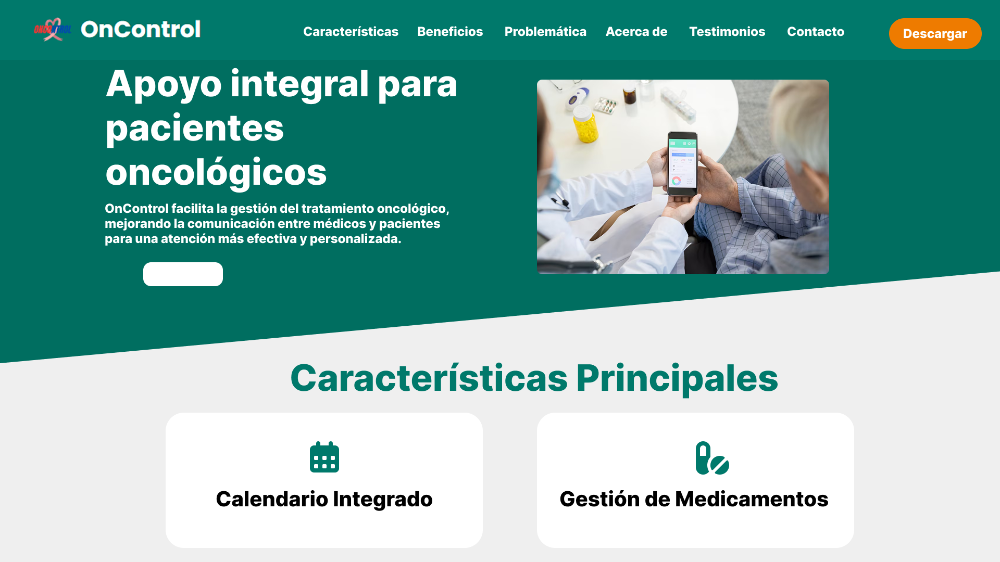
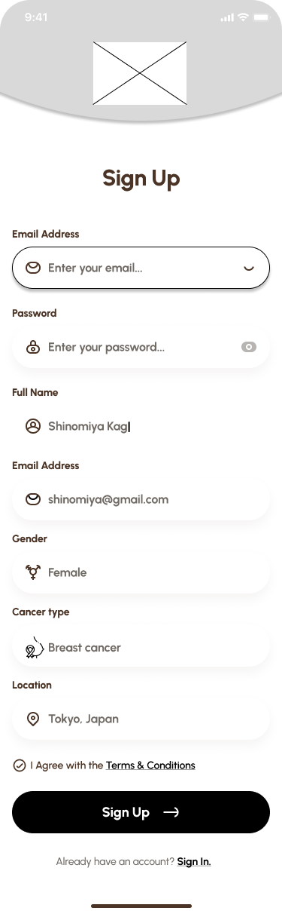
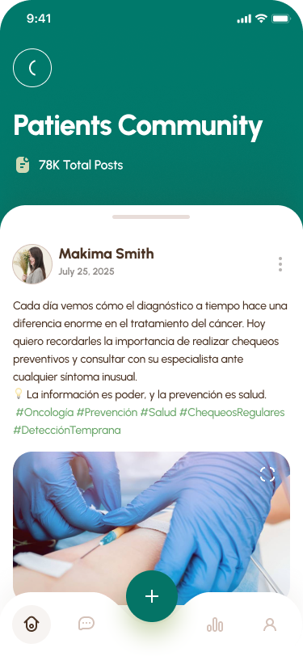

<h1 style="text-align: center;"> Informe del Trabajo Final </h1>
<h3 style="text-align: center;"> Universidad Peruana de Ciencias Aplicadas </h3>


<h5 style="text-align: center"> Área: Ingeniería de Software </h5>

<h5 style="text-align: center"> Curso: Diseño de Experimentos de Ingeniería de Software  </h5>
<h5 style="text-align: center"> NRC: 7491 </h5>

<h5 style="text-align: center"> Docente: Robles Fernández, Ivan </h5>

<h5 style="text-align: center"> Startup: OncoTech  </h5>

<h5 style="text-align: center"> Producto: OnControl  </h5>

## Team members:

  
|                Nombre                 |   Código   |
| :-----------------------------------: | :--------: |
|  Gongora Castillejos, Williams        | u20221c186 |
| Quiñones Tintaya, Johan Jorge         | u202218183 |
|  Huanaco Huayta, Elizabeth Lucero     | u20211g522 |
|  Huapaya Cuevas, Anthony              | u202220235 |
|  Uribe Quispe, Jesús Guillermo        | u202221876 |


<h5 style="text-align: center"> Ciclo 2025-20 </h5>

</div>

# Registro de Versiones del Informe

El objetivo de esta sección es resumir las modificaciones relevantes que se realizan al informe durante el ciclo de vida del proyecto. Esta sección inicia en una página nueva y se incluye un cuadro con la siguiente estructura:

| Versión | Fecha | Autor | Descripción de modificación |
| :-----: | :---: | :---: | --------------------------- |
|    TB1    |   19/09/2025   |   Jesús Uribe Quispe   | Adición del contenido de startup profile, needfinding, user stories, UX/UI Design & Software configuration development                        |
|    TP    |   08/10/2025   |   Jesús Uribe Quispe   | Adición del Capítulo VI y VII, desarrollo de los servicios Web y aplicaciones web. Validación del producto mediante pruebas.                       |

# Project Report Collaboration Insights

URL del repositorio para el reporte del proyecto: [https://github.com/ControlUPC/report/](https://github.com/ControlUPC/report/)

**TP**

<div align="">
  
</div>


Para el desarrollo del informe perteneciente a la entrega TP, se dividió la implementación de secciones de la siguiente forma para cada integrante del equipo:

| Integrante | Tareas Asignadas |
| ---------- | ---------------- |
|Góngora Castillejos Williams | Desarrollo del capitulo VI |
| Huapaya Cuevas Anthony       | Desarrollo del capítulo VII |
|Huanaco Huayta Elizabeth | Desarrollo del capítulo VII |
|Quiñones Quintaya, Johan | Desarrollo del capítulo VI |
|Uribe Quispe Jesús | Desarrollo del capítulo VII |

**TB1**

<div align="">
  
</div>


Para el desarrollo del informe perteneciente a la entrega TF, se dividió la implementación de secciones de la siguiente forma para cada integrante del equipo:

| Integrante | Tareas Asignadas |
| ---------- | ---------------- |
|Góngora Castillejos Williams | Startup Profile, NeedFinding |
| Huapaya Cuevas Anthony       |Startup Profile, desarrollo UX/UI |
|Huanaco Huayta Elizabeth | Startup Profile, desarrollo UX/UI |
|Quiñones Quintaya, Johan | Startup Profile, desarrollo UX/UI |
|Uribe Quispe Jesús | Arquitectura de software del producto, Documentación de implementación de producto |

**Github Collaboration Insights**

Github también presenta un timeline de las ramas principales y los procesos de merge a los que se han sometido. Todas las ramas se crearon tomando en cuenta el diseño de GitFlow para una buena organización cuando se usa un software de control de versiones.

Los integrantes son:

- Gongora Castillejos, Williams (WiJeGo)
- Huanaco Huayta, Elizabeth Lucero (lucerohh)
- Huapaya Cuevas, Anthony Martin (AnthonyHuapaya)
- Quiñones Quintaya, Johan Jorge (johaanq)
- Uribe Quispe, Jesús Guillermo(JesusU27)


# Contenido

1. [**Capítulo I: Introducción.**](#1.) <br>
   1.1. [Startup Profile.](#1.1.) <br>
   1.1.1. [Descripción del startup.](#1.1.1.)<br>
   1.1.2. [Perfiles de los integrantes del equipo.](#1.1.2.)<br>
   1.2. [Solution Profile.](#1.2.)<br>
   1.2.1. [Antecedentes y Problemática.](#1.2.1.)<br>
   1.2.2. [Lean UX Process.](#1.2.2.)<br>
   1.2.2.1 [Lean UX Problem Statements.](#1.2.2.1.)<br>
   1.2.2.2. [Lean UX Assumptions.](#1.2.2.2.)<br>
   1.2.2.3 [Lean UX Hypothesis Statements.](#1.2.2.3.)<br>
   1.2.2.4 [Lean UX Canvas.](#1.2.2.4.)<br>
   1.3. [Segmentos objetivo.](#1.3.)<br>

2. [**Capítulo II: Requirements Elicitation & Analysis.**](#2.)<br>
   2.1. [Competidores.](#2.1.)<br>
   2.1.1. [Análisis competitivo.](#2.1.1.)<br>
   2.1.2. [Estrategias y tácticas frente a competidores.](#2.1.2.)<br>
   2.2. [Entrevistas.](#2.2.)<br>
   2.2.1. [Diseño de entrevistas.](#2.2.1.)<br>
   2.2.2. [Registro de entrevistas.](#2.2.2.)<br>
   2.2.3. [Análisis de entrevistas.](#2.2.3.)<br>
   2.3. [Needfinding.](#2.3.)<br>
   2.3.1. [User Personas.](#2.3.1.)<br>
   2.3.2. [User Task Matrix.](#2.3.2.)<br>
   2.3.3. [User Journey Mapping.](#2.3.3.)<br>
   2.3.4. [Empathy Mapping.](#2.3.4.)<br>
   2.3.5. [As-is Scenario Mapping.](#2.3.5.)<br>
   2.4. [Ubiquitous Language.](#2.4.)<br>

3. [**Capítulo III: Requirements Specification.**](#3.)<br>
   3.1. [To-Be Scenario Mapping.](#3.1.)<br>
   3.2. [User Stories.](#3.2.)<br>
   3.3. [Product Backlog.](#3.3.)<br>
   3.4. [Impact Mapping.](#3.4.)<br>

4. [**Capítulo IV: Product Design.**](#4.)<br>
   4.1. [Style Guidelines.](#4.1.)<br>
   4.1.1. [General Style Guidelines.](#4.1.1.)<br>
   4.1.2. [Web Style Guidelines.](#4.1.2.)<br>
   4.1.3. [Mobile Style Guidelines.](#4.1.3.)<br>
   4.1.3.1. [iOS Mobile Style Guidelines.](#4.1.3.1.)<br>
   4.1.3.2. [Android Mobile Style Guidelines.](#4.1.3.2.)<br>
   4.2. [Information Architecture.](#4.2.)<br>
   4.2.1. [Organization Systems.](#4.2.1.)<br>
   4.2.2. [Labeling Systems.](#4.2.2.)<br>
   4.2.3. [SEO Tags and Meta Tags.](#4.2.3.)<br>
   4.2.4. [Searching Systems.](#4.2.4.)<br>
   4.2.5. [Navigation Systems.](#4.2.5.)<br>
   4.3. [Landing Page UI Design.](#4.3.)<br>
   4.3.1. [Landing Page Wireframe.](#4.3.1.)<br>
   4.3.2. [Landing Page Mock-up.](#4.3.2.)<br>
   4.4. [Mobile Applications UX/UI Design.](#4.4.)<br>
   4.4.1. [Mobile Applications Wireframes.](#4.4.1.)<br>
   4.4.2. [Mobile Applications Wireflow Diagrams.](#4.4.2.)<br>
   4.4.3. [Mobile Applications Mock-ups.](#4.4.3.)<br>
   4.4.4. [Mobile Applications User Flow Diagrams.](#4.4.4.)<br>
   4.5. [Mobile Applications Prototyping.](#4.5.)<br>
   4.5.1. [Android Mobile Applications Prototyping.](#4.5.1.)<br>
   4.5.2. [iOS Mobile Applications Prototyping.](#4.5.2.)<br>
   4.6. [Web Applications UX/UI Design.](#4.6.)<br>
   4.6.1. [Web Applications Wireframes.](#4.6.1.)<br>
   4.6.2. [Web Applications Wireflow Diagrams.](#4.6.2.)<br>
   4.6.3. [Web Applications Mock-ups.](#4.6.3.)<br>
   4.6.4. [Web Applications User Flow Diagrams.](#4.6.4.)<br>
   4.7. [Web Applications Prototyping.](#4.7.)<br>
   4.8. [Domain-Driven Software Architecture.](#4.8.)<br>
   4.8.1. [Software Architecture Context Diagram.](#4.8.1.)<br>
   4.8.2. [Software Architecture Container Diagrams.](#4.8.2.)<br>
   4.8.3. [Software Architecture Components Diagrams.](#4.8.3.)<br>
   4.9. [Software Object-Oriented Design.](#4.9.)<br>
   4.9.1. [Class Diagrams.](#4.9.1.)<br>
   4.9.2. [Class Dictionary.](#4.9.2.)<br>
   4.10. [Database Design.](#4.10.)<br>
   4.10.1. [Relational/Non-Relational Database Diagram.](#4.10.1.)<br>

5. [**Capítulo V: Product Implementation.**](#5.)<br>
   5.1. [Software Configuration Management.](#5.1.)<br>
   5.1.1. [Software Development Environment Configuration.](#5.1.1.)<br>
   5.1.2. [Source Code Management.](#5.1.2.)<br>
   5.1.3. [Source Code Style Guide & Conventions.](#5.1.3.)<br>
   5.1.4. [Software Deployment Configuration.](#5.1.4.)<br>
   5.2. [Product Implementation & Deployment.](#5.2.)<br>
   5.2.1.1. [Sprint Backlogs.](#5.2.1.1)<br>
   5.2.1.2. [Implemented Landing Page Evidence.](#5.2.1.2.)<br>
   5.2.1.3. [Implemented Frontend-Web Application Evidence.](#5.2.1.3.)<br>
   5.2.1.4. [Acuerdo de Servicio - SaaS.](#5.2.1.4.)<br>
   5.2.1.5. [Implemented Native-Mobile Application Evidence.](#5.2.1.5.)<br>
   5.2.1.6. [Implemented RESTful API and/or Serverless Backend Evidence.](#5.2.1.6.)<br>
   5.2.1.7 [RESTful API documentation.](#5.2.1.7.)<br>
   5.2.1.8. [Team Collaboration Insights.](#5.2.1.8.)<br>
   5.3. [Video About-the-Product.](#5.3.)<br>

6. [**Capítulo VI: Product Verification & Validation.**](#6.)<br>
   6.1. [Testing Suites & Validation.](#6.1.)<br>
   6.1.1. [Core Entities Unit Tests.](#6.1.1.)<br>
   6.1.2. [Core Integration Tests.](#6.1.2.)<br>
   6.1.3. [Core Behavior-Driven Development.](#6.1.3.)<br>
   6.1.4. [Core System Tests.](#6.1.4.)<br>
   6.2. [Static Testing & Verification.](#6.2.)<br>
   6.2.1. [Static Code Analysis.](#6.2.1.)<br>
   6.2.1.1. [Coding Standards & Conventions.](#6.2.1.1.)<br>
   6.2.1.2. [Code Quality & Security.](#6.2.1.2.)<br>
   6.2.2. [Reviews.](#6.2.2.)<br>
   6.3. [Validation Interviews.](#6.3.)<br>
   6.3.1. [Diseño de Entrevistas.](#6.3.1.)<br>
   6.3.2. [Registro de Entrevistas.](#6.3.2.)<br>
   6.3.3. [Evaluaciones según heurísticas.](#6.3.3.)<br>
   6.4. [Auditoría de Experiencias de Usuario.](#6.4.)<br>
   6.4.1. [Auditoría realizada.](#6.4.1.)<br>
   6.4.1.1. [Información del grupo auditado.](#6.4.1.1.)<br>
   6.4.1.2. [Cronograma de auditoría realizada.](#6.4.1.2.)<br>
   6.4.1.3. [Contenido de auditoría realizada.](#6.4.1.3.)<br>
   6.4.2. [Auditoría recibida.](#6.4.2.)<br>
   6.4.2.1. [Información del grupo auditor.](#6.4.2.1.)<br>
   6.4.2.2. [Cronograma de auditoría recibida.](#6.4.2.2.)<br>
   6.4.2.3. [Contenido de auditoría recibida.](#6.4.2.3.)<br>
   6.4.2.4. [Resumen de modificaciones para subsanar hallazgos.](#6.4.2.4.)<br>

7. [**Capítulo VII: DevOps Practices.**](#7.)<br>
   7.1. [Continuous Integration.](#7.1.)<br>
   7.1.1. [Tools and Practices.](#7.1.1.)<br>
   7.1.2. [Build & Test Suite Pipeline Components.](#7.1.2.)<br>
   7.2. [Continuous Delivery.](#7.2.)<br>
   7.2.1. [Tools and Practices.](#7.2.1.)<br>
   7.2.2. [Stages Deployment Pipeline Components.](#7.2.2.)<br>
   7.3. [Continuous Deployment.](#7.3.)<br>
   7.3.1. [Tools and Practices.](#7.3.1.)<br>
   7.3.2. [Production Deployment Pipeline Components.](#7.3.2.)<br>
   7.4. [Continuous Monitoring.](#7.4.)<br>
   7.4.1. [Tools and Practices.](#7.4.1.)<br>
   7.4.2. [Monitoring Pipeline Components.](#7.4.2.)<br>
   7.4.3. [Alerting Pipeline Components.](#7.4.3.)<br>
   7.4.4. [Notification Pipeline Components.](#7.4.4.)<br>

8. [**Capítulo VIII: Experiment-Driven Development.**](#8.)<br>
   8.1. [Experiment Planning.](#8.1.)<br>
   8.1.1. [As-Is Summary.](#8.1.1.)<br>
   8.1.2. [Raw Material: Assumptions, Knowledge Gaps, Ideas, Claims.](#8.1.2.)<br>
   8.1.3. [Experiment-Ready Questions.](#8.1.3.)<br>
   8.1.4. [Question Backlog.](#8.1.4.)<br>
   8.1.5. [Experiment Cards.](#8.1.5.)<br>
   8.2. [Experiment Design.](#8.2.)<br>
   8.2.1. [Hypotheses.](#8.2.1.)<br>
   8.2.2. [Domain Business Metrics.](#8.2.2.)<br>
   8.2.3. [Measures.](#8.2.3.)<br>
   8.2.4. [Conditions.](#8.2.4.)<br>
   8.2.5. [Scale Calculations and Decisions.](#8.2.5.)<br>
   8.2.6. [Methods Selection.](#8.2.6.)<br>
   8.2.7. [Data Analytics: Goals, KPIs and Metrics Selection.](#8.2.7.)<br>
   8.2.8. [Web and Mobile Tracking Plan.](#8.2.8.)<br>
   8.3. [Experimentation.](#8.3.)<br>
   8.3.1. [To-Be User Stories.](#8.3.1.)<br>
   8.3.2. [To-Be Product Backlog.](#8.3.2.)<br>
   8.3.3. [Pipeline-supported, Experiment-Driven To-Be Software Platform Lifecycle.](#8.3.3.)<br>
   8.3.3.1. [To-Be Sprint Backlogs.](#8.3.3.1.)<br>
   8.3.3.2. [Implemented To-Be Landing Page Evidence.](#8.3.3.2.)<br>
   8.3.3.3. [Implemented To-Be Frontend-Web Application Evidence.](#8.3.3.3.)<br>
   8.3.3.4. [Implemented To-Be RESTful API and/or Serverless Backend Evidence.](#8.3.3.4.)<br>
   8.3.3.5. [Team Collaboration Insights.](#8.3.3.5.)<br>
   8.3.4. [To-Be Validation Interviews.](#8.3.4.)<br>
   8.3.4.1. [Diseño de Entrevistas.](#8.3.4.1.)<br>
   8.3.4.2. [Registro de Entrevistas.](#8.3.4.2.)<br>
   8.4. [Experiment Aftermath & Analysis.](#8.4.)<br>
   8.4.1. [Analysis and Interpretation of Results.](#8.4.1.)<br>
   8.4.2. [Re-scored and Re-prioritized Question Backlog.](#8.4.2.)<br>
   8.5. [Continuous Learning.](#8.5.)<br>
   8.5.1. [Shareback Session Artifacts: Learning Workflow.](#8.5.1.)<br>
   8.6. [To-Be Software Platform Pre-launch.](#8.6.)<br>
   8.6.1. [About-the-Product Intro Video.](#8.6.1.)<br>

9. [Conclusiones.](#9.)<br>
10. [Bibliografía.](#10.)<br>
11. [Anexo.](#11.)<br>


# STUDENT OUTCOME

**ABET – EAC - Student Outcome 4**<br>
La capacidad de reconocer responsabilidades éticas y profesionales en situaciones de ingeniería y hacer juicios informados, que deben considerar el impacto de las soluciones de ingeniería en contextos globales, económicos, ambientales y sociales.

<table>
  <thead>
    <tr>
      <th>Criterio específico</th>
      <th>Acciones realizadas</th>
      <th>Conclusiones</th>
    </tr>
  </thead>
  <tbody>
    <tr>
      <td style="font-weight:bold">4.C.1 Reconoce responsabilidad ética y profesional en situaciones de ingeniería de software</td>
      <td>
      <strong>Huanaco Huayta, Elizabeth Lucero</strong> <br> 
      <strong>TB1:</strong> <p align="justify">El desarrollo de wireframes, wireflows, mock-ups, user flows y prototipos móviles me permitió reconocer mi responsabilidad ética y profesional en la ingeniería de software. Estas tareas me ayudaron a diseñar interfaces centradas en la experiencia del usuario, priorizando la claridad, la accesibilidad y la usabilidad. Asimismo, al trabajar en el prototipado para Android e iOS, comprendí la importancia de seguir estándares de calidad y adaptar la aplicación a cada plataforma. Todo este proceso reforzó mi compromiso con crear soluciones confiables y útiles, considerando siempre el impacto que tienen las decisiones de diseño en la vida de pacientes y doctores. </p><br>
      <strong>TP1:</strong> <p align="justify">La responsabilidad ética y profesional en ingeniería de software implica garantizar calidad, seguridad y confiabilidad, especialmente con datos sensibles.En el proyecto ControlUPC, mediante la investigación y análisis teórico de pipelines de Jenkins, gestión de dependencias con Maven y NPM, pruebas automatizadas y despliegue controlado, se identificaron buenas prácticas para proteger la información. Aunque aún no se implementaron, estas estrategias permitirían asegurar la integridad y confidencialidad de los datos de pacientes oncológicos. Este estudio refuerza la comprensión de los estándares éticos y la responsabilidad profesional en DevOps. </p><br>
      <strong>TB2:</strong> <p align="justify">El desarrollo de las actividades de análisis estático, verificación de estándares de código, evaluación de calidad y seguridad mediante herramientas como Jenkins, así como la realización de entrevistas, auditorías y revisiones heurísticas, me permitió reconocer de manera directa la responsabilidad ética y profesional que implica trabajar en ingeniería de software. Estas tareas me llevaron a identificar y corregir posibles errores, riesgos y deficiencias que podrían afectar la seguridad, la experiencia del usuario o la confiabilidad del sistema, reforzando la importancia de actuar con rigor, transparencia y compromiso. Además, el proceso de documentar hallazgos, revisar el trabajo de otros grupos y proponer acciones de mejora me permitió comprender que las decisiones técnicas deben priorizar el bienestar del usuario, la integridad del producto y el cumplimiento de buenas prácticas, reafirmando así mi rol como profesional responsable dentro del ciclo de desarrollo. </p><br>
      <strong>TF:</strong> <p align="justify">Las tareas desarrolladas me han permitido reconocer mi responsabilidad ética y profesional al tomar decisiones basadas en evidencia, priorizar necesidades críticas de usuarios vulnerables y comunicar resultados con rigurosidad. El análisis del experimento y la interpretación de datos reforzaron la importancia de evitar sesgos y actuar con transparencia, mientras que la repriorización del backlog destacó la obligación de favorecer funcionalidades que reduzcan riesgos clínicos. Asimismo, las actividades de aprendizaje continuo y de pre-lanzamiento fortalecieron mi compromiso con la calidad, la mejora constante y la entrega de un producto seguro y confiable para los pacientes. </p><br>
      <strong>Huapaya Cuevas, Anthony Martin</strong> <br>
      <strong>TB1:</strong> <p align="justify">La elaboración de wireframes, wireflows, mock-ups, user flows y prototipos móviles me permitió reflexionar sobre mi responsabilidad ética y profesional en el ámbito de la ingeniería de software. Estas actividades fueron clave para diseñar interfaces centradas en la experiencia del usuario, donde se priorizó la claridad, la accesibilidad y la facilidad de uso. Además, al desarrollar prototipos tanto para Android como para iOS, comprendí la relevancia de cumplir con los estándares de calidad y de adaptar la aplicación a las particularidades de cada plataforma. En conjunto, este proceso fortaleció mi compromiso con la creación de soluciones confiables y efectivas, teniendo siempre en cuenta el impacto que las decisiones de diseño generan en la vida de pacientes y profesionales de la salud. </p><br>
      <strong>TP1:</strong> <p align="justify">En la práctica de DevOps, la responsabilidad ética y profesional se refleja en la implementación de procesos automatizados y seguros que garanticen la calidad del software y la protección de los datos sensibles. En el proyecto ControlUPC, esto implica mantener la integridad y confidencialidad de la información de los pacientes oncológicos, asegurando que cada despliegue sea confiable y cumpla con los estándares éticos de la ingeniería de software.</p><br>
      <strong>TB2:</strong> <p align="justify">El desarrollo de actividades como el análisis estático, la verificación de estándares de código, la evaluación de calidad y seguridad con herramientas como Jenkins, junto con entrevistas, auditorías y revisiones heurísticas, me permitió comprender de manera directa la responsabilidad ética y profesional inherente a la ingeniería de software. Estas tareas me ayudaron a detectar y corregir errores, riesgos y deficiencias que podrían comprometer la seguridad, la experiencia del usuario o la confiabilidad del sistema, reforzando la necesidad de trabajar con rigor, transparencia y compromiso. Asimismo, documentar los hallazgos, revisar el trabajo de otros equipos y proponer mejoras me hizo ver que las decisiones técnicas deben priorizar el bienestar del usuario, la integridad del producto y el cumplimiento de buenas prácticas, reafirmando mi papel como profesional responsable en el ciclo de desarrollo.</p><br>
      <strong>Uribe Quispe, Jesús Guillermo</strong> <br>
      <strong>TB1:</strong> <p align="justify"> Durante el desarrollo del proyecto, asumí la responsabilidad ética y profesional al diseñar la arquitectura de software, elaborando el diagrama de contenedores, de componentes, de clases y el modelo de bases de datos, asegurándome de que cada decisión fuera clara, documentada y trazable para facilitar la comprensión del equipo y garantizar la mantenibilidad del sistema. </p><br>
      <br>  <strong>TP:</strong> <p align="justify"> Reconozco mi responsabilidad ética y profesional en la ingeniería de software, especialmente tras haber trabajado en DevOps, documentar cómo se implementará la integración continua y diseñar la arquitectura de software. Me comprometo a asegurar que los procesos de integración continua sean robustos y transparentes, garantizando la calidad del software con pruebas automatizadas y despliegues confiables, todo mientras protejo la confidencialidad y seguridad de los datos involucrados. Además, al documentar la arquitectura y los flujos de trabajo, busco promover claridad y sostenibilidad en el proyecto, fomentando un entorno colaborativo y ético que apoye decisiones informadas y cumpla con estándares profesionales, siempre pensando en el beneficio de los usuarios y la comunidad técnica.</p><br> <strong>TB2: </strong> <p align="justify">
      En cada etapa del proyecto asumí mi responsabilidad ética y profesional como ingeniero de software, procurando que mis decisiones fueran transparentes, coherentes y orientadas al bienestar de los usuarios. Evalué cuidadosamente la información, mantuve la integridad en el manejo de datos y seguí buenas prácticas de desarrollo para asegurar que el software fuera confiable y seguro. Además, me aseguré de actuar con respeto, honestidad y compromiso técnico en todas las acciones realizadas durante el proceso.</p> <br>
      <strong>Gongora Castillejos, Williams</strong> <br>
      <strong>TB1:</strong> <p align="justify">Durante el desarrollo de los capítulos 1 y 2, reconocí mi responsabilidad ética y profesional al definir claramente el Startup Profile, la problemática real y los segmentos objetivo, asegurando que la solución responda a necesidades genuinas de médicos y pacientes. Asimismo, en el análisis competitivo, entrevistas y construcción de artefactos de Needfinding, apliqué buenas prácticas de ingeniería de software, priorizando la transparencia, la privacidad de los datos y la utilidad social de la aplicación, lo que refleja un compromiso ético con los usuarios y la sociedad. </p><br>
      <strong>TP:</strong> <p align="justify">En el desarrollo de OnControl, demostré responsabilidad ética mediante pruebas unitarias rigurosas que garantizan la precisión de datos médicos sensibles. Implementé una arquitectura backend segura que protege la información de pacientes oncológicos. Documenté exhaustivamente cada componente para asegurar transparencia y mantenibilidad. </p><br>
        <strong>TB2:</strong> <p align="justify"> Como estudiante, respete los principios de integridad, privacidad y confiabilidad en el manejo de datos médicos. Consideré el impacto social y ético del software en un contexto de salud sensible, priorizando la seguridad del paciente, la transparencia en la gestión de información y la construcción de soluciones tecnológicas que contribuyan positivamente al bienestar social.</p><br>
        <strong>TF:</strong> <p align="justify">Durante el desarrollo del edge service y la integración de sistemas, reconocí mi responsabilidad profesional al priorizar la seguridad de los datos en tránsito y la claridad de la documentación, asegurando que el equipo y futuros desarrolladores pudieran mantener el sistema de forma ética y segura. </p><br>
      <strong>Quiñones Tintaya, Johan Jorge</strong> <br>
      <strong>TB1:</strong> <p align="justify"> En el desarrollo de los Wireframes, Wireflows, Mock-ups y User Flows de OnControl, reconocí la importancia de la responsabilidad ética y profesional en el diseño de soluciones dirigidas al sector salud. Durante este proceso, tomé decisiones orientadas a garantizar la seguridad de la información médica, la usabilidad para médicos y pacientes y la precisión en la representación de datos sensibles como historiales clínicos, tratamientos y síntomas. Este trabajo reflejó mi compromiso de que las interfaces no solo sean funcionales, sino que también respeten principios de confidencialidad, accesibilidad y confiabilidad, aspectos éticos esenciales en la ingeniería de software aplicada a contextos médicos. </p><br>
      <strong>TP:</strong> <p align="justify">Demostré responsabilidad ética desarrollando una API RESTful segura con Spring Boot que protege datos médicos sensibles mediante autenticación JWT. Implementé validaciones exhaustivas en los endpoints para garantizar la integridad de la información clínica de pacientes oncológicos. La integración frontend-backend que realicé priorizó la privacidad y confiabilidad del sistema en todo momento. Documenté los 47 endpoints asegurando transparencia y mantenibilidad del código.</p><br>
      <strong>TB2:</strong> <p align="justify">La implementación de integración continua, entrega continua, despliegue continuo y monitoreo —incluyendo el uso de herramientas, pipelines de compilación, pruebas, despliegue, seguimiento y alertas— me permitió reconocer la responsabilidad ética y profesional que implica garantizar sistemas confiables y seguros. Estas actividades evidenciaron la importancia de tomar decisiones técnicas que minimicen riesgos, mantengan la estabilidad del software y protejan la experiencia del usuario, reforzando mi compromiso con la transparencia, la prevención de fallas y la mejora continua dentro del desarrollo de software.</p><br>
      </td>
      <td>
        <p> <strong>TB1:</strong>
        El desarrollo de interfaces y la construcción de la arquitectura del sistema permitieron reconocer la importancia de la responsabilidad ética y profesional en la ingeniería de software. Al priorizar la claridad, accesibilidad, usabilidad y estandarización en las decisiones de diseño y documentación, se consolidó el compromiso con la creación de soluciones confiables, adaptadas a las plataformas y sostenibles en el tiempo, siempre considerando el bienestar de pacientes y profesionales de la salud.
        </p>
           <p> <strong>TP:</strong>
        Como grupo, reconocemos nuestra responsabilidad ética y profesional en la ingeniería de software, reflejada en nuestro trabajo con DevOps, la documentación de integración continua y el diseño de la arquitectura de software. Nos hemos comprometido a garantizar procesos robustos y transparentes, protegiendo la confidencialidad de los datos y promoviendo un desarrollo sostenible que beneficie a la comunidad técnica, asegurando que nuestras decisiones estén alineadas con estándares éticos y profesionales.
        </p>
        <p>
          <p> <strong>TB2:</strong>
        La aplicación de estándares de codificación, evaluaciones de calidad y seguridad del código, revisiones técnicas, entrevistas de validación, análisis heurísticos y auditorías de experiencia de usuario, junto con la implementación de procesos de integración, entrega y despliegue continuo, monitoreo activo, definición de hipótesis, análisis de métricas y construcción de backlogs y experimentos, me permitió reconocer la responsabilidad ética y profesional que implica cada decisión dentro del desarrollo de software. Estas actividades evidenciaron la importancia de garantizar la seguridad, consistencia, confiabilidad y sostenibilidad del sistema, asegurando que el trabajo técnico se realice con rigor, transparencia y compromiso hacia los usuarios, los equipos de desarrollo y el impacto social del producto final.
        </p>
        <p> <strong>TF:</strong>
        Como equipo, demostramos responsabilidad ética y profesional al basar nuestras decisiones en análisis rigurosos, evidencia y necesidades reales de los usuarios. El trabajo conjunto en la evaluación del experimento, la interpretación de datos y la priorización del backlog reflejó un compromiso con minimizar riesgos y mejorar la experiencia de pacientes en situaciones sensibles. Además, las sesiones de aprendizaje y el trabajo previo al lanzamiento mostraron una práctica colaborativa orientada a la calidad, la transparencia y el impacto positivo del software en contextos clínicos reales.
        </p>
      </td>
    </tr>
    <tr>
      <td  style="font-weight:bold">4.C.2 Emite juicios informados considerando el impacto de las soluciones de ingeniería de software en contextos globales, económicos, ambientales y sociales</td>
      <td>
      <strong>Huanaco Huayta, Elizabeth Lucero</strong> <br> 
      <strong>TB1:</strong> <p align="justify">El desarrollo de wireframes, wireflows, mock-ups, user flows y prototipos móviles me ayudó a emitir juicios informados sobre el impacto de la aplicación. Al diseñar las vistas pensé en el efecto social, facilitando la comunicación y accesibilidad para pacientes y doctores. También en el aspecto económico, al optimizar la gestión de citas y tratamientos. Consideré el impacto global, al crear un diseño adaptable a diferentes plataformas. Estas tareas me permitieron entender que las decisiones de diseño tienen consecuencias más allá de lo técnico, influyendo directamente en la vida de los usuarios y en el contexto en el que se aplica la solución.</p><br>
      <strong>TP1:</strong> <p align="justify">En DevOps, emitir juicios informados implica analizar cómo las decisiones técnicas afectan los ámbitos global, económico, ambiental y social. En el proyecto ControlUPC, la investigación sobre prácticas de despliegue continuo automatizado permite identificar formas de optimizar recursos tecnológicos y humanos, reducir costos operativos y mejorar la disponibilidad del sistema para médicos y pacientes oncológicos. Este enfoque favorece la eficiencia económica y la sostenibilidad tecnológica, al tiempo que genera un impacto social positivo al garantizar un acceso confiable y oportuno a información médica crítica, contribuyendo a la calidad del servicio de salud.</p><br>
      <strong>TB2:</strong> <p align="justify">Las actividades de análisis de código, validación con usuarios y auditorías heurísticas me permitieron emitir juicios informados sobre el impacto que las soluciones de software pueden generar en contextos globales, económicos y sociales. Al evaluar problemas como tiempos de carga, usabilidad, seguridad y accesibilidad, comprendí que decisiones técnicas inadecuadas pueden afectar costos, eficiencia y la experiencia del usuario. Asimismo, proponer mejoras basadas en evidencia reforzó mi capacidad para considerar cómo cada ajuste contribuye a un sistema más sostenible, confiable y beneficioso para quienes dependen de él.</p><br>
      <strong>TF:</strong> <p align="justify">Las tareas realizadas me ayudaron a emitir juicios informados al analizar evidencia real sobre el comportamiento de los usuarios y evaluar cómo cada decisión de diseño o priorización impacta en un contexto social y económico sensible, como el acceso a tratamientos oncológicos. El análisis del experimento y la interpretación de resultados me permitieron comprender las consecuencias globales y locales de mejorar o no ciertos flujos, mientras que la repriorización del backlog integró criterios de impacto social y eficiencia del sistema. Finalmente, el pre-lanzamiento y las sesiones de aprendizaje continuo fortalecieron mi capacidad para anticipar efectos más amplios del software en la continuidad del cuidado, la carga económica para los centros médicos y la calidad de vida de los pacientes.</p><br>
      <strong>Huapaya Cuevas, Anthony Martin</strong> <br>
      <strong>TB1:</strong> <p align="justify">La creación de wireframes, wireflows, mock-ups, user flows y prototipos móviles me permitió reflexionar sobre el impacto que puede generar la aplicación. Durante el diseño de las vistas tuve en cuenta el efecto social, al fomentar una comunicación más fluida y accesible entre pacientes y doctores. También consideré la dimensión económica, al proponer una solución que optimiza la gestión de citas y tratamientos. Asimismo, valoré el alcance global al diseñar una interfaz adaptable a distintas plataformas. Este proceso me hizo comprender que las decisiones de diseño trascienden lo técnico, pues influyen directamente en la vida de los usuarios y en el entorno donde se implementa la solución. </p><br>
      <strong>TP1:</strong> <p align="justify">En el contexto de DevOps, emitir juicios informados implica evaluar cómo las decisiones técnicas influyen en los ámbitos global, económico y social. En el proyecto ControlUPC, la adopción de prácticas automatizadas de despliegue continuo contribuye a optimizar recursos tecnológicos y humanos, reduciendo costos operativos y mejorando la disponibilidad del sistema para doctores y pacientes oncológicos. Este enfoque no solo promueve la eficiencia económica y la sostenibilidad tecnológica, sino que también tiene un impacto social positivo al garantizar un acceso oportuno y confiable a información médica crítica, fortaleciendo así la calidad del servicio en el ámbito de la salud.</p><br>
      <strong>TB2:</strong> <p align="justify">Las actividades de análisis de código, la validación con usuarios y las auditorías heurísticas me permitieron desarrollar criterios fundamentados sobre el impacto que las soluciones de software pueden tener en ámbitos globales, económicos y sociales. Al examinar aspectos como los tiempos de carga, la usabilidad, la seguridad y la accesibilidad, entendí que decisiones técnicas inapropiadas pueden influir negativamente en los costos, la eficiencia y la experiencia del usuario. Del mismo modo, sugerir mejoras basadas en evidencia fortaleció mi capacidad para evaluar cómo cada ajuste contribuye a un sistema más sostenible, confiable y beneficioso para quienes dependen de él.</p><br>
      <strong>Uribe Quispe, Jesús Guillermo</strong> <br>
      <strong>TB1:</strong> <p align="justify"> Al preparar la documentación de implementación del producto, emití juicios informados considerando el impacto que las soluciones de software podrían tener en el contexto global, económico, ambiental y social. Esto me llevó a priorizar decisiones que promuevan la eficiencia en el uso de recursos, la escalabilidad y la accesibilidad del sistema, contribuyendo a un producto sostenible y con potencial de adaptarse a diferentes escenarios. </p><br>
      <strong>TP:</strong> <p align="justify">
Como ingeniero de software, emito juicios informados considerando el impacto de mis soluciones en contextos globales, económicos, ambientales y sociales, especialmente tras mi experiencia en DevOps, documentación de integración continua y diseño de arquitectura de software. Evalúo cómo las implementaciones optimizadas y los despliegues continuos pueden reducir costos operativos y mejorar la eficiencia global, mientras me aseguro de minimizar el consumo energético y el impacto ambiental mediante prácticas sostenibles. Además, considero las implicaciones sociales, garantizando que las soluciones sean accesibles y beneficiosas para diversas culturas y comunidades, y analizo el contexto económico para asegurar que sean viables y equitativas, promoviendo un desarrollo responsable que equilibre innovación con bienestar colectivo.</p><br>
<strong>TB2:</strong> <p align="justify">
Al tomar decisiones sobre las soluciones propuestas, emití juicios informados analizando cómo estas podían influir en contextos globales, económicos, ambientales y sociales. Consideré la sostenibilidad del sistema, el uso eficiente de recursos y el posible impacto en los usuarios y en el entorno tecnológico. Reflexioné sobre la accesibilidad, la equidad y los efectos a largo plazo, eligiendo alternativas que generaran beneficios y minimizaran riesgos o impactos negativos.</p><br>
      <strong>Gongora Castillejos, Williams</strong> <br>
      <strong>TB1:</strong> <p align="justify">En los capítulos 1 y 2 emití juicios informados al analizar la problemática oncológica en el Perú, considerando el impacto social de facilitar la comunicación entre médicos y pacientes, el potencial económico de un modelo de negocio sostenible, y la escalabilidad global hacia otras especialidades médicas. Además, evalué la importancia de la seguridad y privacidad de datos como un factor crítico con repercusiones éticas y sociales en el uso responsable de la tecnología. </p><br>
      <strong>TP:</strong> <p align="justify">En el desarrollo de OnControl, emití juicios informados que priorizaron el impacto social al abordar problemáticas críticas del sistema oncológico peruano. Consideré el contexto económico local al diseñar un modelo freemium accesible que no excluye a pacientes de escasos recursos. Evalué el alcance global mediante una arquitectura escalable que puede adaptarse a otros sistemas de salud. Implementé soluciones técnicas que optimizan recursos ambientales mediante procesos digitalizados, reduciendo el uso de papel en historiales médicos.</p><br>
      <strong>TB2:</strong> <p align="justify">Durante el desarrollo de las secciones 8.2.4 a 8.3.2 del proyecto OnControl, emití juicios informados evaluando el impacto de las soluciones propuestas en contextos globales, económicos y sociales. Analicé cómo la adopción de una plataforma web accesible y segura puede mejorar la eficiencia médica y reducir costos operativos, contribuyendo a una atención más equitativa. </p><br>
      <strong>TF:</strong> <p align="justify"> Al diseñar el edge service y la arquitectura de integración, emití juicios informados priorizando la eficiencia y la escalabilidad. Esta decisión considera el impacto económico al reducir costos operativos futuros de infraestructura, y el impacto social al garantizar que la aplicación sea accesible y responda adecuadamente ante un aumento global en la demanda de usuarios.</p><br>
      <strong>Quiñones Tintaya, Johan Jorge</strong> <br>
      <strong>TB1:</strong> <p align="justify"> Al diseñar y documentar las interfaces de OnControl (wireframes, wireflows, mock-ups y user flows), emití juicios informados sobre cómo estas soluciones pueden impactar global y socialmente. Reconocí que una plataforma enfocada en oncología contribuye a mejorar el acceso a la salud digital, optimiza la gestión médica y reduce costos administrativos, lo cual tiene un impacto económico positivo en instituciones de salud. Asimismo, consideré que el diseño debía ser escalable y adaptable a distintos entornos, lo que abre la posibilidad de replicarse en contextos globales con similares necesidades. Además, busqué minimizar el uso excesivo de recursos físicos al digitalizar procesos antes manejados en papel, aportando indirectamente a un impacto ambiental positivo. </p><br>
        <strong>TP:</strong> <p align="justify">Al desarrollar OnControl, emití juicios informados considerando su impacto multidimensional. Socialmente, la plataforma mejora la accesibilidad a servicios oncológicos en Perú, reduciendo barreras geográficas mediante telemedicina. Económicamente, optimiza recursos del sistema de salud y reduce costos de desplazamiento para pacientes. Ambientalmente, minimiza la huella de carbono al disminuir traslados innecesarios. Globalmente, establece un precedente para soluciones digitales escalables en países en desarrollo.</p><br>
        <strong>TB2:</strong> <p align="justify">La aplicación de prácticas de integración continua, entrega continua, despliegue continuo y monitoreo me permitió emitir juicios informados sobre el impacto que las decisiones técnicas generan en contextos globales, económicos, ambientales y sociales. Al analizar la eficiencia de los pipelines, los costos asociados al despliegue, la confiabilidad del sistema y el uso responsable de recursos, comprendí cómo cada automatización o mejora puede influir en la sostenibilidad, la productividad y la experiencia de los usuarios. Estas actividades reforzaron mi capacidad para evaluar críticamente cómo las soluciones de software afectan su entorno y para proponer acciones que aporten valor real y responsable.</p><br>
      </td>
      <td>
        <p><strong>TB1:</strong>
        La reflexión sobre los impactos globales, sociales, económicos y ambientales del software permitió emitir juicios informados que guían el desarrollo hacia la sostenibilidad y la eficiencia. Al diseñar interfaces accesibles, optimizar recursos y contemplar la escalabilidad, se comprendió que las soluciones de ingeniería no se limitan a lo técnico, sino que influyen directamente en la vida de los usuarios y en el contexto donde son implementadas.
        </p>
         <p><strong>TP:</strong>
          Como grupo, emitimos juicios informados considerando el impacto de nuestras soluciones en contextos globales, económicos, ambientales y sociales, evaluando cómo las optimizaciones en los despliegues reducen costos y mejoran la eficiencia a nivel mundial, mientras minimizamos el impacto ambiental con prácticas sostenibles. También hemos priorizado la accesibilidad y el bienestar social de diversas culturas, analizando la viabilidad económica para ofrecer soluciones equitativas, demostrando nuestro compromiso con un desarrollo responsable que equilibre innovación y beneficio colectivo a lo largo de este proyecto.
        </p>
        <p><strong>TB2:</strong>
          Las actividades de análisis técnico, validación con usuarios, evaluaciones de usabilidad y revisiones de desempeño me permitieron emitir juicios informados sobre el impacto de las soluciones de software en contextos globales, económicos, ambientales y sociales. Al identificar problemas como tiempos de carga, accesibilidad, seguridad y eficiencia, comprendí cómo decisiones técnicas influyen en costos, sostenibilidad y calidad de vida de los usuarios. Esta reflexión guiada por evidencia fortaleció mi capacidad para proponer mejoras responsables que aporten valor y reduzcan riesgos en los distintos contextos donde el software opera.
        </p>
        <p><strong>TF:</strong>
          Como equipo, desarrollamos juicios informados al evaluar cómo nuestras decisiones de diseño y priorización afectan a los usuarios y al sistema en un contexto social y económico complejo. El análisis del experimento y la interpretación de resultados nos permitió comprender las implicancias más amplias de mejorar la continuidad del tratamiento y reducir el no-show, especialmente en pacientes vulnerables. Asimismo, la repriorización del backlog y el trabajo de pre-lanzamiento nos llevó a considerar el impacto global, social y operativo de cada funcionalidad, promoviendo soluciones de software que aporten valor real y reduzcan barreras en el acceso a la atención médica.
        </p>
      </td>
    </tr>
  </tbody>
</table>

<div id='1.'><h2>1. Capítulo I: Introducción</h2></div>

<div id='1.1.'><h3>1.1. Startup Profile</h3></div>
<div id='1.1.1.'><h4>1.1.1. Descripción del startup</h4></div>
OnControl es una aplicación creada por alumnos de Ingeniería de Software de la Universidad Peruana de Ciencias Aplicadas (UPC), con el objetivo de ofrecer apoyo y organización tanto a pacientes oncológicos como a médicos oncólogos en el sector de la salud. Reconocemos las complejidades y desafíos que enfrentan estos dos grupos en el proceso de tratamiento del cáncer, por lo que buscamos darles la importancia debida.

OnControl ofrece una plataforma integral que facilita la gestión de pacientes y la organización de su información. Los médicos pueden administrar eficientemente los datos de sus pacientes, asignar tratamientos y procedimientos. Los pacientes, por su parte, pueden agendar sus citas médicas, además de consultarlas como los procedimientos y tratamientos que lleva.

Como valor diferencial, OnControl integra sensores IoT que permiten medir parámetros vitales como saturación de oxígeno, ritmo cardíaco y temperatura corporal. Estos datos se registran y muestran en la aplicación del paciente y en la plataforma web del médico, generando alertas cuando se exceden los rangos saludables y contribuyendo a una atención más segura y oportuna.

- **Misión:** Mejorar la calidad de vida de pacientes oncológicos y optimizar el seguimiento médico mediante herramientas tecnológicas innovadoras.

- **Visión:** Ser la plataforma líder en salud oncológica digital en el Perú, reconocida por nuestra innovación, accesibilidad y compromiso con la atención integral.

</ul>
<div id='1.1.2.'><h4>1.1.2. Perfiles de los integrantes del equipo</h4></div>

<table>
  <tr>
    <th>Miembro del equipo</th>
    <th>Descripción</th>
    <th>Codigo de usuario</th>
  </tr>
  <tr>
    <td></td>
    <td>Mi nombre es Johan Jorge Quiñones Tintaya, tengo 19 años y soy estudiante de ingeniería de software en la UPC, cursando el quinto ciclo. He adquirido una base sólida en algoritmos y programación orientada a objetos, lo que me permite enfrentar desafíos de desarrollo con eficacia. Además, me destaco por mi capacidad para trabajar en equipo, manteniendo una comunicación clara y efectiva que facilita la colaboración. Estoy comprometido con mi crecimiento profesional y busco constantemente mejorar mis habilidades para contribuir de manera significativa en proyectos y equipos, ofreciendo soluciones innovadoras.</td>
    <td>U202218183</td>
  </tr>
  <tr>
    <td></td>
    <td>Mi nombre es Elizabeth Lucero Huanaco Huayta y estoy en el séptimo ciclo de Ingeniería de Software en la Universidad Peruana de Ciencias Aplicadas. Me considero una persona organizada, resiliente y asertiva. Elegí enfocarme en esta carrera por el interés que tengo en el desarrollo de software, ya que considero que es un área clave para el futuro de la innovación tecnológica. Actualmente tengo conocimientos de tecnologías como Java, SQL y desarrollo de aplicaciones modernas con el enfoque Domain Driven Design. En este proyecto, me comprometo a aplicar mis conocimientos y a contribuir con el logro de los objetivos de mi equipo, fomentando un ambiente colaborativo.</td>
    <td>U20211G522</td>
  </tr>
  <tr>
    <td></td>
    <td>Mi nombre es Anthony Martín Huapaya Cuevas y soy estudiante de la carrera de Ingeniería de Software, cursando el séptimo ciclo. Mis conocimientos con respecto a tecnologías son Java, SQL y un poco de Python, aplicando esto al modelo de Domain Driven Design. Me considero una persona que apoya constantemente al grupo, mantiene un ambiente laboral estable, me gusta escuchar las opiniones o puntos de vista de los demás y soy alguien que se adapta a cualquier forma de trabajo.</td>
    <td>U202220235</td>
  </tr>
  <tr>
    <td></td>
    <td>Mi nombre es Williams Jesús Góngora Castillejos y soy estudiante del quinto ciclo de la carrera de Ingeniería de Software. Me considero una persona inteligente en todo lo que conlleva a números y razonamiento intuitivo, además de ser creativo para generar soluciones como ingeniero. Cuento con conocimientos en SQL, C++ y Python. Dentro de mis habilidades interpersonales, soy amable, empático y trato de establecer confianza entre mis compañeros para realizar un mejor trabajo en equipo.</td>
    <td>U20221C186</td>
  </tr>
  <tr>
    <td></td>
    <td>Mi nombre es Jesús Guillermo Uribe Quispe y soy estudiante de Ingenieria de Software en la UPC. Actualmente estoy en el 7to ciclo y elegí esta carrera porque me interesó el campo del software y la matemáticas. Me comprometo a ayudar a mis compañeros con el trabajo asi como también fuera de este.</td>
    <td>U202221876</td>
  </tr>
</table>

<div id='1.2.'><h3>1.2. Solution Profile</h3></div>
<div id='1.2.1.'><h4>1.2.1. Antecedentes y Problemática</h4></div>

* **What – ¿Cuál es el problema?** <br>
  El cuidado oncológico en el Perú presenta deficiencias en la gestión de citas médicas, el seguimiento de tratamientos y la organización de la información clínica, generando ineficiencia en la atención y disminuyendo la calidad del servicio.

* **When – ¿Cuándo sucede el problema?** <br>
  El problema es recurrente y persistente, ya que los pacientes y médicos deben enfrentarlo diariamente debido a la falta de herramientas digitales de soporte en el proceso oncológico.

* **Where – ¿Dónde surge el problema?** <br>
  Esta situación se presenta en pacientes que padecen cáncer al no tener un buen control de seguimiento, citas, medicamentos, etc.

* **Who – ¿Quiénes son afectados?** <br>
  Los principales afectados son los pacientes oncológicos y sus familias, quienes experimentan mayor ansiedad y desinformación; y los médicos oncólogos, que enfrentan sobrecarga laboral y riesgo de agotamiento profesional. También repercute en el desempeño de equipos médicos multidisciplinarios.

* **Why – ¿Cuál es la causa?** <br>
  La raíz del problema se encuentra en la ausencia de soluciones tecnológicas integrales y procesos optimizados que permitan centralizar la información, facilitar el seguimiento del tratamiento y mejorar la comunicación entre los distintos actores del cuidado oncológico.

* **How – ¿Cómo ocurre?** <br>
  La gestión continúa realizándose mediante métodos manuales o fragmentados, lo que conlleva a retrasos, duplicación de esfuerzos, errores en la administración de medicamentos y dificultades para mantener una comunicación fluida entre médicos y pacientes.

* **How much – ¿Cuál es la magnitud?** <br>
  La magnitud es considerable: en Perú, más del 60 % de los casos de cáncer son diagnosticados en etapas avanzadas (MINSA, 2023), lo que refleja la falta de seguimiento temprano. Además, más del 45 % de oncólogos reportan síntomas de agotamiento profesional (Shanafelt et al., 2014), lo que evidencia el impacto negativo tanto en la calidad de vida de los pacientes como en la capacidad operativa del personal de salud.
  <br>

<div align="center">
  
  <p><em>Grafica 1: Tendencias de mortalidad por cáncer en el Perú.</em></p>
</div>

<div id='1.2.2.'><h4>1.2.2. Lean UX Process</h4></div>

<div id='1.2.2.1.'><h5>1.2.2.1. Lean UX Problem Statements</h5></div>

El tratamiento y cuidado de los pacientes con cáncer suele ser un proceso agotador y complejo. La falta de información clara, organización adecuada y comprensión del proceso terapéutico incrementa significativamente la ansiedad y el estrés tanto en los pacientes como en sus familiares. En el Perú, más del 60 % de los casos son diagnosticados en etapas avanzadas, lo que agrava aún más esta situación (MINSA, 2023).

Al mismo tiempo, los médicos oncólogos enfrentan una elevada carga asistencial, gestionando múltiples pacientes con horarios y tratamientos altamente específicos que requieren un seguimiento constante. Esta realidad contribuye a la sobrecarga laboral y al desgaste profesional, con estudios que señalan que más del 45 % de oncólogos presentan síntomas de agotamiento (Shanafelt et al., 2014).

Frente a la falta de herramientas que faciliten el acceso a información sobre medicamentos, la organización de citas y la coordinación del tratamiento, surge una interrogante fundamental:

<br><br><div>
**¿Qué soluciones tecnológicas pueden contribuir a mejorar la coordinación en la atención oncológica y garantizar un proceso más claro y menos estresante para pacientes, familiares y médicos?**

</div>

<div id='1.2.2.2.'><h5>1.2.2.2. Lean UX Assumptions</h5></div>

**Features (Características):**

* Interfaz intuitiva y de fácil acceso para médicos y pacientes.
* Aplicación móvil gratuita para pacientes.
* Calendario digital para visualizar citas y tratamientos.
* Herramientas de planificación para el seguimiento clínico.
* Monitoreo de signos vitales mediante sensores IoT (ritmo cardíaco, temperatura y oxigenación).
* Alertas automáticas cuando los parámetros vitales sobrepasen los rangos saludables.

**Business Assumptions (Supuestos de negocio):**

* Creemos que los pacientes oncológicos valoran una plataforma que centralice información confiable sobre sus citas, tratamientos y monitoreo de salud.
* Creemos que los familiares se beneficiarán de una mayor claridad sobre el estado del paciente, lo que generará confianza y reducirá su ansiedad.
* Creemos que la digitalización del seguimiento y el monitoreo de parámetros vitales permitirá a los pacientes optimizar su tiempo.

**Business Outcomes (Resultados esperados):**

* Los usuarios incrementarán el uso de la aplicación al percibir mayor facilidad de acceso a información y a su estado de salud.
* Los pacientes experimentarán una mejor gestión y seguimiento de sus citas y tratamientos.
* Se contribuirá a mejorar el estado emocional de pacientes y familiares, lo que impactará positivamente en la adherencia al tratamiento.

**User Benefits (Beneficios para el usuario):**

* Mayor seguridad y confianza al contar con un monitoreo constante de signos vitales.
* Reducción del estrés y la ansiedad de pacientes y familiares gracias a un sistema más claro y organizado.
* Organización más eficiente para los médicos tratantes, al poder gestionar múltiples casos y recibir alertas tempranas.

<div id='1.2.2.3.'><h5>1.2.2.3. Lean UX Hypothesis Statements</h5></div>

* **Hypothesis 1:**
Creemos que el monitoreo de signos vitales (ritmo cardíaco, temperatura y oxigenación) mediante sensores IoT ayudará a los pacientes a sentirse más protegidos y permitirá a los médicos detectar posibles alertas tempranas. Será exitoso cuando al menos el 65 % de los usuarios expresen que la aplicación les da una sensación de mayor seguridad en su cuidado.

* **Hypothesis 2:**
Creemos que los médicos oncólogos mejorarán la organización de sus pacientes al centralizar en una sola plataforma la información de citas, tratamientos y parámetros vitales. Consideraremos alcanzado el objetivo cuando, en entrevistas posteriores, al menos el 70 % de los médicos reporten una disminución en los errores organizativos o en la duplicidad de esfuerzos.

* **Hypothesis 3:**
Creemos que el envío de alertas automáticas cuando los parámetros vitales sobrepasen los rangos saludables permitirá reaccionar con mayor rapidez ante situaciones de riesgo. Será considerado un éxito cuando al menos el 60 % de los usuarios reconozcan que las alertas les ayudaron a tomar decisiones preventivas oportunas.

<div id='1.2.2.4.'><h5>1.2.2.4. Lean UX Canvas</h5></div>
En esta sección se presenta el Lean UX Canvas de la propuesta, donde se detallan los supuestos clave del proyecto, las necesidades de los usuarios, las posibles soluciones y las hipótesis que guiarán el proceso de validación.
<br>
<br>

<div align="center">
  
</div>
  <p><em>Grafica 2: Lean UX Canvas Control</em></p>


<div id='1.3.'><h3>1.3. Segmentos objetivo</h3></div>

Nuestra aplicación está dirigida principalmente a facilitar la gestión de responsabilidades de los pacientes oncológicos en el Perú, creando un espacio digital que facilite la organización, el seguimiento del tratamiento y la comunicación en la atención oncológica.

Los médicos oncólogos requieren herramientas para optimizar la gestión de citas, el registro de historias clínicas y el monitoreo del progreso de sus pacientes, además de concientizar a través de un portal como blogs y artículos.


| Segmento                  | Característica principal                              | Rango de edad | Necesidades clave                                                                                     | Nivel tecnológico                                                                    |
| ------------------------- | ----------------------------------------------------- | ------------- | ----------------------------------------------------------------------------------------------------- | ------------------------------------------------------------------------------------ |
| **Médicos oncólogos**     | Profesionales de la salud especializados en oncología | 30 – 55 años  | Gestión de pacientes y citas, registro de historias clínicas, monitoreo del progreso de pacientes     | Familiarizados con dispositivos móviles y computadoras                               |
| **Pacientes oncológicos** | Personas en tratamiento o seguimiento oncológico      | 25 – 65 años  | Reserva de citas, recordatorios de tratamiento, registro de signos vitales, acceso a historial médico | Varía según el caso, pero en general utilizan smartphones como principal dispositivo, gestión de tratamientos y medicamentos. |


<div id='2.'><h2>2. Capítulo II: Requirements Elicitation & Analysis</h2></div>

<div id='2.1.'><h3>2.1. Competidores</h3></div>

<div id='2.1.1.'><h4>2.1.1. Análisis competitivo</h4></div>

<table>
  <tr>
    <th colspan="6" valign="top"><b>Análisis Competitivo</b></th>
  </tr>
  <tr>
    <td colspan="1" rowspan="2" valign="top">¿Por qué llevar a cabo este Análisis?</td>
    <td colspan="5" valign="top">Este análisis nos ayudará a comprender mejor a nuestra competencia, identificando sus debilidades y fortalezas. Esto nos permitirá desarrollar estrategias para mejorar nuestro producto.</td>
  </tr>
  <tr></tr>
 <tr>
  <td colspan="2" valign="top"></td>
  <td colspan="1" valign="top" style="vertical-align: middle; text-align: center;">
    
  </td>
  <td colspan="1" valign="top" style="vertical-align: middle; text-align: center;">
    
  </td>
  <td colspan="1" valign="top" style="vertical-align: middle; text-align: center;">
    
  </td>
  <td colspan="1" valign="top" style="vertical-align: middle; text-align: center;">
    
  </td>
</tr>

  <tr>
    <td rowspan="2" valign="top">Perfil</td>
    <td valign="top">Overview</td>
    <td valign="top">Aplicación móvil que ofrece información y consejos de cuidado emocional, nutricional y físico para pacientes con cáncer.</td>
    <td valign="top">Aplicación que brinda apoyo personalizado a pacientes con cáncer.</td>
    <td valign="top">Aplicación que permite a los médicos monitorear pacientes mediante encuestas diarias.</td>
    <td valign="top">Aplicación móvil para pacientes y aplicación web para médicos, con herramientas de organización y planificación de tratamientos oncológicos.</td>
  </tr>
  <tr>
    <td valign="top">¿Qué valor ofrece a los clientes?</td>
    <td valign="top">Brinda consejos y ejercicios para la salud física y mental durante el tratamiento.</td>
    <td valign="top">Ofrece seguimiento de la salud del paciente y recomienda clínicas para exámenes y tratamientos.</td>
    <td valign="top">Proporciona herramientas para el monitoreo continuo del estado del paciente.</td>
    <td valign="top">Facilita la organización de citas y tratamientos, así como calendarios personalizados que reducen la carga de pacientes y médicos.</td>
  </tr>
  <tr>
    <td rowspan="2" valign="top">Perfil de Marketing</td>
    <td valign="top">Mercado objetivo</td>
    <td valign="top">Personas que inician o continúan tratamiento oncológico.</td>
    <td valign="top">Pacientes que buscan o ya reciben tratamiento.</td>
    <td valign="top">Pacientes que requieren acompañamiento en todo su tratamiento.</td>
    <td valign="top">Médicos oncólogos con alta carga laboral y pacientes que necesitan una mejor organización.</td>
  </tr>
  <tr>
    <td valign="top">Estrategias de marketing</td>
    <td valign="top">Promoción en su sitio web.</td>
    <td valign="top">Webinars y videos en su sitio web.</td>
    <td valign="top">Prueba gratuita para luego migrar a planes pagos.</td>
    <td valign="top">Landing page informativa y difusión en canales digitales de salud.</td>
  </tr>
  <tr>
    <td rowspan="3" valign="top">Perfil de Producto</td>
    <td valign="top">Productos & Servicios</td>
    <td valign="top">Consejos de nutrición, ejercicios físicos y apoyo emocional durante el tratamiento.</td>
    <td valign="top">Monitoreo del paciente y acceso a información sobre tipos de cáncer y clínicas recomendadas.</td>
    <td valign="top">Monitoreo diario, consejos de nutrición, ejercicio y manejo del estrés.</td>
    <td valign="top">Calendarios de citas, alarmas y recordatorios, además de una plataforma web para médicos y móvil para pacientes.</td>
  </tr>
  <tr>
    <td valign="top">Precios y costos</td>
    <td valign="top">Gratuita.</td>
    <td valign="top">De uso gratuito y sin restricciones.</td>
    <td valign="top">Modelos de suscripción con opciones gratuitas y de pago.</td>
    <td valign="top">Planes Free, Premium y Pro Service.</td>
  </tr>
  <tr>
    <td valign="top">Canales de distribución</td>
    <td valign="top">Aplicación móvil (Google Play y App Store).</td>
    <td valign="top">Aplicación móvil (Google Play y App Store) + Web App.</td>
    <td valign="top">Aplicación móvil (Google Play y App Store).</td>
    <td valign="top">Aplicación móvil (pacientes), Aplicación web (médicos) y landing page de acceso.</td>
  </tr>
  <tr>
    <td rowspan="4" valign="top">Análisis SWOT</td>
    <td valign="top">Fortalezas</td>
    <td valign="top">Variedad de información científica validada.</td>
    <td valign="top">Apoyo de especialistas y amplia información de clínicas.</td>
    <td valign="top">Gran variedad de herramientas, gestión de síntomas e información de tratamientos.</td>
    <td valign="top">Facilita la comunicación y organización de citas con un calendario interactivo.</td>
  </tr>
  <tr>
    <td valign="top">Debilidades</td>
    <td valign="top">Carece de interacción directa con usuarios.</td>
    <td valign="top">Limitada a ciertos tipos de cáncer.</td>
    <td valign="top">No ofrece comunicación directa con un médico.</td>
    <td valign="top">Carece de videollamadas integradas para consultas.</td>
  </tr>
  <tr>
    <td valign="top">Oportunidades</td>
    <td valign="top">Pocas apps consideran la salud física y mental al mismo nivel.</td>
    <td valign="top">Respaldo de inversionistas en oncología.</td>
    <td valign="top">Posible adopción en hospitales como complemento.</td>
    <td valign="top">Escasa competencia en plataformas médico-paciente integradas.</td>
  </tr>
  <tr>
    <td valign="top">Amenazas</td>
    <td valign="top">Aparición de apps multiplataforma.</td>
    <td valign="top">Usuarios con tipos de cáncer no cubiertos.</td>
    <td valign="top">Nuevas apps con funcionalidades similares.</td>
    <td valign="top">Competencia indirecta de apps generales como WhatsApp, Telegram o Google Calendar.</td>
  </tr>
</table>


<div id='2.1.2.'><h4>2.1.2. Estrategias y tácticas frente a competidores</h4></div>

**1. Experiencia diferenciada por perfil**

* **Estrategia:** Diseñar una experiencia optimizada para cada segmento: médicos (plataforma web) y pacientes (aplicación móvil).
* **Táctica:** Implementar dashboards clínicos para médicos y una app para pacientes con funciones de accesibilidad, recordatorios, gestión de citas, tratamientos, progreso y registro de signos vitales.

**2. Modelo de negocio sostenible y escalable**

* **Estrategia:** Garantizar la sostenibilidad financiera mediante un esquema freemium y servicios premium.
* **Táctica:** Ofrecer suscripciones para médicos que incluyan reportes avanzados, integración con historias clínicas y soporte técnico; mantener funciones básicas gratuitas para pacientes.

**3. Posicionamiento especializado en oncología**

* **Estrategia:** Diferenciarse como la primera plataforma digital enfocada en oncología en el Perú.
* **Táctica:** Generar alianzas con instituciones médicas y campañas dirigidas a especialistas para impulsar confianza y adopción.

**4. Seguridad y cumplimiento normativo**

* **Estrategia:** Cumplir con regulaciones de protección de datos médicos y asegurar la confidencialidad.
* **Táctica:** Implementar cifrado de extremo a extremo, políticas estrictas de manejo de datos y auditorías periódicas.

**5. Innovación continua con retroalimentación**

* **Estrategia:** Evolucionar constantemente el producto en base a las necesidades reales de médicos y pacientes.
* **Táctica:** Aplicar metodologías ágiles y recoger feedback continuo para mejorar usabilidad, escalabilidad y relevancia de la solución.

<div id='2.2.'><h3>2.2. Entrevistas</h3></div>

En esta sección se presentan las entrevistas diseñadas para médicos oncólogos, con el objetivo de comprender en profundidad sus necesidades, frustraciones y expectativas en relación con la gestión de pacientes oncológicos. Estas entrevistas permitirán identificar los principales desafíos en su práctica diaria y explorar cómo una solución digital podría optimizar la organización de citas, tratamientos y seguimientos, contribuyendo a reducir la sobrecarga laboral y mejorar la calidad del servicio.

<div id='2.2.1.'><h4>2.2.1. Diseño de entrevistas</h4></div>

### Preguntas Generales

Estas preguntas buscan conocer el perfil y la relación de los entrevistados con la tecnología:

* ¿Cuál es su edad?
* ¿En qué institución recibe tratamiento o trabaja actualmente (hospital, clínica privada, centro especializado)?
* ¿Qué dispositivos digitales utiliza con más frecuencia (computadora, tablet, smartphone)?
* ¿Ha usado antes alguna aplicación de salud o de gestión de pacientes? ¿Cómo fue su experiencia?

---

### Preguntas Específicas para Médicos Oncólogos

**Perfil Profesional y Práctica Clínica**

* ¿Cuántos pacientes oncológicos atiende en promedio por semana/mes?
* ¿Qué tipo de tratamientos supervisa con mayor frecuencia?

**Organización y Gestión de Pacientes**

* ¿Cómo organiza actualmente las citas, tratamientos y seguimientos de sus pacientes?
* ¿Qué dificultades encuentra en este proceso (ej. sobrecarga de trabajo, errores humanos, falta de integración de información)?

**Necesidades y Expectativas**

* ¿Qué funcionalidades considera más valiosas en una aplicación diseñada para oncología?
* ¿Qué tan útil sería recibir reportes consolidados sobre el estado y evolución de sus pacientes?
* ¿Le interesaría que la aplicación permita monitorear de forma remota ciertos signos vitales de los pacientes?

---

### Preguntas Específicas para Pacientes Oncológicos

**Perfil Personal y Tratamiento**

* ¿Hace cuánto tiempo recibe tratamiento oncológico y de qué tipo?
* ¿Con qué frecuencia tiene citas médicas o controles?

**Gestión del Tratamiento**

* ¿Cómo organiza actualmente sus citas, recordatorios de medicación y controles médicos?
* ¿Qué problemas encuentra (olvidos, retrasos, confusión con medicamentos, dificultad para contactar a su médico)?

**Necesidades y Expectativas**

* ¿Qué funcionalidades considera más útiles en una aplicación (ej. recordatorios, conexión directa con médicos, registro de síntomas, historial de tratamientos)?
* ¿Le resultaría valioso compartir con su médico sus signos vitales y evolución desde una aplicación?
* ¿Qué tan dispuesto estaría a usar una aplicación todos los días como apoyo en su tratamiento?

<div id='2.2.2.'><h4>2.2.2. Registro de entrevistas</h4></div>

* **Segmento 1: Médicos Oncológicos**

|Entevistado 1|Sebastián Silva|
|-|-|
|Edad|27|
|Distrito|San Isidro|
|Foto||
|Link|[Enlace de la entrevista](https://upcedupe-my.sharepoint.com/:v:/g/personal/u202220235_upc_edu_pe/EaLKPHgZ0b5PqTvfCB6MDkQB93evnDKGf300qhOaOZDn7A?nav=eyJwbGF5YmFja09wdGlvbnMiOnsic3RhcnRUaW1lSW5TZWNvbmRzIjoxMDU3LCJ0aW1lc3RhbXBlZExpbmtSZWZlcnJlckluZm8iOnsic2NlbmFyaW8iOiJDaGFwdGVyU2hhcmUiLCJhZGRpdGlvbmFsSW5mbyI6eyJpc1NoYXJlZENoYXB0ZXJBdXRvIjpmYWxzZX19fSwicmVmZXJyYWxJbmZvIjp7InJlZmVycmFsQXBwIjoiU3RyZWFtV2ViQXBwIiwicmVmZXJyYWxWaWV3IjoiU2hhcmVDaGFwdGVyTGluayIsInJlZmVycmFsQXBwUGxhdGZvcm0iOiJXZWIiLCJyZWZlcnJhbE1vZGUiOiJ2aWV3In19&e=hgVNiJ)|
|Time | 17:37 - 22:13 |
|Analisis de Entrevista| Sebastián trabaja actualmente en una clínica privada en San Isidro, utiliza normalmente la computadora para realizar algunos registros y una tablet por comodidad. Usa un sistema simple para gestionar lo justo y necesario, pero necesita que sea más eficiente. Atiende entre 5 a 6 pacientes a la semana, ya que le dedica tiempo para ellos. Realiza diagnósticos y pruebas para descartar si tiene alguna enfermedad cancerígena. Organiza las citas mediante correos o mensajes por la aplicación Whatsapp, donde presenta dificultades con respecto al recordatorio para la cita de los pacientes. Desea un mejor gestor dedicado para que le pueda ayudar a sus pacientes, indicando más rapidez y eficiencia. También le parece interesante realizar un control continuo para el paciente.|

|Entevistado 2|Edith Gutierrez|
|-|-|
|Edad|37|
|Distrito|España, Madrid|
|Foto||
|Link|[Enlace de la entrevista](https://upcedupe-my.sharepoint.com/:v:/g/personal/u202220235_upc_edu_pe/EaLKPHgZ0b5PqTvfCB6MDkQB93evnDKGf300qhOaOZDn7A?nav=eyJwbGF5YmFja09wdGlvbnMiOnsic3RhcnRUaW1lSW5TZWNvbmRzIjoxMzMzLCJ0aW1lc3RhbXBlZExpbmtSZWZlcnJlckluZm8iOnsic2NlbmFyaW8iOiJDaGFwdGVyU2hhcmUiLCJhZGRpdGlvbmFsSW5mbyI6eyJpc1NoYXJlZENoYXB0ZXJBdXRvIjpmYWxzZX19fSwicmVmZXJyYWxJbmZvIjp7InJlZmVycmFsQXBwIjoiU3RyZWFtV2ViQXBwIiwicmVmZXJyYWxWaWV3IjoiU2hhcmVDaGFwdGVyTGluayIsInJlZmVycmFsQXBwUGxhdGZvcm0iOiJXZWIiLCJyZWZlcnJhbE1vZGUiOiJ2aWV3In19&e=aPFBYp)|
|Time | 22:13 - 28:33 |
|Analisis de Entrevista| Edith es médico general en Perú y actualmente se encuentra en Madrid, España, ocupando el cargo de médico geriatra. Ella usa actualmente el IDoctus y el Memsa, también usa a veces la IA. Antes usaba algunas aplicaciones y tuve una buena experiencia, pero uso más los programas que ofrece la institución. Atiende en promedio entre 20 a 25 en un turno de 8 horas. Supervisa normalmente enfermedades crónicas, pacientes oncológicos, pacientes terminales; cada uno teniendo que supervisar cómo sobrelleva la enfermedad, dando un control constante de ello. Usa un software que le ayuda a gestionar las citas de los pacientes, donde se le da un aviso al paciente o familiares mediante una alerta a su dispositivo móvil. La principal dificultad son los pacientes, quienes se pueden olvidar o no llegaron a ver la alerta de la cita. Ella desea un recordatorio para sus pacientes que les avise con 2 días de antelación. Le resultaría útil el estado del paciente para investigar el progreso del paciente, pero a nivel grupal, por lo que le interesa un monitoreo constante de los signos vitales de los pacientes.|

|Entevistado 3| Christian Matos |
|-|-|
|Edad| 20 |
|Distrito| San Juan de Lurigancho|
|Foto | |
|Link|[Enlace de la entrevista](https://upcedupe-my.sharepoint.com/:v:/g/personal/u202220235_upc_edu_pe/EaLKPHgZ0b5PqTvfCB6MDkQBL4AQsZX9orPOC3url-801w?nav=eyJwbGF5YmFja09wdGlvbnMiOnsic3RhcnRUaW1lSW5TZWNvbmRzIjoxNzEzLCJ0aW1lc3RhbXBlZExpbmtSZWZlcnJlckluZm8iOnsic2NlbmFyaW8iOiJDaGFwdGVyU2hhcmUiLCJhZGRpdGlvbmFsSW5mbyI6eyJpc1NoYXJlZENoYXB0ZXJBdXRvIjpmYWxzZX19fSwicmVmZXJyYWxJbmZvIjp7InJlZmVycmFsQXBwIjoiU3RyZWFtV2ViQXBwIiwicmVmZXJyYWxWaWV3IjoiU2hhcmVDaGFwdGVyTGluayIsInJlZmVycmFsQXBwUGxhdGZvcm0iOiJXZWIiLCJyZWZlcnJhbE1vZGUiOiJ2aWV3In19&e=KJ9Snb)|
|Time | 28:33 - 31:57 |
|Analisis de Entrevista| El médico entrevistado refleja una práctica con alta carga asistencial (40–50 pacientes semanales) y procesos poco integrados, lo que genera pains como duplicidad de esfuerzos, sobrecarga administrativa y riesgo de errores en citas y tratamientos al depender de agendas, Excel y sistemas hospitalarios aislados. La falta de centralización limita su capacidad de seguimiento eficiente y le resta tiempo a la atención clínica. Frente a esto, reconoce como gains de OnControl la posibilidad de contar con un dashboard en tiempo real para visualizar pacientes activos y citas pendientes, un historial clínico digital unificado que reduzca la dispersión de datos, reportes consolidados exportables que faciliten auditorías y comités, así como el monitoreo remoto de signos vitales, que le permitiría actuar con rapidez ante complicaciones. En conjunto, la entrevista valida que OnControl responde a una necesidad real del médico: optimizar tiempo, reducir errores y mejorar la calidad del seguimiento clínico. |

* **Segmento 2: Pacientes Oncológicos**

|Entrevistado 1|Jesus Sanchez|
|-|-|
|Edad|27|
|Distrito|San Juan de Miraflores|
|Foto||
|Link|[Enlace de la entrevista](https://upcedupe-my.sharepoint.com/:v:/g/personal/u202220235_upc_edu_pe/EaLKPHgZ0b5PqTvfCB6MDkQB93evnDKGf300qhOaOZDn7A?nav=eyJwbGF5YmFja09wdGlvbnMiOnsic3RhcnRUaW1lSW5TZWNvbmRzIjo3MDksInRpbWVzdGFtcGVkTGlua1JlZmVycmVySW5mbyI6eyJzY2VuYXJpbyI6IkNoYXB0ZXJTaGFyZSIsImFkZGl0aW9uYWxJbmZvIjp7ImlzU2hhcmVkQ2hhcHRlckF1dG8iOmZhbHNlfX19LCJyZWZlcnJhbEluZm8iOnsicmVmZXJyYWxBcHAiOiJTdHJlYW1XZWJBcHAiLCJyZWZlcnJhbFZpZXciOiJTaGFyZUNoYXB0ZXJMaW5rIiwicmVmZXJyYWxBcHBQbGF0Zm9ybSI6IldlYiIsInJlZmVycmFsTW9kZSI6InZpZXcifX0&e=clQyNe)|
|Time | 11:49 - 17:30 |
|Analisis de Entrevista| Jesús, paciente oncológico diagnosticado con cáncer de estómago, comenta que está siguiendo un tratamiento oncológico desde hace 4 meses. Señala que sufre de altos niveles de estrés debido a la complejidad del proceso y la falta de organización en el registro de citas médicas, lo que le genera retrasos y confusiones. Además, menciona la dificultad para recordar horarios de medicamentos y para acceder a información confiable sobre su tratamiento. Expresa que un sistema que centralice la gestión de citas, recordatorios y el seguimiento del tratamiento sería de gran ayuda para reducir su ansiedad y mejorar su adherencia al proceso médico.|

|Entrevistado 2|Fabrisio Belahonia|
|-|-|
|Edad|30|
|Distrito|San Juan de Lurigancho|
|Foto||
|Link|[Enlace de la entrevista](https://upcedupe-my.sharepoint.com/:v:/g/personal/u202220235_upc_edu_pe/EaLKPHgZ0b5PqTvfCB6MDkQB93evnDKGf300qhOaOZDn7A?nav=eyJwbGF5YmFja09wdGlvbnMiOnsic3RhcnRUaW1lSW5TZWNvbmRzIjo1LCJ0aW1lc3RhbXBlZExpbmtSZWZlcnJlckluZm8iOnsic2NlbmFyaW8iOiJDaGFwdGVyU2hhcmUiLCJhZGRpdGlvbmFsSW5mbyI6eyJpc1NoYXJlZENoYXB0ZXJBdXRvIjpmYWxzZX19fSwicmVmZXJyYWxJbmZvIjp7InJlZmVycmFsQXBwIjoiU3RyZWFtV2ViQXBwIiwicmVmZXJyYWxWaWV3IjoiU2hhcmVDaGFwdGVyTGluayIsInJlZmVycmFsQXBwUGxhdGZvcm0iOiJXZWIiLCJyZWZlcnJhbE1vZGUiOiJ2aWV3In19&e=lUXNgm)|
|Time | 0:05 - 6:23 |
|Analisis de Entrevista| Fabrisio, paciente oncológico diagnosticado con cáncer de estómago, comenta que está siguiendo un tratamiento oncológico en el hospital Rebagliati desde hace una año y medio. Señala que usualmente usa su celular para gestionar las actividades, como citas, exámenes y medicamentos mediante una agenda física o una aplicación básica que no tiene las funcionalidades esenciales para este tipo de tratamiento, lo que le genera malestar y confusiones ya que usualmente olvida fechas importantes durante su tratamiento. Además, menciona la dificultad para gestionar sus citas con diferentes especialistas y para acceder a información centralizada sobre su tratamiento. Este paciente menciona que un sistema práctico que centralice la gestión de citas, recordatorios y el seguimiento del tratamiento integral supervisado con médicos de distintas especialidades sería valioso y le brindaría mayor tranquilidad.|

|Entrevistado 3|Anthony Urbano|
|-|-|
|Edad|24|
|Distrito|Ate|
|Foto||
|Link|[Enlace de la entrevista](https://upcedupe-my.sharepoint.com/:v:/g/personal/u202220235_upc_edu_pe/EaLKPHgZ0b5PqTvfCB6MDkQB93evnDKGf300qhOaOZDn7A?nav=eyJwbGF5YmFja09wdGlvbnMiOnsic3RhcnRUaW1lSW5TZWNvbmRzIjozODMsInRpbWVzdGFtcGVkTGlua1JlZmVycmVySW5mbyI6eyJzY2VuYXJpbyI6IkNoYXB0ZXJTaGFyZSIsImFkZGl0aW9uYWxJbmZvIjp7ImlzU2hhcmVkQ2hhcHRlckF1dG8iOmZhbHNlfX19LCJyZWZlcnJhbEluZm8iOnsicmVmZXJyYWxBcHAiOiJTdHJlYW1XZWJBcHAiLCJyZWZlcnJhbFZpZXciOiJTaGFyZUNoYXB0ZXJMaW5rIiwicmVmZXJyYWxBcHBQbGF0Zm9ybSI6IldlYiIsInJlZmVycmFsTW9kZSI6InZpZXcifX0&e=UuWYs1)|
|Time | 6:23 - 11:49 |
|Analisis de Entrevista| Anthony, paciente oncológico diagnosticado con cáncer de colon de 24 años, comenta que está siguiendo un tratamiento oncológico en el Hospital Nacional Guillermo Almenara desde hace aproximadamente ocho meses, incluyendo quimioterapia y consultas con nutrición y psicología. Señala que principalmente utiliza su smartphone para gestionar recordatorios de medicación, citas y resultados de laboratorio, complementando con notas en papel y su laptop para organizar fechas importantes. Indica que las herramientas actuales, como agendas o aplicaciones básicas de recordatorios, no le permiten registrar síntomas ni efectos secundarios, lo que genera confusión y estrés, especialmente cuando olvida citas o cambios en el tratamiento. Además, menciona la dificultad encontrar un sistema centralizado que integre toda la información de su tratamiento. Este paciente considera que una aplicación práctica que centralice la gestión de citas, recordatorios, registro de síntomas y evolución supervisada por su médico le brindaría mayor organización, seguridad y tranquilidad.|


<div id='2.2.3.'><h4>2.2.3. Análisis de entrevistas</h4></div>

Las entrevistas realizadas revelan que tanto médicos oncólogos como pacientes oncológicos enfrentan limitaciones en la gestión y organización de sus procesos de atención.

Los **médicos oncólogos** destacaron la dificultad de manejar citas y tratamientos de manera eficiente, ya que muchos aún dependen de métodos manuales como agendas físicas o archivos dispersos. Coincidieron en la necesidad de una plataforma que centralice **historias clínicas**, facilite **recordatorios automáticos** y permita un **seguimiento más ordenado del paciente**.

Los **pacientes oncológicos**, por su parte, señalaron que suelen olvidar citas o medicamentos durante su tratamiento y que requieren un espacio confiable para registrar su **información médica**, acceder a **orientación clara** y llevar un **seguimiento de síntomas y progresos**. El uso extendido del smartphone entre ellos confirma la viabilidad de una aplicación móvil.

En conjunto, ambos grupos validan la necesidad de una solución digital con **interfaz diferenciada** (web para médicos y móvil para pacientes), que integre las siguientes funcionalidades:

* Gestión de citas y recordatorios.
* Registro y consulta de información clínica.
* Seguimiento de tratamientos y evolución del paciente.
* Acceso a información confiable y organizada.
* Proyección futura hacia el **monitoreo de signos vitales**.

<div id='2.3.'><h3>2.3. Needfinding</h3></div>
<div id='2.3.1.'><h4>2.3.1. User Personas</h4></div>

La construcción de los User Personas se basa en la información recopilada a partir de entrevistas con médicos oncólogos y pacientes oncológicos, así como en el análisis de soluciones digitales disponibles en el sector salud. Estos arquetipos permiten representar de manera clara las características, motivaciones y necesidades de los principales segmentos objetivos, asegurando que el diseño de la aplicación responda a expectativas reales.

* **Segmento objetivo: Paciente Oncológico**

Link de UXPressia: https://uxpressia.com/w/mDdvz/p/tViVP


* **Segmento objetivo: Médico Oncólogo**

Link de UXPressia: https://uxpressia.com/w/mDdvz/p/mxqb4


<div id='2.3.2.'><h4>2.3.2. User Task Matrix</h4></div>

En esta sección se presenta el **User Task Matrix**, que resume las tareas principales realizadas por los dos segmentos objetivo: **pacientes oncológicos** y **médicos oncólogos**. Estas tareas fueron identificadas a partir del análisis de entrevistas y no dependen de la existencia de la aplicación, sino de las actividades reales que cada segmento debe realizar para alcanzar sus objetivos.

| **Tareas**                              | **Paciente: Frecuencia** | **Paciente: Importancia** | **Médico: Frecuencia** | **Médico: Importancia** |
| --------------------------------------- | ------------------------ | ------------------------- | ---------------------- | ----------------------- |
| Buscar información sobre el cáncer      | Alta                     | Alta                      | Media                  | Alta                    |
| Gestionar citas médicas                 | Alta                     | Alta                      | Alta                   | Alta                    |
| Comunicarse con especialistas           | Alta                     | Alta                      | Alta                   | Alta                    |
| Registrar y monitorear medicamentos     | Alta                     | Alta                      | Alta                   | Alta                    |
| Seguimiento del progreso del paciente   | Media                    | Alta                      | Alta                   | Alta                    |
| Coordinar con otros especialistas       | Baja                     | Media                     | Alta                   | Alta                    |
| Gestionar pagos y citas especiales      | Media                    | Media                     | Media                  | Media                   |
| Buscar apoyo psicológico                | Media                    | Alta                      | Baja                   | Media                   |
| Revisar tratamientos anteriores         | Baja                     | Alta                      | Alta                   | Alta                    |
| Acceder a recordatorios de tratamientos | Alta                     | Alta                      | Alta                   | Alta                    |

#### Análisis

* **Coincidencias:** Tanto pacientes como médicos consideran de **alta frecuencia e importancia** tareas como la **gestión de citas, comunicación con especialistas, registro de medicamentos y recordatorios de tratamientos**, lo que refleja la necesidad de mantener una coordinación constante.
* **Diferencias:**

  * Los **pacientes** otorgan más relevancia a la **búsqueda de información confiable y apoyo psicológico**, mientras que para los **médicos** estas actividades tienen un peso menor.
  * Los **médicos** priorizan más el **seguimiento del progreso del paciente y la coordinación con otros especialistas**, lo que corresponde a su rol clínico.
* **Hallazgos clave:**

  * Las tareas de **alta frecuencia y alta importancia en ambos segmentos** (citas, recordatorios, comunicación, medicamentos) deben ser el **foco central del diseño de la aplicación**.
  * Las tareas diferenciadoras (apoyo psicológico en pacientes, coordinación entre especialistas en médicos) pueden considerarse como **funcionalidades de valor agregado** que aumenten la utilidad de la plataforma.

<div id='2.3.3.'><h4>2.3.3. User Journey Mapping</h4></div>

En esta sección se presentan los User Journey Maps para los segmentos objetivo identificados: pacientes oncológicos y médicos oncólogos. Los journeys reflejan el proceso actual que realizan ambos actores sin la existencia de nuestra solución digital, evidenciando las dificultades, frustraciones y oportunidades de mejora.

* **Segmento objetivo: Paciente Oncológico**


* **Segmento objetivo: Médico Oncólogo**


<div id='2.3.4.'><h4>2.3.4. Empathy Mapping</h4></div>

En esta sección se presentan los Empathy Maps desarrollados para cada User Persona, con el propósito de profundizar en su experiencia, emociones y necesidades. El proceso de elaboración se llevó a cabo en la herramienta indicada, colocando en el centro a cada User Persona previamente definido (médico oncólogo y paciente oncológico).

* **Segmento objetivo: Paciente Oncológico**


* **Segmento objetivo: Médico Oncólogo**


<div id='2.3.5.'><h4>2.3.5. As-is Scenario Mapping</h4></div>

En esta sección se presentan los As-Is Scenario Maps elaborados para cada User Persona (médico oncólogo y paciente oncológico), con el objetivo de comprender cómo viven actualmente sus procesos relacionados con la gestión y seguimiento del tratamiento oncológico, antes de la implementación de nuestra solución.

* **Segmento objetivo: Paciente Oncológico**


* **Segmento objetivo: Médico Oncólogo**


<div id='2.4.'><h3>2.4. Ubiquitous Language</h3></div>

En esta sección se presenta un glosario de términos que forman parte del dominio de la aplicación. El objetivo es asegurar que tanto el equipo como los stakeholders tengan un entendimiento común y sin ambigüedades de los conceptos principales.

#### Glosario de términos

* **Oncologist (Oncólogo)**
  Médico especialista en la prevención, diagnóstico y tratamiento del cáncer.

* **Oncological Patient (Paciente oncológico)**
  Persona que ha sido diagnosticada con cáncer y se encuentra en tratamiento o en seguimiento médico.

* **Medical Appointment (Cita médica)**
  Encuentro programado entre un paciente y un oncólogo con el fin de diagnóstico, tratamiento o seguimiento.

* **Treatment Plan (Plan de tratamiento)**
  Conjunto de procedimientos, medicamentos y cuidados definidos por el oncólogo para atender la condición del paciente.

* **Medication Reminder (Recordatorio de medicación)**
  Notificación que ayuda al paciente a cumplir con la toma puntual de sus medicamentos.

* **Clinical History (Historia clínica)**
  Registro estructurado de los antecedentes, diagnósticos, tratamientos y evolución de un paciente.

* **Treatment Adherence (Adherencia al tratamiento)**
  Grado en que el paciente sigue las recomendaciones y el plan terapéutico indicado por el oncólogo.

* **Emotional Support (Apoyo emocional)**
  Acompañamiento que recibe el paciente en su proceso, destinado a reducir ansiedad, miedo y estrés relacionados al tratamiento.

* **Follow-up Consultation (Consulta de seguimiento)**
  Evaluación periódica realizada por el oncólogo para medir la efectividad del tratamiento y ajustar el plan si es necesario.

* **Early Detection (Detección temprana)**
  Identificación oportuna de signos y síntomas de cáncer para mejorar la eficacia del tratamiento.

<div id='3.'><h2>3. Capítulo III: Requirements Specification</h2></div>

En esta sección se presentan los requisitos del producto digital a partir del análisis de la información recopilada en las investigaciones previas. El objetivo es transformar las necesidades de los usuarios y de los stakeholders en requisitos claros y estructurados que guíen el diseño y desarrollo de la solución. Para ello, se incluyen artefactos que permiten comprender la situación futura deseada, las tareas clave de los usuarios y la priorización del trabajo.

<div id='3.1.'><h3>3.1. To-Be Scenario Mapping</h3></div>

En esta sección se presentan los To-Be Scenario Maps elaborados para cada uno de los User Personas identificados. Estos mapas representan la experiencia futura esperada al implementar la solución digital propuesta, mostrando cómo cambiará y mejorará la interacción del usuario en comparación con la situación actual.

* **Segmento objetivo: Paciente Oncológico**


* **Segmento objetivo: Médico Oncólogo**


<div id='3.2.'><h3>3.2. User Stories</h3></div>
<table class="table">
  <tr>
    <th class="th1" style="width: 25%;">Story ID</th>
    <th  class="th1" style="width: 35%;">User</th>
    <th  class="th1" style="width: 35%;">Priority</th>
    <th  class="th1" style="width: 25%;">Epic</th>
  </tr>
  <tr>
    <td class="td1">US001</td>
    <td class="td1">Usuario</td>
    <td class="td1">HIGH</td>
    <td class="td1">E001</td>
  </tr>
  <tr>
    <th colspan="4" class="section th1">Title</th>
  </tr>
  <tr>
    <td class="td1" colspan="4">Registrar cuenta </td>
  </tr>
  <tr>
    <th colspan="4" class="section th1">Description</th>
  </tr>
  <tr>
    <td class="td1" colspan="4">	Como usuario general, quiero registrarme para acceder a la aplicación OnControl.</td>
  </tr>
  <tr>
    <th colspan="4" class="section th1">Acceptance Criteria</th>
  </tr>
  <tr>
    <td class="td1" colspan="4">
    E01 – Registro exitoso: Dado que el usuario está en el formulario de registro Cuando completa todos los campos obligatorios con datos válidos Entonces el sistema crea la cuenta y se redirecciona al dashboard.<br>
    E02 – Datos inválidos: Dado que el usuario está en el formulario de registro Cuando falta algún campo obligatorio o el formato es incorrecto, Entonces el sistema muestra un mensaje de error y no crea la cuenta.
    </td>
  </tr>
</table>
<table class="table">
  <tr>
    <th class="th1" style="width: 25%;">Story ID</th>
    <th  class="th1" style="width: 35%;">User</th>
    <th  class="th1" style="width: 35%;">Priority</th>
    <th  class="th1" style="width: 25%;">Epic</th>
  </tr>
  <tr>
    <td class="td1">US002</td>
    <td class="td1">Usuario</td>
    <td class="td1">HIGH</td>
    <td class="td1">E001</td>
  </tr>
  <tr>
    <th colspan="4" class="section th1">Title</th>
  </tr>
  <tr>
    <td class="td1" colspan="4">Iniciar Sesión</td>
  </tr>
  <tr>
    <th colspan="4" class="section th1">Description</th>
  </tr>
  <tr>
    <td class="td1" colspan="4">Como usuario general, quiero iniciar sesión para acceder a las funciones de la app.</td>
  </tr>
  <tr>
    <th colspan="4" class="section th1">Acceptance Criteria</th>
  </tr>
  <tr>
    <td class="td1" colspan="4">E01 – Autenticación exitosa: Dado que el usuario está en la pantalla de login Cuando ingresa credenciales válidas Entonces el sistema lo autentica y muestra el dashboard.<br>
    E02 – Credenciales inválidas: Dado que el usuario está en la pantalla de login Cuando ingresa credenciales incorrectas Entonces el sistema muestra un mensaje de error.</td>
  </tr>
</table>
<table class="table">
  <tr>
    <th class="th1" style="width: 25%;">Story ID</th>
    <th  class="th1" style="width: 35%;">User</th>
    <th  class="th1" style="width: 35%;">Priority</th>
    <th  class="th1" style="width: 25%;">Epic</th>
  </tr>
  <tr>
    <td class="td1">US003</td>
    <td class="td1">Usuario</td>
    <td class="td1">HIGH</td>
    <td class="td1">E001</td>
  </tr>
  <tr>
    <th colspan="4" class="section th1">Title</th>
  </tr>
  <tr>
    <td class="td1" colspan="4">Cerrar sesión</td>
  </tr>
  <tr>
    <th colspan="4" class="section th1">Description</th>
  </tr>
  <tr>
    <td class="td1" colspan="4">Como usuario general, quiero cerrar mi sesión para proteger mi cuenta tras usar la app</td>
  </tr>
  <tr>
    <th colspan="4" class="section th1">Acceptance Criteria</th>
  </tr>
  <tr>
    <td class="td1" colspan="4">E01 – Cierre exitoso: Dado que el usuario está autenticado Cuando selecciona “Cerrar sesión” Entonces el sistema lo redirige a la landing page.<br>
    E02 – Prevención de acceso: Dado que el usuario cierra sesión Cuando intenta navegar con la sesión cerrada Entonces el sistema lo obliga a loguearse de nuevo.</td>
  </tr>
</table>

<table class="table">
  <tr>
    <th class="th1" style="width: 25%;">Story ID</th>
    <th  class="th1" style="width: 35%;">User</th>
    <th  class="th1" style="width: 35%;">Priority</th>
    <th  class="th1" style="width: 25%;">Epic</th>
  </tr>
  <tr>
    <td class="td1">US004</td>
    <td class="td1">Usuario</td>
    <td class="td1">HIGH</td>
    <td class="td1">E001</td>
  </tr>
  <tr>
    <th colspan="4" class="section th1">Title</th>
  </tr>
  <tr>
    <td class="td1" colspan="4">Recuperar cuenta</td>
  </tr>
  <tr>
    <th colspan="4" class="section th1">Description</th>
  </tr>
  <tr>
    <td class="td1" colspan="4">Como usuario general, quiero recuperar mi cuenta en caso de olvidar o perder mis credenciales de autenticación.</td>
  </tr>
  <tr>
    <th colspan="4" class="section th1">Acceptance Criteria</th>
  </tr>
  <tr>
    <td class="td1" colspan="4">E01 – Recuperación por email: Dado que el usuario no recuerda su contraseña Cuando elige “Recuperar por email” Entonces el sistema envía un enlace de restablecimiento.<br>
    E02 – Recuperación por SMS: Dado que el usuario no recuerda su contraseña Cuando elige “Recuperar por SMS” Entonces el sistema envía un código de verificación al móvil.</td>
  </tr>
</table>

<table class="table">
  <tr>
    <th class="th1" style="width: 25%;">Story ID</th>
    <th  class="th1" style="width: 35%;">User</th>
    <th  class="th1" style="width: 35%;">Priority</th>
    <th  class="th1" style="width: 25%;">Epic</th>
  </tr>
  <tr>
    <td class="td1">US005</td>
    <td class="td1">Usuario general</td>
    <td class="td1">HIGH</td>
    <td class="td1">E002</td>
  </tr>
  <tr>
    <th colspan="4" class="section th1">Title</th>
  </tr>
  <tr>
    <td class="td1" colspan="4">Cambio de número telefónico</td>
  </tr>
  <tr>
    <th colspan="4" class="section th1">Description</th>
  </tr>
  <tr>
    <td class="td1" colspan="4">Como usuario general, Quiero actualizar mi número de teléfono, Para recibir notificaciones correctamente.</td>
  </tr>
  <tr>
    <th colspan="4" class="section th1">Acceptance Criteria</th>
  </tr>
  <tr>
    <td class="td1" colspan="4">E01 – Cambio exitoso: Dado que el usuario está en su perfil Cuando ingresa un número válido Entonces el sistema actualiza el teléfono.<br>
    E02 – Número inválido: Dado que el usuario ingresa un formato incorrecto Cuando guarda cambios Entonces el sistema muestra un error y no lo actualiza.</td>
  </tr>
</table>
<table class="table">
  <tr>
    <th class="th1" style="width: 25%;">Story ID</th>
    <th  class="th1" style="width: 35%;">User</th>
    <th  class="th1" style="width: 35%;">Priority</th>
    <th  class="th1" style="width: 25%;">Epic</th>
  </tr>
  <tr>
    <td class="td1">US006</td>
    <td class="td1">Usuario general</td>
    <td class="td1">HIGH</td>
    <td class="td1">E002</td>
  </tr>
  <tr>
    <th colspan="4" class="section th1">Title</th>
  </tr>
  <tr>
    <td class="td1" colspan="4">Cambio de contraseña</td>
  </tr>
  <tr>
    <th colspan="4" class="section th1">Description</th>
  </tr>
  <tr>
    <td class="td1" colspan="4">	Como usuario general, Quiero cambiar mi contraseña Para mantener segura mi cuenta</td>
  </tr>
  <tr>
    <th colspan="4" class="section th1">Acceptance Criteria</th>
  </tr>
  <tr>
    <td class="td1" colspan="4">E01 – Contraseña actualizada: Dado que el usuario está en su perfil Cuando ingresa la contraseña actual y una nueva válida Entonces el sistema la actualiza y confirma el cambio.<br>
    E02 – Parámetros no cumplidos: Dado que la nueva contraseña no cumple requisitos Cuando intenta guardarla Entonces el sistema muestra un mensaje de error.</td>
  </tr>
</table>
<table class="table">
  <tr>
    <th class="th1" style="width: 25%;">Story ID</th>
    <th  class="th1" style="width: 35%;">User</th>
    <th  class="th1" style="width: 35%;">Priority</th>
    <th  class="th1" style="width: 25%;">Epic</th>
  </tr>
  <tr>
    <td class="td1">US007</td>
    <td class="td1">Usuario general</td>
    <td class="td1">HIGH</td>
    <td class="td1">E002</td>
  </tr>
  <tr>
    <th colspan="4" class="section th1">Title</th>
  </tr>
  <tr>
    <td class="td1" colspan="4">Cambio de Datos personales</td>
  </tr>
  <tr>
    <th colspan="4" class="section th1">Description</th>
  </tr>
  <tr>
    <td class="td1" colspan="4">Como usuario general, quiero cambiar mis datos personales para tenerlos actualizados en la plataforma.</td>
  </tr>
  <tr>
    <th colspan="4" class="section th1">Acceptance Criteria</th>
  </tr>
  <tr>
    <td class="td1" colspan="4">E01 - Datos personales actualizados: Dado que el usuario entra a su perfil, Cuando seleccione la opción de cambiar datos personales e ingrese los nuevos. Entonces el sistema confirmará el cambio.</td>
  </tr>
</table>

<table class="table"> <tr> <th class="th1" style="width: 25%;">Story ID</th> <th class="th1" style="width: 35%;">User</th> <th class="th1" style="width: 35%;">Priority</th> <th class="th1" style="width: 25%;">Epic</th> </tr> <tr> <td class="td1">US08</td> <td class="td1">Como paciente</td> <td class="td1">HIGH</td> <td class="td1">E003</td> </tr> <tr> <th colspan="4" class="section th1">Title</th> </tr> <tr> <td class="td1" colspan="4">Buscar especialidad y médico para cita</td> </tr> <tr> <th colspan="4" class="section th1">Description</th> </tr> <tr> <td class="td1" colspan="4">Quiero seleccionar una especialidad y ver la lista de médicos disponibles (con foto y nombre) para poder elegir a quién agendarle una cita.</td> </tr> <tr> <th colspan="4" class="section th1">Acceptance Criteria</th> </tr> <tr> <td class="td1" colspan="4"> Escenario 1: Filtrar médicos por especialidad<br> Cuando el paciente seleccione una especialidad <br> Y existan médicos registrados en esa especialidad <br> Entonces se mostrará la lista de médicos con foto y nombre.<br><br>
  Escenario 2: No hay médicos disponibles<br>
  Cuando el paciente seleccione una especialidad <br>
  Y no existan médicos en esa especialidad <br>
  Entonces se mostrará un mensaje de “No hay médicos disponibles”.<br><br>

  Escenario 3: Selección de médico<br>
  Cuando el paciente toque la tarjeta de un médico <br>
  Entonces se seleccionará ese médico y se podrá continuar al formulario de creación de cita.
</td>

</tr> </table> <br> <table class="table"> <tr> <th class="th1" style="width: 25%;">Story ID</th> <th class="th1" style="width: 35%;">User</th> <th class="th1" style="width: 35%;">Priority</th> <th class="th1" style="width: 25%;">Epic</th> </tr> <tr> <td class="td1">US09</td> <td class="td1">Como paciente</td> <td class="td1">HIGH</td> <td class="td1">EP003</td> </tr> <tr> <th colspan="4" class="section th1">Title</th> </tr> <tr> <td class="td1" colspan="4">Agendar una nueva cita médica</td> </tr> <tr> <th colspan="4" class="section th1">Description</th> </tr> <tr> <td class="td1" colspan="4">Quiero seleccionar el médico, la fecha, la hora y el motivo para crear una cita y guardarla en mi lista de citas.</td> </tr> <tr> <th colspan="4" class="section th1">Acceptance Criteria</th> </tr> <tr> <td class="td1" colspan="4"> Escenario 1: Crear cita exitosa<br> Cuando el paciente complete los campos obligatorios (doctor, fecha, hora, motivo) <br> Y presione el botón “Create Appointment” <br> Entonces la cita será registrada y aparecerá en la pantalla “My Appointments”.<br><br>
  Escenario 2: Campos obligatorios vacíos<br>
  Cuando el paciente deje algún campo obligatorio vacío <br>
  Y presione “Create Appointment” <br>
  Entonces se mostrará un mensaje de error indicando que debe completar los campos.<br><br>

  Escenario 3: Hora no disponible<br>
  Cuando el paciente seleccione una hora que ya está ocupada para ese doctor <br>
  Entonces se mostrará un mensaje “Hora no disponible” y no se permitirá crear la cita hasta elegir otra hora.
</td>

</tr> </table> <br> <table class="table"> <tr> <th class="th1" style="width: 25%;">Story ID</th> <th class="th1" style="width: 35%;">User</th> <th class="th1" style="width: 35%;">Priority</th> <th class="th1" style="width: 25%;">Epic</th> </tr> <tr> <td class="td1">US10</td> <td class="td1">Como paciente</td> <td class="td1">HIGH</td> <td class="td1">EP003</td> </tr> <tr> <th colspan="4" class="section th1">Title</th> </tr> <tr> <td class="td1" colspan="4">Visualizar mis citas agendadas</td> </tr> <tr> <th colspan="4" class="section th1">Description</th> </tr> <tr> <td class="td1" colspan="4">Quiero ver la lista de mis citas con el nombre del doctor, la fecha y la hora para llevar control de mis próximas consultas.</td> </tr> <tr> <th colspan="4" class="section th1">Acceptance Criteria</th> </tr> <tr> <td class="td1" colspan="4"> Escenario 1: Mostrar citas registradas<br> Cuando el paciente tenga citas agendadas <br> Entonces se listarán en la pantalla “My Appointments” mostrando el nombre del doctor, la fecha y la hora.<br><br>
  Escenario 2: No hay citas agendadas<br>
  Cuando el paciente no tenga citas registradas <br>
  Entonces se mostrará un mensaje de “No tienes citas agendadas”.<br><br>

  Escenario 3: Ver detalles de cita<br>
  Cuando el paciente toque una cita en la lista <br>
  Entonces se abrirá una vista con los detalles completos de la cita (doctor, fecha, hora, motivo).
</td>

</tr> </table> <br> <table class="table"> <tr> <th class="th1" style="width: 25%;">Story ID</th> <th class="th1" style="width: 35%;">User</th> <th class="th1" style="width: 35%;">Priority</th> <th class="th1" style="width: 25%;">Epic</th> </tr> <tr> <td class="td1">US11</td> <td class="td1">Como paciente</td> <td class="td1">MEDIUM</td> <td class="td1">EP003</td> </tr> <tr> <th colspan="4" class="section th1">Title</th> </tr> <tr> <td class="td1" colspan="4">Visualizar tratamientos asignados</td> </tr> <tr> <th colspan="4" class="section th1">Description</th> </tr> <tr> <td class="td1" colspan="4">Quiero consultar mis tratamientos (prescripciones) con dosis y frecuencia para seguir las indicaciones del médico.</td> </tr> <tr> <th colspan="4" class="section th1">Acceptance Criteria</th> </tr> <tr> <td class="td1" colspan="4"> Escenario 1: Ver tratamientos activos<br> Cuando el paciente acceda a “My Treatments” <br> Y existan tratamientos asignados <br> Entonces se mostrará la lista de tratamientos con medicamentos, dosis y frecuencia.<br><br>
  Escenario 2: No hay tratamientos<br>
  Cuando el paciente no tenga tratamientos asignados <br>
  Entonces se mostrará un mensaje de “No tienes tratamientos asignados”.<br><br>

  Escenario 3: Ver detalle de un tratamiento<br>
  Cuando el paciente seleccione un tratamiento de la lista <br>
  Entonces se mostrará la descripción completa del tratamiento y un botón “Go to my medications”.
</td>

</tr> </table> <br> <table class="table"> <tr> <th class="th1" style="width: 25%;">Story ID</th> <th class="th1" style="width: 35%;">User</th> <th class="th1" style="width: 35%;">Priority</th> <th class="th1" style="width: 25%;">Epic</th> </tr> <tr> <td class="td1">US12</td> <td class="td1">Como paciente</td> <td class="td1">HIGH</td> <td class="td1">E003</td> </tr> <tr> <th colspan="4" class="section th1">Title</th> </tr> <tr> <td class="td1" colspan="4">Visualizar mis medicamentos</td> </tr> <tr> <th colspan="4" class="section th1">Description</th> </tr> <tr> <td class="td1" colspan="4">Quiero ver la lista de mis medicamentos con hora, notas y secciones (Hoy, Última semana) para saber qué debo tomar y cuándo.</td> </tr> <tr> <th colspan="4" class="section th1">Acceptance Criteria</th> </tr> <tr> <td class="td1" colspan="4"> Escenario 1: Mostrar medicamentos<br> Cuando el paciente tenga medicamentos registrados <br> Entonces se listarán agrupados por “Today” y “Last Week”, mostrando nombre y hora de cada medicamento.<br><br>
  Escenario 2: No hay medicamentos<br>
  Cuando el paciente no tenga medicamentos registrados <br>
  Entonces se mostrará un mensaje de “No tienes medicamentos registrados”.<br><br>

  Escenario 3: Ver detalle de medicamento<br>
  Cuando el paciente seleccione un medicamento de la lista <br>
  Entonces se mostrará la pantalla de detalle con fecha, notas y opción para agregar recordatorio.
</td>

</tr> </table> <br> <table class="table"> <tr> <th class="th1" style="width: 25%;">Story ID</th> <th class="th1" style="width: 35%;">User</th> <th class="th1" style="width: 35%;">Priority</th> <th class="th1" style="width: 25%;">Epic</th> </tr> <tr> <td class="td1">US13</td> <td class="td1">Como paciente</td> <td class="td1">HIGH</td> <td class="td1">E003</td> </tr> <tr> <th colspan="4" class="section th1">Title</th> </tr> <tr> <td class="td1" colspan="4">Agregar recordatorio de medicamento</td> </tr> <tr> <th colspan="4" class="section th1">Description</th> </tr> <tr> <td class="td1" colspan="4">Quiero crear un recordatorio indicando nombre del medicamento, hora, días activos y notas para recibir alertas y no olvidar mis dosis.</td> </tr> <tr> <th colspan="4" class="section th1">Acceptance Criteria</th> </tr> <tr> <td class="td1" colspan="4"> Escenario 1: Crear recordatorio exitoso<br> Cuando el paciente complete nombre, hora y al menos un día activo <br> Y presione “Save” <br> Entonces el recordatorio se guardará y aparecerá en la lista de recordatorios.<br><br>
  Escenario 2: Campos obligatorios vacíos<br>
  Cuando el paciente intente guardar sin completar nombre u hora <br>
  Entonces se mostrará un mensaje de error indicando los campos obligatorios.<br><br>

  Escenario 3: Selección de días<br>
  Cuando el paciente toque los botones de días (Monday, Tuesday, ...) <br>
  Entonces esos días quedarán marcados/desmarcados según la selección antes de guardar.
</td>

</tr> </table>

<table class="table"> <tr> <th class="th1" style="width: 25%;">Story ID</th> <th class="th1" style="width: 35%;">User</th> <th class="th1" style="width: 35%;">Priority</th> <th class="th1" style="width: 25%;">Epic</th> </tr> <tr> <td class="td1">US14</td> <td class="td1">Como paciente</td> <td class="td1">HIGH</td> <td class="td1">E004</td> </tr> <tr> <th colspan="4" class="section th1">Title</th> </tr> <tr> <td class="td1" colspan="4">Acceder a la comunidad de pacientes</td> </tr> <tr> <th colspan="4" class="section th1">Description</th> </tr> <tr> <td class="td1" colspan="4">Quiero acceder a la comunidad de pacientes para leer y compartir publicaciones con otros usuarios.</td> </tr> <tr> <th colspan="4" class="section th1">Acceptance Criteria</th> </tr> <tr> <td class="td1" colspan="4"> Escenario 1: Ver publicaciones<br> Cuando el paciente acceda a “Patients Community”<br> Entonces se mostrarán las publicaciones con autor, fecha, texto, imágenes y hashtags.<br><br>
  Escenario 2: No hay publicaciones<br>
  Cuando no existan publicaciones en la comunidad<br>
  Entonces se mostrará un mensaje “Aún no hay publicaciones”.<br><br>

  Escenario 3: Crear nueva publicación<br>
  Cuando el paciente presione el botón “+”<br>
  Entonces será dirigido a la pantalla de creación de publicación.
</td>

</tr> </table>
<table class="table"> <tr> <th class="th1" style="width: 25%;">Story ID</th> <th class="th1" style="width: 35%;">User</th> <th class="th1" style="width: 35%;">Priority</th> <th class="th1" style="width: 25%;">Epic</th> </tr> <tr> <td class="td1">US15</td> <td class="td1">Como médico</td> <td class="td1">MEDIUM</td> <td class="td1">E004</td> </tr> <tr> <th colspan="4" class="section th1">Title</th> </tr> <tr> <td class="td1" colspan="4">Crear una publicación en la comunidad</td> </tr> <tr> <th colspan="4" class="section th1">Description</th> </tr> <tr> <td class="td1" colspan="4">Quiero redactar una publicación con texto e imágenes para compartir información o experiencias en la comunidad.</td> </tr> <tr> <th colspan="4" class="section th1">Acceptance Criteria</th> </tr> <tr> <td class="td1" colspan="4"> Escenario 1: Publicación exitosa<br> Cuando el médico escriba un texto válido<br> Y presione el botón “Post”<br> Entonces la publicación se guardará y aparecerá en la comunidad.<br><br>
  Escenario 2: Publicación con imagen<br>
  Cuando el médico agregue una imagen junto al texto<br>
  Entonces la publicación mostrará la imagen en la comunidad.<br><br>

  Escenario 3: Texto vacío<br>
  Cuando el médico intente publicar sin texto<br>
  Entonces se mostrará un mensaje de error indicando que debe escribir contenido.
</td>

</tr> </table>
<table class="table"> <tr> <th class="th1" style="width: 25%;">Story ID</th> <th class="th1" style="width: 35%;">User</th> <th class="th1" style="width: 35%;">Priority</th> <th class="th1" style="width: 25%;">Epic</th> </tr> <tr> <td class="td1">US16</td> <td class="td1">Como médico</td> <td class="td1">MEDIUM</td> <td class="td1">E004</td> </tr> <tr> <th colspan="4" class="section th1">Title</th> </tr> <tr> <td class="td1" colspan="4">Acceder a la comunidad de médicos</td> </tr> <tr> <th colspan="4" class="section th1">Description</th> </tr> <tr> <td class="td1" colspan="4">Quiero acceder a la comunidad de médicos para leer y compartir publicaciones solo entre profesionales de la salud.</td> </tr> <tr> <th colspan="4" class="section th1">Acceptance Criteria</th> </tr> <tr> <td class="td1" colspan="4"> Escenario 1: Ver publicaciones<br> Cuando el médico acceda a “Doctors Community”<br> Entonces se mostrarán publicaciones de otros médicos con autor, fecha, texto e imágenes.<br><br>
  Escenario 2: Crear publicación<br>
  Cuando el médico presione el botón “+”<br>
  Entonces podrá crear una publicación con texto e imágenes.<br><br>

  Escenario 3: Acceso restringido<br>
  Cuando un paciente intente acceder a la comunidad de médicos<br>
  Entonces se mostrará un mensaje de “Acceso no permitido”.
</td>

</tr> </table>

<table class="table"> <tr> <th class="th1" style="width: 25%;">Story ID</th> <th class="th1" style="width: 35%;">User</th> <th class="th1" style="width: 35%;">Priority</th> <th class="th1" style="width: 25%;">Epic</th> </tr> <tr> <td class="td1">US17</td> <td class="td1">Como paciente</td> <td class="td1">HIGH</td> <td class="td1">E005</td> </tr> <tr> <th colspan="4" class="section th1">Title</th> </tr> <tr> <td class="td1" colspan="4">Registrar entradas en mi diario personal</td> </tr> <tr> <th colspan="4" class="section th1">Description</th> </tr> <tr> <td class="td1" colspan="4">Quiero documentar mis emociones y experiencias diarias en un diario personal para llevar seguimiento de mi estado mental.</td> </tr> <tr> <th colspan="4" class="section th1">Acceptance Criteria</th> </tr> <tr> <td class="td1" colspan="4"> Escenario 1: Crear nueva entrada<br> Cuando el paciente ingrese un título, seleccione una emoción y escriba una nota<br> Y presione “Create Journal”<br> Entonces la entrada se guardará y aparecerá en “My Journal”.<br><br>
  Escenario 2: Campos obligatorios vacíos<br>
  Cuando el paciente intente guardar sin título o emoción seleccionada<br>
  Entonces se mostrará un mensaje de error.<br><br>

  Escenario 3: Consultar entradas<br>
  Cuando el paciente acceda a “My Journal”<br>
  Entonces se listarán todas las entradas previas ordenadas por fecha.
</td>

</tr> </table>
<table class="table"> <tr> <th class="th1" style="width: 25%;">Story ID</th> <th class="th1" style="width: 35%;">User</th> <th class="th1" style="width: 35%;">Priority</th> <th class="th1" style="width: 25%;">Epic</th> </tr> <tr> <td class="td1">US18</td> <td class="td1">Como paciente</td> <td class="td1">HIGH</td> <td class="td1">E005</td> </tr> <tr> <th colspan="4" class="section th1">Title</th> </tr> <tr> <td class="td1" colspan="4">Registrar nivel de dolor en autoseguimiento</td> </tr> <tr> <th colspan="4" class="section th1">Description</th> </tr> <tr> <td class="td1" colspan="4">Quiero registrar mi nivel de dolor y una breve descripción para hacer seguimiento de mi evolución durante el tratamiento.</td> </tr> <tr> <th colspan="4" class="section th1">Acceptance Criteria</th> </tr> <tr> <td class="td1" colspan="4"> Escenario 1: Crear entrada de dolor<br> Cuando el paciente seleccione un nivel de dolor del 1 al 10<br> Y escriba una descripción opcional<br> Y presione “Create Entry”<br> Entonces la entrada se guardará y aparecerá en “Autocontrol”.<br><br>
  Escenario 2: Sin nivel de dolor<br>
  Cuando el paciente intente guardar sin seleccionar un nivel de dolor<br>
  Entonces se mostrará un mensaje de error indicando que debe seleccionarlo.<br><br>

  Escenario 3: Consultar historial<br>
  Cuando el paciente acceda a “Autocontrol”<br>
  Entonces verá todas sus entradas previas con fecha y nivel de dolor.
</td>

</tr> </table>
<table class="table"> <tr> <th class="th1" style="width: 25%;">Story ID</th> <th class="th1" style="width: 35%;">User</th> <th class="th1" style="width: 35%;">Priority</th> <th class="th1" style="width: 25%;">Epic</th> </tr> <tr> <td class="td1">US19</td> <td class="td1">Como paciente</td> <td class="td1">MEDIUM</td> <td class="td1">E005</td> </tr> <tr> <th colspan="4" class="section th1">Title</th> </tr> <tr> <td class="td1" colspan="4">Registrar comidas en mi diario de alimentación</td> </tr> <tr> <th colspan="4" class="section th1">Description</th> </tr> <tr> <td class="td1" colspan="4">Quiero registrar lo que consumo diariamente en un diario de alimentación para llevar control de mi dieta.</td> </tr> <tr> <th colspan="4" class="section th1">Acceptance Criteria</th> </tr> <tr> <td class="td1" colspan="4"> Escenario 1: Crear nueva entrada de comida<br> Cuando el paciente ingrese el nombre del alimento<br> Y presione “Create Entry”<br> Entonces la comida se registrará en “Food Diary”.<br><br>
  Escenario 2: Campo vacío<br>
  Cuando el paciente intente guardar sin ingresar el nombre de la comida<br>
  Entonces se mostrará un mensaje de error.<br><br>

  Escenario 3: Consultar diario de alimentación<br>
  Cuando el paciente acceda a “Food Diary”<br>
  Entonces verá todas las entradas previas con fecha y lista de comidas registradas.
</td>

</tr> </table>

<table class="table"> <tr> <th class="th1" style="width: 25%;">Story ID</th> <th class="th1" style="width: 35%;">User</th> <th class="th1" style="width: 35%;">Priority</th> <th class="th1" style="width: 25%;">Epic</th> </tr> <tr> <td class="td1">US20</td> <td class="td1">Como médico</td> <td class="td1">HIGH</td> <td class="td1">E006</td> </tr> <tr> <th colspan="4" class="section th1">Title</th> </tr> <tr> <td class="td1" colspan="4">Consultar lista de mis pacientes</td> </tr> <tr> <th colspan="4" class="section th1">Description</th> </tr> <tr> <td class="td1" colspan="4">Quiero visualizar una lista de mis pacientes para poder acceder rápidamente a su información médica y diagnósticos.</td> </tr> <tr> <th colspan="4" class="section th1">Acceptance Criteria</th> </tr> <tr> <td class="td1" colspan="4"> Escenario 1: Ver listado de pacientes<br> Cuando el médico acceda a “My Patients”<br> Entonces verá la lista de pacientes asignados con nombre, foto y tipo de cáncer.<br><br>
  Escenario 2: Pacientes inexistentes<br>
  Cuando el médico no tenga pacientes registrados<br>
  Entonces se mostrará un mensaje “No hay pacientes asignados”.<br><br>
  
  Escenario 3: Acceso al perfil del paciente<br>
  Cuando el médico seleccione un paciente de la lista<br>
  Entonces será redirigido al perfil del paciente.
</td>

</tr> </table>
<table class="table"> <tr> <th class="th1" style="width: 25%;">Story ID</th> <th class="th1" style="width: 35%;">User</th> <th class="th1" style="width: 35%;">Priority</th> <th class="th1" style="width: 25%;">Epic</th> </tr> <tr> <td class="td1">US21</td> <td class="td1">Como médico</td> <td class="td1">HIGH</td> <td class="td1">E006</td> </tr> <tr> <th colspan="4" class="section th1">Title</th> </tr> <tr> <td class="td1" colspan="4">Consultar perfil del paciente</td> </tr> <tr> <th colspan="4" class="section th1">Description</th> </tr> <tr> <td class="td1" colspan="4">Quiero consultar el perfil completo de un paciente con información personal y clínica relevante.</td> </tr> <tr> <th colspan="4" class="section th1">Acceptance Criteria</th> </tr> <tr> <td class="td1" colspan="4"> Escenario 1: Acceso al perfil<br> Cuando el médico seleccione un paciente en “My Patients”<br> Entonces se mostrará su perfil con datos personales y clínicos (nombre, email, género, tipo de cáncer, ubicación).<br><br>
  Escenario 2: Acceso a historial médico<br>
  Cuando el médico seleccione la opción “Medical History”<br>
  Entonces será redirigido a la vista de historial médico del paciente.<br><br>
  
  Escenario 3: Validación de datos<br>
  Cuando el perfil no tenga información cargada<br>
  Entonces se mostrará un mensaje “Datos no disponibles”.
</td>

</tr> </table>
<table class="table"> <tr> <th class="th1" style="width: 25%;">Story ID</th> <th class="th1" style="width: 35%;">User</th> <th class="th1" style="width: 35%;">Priority</th> <th class="th1" style="width: 25%;">Epic</th> </tr> <tr> <td class="td1">US22</td> <td class="td1">Como médico</td> <td class="td1">HIGH</td> <td class="td1">E006</td> </tr> <tr> <th colspan="4" class="section th1">Title</th> </tr> <tr> <td class="td1" colspan="4">Consultar historial médico de un paciente</td> </tr> <tr> <th colspan="4" class="section th1">Description</th> </tr> <tr> <td class="td1" colspan="4">Quiero visualizar el historial médico de un paciente para dar seguimiento a sus citas y tratamientos previos.</td> </tr> <tr> <th colspan="4" class="section th1">Acceptance Criteria</th> </tr> <tr> <td class="td1" colspan="4"> Escenario 1: Ver historial<br> Cuando el médico acceda a la sección “Medical History”<br> Entonces verá una lista cronológica de entradas médicas con fecha y hora.<br><br>
  Escenario 2: Historial vacío<br>
  Cuando el paciente no tenga entradas médicas registradas<br>
  Entonces se mostrará el mensaje “No hay registros médicos”.<br><br>
  
  Escenario 3: Acceso a nueva entrada<br>
  Cuando el médico presione el botón “+”<br>
  Entonces podrá crear una nueva entrada en el historial médico.
</td>

</tr> </table>
<table class="table"> <tr> <th class="th1" style="width: 25%;">Story ID</th> <th class="th1" style="width: 35%;">User</th> <th class="th1" style="width: 35%;">Priority</th> <th class="th1" style="width: 25%;">Epic</th> </tr> <tr> <td class="td1">US23</td> <td class="td1">Como médico</td> <td class="td1">HIGH</td> <td class="td1">E006</td> </tr> <tr> <th colspan="4" class="section th1">Title</th> </tr> <tr> <td class="td1" colspan="4">Registrar nueva entrada en historial médico</td> </tr> <tr> <th colspan="4" class="section th1">Description</th> </tr> <tr> <td class="td1" colspan="4">Quiero crear una nueva entrada en el historial médico de un paciente para registrar detalles del tratamiento o evolución.</td> </tr> <tr> <th colspan="4" class="section th1">Acceptance Criteria</th> </tr> <tr> <td class="td1" colspan="4"> Escenario 1: Crear entrada exitosa<br> Cuando el médico ingrese una descripción<br> Y presione “Create Entry”<br> Entonces la entrada se guardará y se añadirá al historial médico del paciente.<br><br>
  Escenario 2: Campos vacíos<br>
  Cuando el médico intente guardar sin descripción<br>
  Entonces se mostrará un mensaje de error indicando que debe escribir información.<br><br>
  
  Escenario 3: Añadir tratamiento<br>
  Cuando el médico seleccione la opción “Add a treatment”<br>
  Entonces será redirigido a la pantalla de creación de tratamiento.
</td>

</tr> </table>
<table class="table"> <tr> <th class="th1" style="width: 25%;">Story ID</th> <th class="th1" style="width: 35%;">User</th> <th class="th1" style="width: 35%;">Priority</th> <th class="th1" style="width: 25%;">Epic</th> </tr> <tr> <td class="td1">US24</td> <td class="td1">Como médico</td> <td class="td1">MEDIUM</td> <td class="td1">E006</td> </tr> <tr> <th colspan="4" class="section th1">Title</th> </tr> <tr> <td class="td1" colspan="4">Registrar un tratamiento médico</td> </tr> <tr> <th colspan="4" class="section th1">Description</th> </tr> <tr> <td class="td1" colspan="4">Quiero registrar un tratamiento médico con nombre y detalles para incluirlo en el historial del paciente.</td> </tr> <tr> <th colspan="4" class="section th1">Acceptance Criteria</th> </tr> <tr> <td class="td1" colspan="4"> Escenario 1: Crear tratamiento exitoso<br> Cuando el médico ingrese nombre y detalles del tratamiento<br> Y presione “Create Treatment”<br> Entonces el tratamiento se guardará y se vinculará al historial médico correspondiente.<br><br>
  Escenario 2: Nombre vacío<br>
  Cuando el médico intente guardar sin nombre de tratamiento<br>
  Entonces se mostrará un mensaje de error.<br><br>
  
  Escenario 3: Tratamiento vinculado<br>
  Cuando el tratamiento sea guardado<br>
  Entonces aparecerá en la entrada médica donde fue añadido.
</td>

</tr> </table>
<table class="table">
  <tr>
    <th class="th1" style="width: 25%;">Story ID</th>
    <th  class="th1" style="width: 35%;">User</th>
    <th  class="th1" style="width: 35%;">Priority</th>
    <th  class="th1" style="width: 25%;">Epic</th>
  </tr>
  <tr>
    <td class="td1">US 25</td>
    <td class="td1">Usuario general</td>
    <td class="td1">MEDIUM</td>
    <td class="td1">E007</td>
  </tr>
  <tr>
    <th colspan="4" class="section th1">Title</th>
  </tr>
  <tr>
    <td class="td1" colspan="4">Ver información principal en la página inicial</td>
  </tr>
  <tr>
    <th colspan="4" class="section th1">Description</th>
  </tr>
  <tr>
    <td class="td1" colspan="4">Como visitante, quiero ver un mensaje claro sobre el propósito de OnControl en la página inicial, para entender de inmediato cómo me ayudará.</td>
  </tr>
  <tr>
    <th colspan="4" class="section th1">Acceptance Criteria</th>
  </tr>
  <tr>
    <td class="td1" colspan="4">Dado que estoy en la landing page

Cuando la página carga

Entonces debo visualizar un título destacado con el mensaje “Apoyo integral para pacientes oncológicos”

Y un subtítulo con la descripción del propósito de la aplicación.</td>
  </tr>
</table>

<table class="table">
  <tr>
    <th class="th1" style="width: 25%;">Story ID</th>
    <th  class="th1" style="width: 35%;">User</th>
    <th  class="th1" style="width: 35%;">Priority</th>
    <th  class="th1" style="width: 25%;">Epic</th>
  </tr>
  <tr>
    <td class="td1">US26</td>
    <td class="td1">Usuario General</td>
    <td class="td1">MEDIUM</td>
    <td class="td1">E007</td>
  </tr>
  <tr>
    <th colspan="4" class="section th1">Title</th>
  </tr>
  <tr>
    <td class="td1" colspan="4">Navegar entre secciones desde el menú superior</td>
  </tr>
  <tr>
    <th colspan="4" class="section th1">Description</th>
  </tr>
  <tr>
    <td class="td1" colspan="4">Como visitante, quiero navegar a distintas secciones (Características, Beneficios, Problemática, Acerca de, Testimonios, Contacto), para acceder a la información de forma rápida.</td>
  </tr>
  <tr>
    <th colspan="4" class="section th1">Acceptance Criteria</th>
  </tr>
  <tr>
    <td class="td1" colspan="4">Dado que estoy en la landing page

Cuando hago clic en un ítem del menú (ejemplo: "Características")

Entonces debo ser redirigido automáticamente a la sección correspondiente dentro de la misma página.</td>
  </tr>
</table>

<table class="table">
  <tr>
    <th class="th1" style="width: 25%;">Story ID</th>
    <th  class="th1" style="width: 35%;">User</th>
    <th  class="th1" style="width: 35%;">Priority</th>
    <th  class="th1" style="width: 25%;">Epic</th>
  </tr>
  <tr>
    <td class="td1">US27</td>
    <td class="td1">Usuario General</td>
    <td class="td1">MEDIUM</td>
    <td class="td1">E007</td>
  </tr>
  <tr>
    <th colspan="4" class="section th1">Title</th>
  </tr>
  <tr>
    <td class="td1" colspan="4">Descargar la aplicación</td>
  </tr>
  <tr>
    <th colspan="4" class="section th1">Description</th>
  </tr>
  <tr>
    <td class="td1" colspan="4">Como visitante, quiero tener la opción de descargar la aplicación, para comenzar a usar OnControl en mi dispositivo.</td>
  </tr>
  <tr>
    <th colspan="4" class="section th1">Acceptance Criteria</th>
  </tr>
  <tr>
    <td class="td1" colspan="4">Dado que estoy en la landing page

Cuando hago clic en el botón "Descargar" en el menú superior

Entonces debo ser redirigido a una página o enlace de descarga (App Store, Google Play o un archivo APK/instalador).</td>
  </tr>
</table>
<table class="table">
  <tr>
    <th class="th1" style="width: 25%;">Story ID</th>
    <th  class="th1" style="width: 35%;">User</th>
    <th  class="th1" style="width: 35%;">Priority</th>
    <th  class="th1" style="width: 25%;">Epic</th>
  </tr>
  <tr>
    <td class="td1">US28</td>
    <td class="td1">Usuario General</td>
    <td class="td1">MEDIUM</td>
    <td class="td1">E007</td>
  </tr>
  <tr>
    <th colspan="4" class="section th1">Title</th>
  </tr>
  <tr>
    <td class="td1" colspan="4">Contactar con el equipo</td>
  </tr>
  <tr>
    <th colspan="4" class="section th1">Description</th>
  </tr>
  <tr>
    <td class="td1" colspan="4">Como visitante, quiero poder contactar al equipo de OnControl, para resolver dudas o recibir información personalizada.</td>
  </tr>
  <tr>
    <th colspan="4" class="section th1">Acceptance Criteria</th>
  </tr>
  <tr>
    <td class="td1" colspan="4">Dado que estoy en la landing page

Cuando hago clic en el botón "Contáctanos"

Entonces debo ser redirigido a un formulario de contacto o a la sección de contacto de la página

Y debo poder enviar un mensaje con mis datos.</td>
  </tr>
</table>
<table class="table">
  <tr>
    <th class="th1" style="width: 25%;">Story ID</th>
    <th  class="th1" style="width: 35%;">User</th>
    <th  class="th1" style="width: 35%;">Priority</th>
    <th  class="th1" style="width: 25%;">Epic</th>
  </tr>
  <tr>
    <td class="td1">US29</td>
    <td class="td1">Usuario General</td>
    <td class="td1">MEDIUM</td>
    <td class="td1">E007</td>
  </tr>
  <tr>
    <th colspan="4" class="section th1">Title</th>
  </tr>
  <tr>
    <td class="td1" colspan="4">Visualizar imagen representativa</td>
  </tr>
  <tr>
    <th colspan="4" class="section th1">Description</th>
  </tr>
  <tr>
    <td class="td1" colspan="4">Como visitante, quiero ver imágenes que representen el uso de OnControl en contexto médico, para entender mejor su propósito.</td>
  </tr>
  <tr>
    <th colspan="4" class="section th1">Acceptance Criteria</th>
  </tr>
  <tr>
    <td class="td1" colspan="4">Dado que estoy en la landing page

Cuando la página carga

Entonces debo visualizar al costado del texto principal una imagen ilustrativa que muestre a un médico y paciente usando la aplicación.</td>
  </tr>
</table>
<table class="table">
  <tr>
    <th class="th1" style="width: 25%;">Story ID</th>
    <th  class="th1" style="width: 35%;">User</th>
    <th  class="th1" style="width: 35%;">Priority</th>
    <th  class="th1" style="width: 25%;">Epic</th>
  </tr>
  <tr>
    <td class="td1">US30</td>
    <td class="td1">Usuario General</td>
    <td class="td1">MEDIUM</td>
    <td class="td1">E007</td>
  </tr>
  <tr>
    <th colspan="4" class="section th1">Title</th>
  </tr>
  <tr>
    <td class="td1" colspan="4">Conocer las características de OnControl</td>
  </tr>
  <tr>
    <th colspan="4" class="section th1">Description</th>
  </tr>
  <tr>
    <td class="td1" colspan="4">Como visitante, quiero ver las características principales de OnControl, para entender qué funcionalidades ofrece.</td>
  </tr>
  <tr>
    <th colspan="4" class="section th1">Acceptance Criteria</th>
  </tr>
  <tr>
    <td class="td1" colspan="4">Dado que estoy en la landing page

Cuando hago clic en la sección "Características" del menú

Entonces debo visualizar una lista de funcionalidades explicadas de manera clara y concisa.</td>
  </tr>
</table>

<table class="table">
  <tr>
    <th class="th1" style="width: 25%;">Story ID</th>
    <th  class="th1" style="width: 35%;">User</th>
    <th  class="th1" style="width: 35%;">Priority</th>
    <th  class="th1" style="width: 25%;">Epic</th>
  </tr>
  <tr>
    <td class="td1">US31</td>
    <td class="td1">Usuario General</td>
    <td class="td1">MEDIUM</td>
    <td class="td1">E007</td>
  </tr>
  <tr>
    <th colspan="4" class="section th1">Title</th>
  </tr>
  <tr>
    <td class="td1" colspan="4">Ver los beneficios de usar OnControl</td>
  </tr>
  <tr>
    <th colspan="4" class="section th1">Description</th>
  </tr>
  <tr>
    <td class="td1" colspan="4">Como visitante, quiero ver los beneficios que OnControl ofrece a pacientes y médicos, para evaluar el valor que aporta.</td>
  </tr>
  <tr>
    <th colspan="4" class="section th1">Acceptance Criteria</th>
  </tr>
  <tr>
    <td class="td1" colspan="4">Dado que estoy en la landing page

Cuando accedo a la sección "Beneficios"

Entonces debo visualizar un listado de ventajas presentadas en un formato claro (ejemplo: íconos + texto).</td>
  </tr>
</table>

<table class="table">
  <tr>
    <th class="th1" style="width: 25%;">Story ID</th>
    <th  class="th1" style="width: 35%;">User</th>
    <th  class="th1" style="width: 35%;">Priority</th>
    <th  class="th1" style="width: 25%;">Epic</th>
  </tr>
  <tr>
    <td class="td1">US32</td>
    <td class="td1">Usuario General</td>
    <td class="td1">MEDIUM</td>
    <td class="td1">E007</td>
  </tr>
  <tr>
    <th colspan="4" class="section th1">Title</th>
  </tr>
  <tr>
    <td class="td1" colspan="4">Conocer la problemática que resuelve OnControl</td>
  </tr>
  <tr>
    <th colspan="4" class="section th1">Description</th>
  </tr>
  <tr>
    <td class="td1" colspan="4">Como visitante, quiero entender la problemática que aborda OnControl, para identificarme con las necesidades que soluciona.</td>
  </tr>
  <tr>
    <th colspan="4" class="section th1">Acceptance Criteria</th>
  </tr>
  <tr>
    <td class="td1" colspan="4">Dado que estoy en la landing page

Cuando hago scroll o clic en "Problemática"

Entonces debo visualizar un texto explicativo sobre los desafíos actuales en el tratamiento oncológico.</td>
  </tr>
</table>

<table class="table">
  <tr>
    <th class="th1" style="width: 25%;">Story ID</th>
    <th  class="th1" style="width: 35%;">User</th>
    <th  class="th1" style="width: 35%;">Priority</th>
    <th  class="th1" style="width: 25%;">Epic</th>
  </tr>
  <tr>
    <td class="td1">US33</td>
    <td class="td1">Usuario General</td>
    <td class="td1">MEDIUM</td>
    <td class="td1">E007</td>
  </tr>
  <tr>
    <th colspan="4" class="section th1">Title</th>
  </tr>
  <tr>
    <td class="td1" colspan="4">Conocer la sección "Acerca de"</td>
  </tr>
  <tr>
    <th colspan="4" class="section th1">Description</th>
  </tr>
  <tr>
    <td class="td1" colspan="4">Como visitante, quiero leer quiénes son y cuál es la misión de OnControl, para confiar en la seriedad del producto.</td>
  </tr>
  <tr>
    <th colspan="4" class="section th1">Acceptance Criteria</th>
  </tr>
  <tr>
    <td class="td1" colspan="4">Dado que estoy en la landing page

Cuando accedo a la sección "Acerca de"

Entonces debo visualizar información sobre el equipo, la misión y visión del proyecto.</td>
  </tr>
</table>

<table class="table">
  <tr>
    <th class="th1" style="width: 25%;">Story ID</th>
    <th  class="th1" style="width: 35%;">User</th>
    <th  class="th1" style="width: 35%;">Priority</th>
    <th  class="th1" style="width: 25%;">Epic</th>
  </tr>
  <tr>
    <td class="td1">US34</td>
    <td class="td1">Usuario General</td>
    <td class="td1">MEDIUM</td>
    <td class="td1">E007</td>
  </tr>
  <tr>
    <th colspan="4" class="section th1">Title</th>
  </tr>
  <tr>
    <td class="td1" colspan="4">Leer testimonios de pacientes y médicos</td>
  </tr>
  <tr>
    <th colspan="4" class="section th1">Description</th>
  </tr>
  <tr>
    <td class="td1" colspan="4">Como visitante, quiero ver testimonios de usuarios reales (pacientes/médicos), para validar la efectividad de OnControl.</td>
  </tr>
  <tr>
    <th colspan="4" class="section th1">Acceptance Criteria</th>
  </tr>
  <tr>
    <td class="td1" colspan="4">Dado que estoy en la landing page

Cuando hago scroll hasta la sección "Testimonios"

Entonces debo visualizar citas o reseñas de pacientes/médicos

Y cada testimonio debe estar acompañado del nombre o rol del testigo.</td>
  </tr>
</table>


<table class="table">
  <tr>
    <th class="th1" style="width: 25%;">Story ID</th>
    <th  class="th1" style="width: 35%;">User</th>
    <th  class="th1" style="width: 35%;">Priority</th>
    <th  class="th1" style="width: 25%;">Epic</th>
  </tr>
  <tr>
    <td class="td1">US35</td>
    <td class="td1">Usuario general</td>
    <td class="td1">LOW</td>
    <td class="td1">E007</td>
  </tr>
  <tr>
    <th colspan="4" class="section th1">Title</th>
  </tr>
  <tr>
    <td class="td1" colspan="4">Acceder a la sección de contacto</td>
  </tr>
  <tr>
    <th colspan="4" class="section th1">Description</th>
  </tr>
  <tr>
    <td class="td1" colspan="4">Como visitante, quiero ver la sección de contacto con formulario o información, para poder comunicarme con el equipo.</td>
  </tr>
  <tr>
    <th colspan="4" class="section th1">Acceptance Criteria</th>
  </tr>
  <tr>
    <td class="td1" colspan="4">Dado que estoy en la landing page

Cuando entro a la sección "Contacto"

Entonces debo visualizar un formulario de contacto con campos básicos (nombre, correo, mensaje)

Y debo poder enviar el formulario exitosamente.</td>
  </tr>
</table>

<table class="table">
  <tr>
    <th class="th1" style="width: 25%;">Story ID</th>
    <th  class="th1" style="width: 35%;">User</th>
    <th  class="th1" style="width: 35%;">Priority</th>
    <th  class="th1" style="width: 25%;">Epic</th>
  </tr>
  <tr>
    <td class="td1">US36</td>
    <td class="td1">Usuario General</td>
    <td class="td1">LOW</td>
    <td class="td1">E007</td>
  </tr>
  <tr>
    <th colspan="4" class="section th1">Title</th>
  </tr>
  <tr>
    <td class="td1" colspan="4">Navegar fácilmente por la landing page</td>
  </tr>
  <tr>
    <th colspan="4" class="section th1">Description</th>
  </tr>
  <tr>
    <td class="td1" colspan="4">Como visitante, quiero que el menú superior esté siempre visible, para acceder a cualquier sección sin necesidad de hacer scroll manualmente.</td>
  </tr>
  <tr>
    <th colspan="4" class="section th1">Acceptance Criteria</th>
  </tr>
  <tr>
    <td class="td1" colspan="4">Dado que estoy en la landing page

Cuando hago scroll hacia abajo

Entonces el menú superior debe permanecer fijo en la parte superior de la pantalla.</td>
  </tr>
</table>

<div id='3.3.'><h3>3.3. Product Backlog</h3></div>

<table border="1" cellpadding="6" cellspacing="0">
  <thead>
    <tr>
      <th>Orden</th>
      <th>User Story ID</th>
      <th>Título</th>
      <th>Descripción</th>
      <th>Story Points</th>
    </tr>
  </thead>
  <tbody>
    <tr>
      <td>1</td>
      <td>US09</td>
      <td>Agendar una nueva cita médica</td>
      <td>Quiero seleccionar el médico, la fecha, la hora y el motivo para crear una cita.</td>
      <td>5</td>
    </tr>
    <tr>
      <td>2</td>
      <td>US22</td>
      <td>Consultar historial médico de un paciente</td>
      <td>Quiero visualizar el historial médico de un paciente con entradas médicas.</td>
      <td>5</td>
    </tr>
    <tr>
      <td>3</td>
      <td>US23</td>
      <td>Registrar nueva entrada en historial médico</td>
      <td>Quiero crear una nueva entrada en el historial médico con detalles del tratamiento.</td>
      <td>5</td>
    </tr>
    <tr>
      <td>4</td>
      <td>US08</td>
      <td>Buscar especialidad y médico</td>
      <td>Quiero seleccionar una especialidad y ver la lista de médicos disponibles.</td>
      <td>3</td>
    </tr>
    <tr>
      <td>5</td>
      <td>US10</td>
      <td>Visualizar mis citas agendadas</td>
      <td>Quiero ver la lista de mis citas con doctor, fecha y hora.</td>
      <td>3</td>
    </tr>
    <tr>
      <td>6</td>
      <td>US12</td>
      <td>Visualizar mis medicamentos</td>
      <td>Quiero ver la lista de mis medicamentos con horarios y notas.</td>
      <td>3</td>
    </tr>
    <tr>
      <td>7</td>
      <td>US13</td>
      <td>Agregar recordatorio de medicamento</td>
      <td>Quiero crear recordatorios con hora y días activos.</td>
      <td>3</td>
    </tr>
    <tr>
      <td>8</td>
      <td>US14</td>
      <td>Acceder a la comunidad de pacientes</td>
      <td>Quiero leer y compartir publicaciones con otros pacientes.</td>
      <td>3</td>
    </tr>
    <tr>
      <td>9</td>
      <td>US17</td>
      <td>Registrar entradas en diario personal</td>
      <td>Quiero documentar emociones y experiencias en un diario.</td>
      <td>3</td>
    </tr>
    <tr>
      <td>10</td>
      <td>US18</td>
      <td>Registrar nivel de dolor</td>
      <td>Quiero registrar mi nivel de dolor y descripción para seguimiento.</td>
      <td>3</td>
    </tr>
    <tr>
      <td>11</td>
      <td>US20</td>
      <td>Consultar lista de mis pacientes</td>
      <td>Quiero visualizar una lista de mis pacientes asignados.</td>
      <td>3</td>
    </tr>
    <tr>
      <td>12</td>
      <td>US21</td>
      <td>Consultar perfil del paciente</td>
      <td>Quiero consultar el perfil completo de un paciente.</td>
      <td>3</td>
    </tr>
    <tr>
      <td>13</td>
      <td>US24</td>
      <td>Registrar un tratamiento médico</td>
      <td>Quiero registrar un tratamiento con nombre y detalles.</td>
      <td>3</td>
    </tr>
    <tr>
      <td>14</td>
      <td>US11</td>
      <td>Visualizar tratamientos asignados</td>
      <td>Quiero consultar mis tratamientos con dosis y frecuencia.</td>
      <td>2</td>
    </tr>
    <tr>
      <td>15</td>
      <td>US15</td>
      <td>Crear publicación en comunidad (médico)</td>
      <td>Quiero redactar publicaciones con texto e imágenes.</td>
      <td>2</td>
    </tr>
    <tr>
      <td>16</td>
      <td>US16</td>
      <td>Acceder a la comunidad de médicos</td>
      <td>Quiero acceder a comunidad exclusiva de médicos.</td>
      <td>2</td>
    </tr>
    <tr>
      <td>17</td>
      <td>US19</td>
      <td>Registrar comidas</td>
      <td>Quiero registrar lo que consumo en un diario de alimentación.</td>
      <td>2</td>
    </tr>
    <tr>
      <td>18</td>
      <td>US25</td>
      <td>Ver información principal en página inicial</td>
      <td>Quiero ver un mensaje claro sobre el propósito de OnControl.</td>
      <td>2</td>
    </tr>
    <tr>
      <td>19</td>
      <td>US26</td>
      <td>Navegar entre secciones</td>
      <td>Quiero navegar a distintas secciones desde el menú superior.</td>
      <td>2</td>
    </tr>
    <tr>
      <td>20</td>
      <td>US27</td>
      <td>Descargar la aplicación</td>
      <td>Quiero poder descargar OnControl desde la landing page.</td>
      <td>2</td>
    </tr>
    <tr>
      <td>21</td>
      <td>US28</td>
      <td>Contactar con el equipo</td>
      <td>Quiero contactar al equipo de OnControl mediante formulario.</td>
      <td>2</td>
    </tr>
    <tr>
      <td>22</td>
      <td>US29</td>
      <td>Visualizar imagen representativa</td>
      <td>Quiero ver imágenes ilustrativas en la página inicial.</td>
      <td>2</td>
    </tr>
    <tr>
      <td>23</td>
      <td>US30</td>
      <td>Conocer las características</td>
      <td>Quiero ver la lista de funcionalidades principales.</td>
      <td>2</td>
    </tr>
    <tr>
      <td>24</td>
      <td>US31</td>
      <td>Ver beneficios</td>
      <td>Quiero ver los beneficios de usar OnControl.</td>
      <td>2</td>
    </tr>
    <tr>
      <td>25</td>
      <td>US32</td>
      <td>Conocer la problemática</td>
      <td>Quiero entender la problemática que resuelve OnControl.</td>
      <td>2</td>
    </tr>
    <tr>
      <td>26</td>
      <td>US33</td>
      <td>Sección "Acerca de"</td>
      <td>Quiero leer la misión y visión de OnControl.</td>
      <td>2</td>
    </tr>
    <tr>
      <td>27</td>
      <td>US34</td>
      <td>Leer testimonios</td>
      <td>Quiero leer testimonios de pacientes y médicos.</td>
      <td>2</td>
    </tr>
    <tr>
      <td>28</td>
      <td>US35</td>
      <td>Acceder a sección de contacto</td>
      <td>Quiero ver un formulario o información de contacto.</td>
      <td>2</td>
    </tr>
    <tr>
      <td>29</td>
      <td>US36</td>
      <td>Navegación fija</td>
      <td>Quiero que el menú superior esté siempre visible.</td>
      <td>2</td>
    </tr>
    <tr>
      <td>30</td>
      <td>US005</td>
      <td>Cambio de número telefónico</td>
      <td>Quiero actualizar mi número de teléfono para notificaciones.</td>
      <td>1</td>
    </tr>
    <tr>
      <td>31</td>
      <td>US006</td>
      <td>Cambio de contraseña</td>
      <td>Quiero cambiar mi contraseña para mayor seguridad.</td>
      <td>1</td>
    </tr>
    <tr>
      <td>32</td>
      <td>US007</td>
      <td>Cambio de datos personales</td>
      <td>Quiero actualizar mis datos personales en la plataforma.</td>
      <td>1</td>
    </tr>
    <tr>
      <td>33</td>
      <td>US001</td>
      <td>Registrar cuenta</td>
      <td>Quiero registrarme para acceder a la aplicación.</td>
      <td>1</td>
    </tr>
    <tr>
      <td>34</td>
      <td>US002</td>
      <td>Iniciar sesión</td>
      <td>Quiero iniciar sesión para acceder a la app.</td>
      <td>1</td>
    </tr>
    <tr>
      <td>35</td>
      <td>US003</td>
      <td>Cerrar sesión</td>
      <td>Quiero cerrar mi sesión para proteger mi cuenta.</td>
      <td>1</td>
    </tr>
    <tr>
      <td>36</td>
      <td>US004</td>
      <td>Recuperar cuenta</td>
      <td>Quiero recuperar mi cuenta en caso de olvidar credenciales.</td>
      <td>1</td>
    </tr>
  </tbody>
</table>


<div id='3.4.'><h3>3.4. Impact Mapping</h3></div>

En esta sección se elaboró el impact mapping, tomando como punto de partida las metas comerciales definidas para cada user persona. A partir de ello, se identificaron los impactos esperados, los entregables requeridos y se estableció la relación con las historias de usuario correspondientes.

Segmento objetivo: Pacientes y familiares


Segmento objetivo: Oncólogos


<div id='4.'><h2>4. Capítulo IV: Product Design</h2></div>

<div id='4.1.'><h3>4.1. Style Guidelines</h3></div>
<div id='4.1.1.'><h4>4.1.1. General Style Guidelines</h4></div>


### Branding

El branding de OnControl refleja nuestro objetivo de brindar ayuda integral a pacientes y médicos oncológicos en Perú. Nuestros elementos visuales emiten confianza y empatía.

### Logo

El logo de OnControl fusiona conceptos visuales que representan nuestra misión:

- La palabra "ONCO" en rojo y "NTROL" en azul, simbolizando la dualidad entre el paciente y el médico
- El lazo rosa formando un corazón, representando la conciencia sobre el cáncer y el cuidado en el paciente.


**Uso del logo:**

- No distorsionar, rotar o cambiar los colores del logo
- En fondos oscuros, utilizar la versión blanca del logo
- Tamaño mínimo: 40px de altura para asegurar legibilidad


### Typography

La tipografía principal de OnControl es Poppins, una fuente sans-serif moderna y legible que transmite profesionalismo y accesibilidad.

**Importación y configuraciones de la fuente:**
```css
@import url("https://fonts.googleapis.com/css2?family=Poppins:wght@300;400;500;600;700&display=swap");

:root {
  --font-primary: "Poppins", sans-serif;
}
```

**Jerarquía tipográfica:**

| Elemento | Tamaño | Peso | Uso
|-----|-----|-----|-----
| H1 | 3rem (48px) | 700 | Títulos principales, hero section
| H2 | 2.5rem (40px) | 700 | Títulos de sección
| H3 | 1.5rem (24px) | 600 | Subtítulos, encabezados de tarjetas
| H4 | 1.3rem (20px) | 600 | Títulos menores
| Body | 1rem (16px) | 400 | Texto general
| Small | 0.875rem (14px) | 400 | Texto secundario, pies de página


### Colors

La paleta de colores de OnControl está diseñada para transmitir confianza, tranquilidad y esperanza, utilizando tonos que reflejan el sector de la salud con acentos que aportan calidez y energía.

```css
:root {
  /* Colores primarios */
  --primary: #00796b;      /* Verde teal - Color principal */
  --secondary: #004d40;    /* Verde teal oscuro - Color secundario */
  --accent: #ff5722;       /* Naranja - Color de acento */
  
  /* Colores de la marca */
  --brand-red: #ff3333;    /* Rojo del logo - "ONCO" */
  --brand-blue: #0033cc;   /* Azul del logo - "NTROL" */
  --brand-pink: #e91e63;   /* Rosa del lazo */
  
  /* Colores neutros */
  --background: #f5f5f5;   /* Fondo general */
  --foreground: #212121;   /* Texto principal */
  --card: #ffffff;         /* Fondo de tarjetas */
  --card-hover: #e0e0e0;   /* Estado hover de tarjetas */
  
  /* Colores de estado */
  --success: #4caf50;      /* Éxito */
  --warning: #ff9800;      /* Advertencia */
  --error: #f44336;        /* Error */
  --info: #2196f3;         /* Información */
}
```

**Uso de colores:**

- **Color primario (--primary)**: Utilizado para la barra de navegación, fondos de secciones importantes y elementos principales.
- **Color secundario (--secondary)**: Utilizado para gradientes, elementos secundarios y estados hover.
- **Color de acento (--accent)**: Utilizado para botones de llamada a la acción, iconos destacados y elementos que requieren atención.
- **Colores de la marca**: Reservados principalmente para el logo y elementos visuales de identidad.
- **Colores neutros**: Utilizados para fondos, texto y elementos de interfaz general.


### Spacing

El sistema de espaciado de OnControl sigue un patrón consistente para crear una jerarquía visual clara y una experiencia de usuario coherente.

```css
:root {
  --spacing-xs: 0.25rem;   /* 4px */
  --spacing-sm: 0.5rem;    /* 8px */
  --spacing-md: 1rem;      /* 16px */
  --spacing-lg: 1.5rem;    /* 24px */
  --spacing-xl: 2rem;      /* 32px */
  --spacing-2xl: 3rem;     /* 48px */
  --spacing-3xl: 4rem;     /* 64px */
  --spacing-4xl: 5rem;     /* 80px */
}
```

**Principios de espaciado:**

- Utilizar espaciado consistente entre secciones (--spacing-3xl o --spacing-4xl)
- Mantener un espaciado interno consistente en tarjetas y contenedores (--spacing-lg o --spacing-xl)
- Aplicar espaciado vertical entre elementos de texto según su jerarquía
- Utilizar márgenes proporcionales al tamaño de los elementos


### Componentes UI

#### Botones

Los botones en OnControl siguen un diseño consistente con bordes redondeados y transiciones suaves.

```css
.cta-button {
  display: inline-block;
  background-color: var(--accent);
  color: white;
  padding: 12px 30px;
  border-radius: 30px;
  text-decoration: none;
  font-weight: 600;
  transition: background-color 0.3s ease, transform 0.3s ease;
  border: none;
  cursor: pointer;
}

.cta-button:hover {
  background-color: #e64a19;
  transform: translateY(-3px);
}

.cta-button.secondary {
  background-color: transparent;
  border: 2px solid white;
}

.cta-button.secondary:hover {
  background-color: rgba(255, 255, 255, 0.2);
}
```

**Variantes de botones:**

- **Primario**: Fondo naranja (--accent), texto blanco
- **Secundario**: Borde blanco, fondo transparente, texto blanco
- **Terciario**: Solo texto, sin fondo ni borde


#### Tarjetas

Las tarjetas son componentes fundamentales que muestran información agrupada con un estilo consistente.

```css
.card {
  background-color: var(--card);
  border-radius: 10px;
  padding: 30px;
  box-shadow: 0 5px 15px rgba(0, 0, 0, 0.1);
  transition: transform 0.3s ease, box-shadow 0.3s ease;
}

.card:hover {
  transform: translateY(-5px);
  box-shadow: 0 10px 20px rgba(0, 0, 0, 0.1);
}
```

#### Iconografía

OnControl utiliza iconos de Font Awesome para mantener un estilo coherente en toda la interfaz.

```html
<link rel="stylesheet" href="https://cdnjs.cloudflare.com/ajax/libs/font-awesome/6.4.0/css/all.min.css">
```

**Uso de iconos:**

- Mantener tamaños consistentes (generalmente 1.5rem para iconos estándar)
- Utilizar el color primario o de acento para iconos destacados
- Aplicar el mismo estilo de transición para estados hover


### Accesibilidad

OnControl se compromete a crear una experiencia inclusiva para todos los usuarios, incluyendo aquellos con discapacidades.

**Principios de accesibilidad:**

- Mantener un contraste de color adecuado (relación mínima de 4.5:1 para texto normal)
- Utilizar etiquetas semánticas HTML5 (header, nav, main, section, etc.)
- Incluir atributos alt en todas las imágenes
- Asegurar que todos los elementos interactivos sean accesibles mediante teclado
- Implementar ARIA roles y atributos cuando sea necesario


### Implementación y Mantenimiento

Esta guía de estilo debe ser consultada y seguida por todos los miembros del equipo de OnControl. Para mantener la consistencia:

1. Revisar esta documentación antes de comenzar nuevos desarrollos
2. Utilizar los componentes y tokens definidos en este documento
3. Consultar con el equipo de diseño ante cualquier duda o necesidad de nuevos elementos
4. Actualizar esta guía cuando se realicen cambios significativos en el diseño

<div id='4.1.2.'><h4>4.1.2. Web Style Guidelines</h4></div>

1. **Layout y Estructura**
- **Diseño responsivo** con grid fluido (12 columnas).  
- **Navbar fija** en la parte superior con color primario (`--primary`) y CTA en color acento (`--accent`).  
- **Sidebar opcional** en vistas de usuario profesional (médicos) para acceso rápido a secciones críticas.  
- **Hero Section amplia** en la landing con tipografía H1 de 48px.  

2. **Interacciones**
- **Hover states**: botones y tarjetas con elevación (sombra y ligero `translateY`).  
- **Transiciones suaves (0.3s)** para animaciones de color y desplazamiento.  
- **Enlaces internos** con anclas que permitan saltar a secciones clave.  

3. **Componentes Web**
- **Botones**:  
  - Primario (fondo `--accent`),  
  - Secundario (borde blanco en fondos oscuros),  
  - Terciario (solo texto).  
- **Tablas y formularios**: claros, con fondo `--card` y bordes suaves.  
- **Modales y popups**: con overlay semitransparente y centrados.  

4. **Accesibilidad Web**
- Cumplimiento **WCAG 2.1**.  
- Contraste alto en botones y enlaces.  
- Soporte completo de teclado en menús, formularios y modales.  
- Etiquetas `aria-*` para lectores de pantalla. 


<div id='4.1.3.'><h4>4.1.3. Mobile Style Guidelines</h4></div>

La app móvil mantiene consistencia visual con la marca, pero se adapta a los **estándares de diseño de Android (Material Design)** e **iOS (Human Interface Guidelines)**.  


<div id='4.1.3.1.'><h5>4.1.3.1. iOS Mobile Style Guidelines</h5></div>

1. **Navegación**
- **Tab Bar inferior** (máx. 5 ítems): Home, Tratamientos, Citas, Chat, Perfil.  
- **Header transparente con blur** en pantallas secundarias, usando tipografía grande y clara (H1 → 34px adaptado a iOS).  
- **Gestos nativos**: swipe para volver atrás, pull-to-refresh en listas.  

2. **Estilo Visual**
- Uso intensivo de **espacios en blanco** (padding amplio, `--spacing-xl` en secciones principales).  
- Botones redondeados con **bordes suaves (12-16px)**.  
- Iconografía simple en **SF Symbols** complementada con colores de la marca (`--accent`, `--primary`).  

3. **Componentes iOS**
- **Botones CTA**: prominentes, ocupando todo el ancho en formularios.  
- **Listas (UITableView / CollectionView)** con divisores claros y tarjetas minimalistas.  
- **Alertas y modales**: estilo nativo iOS (centrado con fondo difuminado).  


<div id='4.1.3.2.'><h5>4.1.3.2. Android Mobile Style Guidelines</h5></div>

1. **Navegación**
- **Bottom Navigation Bar** con máximo 5 accesos directos: Tratamientos, Citas, Calendario, Chat, Perfil.  
- **App Bar superior** con color primario (`--primary`) y menú hamburguesa para accesos secundarios.  
- Soporte de **navegación por Drawer** en la experiencia del médico (más funcionalidades).  

2. **Estilo Visual**
- Aplicación de **Material Design 3 (Material You)**.  
- **Botones con esquinas ligeramente redondeadas (8px)**.  
- Tarjetas con elevación y sombreado (tokens `--card`, `--card-hover`).  
- Uso de **color dinámico** si se integra con Android 12+ (adaptación automática de paleta).  

3. **Componentes Android**
- **FAB (Floating Action Button)** en naranja (`--accent`) para acciones rápidas (ej. añadir cita).  
- **Snackbars** para notificaciones temporales.  
- **Dialogs** con fondo semitransparente y esquinas redondeadas.

<div id='4.2.'><h3>4.2. Information Architecture</h3></div>
<div id='4.2.1.'><h4>4.2.1. Organization Systems</h4></div>

En **OnControl**, hemos diseñado sistemas de organización enfocados exclusivamente en las funcionalidades específicas que implementaremos en nuestra plataforma para satisfacer las necesidades de nuestros dos grupos de usuarios principales: **médicos oncólogos** y **pacientes con cáncer**.

---

## Organización Visual del Contenido

### 1. Organización Jerárquica (Visual Hierarchy)

**Landing Page**
- **Navegación principal**: estructura con priorización visual clara. Funcionalidades clave (pacientes, citas, historiales clínicos) destacadas con íconos grandes y posiciones prominentes.
- **Sección de beneficios**: organizada jerárquicamente según la relevancia para cada usuario (pacientes primero, luego médicos).

**Aplicación**
- **Menú principal**: funcionalidades ordenadas por importancia → Tratamientos, Citas, Pacientes.
- **Sección de tratamientos**: elementos visuales que destacan el estado (creado, iniciado, actualizado).
- **Sección de citas**: indicadores visuales que muestran su estado (creada, cancelada, aceptada).

### 2. Organización Secuencial (Step-by-Step)

**Médicos**
- Registro de cuenta → Doctor registrado
- Creación de tratamiento → Asignar procedimiento -> Aceptar solicitud → Tratamiento creado  
- Gestión de citas → Buscar cita → Aceptar una solicitud de paciente → Aceptar cita  

**Pacientes**
- Registro de cuenta → Aceptar solicitud → Paciente registrado  
- Solicitud de cita → Solicitud enviada → Solicitud aceptada → Cita creada  
- Registro de síntomas → Marcar síntomas personalizados → Registrar síntomas  

---

## Esquemas de Categorización de Contenido

### 1. Categorización por Tópicos

**Médicos**
- Menú principal: Tratamientos, Citas, Calendario.
- Sección de tratamientos: Tratamientos creados, Procedimientos, Solicitudes.
- Gestión de citas: Citas aceptadas, citas realizadas, citas en curso.  

**Pacientes**
- Menú principal: Solicitudes, Citas, Síntomas.  
- Sección de solicitudes: Solicitudes, citas, sintomas.  


### 2. Categorización por Audiencia

- **Experiencia para Médicos** → creación de tratamientos, gestión de procedimientos, aprobación de solicitudes.  
- **Experiencia para Pacientes** → envío de solicitudes, registro de síntomas, comunicación con su doctor.  

### 3. Categorización por Estado

**Médicos**
- Tratamientos: Creados, Iniciados, Actualizados.  
- Procedimientos: Asignados, Realizados, Actualizados.  
- Solicitudes: Pendientes, Aceptadas, Rechazadas.  
- Citas: Creadas, Canceladas, Realizadas.  

**Pacientes**
- Solicitudes: Enviadas, Aceptadas, Rechazadas.  
- Citas: Creadas, Confirmadas, Canceladas.  
- Permisos: Concedidos.
- Historiales Médicos: creado.
---

### 4. Categorización Cronológica

**Calendario**
- Recordatorios: organizados cronológicamente.  
- Citas: ordenadas por fecha y hora.  
- Funcionalidad: actualizar, eliminar o posponer recordatorios.  

**Tratamientos**
- Historial de modificaciones: registro cronológico de fechas de inicio.  
- Procedimientos: secuencia temporal de actividades.  


<div id='4.2.2.'><h4>4.2.2. Labeling Systems</h4></div>

El sistema de etiquetado de la Landing Page de OnControl ha sido diseñado para que médicos oncólogos, pacientes y familiares puedan comprender la información de manera clara, accesible y sin tecnicismos innecesarios.  
El lenguaje usado es directo, empático y orientado a facilitar la navegación.

---

## Navegación Principal

- **Características** → Funcionalidades clave explicadas con íconos y descripciones cortas.  
- **Beneficios** → Ventajas específicas para médicos y pacientes, mostradas en tarjetas visuales.  
- **Problemática** → Explica los desafíos actuales en la atención oncológica en Perú y cómo OnControl aporta soluciones.  
- **Testimonios** → Experiencias reales de pacientes, médicos y familiares.  
- **Contacto** → Formulario para solicitar información o una demo.  
- **Descargar App** → Acceso directo a las versiones de iOS y Android.  

---

## Sección Hero

- **Apoyo integral para pacientes oncológicos** → Mensaje principal que comunica el propósito de la plataforma.  
- **Solicitar demo** → Botón transparente que dirige al formulario de contacto.  
- **Descargar App** → Botón destacado (naranja) que redirige a la sección de descarga.  

---

## Características

- **Características principales** → Encabezado que introduce esta sección.  
- **Calendario Integrado** → Gestión de citas y recordatorios.  
- **Gestión de Medicamentos** → Seguimiento de tratamientos y medicación.  
- **Comunicación Directa** → Chat entre médicos y pacientes.  

---

## Beneficios

- **Beneficios** → Título de la sección.  
- **Para Médicos Oncólogos** → Ventajas enfocadas en la práctica profesional.  
- **Para Pacientes** → Acompañamiento en su proceso de tratamiento.  
- **Para Familiares** → Herramientas de apoyo al entorno del paciente.  
- **Para el Sistema de Salud** → Beneficios a nivel institucional.  

---

## Problemática

- **La problemática** → Presenta el contexto.  
- **Desafíos en la atención oncológica** → Subtítulo que explica la situación en Perú.  
- **Más acerca del problema** → Introduce contenido multimedia complementario.  

---

## Descarga de la App

- **Lleva el control de tu tratamiento donde vayas** → Mensaje principal de esta sección.  
- **Descargar en App Store** → Botón para iOS con ícono de Apple.  
- **Disponible en Google Play** → Botón para Android con ícono de Google Play.  

---

## Testimonios

- **Lo que dicen nuestros usuarios** → Introducción a la sección.  
- **Paciente oncológica** → Ejemplo de atribución: "[Nombre], Paciente oncológica".  
- **Médico oncólogo** → Ejemplo: "Dr. [Nombre], Oncólogo".  
- **Familiar de paciente** → Ejemplo: "[Nombre], Familiar de paciente".  

---

## Contacto

- **¿Listo para mejorar la experiencia oncológica?** → Título motivador.  
- **Contáctanos para una demostración personalizada** → Subtítulo explicativo.  
- **Tipo de usuario** → Selector con opciones: Paciente, Médico, Familiar, Otro.  
- **Enviar** → Botón principal del formulario.  

---

## Footer

- **Navegación** → Enlaces internos de la página.  
- **Contacto** → Datos de contacto directo.  
- **Síguenos** → Acceso a redes sociales.  
- **Política de Privacidad** → Información sobre protección de datos.  
- **Términos y Condiciones** → Detalles legales del servicio.  

<div id='4.2.3.'><h4>4.2.3. SEO Tags and Meta Tags</h4></div>

En esta sección se detallan los elementos de optimización para motores de búsqueda (SEO) y metaetiquetas que implementaremos en la landing page y aplicación web de OnControl, así como los elementos de optimización para tiendas de aplicaciones (ASO) para nuestras aplicaciones móviles.

### Landing Page

#### Title Tags

| Página | Title Tag
|-----|-----
| **Home** | OnControl - Apoyo integral para pacientes oncológicos en Perú
| **Características** | Características de OnControl - Gestión eficiente de tratamientos oncológicos
| **Beneficios** | Beneficios de OnControl - Mejorando la experiencia oncológica para médicos y pacientes
| **Contacto** | Contacta con OnControl - Solicita una demo personalizada


#### Meta Description Tags

| Página | Meta Description
|-----|-----
| **Home** | OnControl facilita la gestión del tratamiento oncológico, mejorando la comunicación entre médicos y pacientes para una atención más efectiva y personalizada en Perú.
| **Características** | Descubre las funcionalidades de OnControl: calendario integrado, gestión de medicamentos y comunicación directa entre médicos oncólogos y pacientes.
| **Beneficios** | OnControl reduce la ansiedad de los pacientes y optimiza el tiempo de los médicos oncólogos, mejorando la calidad de la atención oncológica en Perú.
| **Contacto** | Solicita una demostración personalizada de OnControl y descubre cómo podemos mejorar la experiencia oncológica para ti o tus pacientes.


#### Meta Keywords

```html
<meta name="keywords" content="oncología, cáncer, tratamiento oncológico, pacientes oncológicos, médicos oncólogos, gestión médica, Perú, aplicación médica, seguimiento de tratamiento, comunicación médico-paciente, citas médicas, recordatorios de medicamentos">
```

#### Meta Author

```html
<meta name="author" content="OnControl - Equipo de Desarrollo">
```

#### Open Graph Tags

```html
<meta property="og:title" content="OnControl - Apoyo integral para pacientes oncológicos">
<meta property="og:description" content="Plataforma que facilita la gestión del tratamiento oncológico, mejorando la comunicación entre médicos y pacientes.">
<meta property="og:image" content="https://oncontrol.pe/images/og-image.jpg">
<meta property="og:url" content="https://oncontrol.pe">
<meta property="og:type" content="website">
```

<div id='4.2.4.'><h4>4.2.4. Searching Systems</h4></div>

En esta sección especificamos los sistemas de búsqueda que implementaremos en OnControl para ayudar a los usuarios a encontrar información dentro de la plataforma.

### Tipos de Búsqueda por Interfaz

#### 1. Landing Page

La landing page al ser una página estática y con poco contenido, no es necesario usar barras de búsqueda.


#### 2. Aplicación Web

##### Para Médicos

| Sección | Tipo de Búsqueda | Filtros Disponibles | Visualización de Resultados
|-----|-----|-----|-----
| **Pacientes** | Búsqueda por texto con autocompletado | • Nombre/DNI<br> • Tipo de cáncer<br>• Estado de tratamiento<br>• Fecha de última cita | Lista con tarjetas de paciente que muestran foto, nombre, diagnóstico principal y próxima cita
| **Tratamientos** | Búsqueda combinada (texto + filtros) | • Estado (creado, iniciado, actualizado)<br>• Tipo de tratamiento<br>• Fecha de inicio<br>• Especialista asignado | Vista tabular con opciones para expandir detalles de cada tratamiento
| **Citas** | Búsqueda en calendario + texto | • Rango de fechas<br>• Estado (creada, confirmada, cancelada)<br>• Tipo de cita<br>• Paciente | Vista de calendario con opción de cambiar a lista, mostrando hora, paciente y tipo de cita


##### Para Pacientes

| Sección | Tipo de Búsqueda | Filtros Disponibles | Visualización de Resultados
|-----|-----|-----|-----
| **Tratamientos** | Búsqueda por texto simple | • Estado (activo, completado)<br>• Fecha de inicio<br>• Tipo de tratamiento | Tarjetas con información resumida y opción para ver detalles
| **Citas** | Búsqueda en calendario | • Estado (solicitada, confirmada, cancelada)<br>• Rango de fechas<br>• Tipo de cita | Vista de calendario con opción de lista, mostrando fecha, hora, doctor y estado
| **Síntomas** | Búsqueda por categoría y texto | • Tipo de síntoma<br>• Intensidad<br>• Fecha de registro | Gráfico temporal con opción de ver lista detallada.

<div id='4.2.5.'><h4>4.2.5. Navigation Systems</h4></div>


En esta sección mencionamos los sistemas de navegación que implementaremos en OnControl para guiar a los usuarios a través de la landing page y la aplicacion web para que se interactue de mejor manera con el producto.

### Landing Page

#### 1. Navegación Global

- **Barra de navegación fija**: Permanece visible al hacer scroll, incluyendo logo, enlaces a secciones principales y botón de descarga destacado.
- **Estructura jerárquica**: Organización clara de elementos por importancia, con el botón "Descargar App" visualmente destacado.
- **Navegación responsiva**: Se transforma en menú hamburguesa en dispositivos móviles.


#### 2. Navegación Contextual

- **Call to Action destacados (CTA):** distribuidos en puntos clave de la página para motivar al usuario a descargar la app o pedir una demostración.

- **Vínculos internos:** integrados en el contenido para mover al usuario entre secciones sin perder el flujo de lectura.

- **Menú con anclas:** facilita el acceso directo a apartados concretos desde la barra de navegación.
#### 3. Navegación de Utilidad

**Pie de página (footer):** incluye accesos rápidos a secciones legales, datos de contacto y la estructura del sitio.

**Botón de volver al inicio:** visible al desplazarse hacia abajo, pensado para regresar fácilmente a la parte superior.

**Rastro de navegación (breadcrumbs):** presente en páginas internas para indicar la posición dentro del sitio y ofrecer enlaces de retroceso.


#### 4. Indicadores de Navegación

- **Resaltado de sección activa**: La sección actual se destaca en la barra de navegación.
- **Cambio de estado en hover**: Feedback visual al pasar el cursor sobre elementos navegables.
- **Animaciones de transición**: Suaves desplazamientos al navegar entre secciones mediante anclas.


#### Aplicación Web

###### Estructura de Navegación Principal

##### 1. Para Médicos

- **Navegación por secciones**: Acceso rápido a las secciones principales:

    - Tratamientos
    - Pacientes
    - Citas
    - Calendario
    - Chat

- **Barra de navegación estática**: Para acceso a funciones y configuración.


##### 2. Para Pacientes

- **Navegación simplificada**: Enfocada en las necesidades del paciente:

    - Mi Tratamiento
    - Mis Citas
    - Mis Síntomas
    - Control de medicamentos


<div id='4.3.'><h3>4.3. Landing Page UI Design</h3></div>

En esta sección se presenta la propuesta de diseño de la Landing Page, creada como primer punto de contacto con los usuarios. El diseño traduce las decisiones de arquitectura de información en una interfaz clara, accesible y atractiva, destacando la propuesta de valor, funcionalidades principales y llamados a la acción. Su objetivo es informar, generar confianza y motivar la adopción de la aplicación.

<div id='4.3.1.'><h4>4.3.1. Landing Page Wireframe</h4></div>

En esta sección se presentan los wireframes del Landing Page en sus versiones para Desktop Web Browser. Estos esquemas visuales muestran la organización de los elementos y la arquitectura de información, aplicando principios de diseño, usabilidad e inclusión. La propuesta busca garantizar una experiencia clara, accesible y coherente para todos los usuarios antes de pasar a la etapa de diseño final.

* **Sección Inicio y Caracteristicas**

<div align="center">
  
</div>

* **Sección Beneficios**

<div align="center">
  
</div>

* **Sección Problema y Testimonios**


<div align="center">
  
</div>


* **Sección Contacto**
 

<div align="center">
  
</div>


* **Sección Acerca De**

<div align="center">
  
</div>


* **Sección Descargas y Footer**

<div align="center">
  
</div>

Figma: [Enlace Figma](https://www.figma.com/design/lQZOGmsUK2ZbFdNXzVZ2Go/OnControl--Exp-?node-id=0-1&t=oDVkPB4ZRA9emgqs-1)

<div id='4.3.2.'><h4>4.3.2. Landing Page Mock-up</h4></div>

En esta sección se presentan los mock-ups del Landing Page, en sus versiones para Desktop Web Browser. Estos diseños de alta fidelidad aplican los principios de usabilidad, diseño inclusivo y arquitectura de información, además de integrar el Design System definido para los productos digitales, asegurando consistencia visual y coherencia en la experiencia de usuario.


* **Sección Inicio y Caracteristicas**

<div align="center">
  
</div>

* **Sección Beneficios**

<div align="center">
  
</div>

* **Sección Problema**

<div align="center">
  
</div>

* **Sección Testimonio**

<div align="center">
  
</div>

* **Sección Contacto**

<div align="center">
  
</div>

* **Sección Descarga**

<div align="center">
  
</div>

Figma: [Enlace Figma](https://www.figma.com/design/lQZOGmsUK2ZbFdNXzVZ2Go/OnControl--Exp-?node-id=0-1&t=oDVkPB4ZRA9emgqs-1)

<br>

<div id='4.4.'><h3>4.4. Mobile Applications UX/UI Design</h3></div>
<div id='4.4.1.'><h4>4.4.1. Mobile Applications Wireframes</h4></div>

**Register** <br>
<p align="justify">
Permite a nuevos usuarios (pacientes y médicos) crear una cuenta ingresando información básica como nombre, correo electrónico y contraseña. Esto asegura un acceso seguro y una experiencia personalizada dentro de la aplicación.
</p>

<br>




**Login** <br>
<p align="justify">
Brinda acceso autenticado a la aplicación. Los usuarios ingresan sus credenciales para acceder a las funciones de monitoreo, alertas y datos personales de manera segura.
</p>


**Perfil** <br>
<p align="justify">
Cada usuario cuenta con un perfil personal donde puede actualizar su información. Esto garantiza que la aplicación se adapte a las necesidades de cada usuario.
</p>


**Pacientes:** <br>

**Página principal** <br>
<p align="justify">
Esta es la primera ventana que le muestra al paciente una vez que inicia sesión en la aplicación, mostrando los grupos que puede revisar, como las comunidades para pacientes y para doctores.
</p>


**Resource** <br>
<p align="justify">
Esta ventana funciona como una navegación entre distintas opciones que le brinda una mejor distribución entre las distintas opciones al usuario.
</p>


**Appointment** <br>
<p align="justify">
Estas ventanas son para el registro de las citas del paciente y como este puede visualizar las citas que agendo.
</p>


**Treatments** <br>
<p align="justify">
Estas ventanas muestran lo que el paciente puede ver el tratamiento que el doctor le receto tras su cita y como puede configurar las alarmas para que pueda medicarse.
</p>


**Community** <br>
<p align="justify">
Estas ventanas son para la visualización de los posts que pueden hacer otros pacientes y como el usuario puede realizar su post, además de la visualización de novedades con respecto a los doctores.
</p>


**My Journal** <br>
<p align="justify">
Estas ventanas le permite al usuario colocar un registro acerca de como le va el día a día, colocando como se siente y que le ocurrió en ese día.
</p>


**Autocontrol** <br>
<p align="justify">
Estas ventanas le permite al usuario colocar que tanto siente dolor con una breve descripción, ayudando de esa manera estar en constante autoevaluación y ver los avances.
</p>


**Food** <br>
<p align="justify">
Estas ventanas le permite registrar las comidas que el paciente ingirió durante el día.
</p>


**Doctor:** <br>

**Página principal** <br>
<p align="justify">
Esta es la primera ventana que le muestra al paciente una vez que inicia sesión en la aplicación, la comunidad de doctores, donde puede visualizar distintos posts que hacen otros médicos.
</p>


**Community** <br>
<p align="justify">
Estas son las ventanas donde el usuario puede ver las publicaciones de los doctores, además de realizar un post en dicha comunidad.
</p>


**Patients** <br>
<p align="justify">
Estas ventanas son para la gestión que realiza el doctor una vez que el paciente reservada una cita, donde puede verlos, añadir una nueva entrada a la historia médica con el tratamiento que se le recetó en su última cita.
</p>


<div id='4.4.2.'><h4>4.4.2. Mobile Applications Wireflow Diagrams</h4></div>

**User Goal: Registro e inicio de sesión** <br>
<p align="justify">
En este User Goal, se muestra el proceso que realizan los usuarios para registrarse o iniciar sesión para entrar a la aplicación.
</p>


**User Goal: Reservar y ver citas agendadas** <br>
<p align="justify">
Para la realización de este User Goal, el usuario podrá ver como puede agendar una cita y en donde puede ver su publicación.
</p>


**User Goal: Ver y publicar posts** <br>
<p align="justify">
Para este User Goal, el usuario puede visualizar y realizar posts de acuerdo a sus respectivos roles que pertenecesn.
</p>


**User Goal: Registrar estados de ánimo** <br>
<p align="justify">
Para este User Goal, el usuario puede visualizar y registrar como se siente.
</p>


**User Goal: Registrar estado de salud diario** <br>
<p align="justify">
Para este User Goal, el usuario puede visualizar y registrar de manera constante el estado de salud que tiene en ese momento.
</p>


**User Goal: Registrar comida diaria** <br>
<p align="justify">
En el User Goal sobre este registro, el usuario puede colocar cuales fueron los alimentos que digerio de manera diaria.
</p>


**User Goal: Ver y publicar posts** <br>
<p align="justify">
Se muestra el flujo que debe seguir los usuarios para la publicación de posts de acuerdo a la edad y género le corresponde.
</p>


**User Goal: Gestionar entrada de historia médica y tratamiento** <br>
<p align="justify">
Se muestra el flujo donde el doctor puede realizar una nueva entrada para el historial clínico y la opción donde puede añadir algún tratamiento que necesite el paciente.
</p>


**User goal: Ver tratamientos y registrar alarmas de medicamentos** <br>
<p align="justify">
Se muestra como los pacientes pueden revisar el tratamiento que se le asignó tras la cita, además de añadir alarmas para el consumo de los medicamentos en su debido tiempo.
</p>


<div id='4.4.3.'><h4>4.4.3. Mobile Applications Mock-ups</h4></div>

**Register and Login** <br>

<p align="justify">
Las pantallas de Login y Registro permiten a pacientes y doctores acceder de manera segura a la aplicación. A través del login, los usuarios ingresan con su correo y contraseña de forma rápida e intuitiva, mientras que el registro facilita la creación de una cuenta con información básica para habilitar el acceso personalizado a funciones de la aplicación.
</p>

<br>

<br>

<br>

<br>

**A continuación, se presentarán los mock-ups de los pacientes en la aplicación móvil.** <br>

**Communities** <br>

<p align="justify">
En la vista de comunidad, el paciente puede interactuar con otros pacientes y con los doctores a través de publicaciones. Esta sección ofrece un espacio para compartir experiencias personales, hábitos de vida y avances en el tratamiento, además de acceder a posts informativos creados por los doctores. De esta manera, se fomenta tanto el apoyo entre pacientes como la orientación profesional, creando una red integral de acompañamiento durante el proceso oncológico.
</p>

<br>

<br>

<br>

<br>

**Perfil** <br>

<p align="justify">
La vista de perfil del paciente reúne su información personal y médica. Su diseño busca centralizar la información más importante para que el paciente tenga un acceso rápido y organizado a su estado de salud.
</p>

<br>

**Resources** <br>

<p align="justify">
La vista de recursos ofrece al paciente un acceso centralizado a las principales funcionalidades de la aplicación. Desde aquí puede agendar y consultar citas médicas, revisar sus tratamientos activos, llevar un control de su medicación, acceder a su diario personal y registrar hábitos como comidas o síntomas diarios. Esta sección funciona como un punto de partida para que el paciente gestione de forma sencilla y organizada su proceso de atención oncológica.
</p>

<br>

**Appointments** <br>

<p align="justify">
La vista de citas permite al paciente buscar, programar y consultar sus próximas atenciones médicas con oncólogos, nutricionistas, psicólogos y otros especialistas. Desde esta sección, el paciente puede revisar la disponibilidad de los especialistas, seleccionar la fecha y hora que mejor se ajuste a su agenda y confirmar la cita en pocos pasos.
</p>

<br>

<br>

<br>

**My journal** <br>

<p align="justify">
La vista My Journal ofrece al paciente un espacio personal para registrar su día a día durante el tratamiento. En esta sección puede anotar sus emocione y reflexiones, creando así un diario que le permite llevar un seguimiento más humano y cercano de su proceso.
</p>

<br>

<br>


**Autocontrol** <br>

<p align="justify">
La vista de autocontrol permite al paciente registrar de forma estructurada aspectos relacionados con su salud diaria, como síntomas y nivel de dolor. Este registro continuo ayuda al paciente a llevar un control detallado de su evolución y a detectar cambios importantes durante el tratamiento.
</p>

<br>

<br>


**Food Diary** <br>

<p align="justify">
La vista Diario de Comida permite al paciente llevar un registro detallado de su alimentación diaria. En esta sección puede anotar los alimentos consumidos en cada comida. Esta funcionalidad busca apoyar a los pacientes en el control de su nutrición durante el tratamiento, facilitando que tanto ellos como los especialistas identifiquen patrones, mejoren hábitos alimenticios y evalúen la relación entre dieta y evolución de la salud.
</p>

<br>

<br>

**My treatments** <br>

<p align="justify">
La vista Mis Tratamientos ofrece al paciente un acceso centralizado a la información de los tratamientos que tiene en curso. Desde esta sección puede consultar detalles como tipo de tratamiento y medicamentos recetados. Esta funcionalidad facilita la organización, mejora la adherencia al tratamiento y brinda mayor seguridad al mantener toda la información accesible en un solo lugar.
</p>

<br>

<br>

<br>

**A continuación, se presentarán los mock-ups de los doctores en la aplicación móvil.** <br>

**Communities** <br>

<p align="justify">
La vista de comunidad de doctores funciona como un espacio colaborativo donde los especialistas pueden compartir publicaciones informativas, artículos de interés, consejos de cuidado y novedades relacionadas con la oncología y disciplinas complementarias como nutrición o psicología. Esta sección ofrece a los pacientes acceso a información confiable y validada por expertos.
</p>

<br>

<br>

**Profile** <br>

<p align="justify">
La vista de perfil del doctor muestra la información profesional del especialista registrada en la plataforma. Desde esta vista, el doctor puede gestionar su información básica.
</p>

<br>

**My patients and medical histories** <br>

<p align="justify">
La vista de mis pacientes e historias médicas permite al doctor acceder al listado de todos los pacientes que tiene a su cargo dentro de la plataforma. Desde aquí, el especialista puede consultar información relevante de cada paciente, incluyendo sus datos básicos, tratamientos en curso e historial clínico. Esta funcionalidad busca centralizar la información médica en un solo lugar, facilitando la gestión y la toma de decisiones clínicas de manera más eficiente y organizada.
</p>

<br>

<br>

<br>

<br>

<br>

<br>

<div id='4.4.4.'><h4>4.4.4. Mobile Applications User Flow Diagrams</h4></div>

**User goal: Registrarse e iniciar sesión** <br>

<p align="justify">
La vista de registro e inicio de sesión permite a pacientes y doctores crear una cuenta en la plataforma o acceder a una existente. A través de formularios simples y seguros, los usuarios pueden registrarse ingresando sus datos básicos o iniciar sesión con sus credenciales para acceder a su perfil y funcionalidades personalizadas.
</p>

<br>

**User goal: Reservar y ver citas agendadas** <br>

<p align="justify">
Este flujo permite al paciente buscar y seleccionar un médico de la especialidad que necesita (oncólogo, nutricionista o psicólogo), agendar una cita y visualizar de manera clara las citas futuras.
</p>

<br>

**User goal: Ver y publicar posts para pacientes** <br>

<p align="justify">
Este flujo permite a los pacientes acceder a publicaciones informativas creadas por los médicos y, a su vez, compartir sus propias experiencias relacionadas con el tratamiento, el estilo de vida o el bienestar. El objetivo es fomentar la comunidad, el aprendizaje y el apoyo mutuo entre pacientes y especialistas.
</p>

<br>

**User goal: Registrar estados de ánimo** <br>

<p align="justify">
Este flujo permite al paciente llevar un registro diario de su estado emocional, añadiendo notas o selecciones rápidas que reflejen cómo se siente. El objetivo es brindar un espacio de autocontrol y seguimiento personal, que pueda servir tanto para el propio paciente como para sus médicos en la evaluación integral de su tratamiento.
</p>

<br>

**User goal: Registrar estado de salud diario** <br>

<p align="justify">
Este flujo permite al paciente anotar información sobre su bienestar físico y síntomas experimentados durante el día. El objetivo es facilitar un seguimiento constante de la evolución del tratamiento, ayudando tanto al paciente a reconocer patrones como a los médicos a contar con datos más completos para una atención personalizada.
</p>

<br>

**User goal: Registrar comida diaria** <br>

<p align="justify">
Este flujo permite al paciente llevar un registro de sus comidas diarias, detallando alimentos. El objetivo es apoyar el control nutricional, favorecer hábitos alimenticios saludables y proporcionar a los médicos información valiosa para complementar el tratamiento oncológico.
</p>

<br>

**User goal: Ver tratamientos y registrar alarmas de medicamentos** <br>

<p align="justify">
Este flujo permite al paciente consultar de manera organizada los tratamientos asignados por sus médicos, incluyendo detalles de medicación, dosis y frecuencia. Además, brinda la opción de configurar alarmas y recordatorios para la toma de medicamentos, ayudando a mejorar la adherencia al tratamiento y reduciendo el riesgo de olvidos.
</p>

<br>

**User goal: Ver y publicar posts para doctores** <br>

<p align="justify">
Este flujo permite a los médicos acceder a publicaciones realizadas por otros especialistas y compartir contenido informativo con la comunidad de pacientes. El objetivo es difundir conocimiento validado, brindar orientación en torno a la salud oncológica y fortalecer la interacción entre profesionales y pacientes dentro de la plataforma.
</p>

<br>

**User goal: Gestionar entrada de historia médica y tratamiento** <br>

<p align="justify">
Este flujo permite a los médicos registrar, actualizar y consultar la historia clínica de cada paciente, así como definir y documentar sus planes de tratamiento. El objetivo es centralizar la información médica de manera clara y accesible, facilitando el seguimiento integral de la evolución del paciente y mejorando la coordinación en la atención.
</p>

<br>


<div id='4.5.'><h3>4.5. Mobile Applications Prototyping</h3></div>

<p align="justify">El prototipo muestra la aplicación diseñada para pacientes oncológicos y médicos, con vistas adaptadas tanto a Android como a iOS. Incluye funciones clave como registro e inicio de sesión, gestión de citas, tratamientos, autocontrol y comunidad. Su objetivo es brindar una experiencia clara y accesible en ambos sistemas operativos, facilitando la comunicación y el seguimiento integral entre pacientes y especialistas.</p 

<div id='4.5.1.'><h4>4.5.1. Android Mobile Applications Prototyping</h4></div>

<br>

[Enlace al video del prototipo versión Android en Figma](https://upcedupe-my.sharepoint.com/:v:/g/personal/u20211g522_upc_edu_pe/EdbNel48ZeZGrsi8I4XhG_cBJOQWAdNOkd-pRxkl4d9C3Q?nav=eyJyZWZlcnJhbEluZm8iOnsicmVmZXJyYWxBcHAiOiJTdHJlYW1XZWJBcHAiLCJyZWZlcnJhbFZpZXciOiJTaGFyZURpYWxvZy1MaW5rIiwicmVmZXJyYWxBcHBQbGF0Zm9ybSI6IldlYiIsInJlZmVycmFsTW9kZSI6InZpZXcifX0%3D&e=9BNg3F)

<div id='4.5.2.'><h4>4.5.2. iOS Mobile Applications Prototyping</h4></div>

<br>

[Enlace al video del prototipo versión iOS en Figma](https://upcedupe-my.sharepoint.com/:v:/g/personal/u202220235_upc_edu_pe/ERILJ5Up5otPs5A5qEMl0ZwBivHsFiBP7TqjRrI0YR0lpQ?nav=eyJyZWZlcnJhbEluZm8iOnsicmVmZXJyYWxBcHAiOiJPbmVEcml2ZUZvckJ1c2luZXNzIiwicmVmZXJyYWxBcHBQbGF0Zm9ybSI6IldlYiIsInJlZmVycmFsTW9kZSI6InZpZXciLCJyZWZlcnJhbFZpZXciOiJNeUZpbGVzTGlua0NvcHkifX0&e=1gY0S8)

<div id='4.6.'><h3>4.6. Web Applications UX/UI Design</h3></div>
<div id='4.6.1.'><h4>4.6.1. Web Applications Wireframes</h4></div>

Los wireframes de la aplicación web de OnControl definen la estructura fundamental y distribución de componentes de la interfaz, estableciendo la arquitectura de información y flujos de usuario mediante diseños esquemáticos que priorizan la funcionalidad sobre la estética, organizando elementos críticos como el dashboard de pacientes con métricas clave, el calendario de citas médicas con vistas semanales y mensuales, los formularios de registro de síntomas y tratamientos, y los paneles de historial médico en una disposición lógica que optimiza la eficiencia del trabajo clínico y garantiza que los profesionales de la oncología puedan acceder y gestionar la información vital con navegación intuitiva y mínima fricción operativa.

**Register**


**Login**


**Dashboard**


**Pacientes**


**Reportes**


**Tratamientos**


<div id='4.6.3.'><h4>4.6.2. Web Applications Mock-ups</h4></div>

Los mock-ups de la aplicación web de OnControl representan la materialización visual de los principios de diseño establecidos en las guías de estilo, presentando una interfaz limpia y profesional orientada a la usabilidad médica, donde se prioriza la claridad en la visualización de información crítica como historiales de pacientes, calendario de citas y seguimiento de tratamientos, mediante un sistema de componentes cohesivo que mantiene la consistencia visual en todos los módulos —dashboard médico, gestión de pacientes, agenda de citas y panel de reportes— asegurando una experiencia intuitiva tanto para oncólogos como para personal médico que requiere acceso rápido a datos clínicos fundamentales para la toma de decisiones.

**Login**


**Register**


**Paciente pages**


**Medico pages**


<div id='4.6.4.'><h4>4.6.3. Web Applications User Flow Diagrams</h4></div>

**User Goal: Registrarse e iniciar sesión**

Este flujo describe cómo un usuario (médico o paciente) accede a la aplicación. El flujo inicia en la pantalla de login, donde el usuario debe ingresar sus credenciales.
- Happy path: Si las credenciales son correctas, el sistema valida e ingresa al Dashboard correspondiente (médico o paciente).
-  Unhappy path: Si los datos no son válidos, se muestra un mensaje de error y se solicita reintento. También se contempla la opción de registrar un nuevo usuario en caso de no tener cuenta.


**User Goal: Ver reportes de mis pacientes**

Este flujo está orientado al médico que desea acceder a los reportes consolidados. Desde el Dashboard Médico selecciona la opción de reportes.
- Happy path: Si decide ver un reporte, puede aplicar filtros y acceder a gráficos y métricas de sus pacientes.
- Unhappy path: Si no requiere reportes en ese momento, el flujo finaliza y el médico regresa a su Dashboard.


**User Goal: Registrar nuevo paciente**

El flujo comienza en el Dashboard Médico, desde donde se accede a la gestión de pacientes.
- Happy path: El médico selecciona nuevo paciente, completa el formulario con información requerida y guarda, obteniendo confirmación de registro.
- Unhappy path: Si los datos están incompletos o inválidos, el sistema muestra un mensaje de error y solicita corrección.


**User Goal: Crear y ver citas agendadas**
Este flujo permite al médico organizar las citas de sus pacientes.
- Happy path: Desde el Dashboard Médico accede al calendario, selecciona una fecha y hora, programa la cita y obtiene confirmación. Las citas quedan visibles en el calendario.
- Unhappy path: Si el horario está ocupado o los datos son inválidos, el sistema notifica el error y pide reprogramación.


**User Goal: Registrar y Agendar nueva cita**

Este flujo combina el registro de paciente con la programación de una cita.
- Happy path: El médico ingresa a la gestión de pacientes, registra a un nuevo paciente y de inmediato agenda su cita en el calendario. Se genera confirmación y notificación.
- Unhappy path: Si hay error en el registro o en la programación (ej. horario ocupado), el sistema alerta y solicita corrección.


**User Goal: Registrar síntoma (paciente)**

Este flujo está diseñado para el paciente. Desde el Dashboard Paciente, accede a la opción de síntomas.
- Happy path: Completa el formulario, selecciona el tipo de síntoma, intensidad y frecuencia, y guarda. El síntoma queda registrado en el historial.
- Unhappy path: Si no completa la información o selecciona datos inválidos, el sistema alerta al paciente para que corrija antes de guardar.


<div id='4.7.'><h3>4.7. Web Applications Prototyping</h3></div>


*Enlace del video:* https://drive.google.com/file/d/15SJY29n_yAYg7pox_Fyss1j0h5ETidr4/view?usp=sharing

<div id='4.8.'><h3>4.8. Domain-Driven Software Architecture</h3></div>
<div id='4.8.1.'><h4>4.8.1. Software Architecture Context Diagram</h4></div>

El diagrama de contexto de OnControl define las fronteras del sistema ilustrando las interacciones entre los actores principales -el Doctor Oncólogo y el Paciente- y los sistemas externos con los que se integra.

<div align="center">

</div>

<div id='4.8.2.'><h4>4.8.2. Software Architecture Container Diagrams</h4></div>

El diagrama representa un sistema distribuido basado en contenedores, utilizando un enfoque de arquitectura monolítica pero con contextos separados en base a Domain Driven Design. Los contenedores están organizados en un sistema de control, y cada contenedor tiene responsabilidades específicas que interactúan entre sí y con una base de datos central. Las relaciones entre los contenedores se indican con flechas que muestran las operaciones de "lee/escribe" (lectura/escritura) y el uso de autenticación.

<div align="center">

</div>

**Aplicación Web:** Frontend del sistema que realiza consultas y usa autenticación, interactuando con "IAM BC" para consultas y autenticación.

**IAM BC (Identity and Access Management):** Gestiona autenticación y control de acceso, recibiendo consultas de "Aplicación Web" y proporcionando autenticación a otros contenedores como "Storage BC" y "Profile BC".

**Appointment BC:** Gestiona citas médicas, lee/escribe en la "Database" y usa autenticación de "IAM BC".
Treatment BC: Gestiona tratamientos (incluyendo oncológicos), lee/escribe en la "Database" y usa autenticación de "IAM BC".

**Storage BC:** Almacena documentos médicos, lee/escribe en la "Database" y usa autenticación de "IAM BC".
Profile BC: Gestiona perfiles de usuario y preferencias médicas, lee/escribe en la "Database" y usa autenticación de "IAM BC".

**Billing BC:** Gestiona facturación y pagos, lee/escribe en la "Database" y usa autenticación de "IAM BC".
Google Authenticator: Proporciona autenticación adicional vía correos verificados, conectándose al sistema para verificar identidades.

**Database:** Base de datos central con contexto delimitado, recibiendo operaciones de lectura/escritura de "Appointment BC", "Treatment BC", "Storage BC", "Profile BC" y "Billing BC".

<div id='4.8.3.'><h4>4.8.3. Software Architecture Components Diagrams</h4></div>

Cada contexto está desarrollado en Java + Spring Boot bajo un enfoque de arquitectura en capas basada en los principios de Domain-Driven Design (DDD).

Cada capa se especializa en una responsabilidad distinta, garantizando una alta cohesión interna y un bajo acoplamiento entre módulos.

**Appointment Context**: 
<div align="center">

</div>

**Billing Context**: 
<div align="center">

</div>

**Profile Context**: 
<div align="center">

</div>


**Storage Context**: 
<div align="center">

</div>

**Treatment Context**: 
<div align="center">

</div>

<div id='4.9.'><h3>4.9. Software Object-Oriented Design</h3></div>
<div id='4.9.1.'><h4>4.9.1. Class Diagrams</h4></div>

El diagrama de clases de OnControl representa la arquitectura central del sistema de gestión oncológica, diseñado bajo los principios de Domain-Driven Design (DDD) y Clean Architecture, donde las entidades fundamentales como Patient, Doctor y Treatment funcionan como agregados raíz que orchestan las operaciones del dominio, mientras que los servicios de aplicación facilitan la coordinación entre estas entidades y los repositorios abstractan la capa de persistencia, creando un ecosistema cohesivo que modela fielmente los procesos médicos oncológicos y asegura la separación de concerns mediante una estructura escalable y mantenible.

<div align="center">

</div>
<div id='4.9.2.'><h4>4.9.2. Class Dictionary</h4></div>

##### **Clase: TipoUsuario**
| Nombre | Tipo | Descripción |
|--------|------|-------------|
| `E` | Enumeración | Indica el tipo de enumeración para clasificar usuarios |
| `PACIENTE` | Valor Enum | Tipo de usuario paciente |
| `MEDICO` | Valor Enum | Tipo de usuario médico |


##### **Clase: Usuario**
| Nombre | Tipo | Descripción |
|--------|------|-------------|
| `id` | Atributo (UUID) | Identificador único del usuario |
| `nombre` | Atributo (String) | Nombre del usuario |
| `apellido` | Atributo (String) | Apellido del usuario |
| `email` | Atributo (String) | Correo electrónico del usuario |
| `contrasena` | Atributo (String) | Contraseña encriptada del usuario |
| `numeroTelefono` | Atributo (String) | Número de teléfono del usuario |
| `fechaRegistro` | Atributo (DateTime) | Fecha y hora de registro en el sistema |
| `cambiarContrasena()` | Método | Permite al usuario cambiar su contraseña actual |
| `cambiarEmail()` | Método | Permite al usuario actualizar su correo electrónico |
| `cambiarNumero()` | Método | Permite al usuario modificar su número de teléfono |
| `asignarRol()` | Método | Asigna un tipo de usuario (PACIENTE/MEDICO) |


##### **Clase: Medico**
| Nombre | Tipo | Descripción |
|--------|------|-------------|
| `id` | Atributo (UUID) | Identificador único del médico |
| `especializacion` | Atributo (String) | Especialidad médica del doctor |
| `registrarPaciente()` | Método | Registra un nuevo paciente en el sistema |
| `revisarHistorialPaciente()` | Método | Consulta el historial médico de un paciente |
| `asignarMedicamento()` | Método | Prescribe medicamentos a un paciente |
| `asignarTratamiento()` | Método | Asigna un plan de tratamiento |
| `asignarProcedimiento()` | Método | Programa procedimientos médicos |


##### **Clase: Paciente**
| Nombre | Tipo | Descripción |
|--------|------|-------------|
| `id` | Atributo (UUID) | Identificador único del paciente |
| `revisarHistorial()` | Método | Permite al paciente consultar su historial médico |
| `agregarMedicamento()` | Método | Registra medicamentos tomados por el paciente |


##### **Clase: HistorialMedico**
| Nombre | Tipo | Descripción |
|--------|------|-------------|
| `id` | Atributo (UUID) | Identificador único del historial |
| `añadirEntrada()` | Método | Agrega una nueva entrada al historial médico |
| `listarEntradas()` | Método | Obtiene lista de todas las entradas del historial |


#### **Relaciones entre Clases**

##### **Usuario → TipoUsuario**
- **Relación**: Asociación
- **Cardinalidad**: 1:1
- **Descripción**: Cada usuario tiene asignado un tipo específico

##### **Usuario → Medico**
- **Relación**: Herencia/Especialización
- **Cardinalidad**: 1:1 (opcional)
- **Descripción**: Un usuario puede especializarse como médico

##### **Usuario → Paciente**
- **Relación**: Herencia/Especialización  
- **Cardinalidad**: 1:1 (opcional)
- **Descripción**: Un usuario puede especializarse como paciente

##### **Paciente → HistorialMedico**
- **Relación**: Composición
- **Cardinalidad**: 1:1
- **Descripción**: Cada paciente tiene un historial médico asociado


<div id='4.10.'><h3>4.10. Database Design</h3></div>
<div id='4.10.1.'><h4>4.10.1. Relational/Non-Relational Database Diagram</h4></div>

El diagrama de base de datos relacional de OnControl presenta un esquema normalizado centrado en la entidad USERS como núcleo principal, desde donde se derivan las especializaciones PATIENTS y DOCTORS mediante relaciones uno-a-uno, complementado con tablas transaccionales como APPOINTMENTS que conecta pacientes con doctores, TREATMENTS y MEDICATIONS para la gestión terapéutica, MEDICAL_RECORDS para el historial clínico, PATIENT_JOURNALS y PATIENT_AUTOCONTROL para el seguimiento emocional y de síntomas, junto con tablas de soporte como SPECIALTIES, DOCTOR_AVAILABILITY y REVIEWS, formando una estructura integral que soporta todos los flujos de atención oncológica mientras mantiene la integridad referencial y la consistencia de los datos médicos críticos.

<div align="center">

</div>

<div id='5.'><h2>5. Capítulo V: Product Implementation</h2></div>

<div id='5.1.'><h3>5.1. Software Configuration Management</h3></div>
<div id='5.1.1.'><h4>5.1.1. Software Development Environment Configuration</h4></div>

#### Product UX/UI Design

- Uxpressia: Herramienta en línea para mapeo de trayectoria del cliente, creación de mapas de impacto y personas. [link](https://uxpressia.com/)

- Figma: Herramienta en línea para diseño UX / UI para las aplicaciones brindadas al usuario final.  
[link](https://www.figma.com/)

- Structurizr: Herramienta de diseño que soporta el modelo C4 para visualizar arquitecturas de software.  
[https://structurizr.com/](https://structurizr.com/)

- Lucid Chart: Herramienta en línea para diagramar la estructura de base de datos y proyectos.
[link](https://www.lucidchart.com/pages/es?gad_campaignid=1501207859&gad_source=1&km_CPC_AdGroupID=63362175812&km_CPC_CampaignId=1501207859&km_CPC_Country=1011114&km_CPC_Creative=286841060342&km_CPC_Device=c&km_CPC_Keyword=lucid%20chart&km_CPC_MatchType=e&km_CPC_Network=g&km_CPC_TargetID=kwd-55720648523&utm_campaign=_chart_es_tier2_mixed_search_brand_exact_&utm_medium=cpc&utm_source=google&_gl=1*164xugu*_up*MQ..*_gs*MQ..&gclid=Cj0KCQjw267GBhCSARIsAOjVJ4HZUbe-aEx7rt1Qlt4757jgQZK1SLAAaXy3B0UT0B7CNfdu0BmC0AgaArN1EALw_wcB&gbraid=0AAAAADLdSjAFcPvM5paFQtu9EIsjkg-0k)
- MIRO: Pizarra digital colaborativa en línea para diversas actividades colaborativas y lluvia de ideas.  
[link](https://miro.com/es/)

#### Software Development

Estructura aplicada al desarrollo de un producto de software.

- Git: Control de versión para proyectos.
[link](https://git-scm.com/)

- Github: Repositorio comunitario para almacenar avances de proyectos colaborativos.  
[https://github.com/ControlUPC](https://github.com/ControlUPC)

- Visual Studio Code: Editor de código que ofrece extensiones y funcionalidades para el desarrollo eficiente de software.
[https://code.visualstudio.com/](https://code.visualstudio.com/)

- HTML: Lenguaje de etiquetado para la estructuración de plataformas web, será utilizado para el desarrollo de la landing page y la aplicación web.  
[https://www.jetbrains.com/help/webstorm/editing-html-files.html](https://www.jetbrains.com/help/webstorm/editing-html-files.html)

- CSS: Lenguaje de estilización para la elaboración de interfaces de usuario.  
[https://www.jetbrains.com/help/webstorm/style-sheets.html#ws_css_completion](https://www.jetbrains.com/help/webstorm/style-sheets.html#ws_css_completion)

- Flutter: Lenguaje de programación principal para aplicaciones móviles cross platform, utilizada para desarrollar la aplicación hacia los pacientes.
[link](https://flutter.dev/)

- Java + Spring Boot: Lenguaje de programación y Framework de desarrollo para la creación de aplicaciones web, servicios web y microservicios respectivamente.
[link](https://spring.io/projects/spring-boot)

**Sustentación:** 

- **Desarrollo de API:** Usar Java nos permite crear múltiples aplicaciones gracias a su alto ecosistema de frameworks y bibliotecas, su alta estabilidad y compatibilidad entre versiones y un soporte continuo.<br>
 Además, Spring nos permite hacer una arquitectura escalable gracias a su fácil separación del proyecto en capas y una seguridad muy robusta gracias a Spring Security que nos brinda un fácil manejo de autenticación, autorización y protección de APIs.
<br>

- **Desarrollo móvil:** Usar Flutter nos permite crear aplicaciones móviles multiplataforma para el fácil acceso del usuario final, una alta escalabilidad y un desarrollo rápido y continuo gracias a la funcionalidad "Hot Reload".

#### Software Deployment

- Github pages: Servicio para alojar páginas web estáticas.
- Firebase Distribution: Servicio de Google para brindar aplicaciones móviles de prueba. 

[https://pages.github.com/](https://pages.github.com/)

<div id='5.1.2.'><h4>5.1.2. Source Code Management</h4></div>

Enlaces a repositorios del software desarrollado:

- **Landing Page:** [https://github.com/ControlUPC/LandingPage](https://github.com/ControlUPC/LandingPage)
- **Aplicación móvil:** [https://github.com/ControlUPC/OnControlMobile](https://github.com/ControlUPC/OnControlMobile)
- **Aplicación Web:** [https://github.com/ControlUPC/OnControlWeb](https://github.com/ControlUPC/OnControlWeb)

#### Git Flow:

Para el manejo y control de version de los proyectos de software, usaremos el flujo de trabajo **GitFlow**, para facilitar la gestión de ramas durante el desarrollo.

##### Main Branches:

- **main:** rama principal que contiene el proyecto destinado al usuario final.

- **develop:** rama creada a partir de "main", integra las funcionalidades y requirimientos en buen funcionamiento.

##### Support Branches:

Ramas temporales y que son eliminadas luego de cumplir su función.

- **feature:** rama creada a partir de "develop" y que se encarga de alojar la creación de código para resolver una funcionalidad en específico. Dichas ramas al cumplir su funcionalidad se integran a la rama "develop".

- **release:** rama creada a partir de "develop" y es la encargada de revisar y corregir errores que no afectan a la funcionalidad del proyecto para el lanzamiento de una nueva versión. Al cumplir su función se integran a la rama "main".

- **fix:** rama creada a partir de "develop", "feature" dependiendo a la circunstancia. La principal funcionalidad es corregir los errores de una determinada lógica.

**Sustentación:** Usar gitflow permite estructurar el ciclo de vida del software, garantizando seguridad, orden y rapidez en la respuesta a fallos o bugs y claridad en la entrega de nuevas versiones. Es muy útil cuando el proyecto es colaborativo, múltiples versiones activas y releases frecuentes.


<div id='5.1.3.'><h4>5.1.3. Source Code Style Guide & Conventions</h4></div>

Esta sección define las convenciones de estilo y buenas prácticas a seguir en el desarrollo de software dentro del proyecto. Su objetivo es garantizar **legibilidad, consistencia y mantenibilidad** del código entre equipos.  

#### Nomenclatura General
- Todo el código debe escribirse en **inglés** (variables, funciones, clases, archivos).
- Usar nombres **claros y descriptivos**, evitando abreviaturas innecesarias.
- No utilizar **mayúsculas arbitrarias**.  

**Ejemplos:**
```plaintext
✔ UserProfile.kt
✔ getMedication()
✔ .login {}
```

#### Sangría y Formato
- Utilizar 2 espacios para la indentación (no tabulador).

- Mantener consistencia en todos los lenguajes.

**Ejemplo en HTML:**
```
<table>
  <tr>
    <th>Name</th>
    <th>Description</th>
  </tr>
</table>
```

**Ejemplo en CSS:**
```
html {
  background: #fff;
  color: #404;
}
```
**Ejemplo en JavaScript:**

```
Copiar código
function toCelsius(fahrenheit) {
  return (5 / 9) * (fahrenheit - 32);
}
```

#### HTML
- Usar siempre <!DOCTYPE html>.

- Incluir <"title"> en todas las páginas.

- Usar comillas dobles en atributos.

- Evitar líneas de código excesivamente largas.

- Separar bloques extensos con líneas en blanco.

- Asegurar fallbacks para multimedia y definir dimensiones.

#### CSS
- Usar propiedades shorthand cuando sea posible.

- Cada declaración debe terminar con ;.

- Agregar un espacio después de :.

- Dejar un espacio entre el selector y {.

- Usar comillas simples en selectores y valores de atributos.

Ejemplo:

```
.card {
  margin: 0 auto;
  padding: 10px 15px;
  font-family: 'Roboto', sans-serif;
}
```
#### JavaScript

- Incluir espacios alrededor de los operadores (+, -, =, etc.).

- Finalizar siempre las sentencias con ;.

- Llaves {}: abrir al final de la primera línea y cerrar en una línea propia.

Ejemplo:

```
function add(a, b) {
  return a + b;
}
```
#### Vue.js
- Componentes en PascalCase: UserCard.vue, LoginForm.vue.

- Props en camelCase en JavaScript y kebab-case en plantillas.

- Usar script setup en Vue 3.

- Separar bloques <"template">, <"script"> y <"style"> con líneas en blanco.

- Mantener estilos scoped si son específicos del componente.

- Evitar lógica compleja en plantillas; delegar al script.

- Ejemplo:

```
<template>
  <UserCard :user-name="userName" />
</template>

<script setup>
import UserCard from './UserCard.vue'

const userName = 'Alice'
</script>

<style scoped>
.card {
  padding: 1rem;
}
</style>

```

#### Java
- Clases, interfaces y enums en UpperCamelCase (UserService, OrderRepository).

- Variables y métodos en lowerCamelCase (userName, getTotal()).

- Constantes en UPPER_SNAKE_CASE (MAX_USERS, API_KEY).

- Usar siempre modificadores de visibilidad (private, public).

- Seguir el principio KISS (Keep It Simple, Stupid): evitar código innecesario.

- Mantener imports ordenados y evitar import *.

- Documentar métodos públicos con JavaDoc.

Ejemplo:

```
public class UserService {
    private final UserRepository userRepository;

    public UserService(UserRepository userRepository) {
        this.userRepository = userRepository;
    }

    public User getUserById(Long id) {
        return userRepository.findById(id).orElse(null);
    }
}
```

#### MySQL
Nombres de tablas y columnas en snake_case (user_profile, order_items).

- Evitar nombres genéricos (data, info, value).

- Definir claves primarias con id autoincremental (user_id, order_id).

- Usar singular para nombres de tabla (user, order) salvo excepciones.

- Definir índices en columnas de búsqueda frecuente.

- Usar NOT NULL siempre que sea posible para evitar valores ambiguos.

- Prefijar relaciones con FK (user_id, order_id).

Ejemplo:

```
CREATE TABLE user (
    user_id INT AUTO_INCREMENT PRIMARY KEY,
    first_name VARCHAR(100) NOT NULL,
    last_name VARCHAR(100) NOT NULL,
    email VARCHAR(150) UNIQUE NOT NULL,
    created_at TIMESTAMP DEFAULT CURRENT_TIMESTAMP
);
```


<div id='5.1.4.'><h4>5.1.4. Software Deployment Configuration</h4></div>

Esta seccion describe la estrategia de despliegue del sistema, indicando las tecnologías, servicios de nube y entornos de hosting a utilizar para garantizar disponibilidad, escalabilidad y facilidad de mantenimiento.  

### **Despliegue de Landing Page**

**Configuración de GitHub Pages:**
- **Paso 1: Acceder a la Configuración**
  - Navega a tu repositorio en GitHub
  - Haz clic en la pestaña "Settings" (Configuración)
  - Desplázate hacia abajo hasta la sección "Pages" en el menú lateral

- **Paso 2: Seleccionar la Fuente**
  En la sección "Source" (Fuente):
  - **Opción A:** Deploy from a branch
    - **Branch:** Selecciona la rama (generalmente main o gh-pages)
    - **Folder:** Elige / (root) o /docs según tu estructura
    - Es la opción más común y sencilla

**Link de despliegue de landing page:** [https://controlupc.github.io/LandingPage/](https://controlupc.github.io/LandingPage/)

<div align="center">

</div>

### **Despliegue del Frontend (Vercel)**

**Configuración en Vercel:**
- **Paso 1: Conectar Repositorio**
  - Inicia sesión en Vercel y haz clic en "Add New Project"
  - Conecta tu cuenta de GitHub y selecciona el repositorio ControlUPC/OnControl
  - Autoriza los permisos necesarios

- **Paso 2: Configurar el Proyecto**
  - **Framework Preset:** Next.js (se detecta automáticamente)
  - **Build Command:** `npm run build` o `yarn build`
  - **Output Directory:** `.next`
  - **Install Command:** `npm install` o `yarn install`

- **Paso 3: Variables de Entorno**
  - Agrega las variables de entorno necesarias:
    - `NEXT_PUBLIC_API_URL`: URL de tu backend desplegado
    - `NEXT_PUBLIC_APP_ENV`: production

**Link de despliegue del frontend:** [https://oncontrol.vercel.app/](https://on-control.vercel.app/auth/login)


### **Despliegue del Backend (Render)**

**Configuración en Render:**
- **Paso 1: Crear Servicio Web**
  - Selecciona "New Web Service" in Render
  - Conecta el repositorio ControlUPC/oncontrol-backend
  - Configura el servicio como servicio web

- **Paso 2: Configuración del Build**
  - **Runtime:** Java
  - **Build Command:** `./mvnw clean package -DskipTests`
  - **Start Command:** `java -jar target/oncontrol-backend-1.0.0.jar`
  - **Plan:** Free o según requerimientos

- **Paso 3: Variables de Entorno**
  - `SPRING_PROFILES_ACTIVE`: production
  - `SPRING_DATASOURCE_URL`: URL de base de datos MySQL
  - `JWT_SECRET`: Clave secreta para JWT
  - `SERVER_PORT`: 8080

**Link de despliegue del backend:** [https://oncontrol-backend.onrender.com/](https://oncontrol-backend.onrender.com/)


### **Base de Datos (MySQL)**

**Configuración en Render:**
- **Servicio:** MySQL Database en Render
- **Configuración:**
  - Creación de base de datos MySQL en Render
  - Definición de usuario administrador con credenciales seguras
  - Configuración automática de conexión SSL/TLS
  - Backup automático y mantenimiento

### **Resumen de Despliegues**

| Componente      | Tecnología          | Hosting / Servicio | Características Clave |
|-----------------|---------------------|-------------------|-----------------------|
| Frontend        | Next.js + TypeScript| Vercel            | CI/CD automático, CDN global, HTTPS |
| Backend         | Java 17 + Spring Boot | Render          | Auto-scaling, variables de entorno, logs integrados |
| Base de Datos   | MySQL 8.x           | Render Database   | TLS, backups automáticos, alta disponibilidad |
| Landing Page    | HTML + CSS + JS     | GitHub Pages      | Hosting estático gratuito, despliegue continuo |

<div id='5.2.'><h3>5.2. Product Implementation & Deployment</h3></div>
<div id='5.2.1.'><h4>5.2.1. Sprint Backlogs</h4></div>
<div id='5.2.1.1.'><h4>5.2.1.1. Sprint 1</h4></div>

El Sprint 1 marca el inicio del desarrollo técnico de nuestra solución, enfocándose en establecer los cimientos fundamentales de la plataforma mediante la implementación paralela de tres componentes críticos: un landing page para la captación de usuarios y validación del mercado, un frontend web que constituya la interfaz principal de la aplicación, y un backend RESTful escalable que soporte la lógica de negocio y la gestión de datos, sentando así las bases técnicas para iteraciones futuras y la validación integral del producto.

##### SPRINT PLANNING: 
<table border="1" cellspacing="0" cellpadding="8" style="width:100%">
    <tr>
        <th colspan="2" style="background-color:#f2f2f2; text-align:center; font-size:18px">Sprint 1 - Información General</th>
    </tr>
    <tr>
        <th width="30%">Sprint ID</th>
        <td width="70%">SPR-001</td>
    </tr>
    <tr>
        <th>Sprint Planning Date</th>
        <td>10 de Septiembre, 2025</td>
    </tr>
    <tr>
        <th>Hora de Inicio</th>
        <td>03:00 PM (GMT-5)</td>
    </tr>
    <tr>
        <th>Plataforma de Reunión</th>
        <td>Google Meet</td>
    </tr>
    <tr>
        <th>Preparado Por</th>
        <td>Williams Góngora Castillejos</td>
    </tr>
    <tr>
        <th>Asistentes</th>
        <td>Jesús Uribe Quispe / Anthony Huapaya Cuevas / Elizabeth Huanaco Huayta / Johan Quiñones Quintana</td>
    </tr>
    <tr>
        <th>Objetivo del Sprint</th>
        <td>Implementar los componentes base del producto OnControl mediante el desarrollo simultáneo de la Landing Page, 
            Frontend Web con Next.js, Backend API RESTful con Spring Boot, y la integración completa entre todos los módulos.</td>
    </tr>
    <tr>
        <th>Velocidad del Sprint</th>
        <td>112 horas de desarrollo</td>
    </tr>
    <tr>
        <th>Total de Story Points</th>
        <td>20 User Stories completadas</td>
    </tr>
</table>

##### SPRINT BACKLOG:

<table border="1" cellspacing="0" cellpadding="5"> <tr> <th colspan="8">Sprint 1 | Implementación Base del Producto</th> </tr> <tr> <th colspan="2">User Story</th> <th colspan="2">Work-Item / Task</th> <th rowspan="2">Description</th> <th rowspan="2">Estimation (Hours)</th> <th rowspan="2">Assigned To</th> <th rowspan="2">Status <br>(To-do / In-Process / To-Review / Done)</th> </tr> <tr> <th>Id</th> <th>Title</th> <th>Id</th> <th>Title</th> </tr> <!-- Landing Page Tasks --> <tr> <td>US25</td> <td>Ver información principal en la página inicial</td> <td>WT01</td> <td>Implementar hero section con value proposition</td> <td>Como visitante, quiero ver un mensaje claro sobre el propósito de OnControl en la página inicial, para entender de inmediato cómo me ayudará.</td> <td>4h</td> <td>Anthony Huapaya</td> <td>Done</td> </tr> <tr> <td>US26</td> <td>Navegar entre secciones desde el menú superior</td> <td>WT02</td> <td>Desarrollar navbar responsive con navegación suave</td> <td>Como visitante, quiero navegar a distintas secciones (Características, Beneficios, Problemática, Acerca de, Testimonios, Contacto), para acceder a la información de forma rápida.</td> <td>4h</td> <td>Elizabeth Huanaco</td> <td>Done</td> </tr> <tr> <td>US27</td> <td>Descargar la aplicación</td> <td>WT03</td> <td>Implementar sección de descargas con enlaces a stores</td> <td>Como visitante, quiero tener la opción de descargar la aplicación, para comenzar a usar OnControl en mi dispositivo.</td> <td>3h</td> <td>William Gongora</td> <td>Done</td> </tr> <tr> <td>US28</td> <td>Contactar con el equipo</td> <td>WT04</td> <td>Desarrollar formulario de contacto funcional</td> <td>Como visitante, quiero poder contactar al equipo de OnControl, para resolver dudas o recibir información personalizada.</td> <td>4h</td> <td>Jesus Uribe</td> <td>Done</td> </tr> <tr> <td>US29</td> <td>Visualizar imagen representativa</td> <td>WT05</td> <td>Integrar imágenes médicas contextuales</td> <td>Como visitante, quiero ver imágenes que representen el uso de OnControl en contexto médico, para entender mejor su propósito</td> <td>4h</td> <td>William Gongora</td> <td>Done</td> </tr> <tr> <td>US30</td> <td>Conocer las características de OnControl</td> <td>WT06</td> <td>Crear sección de características con iconos</td> <td>Como visitante, quiero ver las características principales de OnControl, para entender qué funcionalidades ofrece.</td> <td>4h</td> <td>Jesús Uribe</td> <td>Done</td> </tr> <tr> <td>US31</td> <td>Ver los beneficios de usar OnControl</td> <td>WT07</td> <td>Desarrollar sección de beneficios diferenciados</td> <td>Como visitante, quiero ver los beneficios que OnControl ofrece a pacientes y médicos, para evaluar el valor que aporta</td> <td>4h</td> <td>Elizabeth Huanaco</td> <td>Done</td> </tr> <tr> <td>US32</td> <td>Conocer la problemática que resuelve OnControl</td> <td>WT08</td> <td>Implementar sección problemática-solución</td> <td>Como visitante, quiero entender la problemática que aborda OnControl, para identificarme con las necesidades que soluciona.</td> <td>4h</td> <td>Anthony Huapaya</td> <td>Done</td> </tr> <tr> <td>US33</td> <td>Conocer la sección "Acerca de"</td> <td>WT09</td> <td>Crear about section con misión y equipo</td> <td>Como visitante, quiero leer quiénes son y cuál es la misión de OnControl, para confiar en la seriedad del producto.</td> <td>4h</td> <td>William Gongora</td> <td>Done</td> </tr> <tr> <td>US34</td> <td>Leer testimonios de pacientes y médicos</td> <td>WT10</td> <td>Implementar carousel de testimonios</td> <td>Como visitante, quiero ver testimonios de usuarios reales (pacientes/médicos), para validar la efectividad de OnControl.</td> <td>4h</td> <td>William Gongora</td> <td>Done</td> </tr> <tr> <td>US35</td> <td>Acceder a la sección de contacto</td> <td>WT11</td> <td>Desarrollar página de contacto completa</td> <td>Como visitante, quiero ver la sección de contacto con formulario o información, para poder comunicarme con el equipo.</td> <td>4h</td> <td>Jesús Uribe</td> <td>Done</td> </tr> <tr> <td>US36</td> <td>Navegar fácilmente por la landing page</td> <td>WT12</td> <td>Optimizar UX y navegación responsive</td> <td>Como visitante, quiero que el menú superior esté siempre visible, para acceder a cualquier sección sin necesidad de hacer scroll manualmente.</td> <td>4h</td> <td>Elizabeth Huanaco</td> <td>Done</td> </tr> <!-- Backend API Tasks --> <tr> <td>US01</td> <td>Gestión de autenticación</td> <td>WT13</td> <td>Implementar endpoints de login y registro</td> <td>Como usuario, quiero autenticarme de forma segura para acceder al sistema.</td> <td>8h</td> <td>Anthony Huapaya</td> <td>Done</td> </tr> <tr> <td>US02</td> <td>Gestión de pacientes</td> <td>WT14</td> <td>Desarrollar CRUD pacientes y dashboards</td> <td>Como médico, quiero gestionar la información de mis pacientes de forma centralizada.</td> <td>12h</td> <td>Jesus Uribe</td> <td>Done</td> </tr> <tr> <td>US03</td> <td>Gestión de tratamientos</td> <td>WT15</td> <td>Implementar módulo completo de tratamientos</td> <td>Como médico, quiero crear y seguir el progreso de tratamientos oncológicos.</td> <td>10h</td> <td>Elizabeth Huanaco</td> <td>Done</td> </tr> <tr> <td>US04</td> <td>Seguimiento de síntomas</td> <td>WT16</td> <td>Desarrollar sistema de reporte de síntomas</td> <td>Como paciente, quiero reportar mis síntomas para que mi médico los monitorice.</td> <td>6h</td> <td>William Gongora</td> <td>Done</td> </tr> <!-- Frontend Web Application Tasks --> <tr> <td>US15</td> <td>Interfaz de dashboard médico</td> <td>WT17</td> <td>Desarrollar componente principal de dashboard</td> <td>Como médico, quiero ver un resumen de mis pacientes y actividades.</td> <td>8h</td> <td>Anthony Huapaya</td> <td>Done</td> </tr> <tr> <td>US16</td> <td>Gestión de citas médicas</td> <td>WT18</td> <td>Implementar calendario y agenda</td> <td>Como médico, quiero gestionar mis citas de forma visual e intuitiva.</td> <td>10h</td> <td>Elizabeth Huanaco</td> <td>Done</td> </tr> <tr> <td>US17</td> <td>Vista de historial médico</td> <td>WT19</td> <td>Crear componente de historial paciente</td> <td>Como médico, quiero acceder al historial completo de un paciente.</td> <td>6h</td> <td>Jesus Uribe</td> <td>Done</td> </tr> <tr> <td>US18</td> <td>Panel de gestión de medicamentos</td> <td>WT20</td> <td>Desarrollar módulo de prescripciones</td> <td>Como médico, quiero prescribir y gestionar medicamentos.</td> <td>8h</td> <td>William Gongora</td> <td>Done</td> </tr></table>


<div id='5.2.1.2.'><h4>5.2.1.2. Implemented Landing Page Evidence</h4></div>

El repositorio fue reinicializado como parte de la transición del proyecto desde la fase de prototipo a desarrollo de producción. Esta decisión se tomó para establecer un historial limpio que refleje únicamente la arquitectura final del sistema, tras múltiples iteraciones de reestructuración técnica y consolidación de funcionalidades core.

| Repository | Branch | Commit Id | Commit Message | Committed on (Date) |
|------------|--------|-----------|----------------|---------------------|
| ControlUPC/LandingPage	 | main | bc12f2b | feat: Add initial structure for landing page layout | 18/09/2025 |
| ControlUPC/oncontrol-backend | main | bf86e39 | Optimizar filtro JWT para no mostrar warnings en rutas públicas | 02/10/2025 |
| ControlUPC/oncontrol-backend | main | d08a334 | Agregar rutas públicas y controlador de salud para el endpoint raíz |  02/10/2025 |
| ControlUPC/oncontrol-backend | main | 4b81733 | Actualizar configuración de application.properties |  02/10/2025 |
| ControlUPC/oncontrol-backend | main | efff8b7 | chore: desactivar DataSeeder para producción |  02/10/2025 |
| ControlUPC/oncontrol-backend | main | ala7f52 | fix: Add type field to organization registration response  | 02/10/2025 |
| ControlUPC/oncontrol-backend | main | 2alab94 | fix: Configurar HikariCP, corregir tipos en controladores y agregar soporte bilingüe en SymptomSeverity  | 02/10/2025 |
| ControlUPC/oncontrol-backend | main | 6b183e7 | feat: Implementar JWT en login de perfiles y agregar módulos de Treatments, Medications, Medical History y Reports  | 02/10/2025 |
| ControlUPC/oncontrol-backend | main | 998b2e4 | feat: Add DataSeeder with initial test data - Creates 1 org, 2 doctors, 4 patients, 5 appointments, 7 symptoms  |02/10/2025 |
| ControlUPC/oncontrol-backend | main | af22521 | feat: OnControl Backend v2.0 - Complete system with 33 endpoints and dashboards  |02/10/2025 |
| ControlUPC/OnControl | main | 46426b8 | Remove unused useState imports from medico and paciente dashboard pages |  06/10/2025 |
| ControlUPC/OnControl | main | 29a1c82 | Fix ESLint errors: remove unused imports and variables, fix explicit any type |  06/10/2025 |
| ControlUPC/OnControl | main | blbal12 | Fix TypeScript error in handleInputChange function - add undefined to union type  | 06/10/2025 |
| ControlUPC/OnControl | main | 697cb5f | Fix TypeScript and ESLint errors for production build  | 06/10/2025 |
| ControlUPC/OnControl | main | 58bc4a | Initial commit: OnControl - Sistema de Gestión Médica Oncológica  | 06/10/2025 |
| ControlUPC/OnControl | main | cadcb48 | fix: Eliminate early returns in organization dashboard to prevent hooks error  | 06/10/2025 |
| ControlUPC/OnControl | main | ce99free | fix: Resolve hooks inconsistency errors in organization dashboard pages  | 06/10/2025 |
| ControlUPC/OnControl | main | fb40ce8 | refactor: Remove reports section from organization dashboard navigation  | 06/10/2025 |
| ControlUPC/OnControl | main | a69aef5 | feat: Enhance doctor registration forms with predefined specializations and formatted license number  | 06/10/2025 |
| ControlUPC/OnControl | main | a249564 | fix: Improve error handling and logging in API client |  06/10/2025 |
| ControlUPC/OnControl | main | 1977421 | feat: Complete backend integration and remove all mock data  | 06/10/2025 |

#### **Despliegue de Landing Page**

**Configuración de GitHub Pages:**
- **Paso 1: Acceder a la Configuración**
  - Navega a tu repositorio en GitHub
  - Haz clic en la pestaña "Settings" (Configuración)
  - Desplázate hacia abajo hasta la sección "Pages" en el menú lateral

- **Paso 2: Seleccionar la Fuente**
  En la sección "Source" (Fuente):
  - **Opción A:** Deploy from a branch
    - **Branch:** Selecciona la rama (generalmente main o gh-pages)
    - **Folder:** Elige / (root) o /docs según tu estructura
    - Es la opción más común y sencilla

**Link de despliegue de landing page:** [https://controlupc.github.io/LandingPage/](https://controlupc.github.io/LandingPage/)

<div aling="center">

</div>

#### **Despliegue del Frontend (Vercel)**

**Configuración en Vercel:**
- **Paso 1: Conectar Repositorio**
  - Inicia sesión en Vercel y haz clic en "Add New Project"
  - Conecta tu cuenta de GitHub y selecciona el repositorio ControlUPC/OnControl
  - Autoriza los permisos necesarios

- **Paso 2: Configurar el Proyecto**
  - **Framework Preset:** Next.js (se detecta automáticamente)
  - **Build Command:** `npm run build` o `yarn build`
  - **Output Directory:** `.next`
  - **Install Command:** `npm install` o `yarn install`

- **Paso 3: Variables de Entorno**
  - Agrega las variables de entorno necesarias:
    - `NEXT_PUBLIC_API_URL`: URL de tu backend desplegado
    - `NEXT_PUBLIC_APP_ENV`: production

**Link de despliegue del frontend:** [https://oncontrol.vercel.app/](https://on-control.vercel.app/auth/login)


#### **Despliegue del Backend (Render/Railway)**

**Configuración en Render:**
- **Paso 1: Crear Servicio Web**
  - Selecciona "New Web Service" en Render
  - Conecta el repositorio ControlUPC/oncontrol-backend
  - Configura el servicio como servicio web

- **Paso 2: Configuración del Build**
  - **Runtime:** Java
  - **Build Command:** `./mvnw clean package -DskipTests`
  - **Start Command:** `java -jar target/oncontrol-backend-1.0.0.jar`
  - **Plan:** Free o según requerimientos

- **Paso 3: Variables de Entorno**
  - `SPRING_PROFILES_ACTIVE`: production
  - `SPRING_DATASOURCE_URL`: URL de base de datos MySQL
  - `JWT_SECRET`: Clave secreta para JWT
  - `SERVER_PORT`: 8080

**Link de despliegue del backend:** [https://oncontrol-backend.onrender.com/](https://oncontrol-backend.onrender.com/)


<div id='5.2.1.3.'><h4>5.2.1.3. Implemented Frontend-Web Application Evidence</h4></div>

El frontend web de OnControl representa la materialización de los diseños UX/UI en una aplicación funcional construida con Next.js, que implementa de manera integral todos los módulos del sistema de gestión oncológica mediante una arquitectura de componentes reutilizables, enrutamiento dinámico y una experiencia de usuario responsive que se conecta de forma segura con la API RESTful backend, demostrando la completa implementación de los flujos de trabajo médicos diseñados para oncólogos y pacientes.

**Login**


**Register**


**Paciente pages**


**Medico pages**


<div id='5.2.1.4.'><h4>5.2.1.4. Acuerdo de Servicio - SaaS</h4></div>

Esta sección establece los derechos, obligaciones y restricciones aplicables a los usuarios de la plataforma, garantizando transparencia en el uso del servicio SaaS. Debe integrarse públicamente en la sección "Terms and Conditions" del website, cumpliendo con los criterios de claridad, accesibilidad y cumplimiento normativo.

### **TÉRMINOS Y CONDICIONES DE USO:**

#### **1. INFORMACIÓN GENERAL**

#### 1.1 Identificación del Prestador
- **Razón Social:** OncoTech

#### 1.2 Objeto del Servicio
La presente plataforma es un **Software como Servicio (SaaS)** que facilita la conexión entre pacientes y profesionales de la salud especializados en tratamiento integral de cáncer, incluyendo oncólogos, nutricionistas, psicólogos y otros especialistas afines.

#### **2. MARCO NORMATIVO APLICABLE**

#### 2.1 Legislación Nacional Vigente
El presente servicio se rige bajo las siguientes normas peruanas:

**Protección de Datos Personales**
- **Ley N° 29733** - Ley de Protección de Datos Personales
- **Decreto Supremo N° 003-2013-JUS** - Reglamento de la Ley de Protección de Datos Personales
- Directrices de la Autoridad Nacional de Protección de Datos Personales

**Sector Salud**
- **Ley N° 26842** - Ley General de Salud
- **Ley N° 29414** - Ley que Establece los Derechos de las Personas Usuarias de los Servicios de Salud
- **Decreto Legislativo N° 1412** - Ley de Gobierno Digital
- Normas técnicas del Ministerio de Salud sobre telemedicina

**Marco Digital**
- **Ley N° 30096** - Ley de Delitos Informáticos
- **Decreto Legislativo N° 1246** - Decreto Legislativo que aprueba diversas medidas de simplificación administrativa
- Código de Protección y Defensa del Consumidor (Ley N° 29571)

#### **3. CONDICIONES DE USO**

#### 3.1 Capacidad Legal
Para utilizar nuestros servicios, el usuario debe:
- Ser mayor de edad (18 años) o contar con autorización de padre/tutor
- Tener capacidad legal para contratar según la legislación peruana
- Proporcionar información veraz y actualizada

#### 3.2 Registro y Verificación
**Para Profesionales de la Salud:**
- Colegiatura vigente en el Colegio Médico del Perú u organismo competente
- Verificación de licencia profesional y especialización
- Cumplimiento de requisitos establecidos por el Ministerio de Salud

**Para Pacientes:**
- Documento Nacional de Identidad (DNI) válido
- Consentimiento informado para tratamiento de datos médicos
- Aceptación de términos específicos para teleconsulta

#### **4. PROTECCIÓN DE DATOS PERSONALES Y MÉDICOS**

#### 4.1 Tratamiento de Datos Sensibles
En cumplimiento con la Ley N° 29733, informamos que:

**Datos Recopilados:**
- Datos personales de identificación
- **Datos sensibles de salud** (diagnósticos, tratamientos, medicamentos)
- Registros de citas médicas y consultas
- Diarios emocionales y autocontrol de síntomas

**Finalidad del Tratamiento:**
- Facilitar la conexión paciente-profesional de salud
- Gestión de citas médicas y seguimiento de tratamientos
- Mejora continua de servicios de salud digital
- Cumplimiento de obligaciones legales del sector salud

#### 4.2 Consentimiento Informado
El usuario otorga consentimiento **libre, previo, expreso e informado** para:
- Recopilación y tratamiento de datos personales y de salud
- Compartición de información médica con profesionales autorizados
- Almacenamiento seguro en servidores con medidas de seguridad
- Uso de datos anonimizados para estudios estadísticos

#### 4.3 Derechos del Titular
Conforme a la normativa peruana, los usuarios tienen derecho a:
- **Información** sobre el tratamiento de sus datos
- **Acceso** a sus datos personales almacenados
- **Rectificación** de datos inexactos o incompletos
- **Cancelación** de datos cuando corresponda
- **Oposición** al tratamiento en casos específicos

#### **5. RESPONSABILIDADES Y LIMITACIONES**

#### 5.1 Responsabilidades de la Plataforma
- Mantener medidas de seguridad técnica y organizacional
- Garantizar disponibilidad del servicio 99.5% del tiempo
- Proporcionar soporte técnico durante horarios establecidos
- Cumplir con regulaciones de protección de datos

#### 5.2 Limitaciones del Servicio
**IMPORTANTE:** Esta plataforma es una herramienta de **conexión y gestión**, NO constituye:
- Diagnóstico médico automatizado
- Reemplazo de consulta médica presencial cuando sea necesaria
- Servicio de emergencias médicas
- Garantía de resultados terapéuticos

#### 5.3 Exclusiones de Responsabilidad
La plataforma no se responsabiliza por:
- Decisiones médicas tomadas por profesionales de salud
- Calidad o efectividad de tratamientos prescritos
- Incompatibilidades entre medicamentos
- Resultados adversos derivados de seguimiento de recomendaciones

#### **6. PROPIEDAD INTELECTUAL**

#### 6.1 Derechos Reservados
- Software, diseño e interface: propiedad de OncoTech
- Contenido médico publicado: propiedad de profesionales autores
- Base de datos: protegida por derechos de autor y normativa de datos

#### 6.2 Licencia de Uso
Se otorga licencia **limitada, no exclusiva y revocable** para:
- Uso personal de la plataforma conforme a términos
- Acceso a contenido médico para fines informativos
- Prohibido: reproducción, distribución o modificación no autorizada

#### **7. FACTURACIÓN Y PAGOS**

#### 7.1 Modelo SaaS
- Suscripción mensual/anual según plan elegido
- Pagos procesados mediante pasarelas seguras
- Facturación electrónica conforme a normativa SUNAT
- Moneda: Soles peruanos (PEN)

#### 7.2 Política de Reembolsos
- Cancelación antes de 7 días: reembolso completo
- Problemas técnicos imputables a la plataforma: compensación proporcional
- Servicios ya utilizados: no reembolsables

#### **8. RESOLUCIÓN DE CONTROVERSIAS**

#### 8.1 Jurisdicción
Las controversias se someterán a:
- **Primera instancia:** INDECOPI (protección al consumidor)
- **Jurisdicción competente:** Tribunales de Lima, Perú
- **Ley aplicable:** Legislación peruana

#### 8.2 Mecanismos Alternativos
Se promueve la resolución mediante:
- Mediación ante Centro de Arbitraje y Mediación
- Conciliación extrajudicial
- Mesa de diálogo con defensoría del usuario

#### **9. VIGENCIA Y MODIFICACIONES**

#### 9.1 Entrada en Vigor
Estos términos entran en vigencia desde la fecha de aceptación por el usuario.

#### 9.2 Modificaciones
- Cambios comunicados con 30 días de anticipación
- Notificación vía email registrado y publicación en plataforma
- Uso continuado implica aceptación de nuevas condiciones

#### **10. CONTACTO Y ATENCIÓN AL USUARIO**

#### 10.1 Canales de Comunicación
- **Email:** oncontrol@oncotech.pe
- **Teléfono:** +51 924 055 322
- **Horario de atención:** Lunes a viernes, 8:00 AM - 6:00 PM

#### 10.2 Oficial de Protección de Datos
Para consultas sobre tratamiento de datos personales:
- **Email:** soporte@oncontech.pe
- **Responsable:** Luis Angel Carrasco

**Al utilizar esta plataforma, el usuario declara haber leído, entendido y aceptado íntegramente los presentes términos y condiciones, reconociendo su carácter vinculante conforme a la legislación peruano.**

*Documento elaborado en cumplimiento de la Ley N° 29733, Ley General de Salud N° 26842, y demás normativa aplicable en el territorio peruano.*

<div id='5.2.1.5.'><h4>5.2.1.5 Implemented Native-Mobile Application Evidence</h4></div>

La aplicación móvil de OnControl, desarrollada con Flutter, implementa una experiencia nativa unificada para iOS y Android que replica todas las funcionalidades clave del sistema de gestión oncológica, permitiendo a pacientes y médicos acceder a historiales médicos, gestionar tratamientos y realizar seguimiento de síntomas desde cualquier lugar con una interfaz optimizada para dispositivos móviles.


<div id='5.2.1.6.'><h4>5.2.1.6 Implemented RESTful API and/or Serverless Backend Evidence</h4></div>

El backend de OnControl, desarrollado con Spring Boot y desplegado en Render, implementa una API RESTful completa con 47 endpoints que soporta todos los módulos del sistema de gestión oncológica, incluyendo autenticación JWT segura, gestión de pacientes, tratamientos, citas médicas, medicamentos y reportes analíticos, demostrando una arquitectura escalable y robusta que garantiza la integridad de los datos médicos y el rendimiento del sistema.

**OnControl Backend - SpringBoot:**

* TreatmentController.java:

Este controller gestiona las peticiones HTTP relacionadas con tratamientos médicos en la API. Permite crear, consultar, actualizar y cambiar el estado de tratamientos, así como registrar y listar sesiones asociadas a cada tratamiento. También ofrece endpoints para obtener estadísticas y próximas sesiones, tanto para doctores como para pacientes. 


* SymptomController.java:

Este controller maneja las peticiones HTTP relacionadas con los síntomas de los pacientes. Permite que un paciente reporte un síntoma, consultar todos sus síntomas (con filtros de fecha), ver los síntomas recientes y obtener estadísticas sobre sus síntomas. 


* PatientController.java:

Este controller expone endpoints para obtener el dashboard y un resumen rápido del estado de un paciente. Permite consultar citas, síntomas recientes y estadísticas, devolviendo toda la información agregada en formato JSON. Maneja errores devolviendo mensajes claros si ocurre algún problema al recuperar los datos.


* DoctorController.java:

Este controller permite a los doctores gestionar a sus pacientes. Ofrece endpoints para crear pacientes, listar todos sus pacientes, consultar detalles de un paciente específico, ver los síntomas de un paciente y obtener un dashboard con el resumen de pacientes y citas. Todas las respuestas son en formato JSON y maneja errores devolviendo mensajes claros.


* MedicalHistoryController.java:

Este controller gestiona el historial médico de los pacientes. Permite agregar nuevas entradas al historial, consultar el historial completo, filtrar por tipo o rango de fechas, y manejar alergias (agregar, listar y eliminar).


* DashboardController.java:

Este controller gestiona los dashboards centralizados de la aplicación, permitiendo obtener vistas generales y estadísticas tanto para organizaciones, doctores y pacientes. Ofrece endpoints para consultar dashboards completos y filtrados (por doctor o paciente), así como endpoints rápidos de estadísticas.


* AppointmentController.java:

Este controller gestiona las citas médicas entre doctores y pacientes. Permite crear nuevas citas, listar todas las citas de un doctor o paciente, consultar una cita específica por ID, actualizar el estado de una cita y agregar notas de seguimiento. 


* ReportController.java:

Este controller expone endpoints para obtener reportes y analíticas relacionados con los doctores. Permite consultar reportes generales, cantidad de pacientes por mes, distribución de tratamientos por tipo y citas por día de la semana.


**OnControl Backend API - Swagger:**


<div id='5.2.1.7.'><h4>5.2.1.7 RESTful API documentation</h4></div>

La aplicación cuenta con documentación generada automáticamente mediante Swagger UI (OpenAPI), la cual permite explorar, probar y visualizar todos los endpoints disponibles en el backend de forma clara y estructurada. Esta documentación está disponible en la ruta: `/api-docs` y facilita tanto la comprensión del API como la integración por parte de otros desarrolladores o sistemas externos.

### **Módulos y Endpoints Disponibles**

#### **Authentication Module**
- `POST /api/auth/register/organization` - Register a new organization
- `POST /api/auth/login` - Login

#### **Patients Module**
- `GET /api/patients/{patientProfileId}/summary` - Get patient summary
- `GET /api/patients/{patientProfileId}/dashboard` - Get patient dashboard

#### **Treatments Module**
- `GET /api/treatments/{treatmentId}` - Get treatment
- `GET /api/treatments/{treatmentId}/sessions` - Get treatment sessions
- `GET /api/treatments/patient/{patientProfileId}` - Get patient treatments
- `GET /api/treatments/patient/{patientProfileId}/sessions/upcoming` - Get upcoming sessions
- `GET /api/treatments/patient/{patientProfileId}/current` - Get current treatment
- `GET /api/treatments/doctor/{doctorProfileId}` - Get doctor treatments
- `GET /api/treatments/doctor/{doctorProfileId}/stats` - Get treatment statistics
- `PATCH /api/treatments/{treatmentId}/status` - Update treatment status
- `POST /api/treatments/{treatmentId}/sessions` - Register session
- `POST /api/treatments/doctor/{doctorProfileId}/patient/{patientProfileId}` - Create treatment
- `PUT /api/treatments/{treatmentId}` - Update treatment

#### **Symptoms Module**
- `GET /api/symptoms/patient/{patientProfileId}` - Get patient symptoms
- `GET /api/symptoms/patient/{patientProfileId}/stats` - Get symptom statistics
- `GET /api/symptoms/patient/{patientProfileId}/recent` - Get recent symptoms
- `POST /api/symptoms/patient/{patientProfileId}` - Report symptom

#### **Appointments Module**
- `GET /api/appointments/{id}` - Get appointment by ID
- `GET /api/appointments/patient/{patientProfileId}` - Get patient appointments
- `GET /api/appointments/doctor/{doctorProfileId}` - Get doctor appointments
- `PATCH /api/appointments/{id}/status` - Update appointment status
- `PATCH /api/appointments/{id}/follow-up` - Add follow-up notes
- `POST /api/appointments/doctor/{doctorProfileId}/patient/{patientProfileId}` - Create appointment

#### **Doctors Module**
- `GET /api/doctors/{doctorProfileId}/patients` - Get doctor patients
- `GET /api/doctors/{doctorProfileId}/patients/{patientId}` - Get patient by ID
- `GET /api/doctors/{doctorProfileId}/patients/{patientId}/symptoms` - Get patient symptoms
- `GET /api/doctors/{doctorProfileId}/dashboard` - Get doctor dashboard
- `POST /api/doctors/{doctorProfileId}/patients` - Create patient

#### **Organizations Module**
- `GET /api/organizations/{organizationId}/doctors` - Get organization doctors
- `GET /api/organizations/{organizationId}/doctors/{doctorId}` - Get doctor by ID
- `GET /api/organizations/{organizationId}/dashboard` - Get organization dashboard
- `POST /api/organizations/{organizationId}/doctors` - Create doctor

#### **Medications Module**
- `DELETE /api/medications/{medicationId}` - Discontinue medication
- `GET /api/medications/{medicationId}` - Get medication
- `GET /api/medications/patient/{patientProfileId}` - Get patient medications
- `GET /api/medications/patient/{patientProfileId}/upcoming-doses` - Get upcoming doses
- `GET /api/medications/patient/{patientProfileId}/active` - Get active medications
- `GET /api/medications/doctor/{doctorProfileId}` - Get doctor medications
- `POST /api/medications/{medicationId}/mark-taken` - Mark dose as taken
- `POST /api/medications/doctor/{doctorProfileId}/patient/{patientProfileId}` - Prescribe medication
- `PUT /api/medications/{medicationId}` - Update medication

#### **Medical History Module**
- `DELETE /api/medical-history/allergies/{allergyId}` - Delete allergy
- `GET /api/medical-history/patient/{patientProfileId}` - Get medical history
- `GET /api/medical-history/patient/{patientProfileId}/allergies` - Get allergies
- `GET /api/medical-history/patient/{patientProfileId}/type/{type}` - Get history by type
- `GET /api/medical-history/patient/{patientProfileId}/date-range` - Get history by date range
- `POST /api/medical-history/patient/{patientProfileId}` - Add history entry
- `POST /api/medical-history/patient/{patientProfileId}/allergies` - Add allergy

#### **Dashboard Module**
- `GET /api/dashboard/patient/{patientProfileId}` - Get Patient Dashboard
- `GET /api/dashboard/patient/{patientProfileId}/stats` - Get Patient Statistics
- `GET /api/dashboard/organization/{organizationId}` - Get Organization Dashboard
- `GET /api/dashboard/organization/{organizationId}/stats` - Get Organization Statistics
- `GET /api/dashboard/organization/{organizationId}/filter/doctor/{doctorId}` - Get Organization Dashboard Filtered by Doctor
- `GET /api/dashboard/doctor/{doctorProfileId}` - Get Doctor Dashboard
- `GET /api/dashboard/doctor/{doctorProfileId}/stats` - Get Doctor Statistics
- `GET /api/dashboard/doctor/{doctorProfileId}/filter/patient/{patientId}` - Get Doctor Dashboard Filtered by Patient

#### **Reports Module**
- `GET /api/reports/doctor/{doctorProfileId}/treatments-by-type` - Get treatments by type
- `GET /api/reports/doctor/{doctorProfileId}/patients-by-month` - Get patients by month
- `GET /api/reports/doctor/{doctorProfileId}/overview` - Get doctor reports
- `GET /api/reports/doctor/{doctorProfileId}/appointments-by-day` - Get appointments by day

#### **Health Check**
- `GET /health` - Health check endpoint
- `GET /` - Root endpoint

#### **Características de la Documentación Swagger**

- Esquema OpenAPI 3.0 completo
- Pruebas interactivas de endpoints
- Modelos de datos detallados (Schemas)
- Ejemplos de requests/responses
- Autenticación JWT integrada
- Códigos de respuesta HTTP documentados
- Parámetros de consulta y validaciones

#### **Esquemas de Datos Disponibles**

La documentación incluye esquemas completos para todos los objetos de transferencia de datos utilizados en la API, incluyendo UpdateTreatmentRequest, CreateAppointmentRequest, LoginRequest, RegisterRequest, y modelos de respuesta como TreatmentStatsResponse, DoctorReportsResponse, PatientStatistics, entre otros.

La documentación Swagger asegura que todos los desarrolladores tengan acceso a especificaciones técnicas precisas y actualizadas de los 47 endpoints disponibles, facilitando el desarrollo frontend y la integración de terceros.

En este caso, el back-end esta desplegado en: [https://oncontrol-backend.onrender.com/swagger-ui/index.html#](https://oncontrol-backend.onrender.com/swagger-ui/index.html#)

<div id='5.2.1.8.'><h4>5.2.1.8 Team Collaboration Insights</h4></div>

En este apartado se evidencia la colaboración y desarrollo conjunto de los componentes abarcados del producto durante el Sprint 1, donde cada integrante contribuyó significativamente al desarrollo integral de la solución OnControl.

### **Distribución de Responsabilidades**

| Integrante | Tareas y Contribuciones |
| ---------- | ----------------------- |
| **Góngora Castillejos Williams** | Desarrollo del backend con Spring Boot, implementación de pruebas unitarias e integrales, configuración de la base de datos MySQL, y contribución al Startup Profile y actividades de NeedFinding |
| **Huapaya Cuevas Anthony** | Desarrollo del frontend con Next.js, implementación de interfaces de usuario, diseño de componentes React, integración con API RESTful, y contribución al desarrollo UX/UI y Landing Page |
| **Huanaco Huayta Elizabeth** | Desarrollo del frontend móvil con Flutter, creación de mockups para aplicaciones nativas, implementación de interfaces móviles responsivas, y contribución al desarrollo UX/UI y Landing Page |
| **Quiñones Quintaya, Johan** | Desarrollo completo del backend con Spring Boot, implementación de los 47 endpoints RESTful, configuración de seguridad JWT, integración con base de datos, y contribución al desarrollo UX/UI |
| **Uribe Quispe Jesús** | Diseño de la arquitectura de software, documentación técnica completa del producto, implementación de la Landing Page, y coordinación de la integración entre frontend, backend y componentes móviles |

<div align="center">
  
</div>


<div id='6.'><h2>Capítulo VI: Product Verification & Validation</h2></div>

<div id='6.1.'><h3>6.1. Testing Suites & Validation</h3></div>

<div id='6.1.1.'><h4>6.1.1. Core Entities Unit Tests</h4></div>
En esta sección se detallan las pruebas unitarias realizadas sobre las entidades principales del sistema, verificando que sus atributos, métodos y reglas de negocio funcionen correctamente de forma aislada. Estas pruebas aseguran que la lógica interna de cada componente cumple con los requisitos definidos y no presenta errores, contribuyendo a la solidez y confiabilidad de la aplicación.

1. **testCreateAppointment_Success**(AppointmentServiceTest)

Esta prueba verifica que el servicio puede crear una cita médica exitosamente cuando se proporcionan todos los datos válidos. Simula la búsqueda de perfiles de doctor y paciente en la base de datos, y valida que el objeto AppointmentResponse retornado contenga la información correcta incluyendo los nombres completos del doctor y paciente, el estado SCHEDULED, y que el método save del repositorio se haya invocado exactamente una vez.

```java
@Test
void testCreateAppointment_Success() {
    when(doctorRepository.findById(doctorId)).thenReturn(Optional.of(doctor));
    when(patientRepository.findById(patientId)).thenReturn(Optional.of(patient));
    when(appointmentRepository.save(any(Appointment.class))).thenReturn(appointment);

    AppointmentResponse response = appointmentService.createAppointment(request);

    assertEquals("SCHEDULED", response.getStatus());
    assertEquals(doctor.getFullName(), response.getDoctorName());
    assertEquals(patient.getFullName(), response.getPatientName());
    verify(appointmentRepository, times(1)).save(any(Appointment.class));
}

```
2. **testCreateAppointment_DoctorNotFound**(AppointmentServiceTest)

Esta prueba valida el manejo de errores cuando se intenta crear una cita pero el perfil del doctor no existe en la base de datos. Verifica que el sistema lance una RuntimeException apropiada y, lo más importante, que NO se intente guardar ninguna cita en el repositorio cuando faltan datos críticos, garantizando la integridad de los datos.

```java
@Test
void testCreateAppointment_DoctorNotFound() {
    when(doctorRepository.findById(doctorId)).thenReturn(Optional.empty());

    assertThrows(RuntimeException.class, () -> appointmentService.createAppointment(request));
    verify(appointmentRepository, never()).save(any());
}

```

3. **testGetAppointmentsByDoctor_Success**(AppointmentServiceTest)

Esta prueba confirma que el servicio puede recuperar correctamente todas las citas asociadas a un doctor específico. Simula una lista de citas retornadas por el repositorio y valida que la respuesta contenga el número correcto de elementos y que los datos del doctor estén presentes en cada respuesta, verificando también que se haya llamado al método del repositorio con el ID correcto.

```java
@Test
void testGetAppointmentsByDoctor_Success() {
    when(appointmentRepository.findByDoctorId(doctorId)).thenReturn(List.of(appointment1, appointment2));

    List<AppointmentResponse> responses = appointmentService.getAppointmentsByDoctor(doctorId);

    assertEquals(2, responses.size());
    responses.forEach(r -> assertEquals(doctor.getFullName(), r.getDoctorName()));
    verify(appointmentRepository).findByDoctorId(doctorId);
}

```

4. **testUpdateAppointmentStatus_ToCancelled**(AppointmentServiceTest)

Esta prueba verifica la funcionalidad de cancelación de citas, asegurando que cuando se actualiza el estado a CANCELLED, el sistema también registre correctamente la razón de cancelación y la fecha/hora en que ocurrió. Valida que todos los campos relacionados con la cancelación se actualicen apropiadamente y que los cambios se persistan en la base de datos mediante el repositorio.

```java
@Test
void testUpdateAppointmentStatus_ToCancelled() {
    when(appointmentRepository.findById(appointmentId)).thenReturn(Optional.of(appointment));
    when(appointmentRepository.save(any(Appointment.class))).thenReturn(appointment);

    appointmentService.updateAppointmentStatus(appointmentId, "CANCELLED", "Motivo de cancelación");

    assertEquals("CANCELLED", appointment.getStatus());
    assertNotNull(appointment.getCancelledAt());
    assertEquals("Motivo de cancelación", appointment.getCancellationReason());
    verify(appointmentRepository).save(appointment);
}

```

5. **testAddFollowUpNotes_Success**(AppointmentServiceTest)

Esta prueba valida que el sistema puede agregar notas de seguimiento a una cita existente después de que ha ocurrido. Verifica que las notas se almacenen correctamente en el objeto Appointment y que los cambios se guarden en la base de datos, lo cual es crucial para mantener el historial médico y las recomendaciones post-consulta.

```java
@Test
void testAddFollowUpNotes_Success() {
    when(appointmentRepository.findById(appointmentId)).thenReturn(Optional.of(appointment));
    when(appointmentRepository.save(any(Appointment.class))).thenReturn(appointment);

    appointmentService.addFollowUpNotes(appointmentId, "Notas de seguimiento");

    assertEquals("Notas de seguimiento", appointment.getFollowUpNotes());
    verify(appointmentRepository).save(appointment);
}

```

6. **testGenerateProfileId_Doctor**(ProfileTest)

Esta prueba verifica la generación automática de identificadores únicos para perfiles de doctores. Valida que cuando se crea un perfil de tipo DOCTOR, el sistema genere automáticamente un profileId que comience con el prefijo "DOC-", asegurando un sistema de identificación consistente y fácilmente reconocible en toda la aplicación.

```java
@Test
void testGenerateProfileId_Doctor() {
    Profile doctor = new Profile(ProfileType.DOCTOR, "John", "Doe");
    assertTrue(doctor.getProfileId().startsWith("DOC-"));
}

```

7. **testGenerateProfileId_Patient**(ProfileTest)

Similar a la prueba anterior pero para pacientes, esta prueba confirma que los perfiles de tipo PATIENT reciben identificadores con el prefijo "PAT-". Esto garantiza que el sistema pueda diferenciar rápidamente entre tipos de perfiles mediante sus identificadores únicos, facilitando búsquedas y validaciones.

```java
@Test
void testGenerateProfileId_Patient() {
    Profile patient = new Profile(ProfileType.PATIENT, "Jane", "Smith");
    assertTrue(patient.getProfileId().startsWith("PAT-"));
}

```

8. **testGetFullName**(ProfileTest)

Esta prueba valida un método de utilidad simple pero importante que concatena el nombre y apellido de un perfil. Aunque parece trivial, es fundamental para asegurar que la presentación de nombres en la interfaz de usuario sea consistente en toda la aplicación y que no haya problemas con espacios o formato.

```java
@Test
void testGetFullName() {
    Profile profile = new Profile(ProfileType.PATIENT, "Ana", "García");
    assertEquals("Ana García", profile.getFullName());
}

```

9. **testGetAuthorities_Organization**(UserTest)

Esta prueba verifica la implementación de Spring Security en el modelo User, específicamente que los usuarios con rol ORGANIZATION reciban las autoridades correctas. Valida que el método getAuthorities retorne una colección que contenga "ROLE_ORGANIZATION", lo cual es esencial para el control de acceso basado en roles en toda la aplicación.

```java
@Test
void testGetAuthorities_Organization() {
    User user = new User("org@example.com", "pass", Role.ORGANIZATION);
    Collection<? extends GrantedAuthority> authorities = user.getAuthorities();
    assertTrue(authorities.stream().anyMatch(a -> a.getAuthority().equals("ROLE_ORGANIZATION")));
}

```

10. **testDefaultValues**(UserTest)

Esta prueba integral verifica que cuando se crea un nuevo usuario, todos los valores predeterminados se establezcan correctamente. Valida que el rol sea ORGANIZATION por defecto, que la cuenta esté activa, que el email no esté verificado inicialmente, y que todas las banderas de seguridad de Spring (cuenta no expirada, no bloqueada, credenciales no expiradas) estén configuradas apropiadamente para un nuevo usuario.

```java
@Test
void testDefaultValues() {
    User user = new User("org@example.com", "pass");
    assertEquals(Role.ORGANIZATION, user.getRole());
    assertTrue(user.isActive());
    assertFalse(user.isEmailVerified());
    assertTrue(user.isAccountNonExpired());
    assertTrue(user.isAccountNonLocked());
    assertTrue(user.isCredentialsNonExpired());
}

```


<div id='6.1.2.'><h4>6.1.2. Core Integration Tests</h4></div>

1. **testCreateAppointment_Success**(AppointmentIntegrationTest) <br>
La prueba testCreateAppointment_Success valida el correcto funcionamiento del proceso de creación de citas médicas en el sistema. Mediante el uso de MockMvc, se simula una solicitud HTTP POST al endpoint correspondiente, verificando que la respuesta sea exitosa con el estado 201 (Created) y que los datos devueltos coincidan con los valores enviados. Esta prueba garantiza que el sistema registre adecuadamente las citas, manteniendo la coherencia y confiabilidad en la gestión de la información médica.

```java
@Test
    @DisplayName("Debe crear una cita exitosamente")
    void testCreateAppointment_Success() throws Exception {
        // Preparar datos
        CreateAppointmentRequest request = CreateAppointmentRequest.builder()
                .appointmentDate(LocalDateTime.now().plusDays(7))
                .durationMinutes(30)
                .type(AppointmentType.PRIMERA_CONSULTA)
                .location("Consultorio 101")
                .notes("Primera consulta de control")
                .preparationInstructions("Traer exámenes previos")
                .sendReminder(true)
                .build();

        // Ejecutar y verificar
        mockMvc.perform(post("/api/appointments/doctor/{doctorId}/patient/{patientId}",
                        doctorProfile.getId(), patientProfile.getId())
                        .with(user(doctorProfile))
                        .contentType(MediaType.APPLICATION_JSON)
                        .content(objectMapper.writeValueAsString(request)))
                .andDo(print())
                .andExpect(status().isCreated())
                .andExpect(jsonPath("$.message").value("Appointment created successfully"))
                .andExpect(jsonPath("$.appointment.id").exists())
                .andExpect(jsonPath("$.appointment.type").value("PRIMERA_CONSULTA"))
                .andExpect(jsonPath("$.appointment.status").value("SCHEDULED"))
                .andExpect(jsonPath("$.appointment.location").value("Consultorio 101"))
                .andExpect(jsonPath("$.appointment.durationMinutes").value(30));
    }

```


2. **testGetDoctorAppointments_Success**(AppointmentIntegrationTest) <br>
La prueba testGetDoctorAppointments_Success evalúa la capacidad del sistema para recuperar correctamente todas las citas asociadas a un médico específico. Utilizando MockMvc, se simula una solicitud HTTP GET al endpoint correspondiente y se verifica que la respuesta tenga el estado 200 (OK). Asimismo, se comprueba que el resultado contenga un arreglo con el número esperado de citas registradas, asegurando la correcta funcionalidad del módulo de consulta de citas médicas.

```java
@Test
    @DisplayName("Debe obtener todas las citas de un doctor")
    void testGetDoctorAppointments_Success() throws Exception {
        // Crear citas de prueba
        createTestAppointment(LocalDateTime.now().plusDays(1), AppointmentType.PRIMERA_CONSULTA);
        createTestAppointment(LocalDateTime.now().plusDays(2), AppointmentType.CONSULTA_SEGUIMIENTO);

        // Ejecutar y verificar
        mockMvc.perform(get("/api/appointments/doctor/{doctorId}", doctorProfile.getId())
                        .with(user(doctorProfile)))
                .andDo(print())
                .andExpect(status().isOk())
                .andExpect(jsonPath("$.appointments").isArray())
                .andExpect(jsonPath("$.appointments", hasSize(2)))
                .andExpect(jsonPath("$.count").value(2));
    }

```


3. **testGetPatientAppointments_Success**(AppointmentIntegrationTest) <br>
La prueba testGetPatientAppointments_Success verifica que el sistema pueda obtener correctamente todas las citas registradas para un paciente determinado. A través de MockMvc, se simula una solicitud HTTP GET al endpoint correspondiente, comprobando que la respuesta tenga el estado 200 (OK) y que contenga un arreglo con el número esperado de citas. Esta prueba garantiza la correcta recuperación y visualización de la información médica asociada a cada paciente dentro del sistema.

```java
@Test
    @DisplayName("Debe obtener todas las citas de un paciente")
    void testGetPatientAppointments_Success() throws Exception {
        // Crear citas de prueba
        createTestAppointment(LocalDateTime.now().plusDays(1), AppointmentType.PRIMERA_CONSULTA);
        createTestAppointment(LocalDateTime.now().plusDays(3), AppointmentType.REVISION_TRATAMIENTO);

        // Ejecutar y verificar
        mockMvc.perform(get("/api/appointments/patient/{patientId}", patientProfile.getId())
                        .with(user(patientProfile)))
                .andDo(print())
                .andExpect(status().isOk())
                .andExpect(jsonPath("$.appointments").isArray())
                .andExpect(jsonPath("$.appointments", hasSize(2)))
                .andExpect(jsonPath("$.count").value(2));
    }

```


4. **testGetAppointmentById_Success**(AppointmentIntegrationTest) <br>
La prueba testGetAppointmentById_Success comprueba que el sistema pueda recuperar correctamente una cita específica utilizando su identificador único. Mediante MockMvc, se simula una solicitud HTTP GET al endpoint correspondiente y se valida que la respuesta tenga el estado 200 (OK). Además, se verifica que los datos devueltos, como el ID, el tipo y el estado de la cita,  coincidan con los valores esperados, garantizando la fiabilidad del proceso de consulta individual de citas médicas.

```java
@Test
    @DisplayName("Debe obtener una cita por su ID")
    void testGetAppointmentById_Success() throws Exception {
        // Crear cita de prueba
        Long appointmentId = createTestAppointment(
                LocalDateTime.now().plusDays(5), 
                AppointmentType.CONSULTA_SEGUIMIENTO
        );

        // Ejecutar y verificar
        mockMvc.perform(get("/api/appointments/{id}", appointmentId)
                        .with(user(doctorProfile)))
                .andDo(print())
                .andExpect(status().isOk())
                .andExpect(jsonPath("$.id").value(appointmentId))
                .andExpect(jsonPath("$.type").value("CONSULTA_SEGUIMIENTO"))
                .andExpect(jsonPath("$.status").value("SCHEDULED"));
    }

```


5. **testUpdateAppointmentStatus_Success**(AppointmentIntegrationTest) <br>
La prueba testUpdateAppointmentStatus_Success comprueba que el sistema pueda actualizar correctamente el estado de una cita médica existente. Para ello, se crea una cita de prueba con una fecha futura y se ejecuta una solicitud HTTP PATCH al endpoint correspondiente, autenticando la acción con un perfil de doctor. Finalmente, se valida que la respuesta tenga el estado 200 (OK), contenga un mensaje de confirmación y refleje el nuevo estado CONFIRMED, garantizando el correcto funcionamiento del proceso de actualización de citas.

```java
@Test
    @DisplayName("Debe actualizar el estado de una cita")
    void testUpdateAppointmentStatus_Success() throws Exception {
        // Crear cita de prueba
        Long appointmentId = createTestAppointment(
                LocalDateTime.now().plusDays(1), 
                AppointmentType.PRIMERA_CONSULTA
        );

        // Ejecutar y verificar
        mockMvc.perform(patch("/api/appointments/{id}/status", appointmentId)
                        .with(user(doctorProfile))
                        .param("status", AppointmentStatus.CONFIRMED.name()))
                .andDo(print())
                .andExpect(status().isOk())
                .andExpect(jsonPath("$.message").value("Appointment status updated successfully"))
                .andExpect(jsonPath("$.appointment.id").value(appointmentId))
                .andExpect(jsonPath("$.appointment.status").value("CONFIRMED"));
    }
```


6. **testCancelAppointment_WithReason**(AppointmentIntegrationTest) <br>
La prueba testCancelAppointment_WithReason comprueba que el sistema permita cancelar correctamente una cita médica registrando una razón específica. Para ello, se crea una cita de prueba con una fecha futura y se ejecuta una solicitud HTTP PATCH al endpoint correspondiente, autenticando la acción con un perfil de doctor y enviando el nuevo estado CANCELLED junto con el motivo de cancelación. Finalmente, se valida que la respuesta tenga el estado 200 (OK), un mensaje de confirmación y el estado actualizado, asegurando el correcto funcionamiento del proceso de cancelación de citas.

```java
@Test
    @DisplayName("Debe cancelar una cita con razón")
    void testCancelAppointment_WithReason() throws Exception {
        // Crear cita de prueba
        Long appointmentId = createTestAppointment(
                LocalDateTime.now().plusDays(2), 
                AppointmentType.PRIMERA_CONSULTA
        );

        // Ejecutar y verificar
        mockMvc.perform(patch("/api/appointments/{id}/status", appointmentId)
                        .with(user(doctorProfile))
                        .param("status", AppointmentStatus.CANCELLED.name())
                        .param("reason", "El paciente solicitó reprogramar"))
                .andDo(print())
                .andExpect(status().isOk())
                .andExpect(jsonPath("$.message").value("Appointment status updated successfully"))
                .andExpect(jsonPath("$.appointment.status").value("CANCELLED"));
    }
```


7. **testAddFollowUpNotes_Success**(AppointmentIntegrationTest) <br>
La prueba testAddFollowUpNotes_Success comprueba que el sistema permita agregar correctamente notas de seguimiento a una cita previamente completada. Para ello, se crea una cita de prueba con fecha pasada, se actualiza su estado a COMPLETED y posteriormente se envía una solicitud HTTP PATCH al endpoint correspondiente con las notas de seguimiento en formato JSON. Finalmente, se valida que la respuesta tenga el estado 200 (OK), incluya un mensaje de confirmación y los datos de la cita actualizada, garantizando el correcto registro del seguimiento médico.

```java
@Test
    @DisplayName("Debe agregar notas de seguimiento a una cita completada")
    void testAddFollowUpNotes_Success() throws Exception {
        // Crear y completar cita de prueba
        Long appointmentId = createTestAppointment(
                LocalDateTime.now().minusDays(1), 
                AppointmentType.PRIMERA_CONSULTA
        );

        // Completar la cita primero
        mockMvc.perform(patch("/api/appointments/{id}/status", appointmentId)
                        .with(user(doctorProfile))
                        .param("status", AppointmentStatus.COMPLETED.name()))
                .andExpect(status().isOk());

        // Agregar notas de seguimiento
        String notesJson = objectMapper.writeValueAsString(
                java.util.Map.of("notes", "El paciente presenta mejoría significativa")
        );

        mockMvc.perform(patch("/api/appointments/{id}/follow-up", appointmentId)
                        .with(user(doctorProfile))
                        .contentType(MediaType.APPLICATION_JSON)
                        .content(notesJson))
                .andDo(print())
                .andExpect(status().isOk())
                .andExpect(jsonPath("$.message").value("Follow-up notes added successfully"))
                .andExpect(jsonPath("$.appointment.id").value(appointmentId));
    }
```


8. **testCreateAppointment_MissingDate**(AppointmentIntegrationTest) <br>
La prueba testCreateAppointment_MissingDate comprueba que el sistema valide correctamente los datos obligatorios al intentar crear una cita médica sin especificar una fecha. Para ello, se construye una solicitud con información incompleta y se envía mediante una petición HTTP POST al endpoint correspondiente. Finalmente, se verifica que la respuesta tenga el estado 400 (Bad Request), asegurando que el sistema rechace apropiadamente solicitudes con datos inválidos.

```java
@Test
    @DisplayName("Debe fallar al crear una cita sin fecha")
    void testCreateAppointment_MissingDate() throws Exception {
        // Preparar datos inválidos (sin fecha)
        CreateAppointmentRequest request = CreateAppointmentRequest.builder()
                .durationMinutes(30)
                .type(AppointmentType.PRIMERA_CONSULTA)
                .location("Consultorio 101")
                .build();

        // Ejecutar y verificar que falla la validación
        mockMvc.perform(post("/api/appointments/doctor/{doctorId}/patient/{patientId}",
                        doctorProfile.getId(), patientProfile.getId())
                        .with(user(doctorProfile))
                        .contentType(MediaType.APPLICATION_JSON)
                        .content(objectMapper.writeValueAsString(request)))
                .andDo(print())
                .andExpect(status().isBadRequest());
    }
```


9. **testGetAppointmentById_NotFound**(AppointmentIntegrationTest) <br>
La prueba testGetAppointmentById_NotFound comprueba que el sistema maneje correctamente la búsqueda de una cita médica utilizando un identificador inexistente. Para ello, se realiza una solicitud HTTP GET al endpoint correspondiente con un ID no registrado en la base de datos. Finalmente, se valida que la respuesta tenga el estado 404 (Not Found) y contenga un mensaje descriptivo, garantizando el adecuado manejo de errores en consultas de citas inexistentes.

```java
@Test
    @DisplayName("Debe fallar al obtener una cita con ID inexistente")
    void testGetAppointmentById_NotFound() throws Exception {
        Long nonExistentId = 99999L;

        mockMvc.perform(get("/api/appointments/{id}", nonExistentId)
                        .with(user(doctorProfile)))
                .andDo(print())
                .andExpect(status().isNotFound())
                .andExpect(jsonPath("$.message").exists());
    }
```


<div id='6.1.3.'><h4>6.1.3. Core Behavior-Driven Development</h4></div>

En esta sección se describe cómo el equipo utiliza la metodología Behavior-Driven Development (BDD) para asegurar que el sistema cumpla con los requisitos funcionales desde la perspectiva del usuario final. Se emplean escenarios escritos en lenguaje natural, utilizando la herramienta Cucumber junto con Gherkin, para definir y automatizar pruebas que validan los flujos principales de la aplicación, como el agendamiento de citas médicas. Esto permite una mejor comunicación entre desarrolladores, testers y stakeholders, facilitando la detección temprana de errores y asegurando que el software entregue valor real al usuario.

**Acceptance Tests:**

* appointment-booking.feature:


* appointment-list.feature:


  
* landing-contact.feature:


* landing-navigation.feature:


* login.feature:


* password-change.feature:


* profile-management.feature:


* user-registration.feature:


<div id='6.1.4.'><h4>6.1.4. Core System Tests</h4></div>

En esta sección se presentan las pruebas desarrolladas para verificar el correcto funcionamiento de los componentes individuales de la aplicación. Estas pruebas aseguran que cada clase y método cumpla con su responsabilidad de manera aislada, contribuyendo a la calidad, mantenibilidad y robustez del sistema, y permitiendo detectar errores de forma temprana durante el ciclo de desarrollo.

**Verificacion de todas las pruebas**

<br>


<br><br>

* **Pruebas Unitarias:**


<br><br><br>


<br><br><br>


<br><br><br>


<br><br><br>


<br><br><br>


<br><br><br>


<br><br><br>


<br><br><br>


<br><br><br>

* **Pruebas de integración:**


<br><br><br>


<br><br><br>


<br><br><br>


<br><br><br>


<br><br><br>


<br><br><br>


<br><br><br>


<br><br><br>


<br><br><br>

<div id='6.2.'><h3>6.2. Static Testing & Verification</h3></div>

<div id='6.2.1.'><h4>6.2.1. Static Code Analysis</h4></div>
<div id='6.2.1.1.'><h5>6.2.1.1. Coding Standard & Code Conventions</h5></div>

Durante el desarrollo de la aplicación, se definieron y adoptaron estándares de codificación adaptados a cada una de las tecnologías empleadas. En el caso del frontend web desarrollado con Next.js, se siguieron las convenciones ampliamente aceptadas en la comunidad de JavaScript. 

En cuanto al backend implementado con Spring Boot, se aplicaron buenas prácticas de programación en Java, priorizando el uso apropiado de estructuras de control, una adecuada modularización y comentarios explicativos cuando fueron requeridos. Estas convenciones facilitaron la coherencia en el código entre los distintos miembros del equipo, optimizando tanto el proceso de revisión como el mantenimiento de la solución.<br>

**Convenciones del proyecto**

Nombres de proyectos y clases
- Se utilizan nombres cortos para mantener la claridad y simplicidad.
- Los proyectos se nombran en mayúsculas.
- Se aplica el formato CamelCase para los nombres de proyectos y clases.
- En el backend, las tablas se nombran siguiendo el formato snake_case.
<br>

Identación y espaciado
- Se emplea tabulación para estructurar el código y mejorar su legibilidad.
<br>

Comentarios
- Se utiliza JavaDoc para documentar las diferentes partes del código, con el propósito de mantener claras las responsabilidades y funcionalidades del backend.
<br>

Organización de archivos
- Backend: se organiza en carpetas por bounded context, siguiendo los principios de Domain-Driven Design (DDD).
- Frontend: se estructura de forma análoga al backend, dividiendo el código por bounded context y, dentro de estos, por funcionalidad, también conforme a DDD.
<br>

<div id='6.2.1.2.'><h5>6.2.1.2. Code Quality & Code Security</h5></div>

Durante el desarrollo se identificaron y abordaron diversas vulnerabilidades clave:

- **Inyección SQL:** En el backend desarrollado con Spring Boot, se factorizan las consultas para utilizar parámetros seguros mediante PreparedStatement y sentencias JPQL en los repositorios de JPA, evitando riesgos de inyección.
- **Manejo inseguro de autenticación y sesiones:** En la integración entre frontend y backend, se verificó que los tokens JWT se transmitían de forma segura a través del encabezado HTTP Authorization. Además, se definieron tiempos de expiración apropiados y se implementó un sistema controlado de renovación de sesión.
<br>

<div id='6.2.2.'><h4>6.2.2. Reviews</h4></div>

El objetivo del proceso de revisión de código es garantizar que el software cumpla con los más altos estándares de calidad, consistencia y seguridad antes de su despliegue.
Este proceso se realizará de forma colaborativa y automatizada, siguiendo las siguientes etapas:

- **Revisión entre pares:** Cada desarrollador revisará el código de otro miembro del equipo con el propósito de detectar posibles errores, asegurar la correcta aplicación de las convenciones de codificación y fomentar buenas prácticas de desarrollo.

- **Análisis automatizado del código:** Herramientas como Jenkins e IntelliJ se emplearán para identificar problemas de calidad, rendimiento o seguridad, garantizando el cumplimiento de los estándares establecidos por el equipo.

- **Verificación final de calidad:** Antes de la implementación, se validará que el código esté bien estructurado, correctamente documentado y libre de errores críticos que puedan afectar su funcionamiento en producción.

- **Evaluación de seguridad:** Se realizará un análisis de vulnerabilidades en las secciones más críticas del código, utilizando herramientas de integración continua como Jenkins, con el fin de proteger la estabilidad y seguridad del entorno de producción.

- **Registro de revisiones:** Todas las revisiones serán documentadas, incluyendo los errores detectados, las soluciones aplicadas y las observaciones de mejora. Este registro servirá como base para fomentar la mejora continua en el proceso de desarrollo.

- **Calidad y seguridad:** El código debe seguir los estándares definidos y no introducir vulnerabilidades.

- **Cobertura de pruebas:** Se debe alcanzar una cobertura mínima (por ejemplo, del 80%) para validar que las nuevas funcionalidades estén correctamente probadas.
<br>

<div id='6.3.'><h3>6.3. Validation Interviews</h3></div>
<div id='6.3.1.'><h4>6.3.1. Diseño de Entrevistas</h4></div>

**Preguntas de introducción:**
- ¿Podría indicar su nombre completo, edad, distrito de residencia y ocupación o especialidad médica?
- ¿Ha tenido experiencia previa utilizando aplicaciones relacionadas con la gestión del tratamiento oncológico o control médico?
- ¿Con qué frecuencia utiliza herramientas digitales para llevar el control de tratamientos o pacientes?

**Preguntas acerca del Landing Page:**
- ¿Le parece que el diseño de la página inicial resulta atractivo y profesional?
- ¿Considera que el contenido de la página comunica de forma clara el propósito y los beneficios de la aplicación?
- ¿Qué elementos visuales o de información considera más útiles o interesantes?
- ¿Cambiaría o eliminaría algún elemento de la página para hacerlo más claro o atractivo?

**Preguntas acerca de la aplicación:**
- ¿Las herramientas y secciones de la aplicación le resultan fáciles de identificar y comprender?
- ¿La navegación dentro de la aplicación le parece intuitiva o presenta confusiones?
- ¿Los textos, botones e íconos tienen un tamaño y contraste adecuados para su lectura?

**Preguntas para los pacientes:**
- ¿Considera que esta aplicación le ayudaría a llevar un mejor control de sus citas, medicamentos y evolución médica?
- ¿Hay alguna función que considere que facilita aún más el seguimiento de su proceso oncológico?
- Si usara la aplicación por primera vez sin guía, ¿le resultaría fácil comprender cómo empezar?

**Preguntas para los médicos:**
- ¿Considera que las herramientas de la aplicación le ayudarían a organizar y hacer seguimiento de sus pacientes oncológicos de manera más eficiente?
- ¿La interfaz le permite acceder rápidamente a la información médica relevante de cada paciente?
- ¿Hay alguna funcionalidad que considere necesaria para optimizar la gestión de tratamientos o reportes clínicos?
- ¿Recomendaría esta aplicación a otros colegas oncólogos o a instituciones médicas?

**Preguntas finales:**
- ¿Qué cambios visuales o funcionales implementaría para mejorar la experiencia de uso?
- ¿Qué tan satisfecho se siente con la experiencia general que ofrece la aplicación?
- ¿Le gustaría seguir utilizando la aplicación en el futuro? ¿Por qué?
<br>

<div id='6.3.2.'><h4>6.3.2. Registro de Entrevistas</h4></div>

* **Segmento 1: Médicos Oncológicos**

|Entevistado 1|Sebastián Silva|
|-|-|
|Edad|27|
|Distrito|San Isidro|
|Foto||
|Link|[Enlace de la entrevista](https://upcedupe-my.sharepoint.com/:v:/g/personal/u202220235_upc_edu_pe/IQAztEFI4L8GRpRxitHDmxlFAcdZqtk90_p98VBKmkBlFDc?nav=eyJwbGF5YmFja09wdGlvbnMiOnsic3RhcnRUaW1lSW5TZWNvbmRzIjoyNDY3LjUzNCwidGltZXN0YW1wZWRMaW5rUmVmZXJyZXJJbmZvIjp7InNjZW5hcmlvIjoiQ2hhcHRlclNoYXJlIiwiYWRkaXRpb25hbEluZm8iOnsiaXNTaGFyZWRDaGFwdGVyQXV0byI6ZmFsc2V9fX0sInJlZmVycmFsSW5mbyI6eyJyZWZlcnJhbEFwcCI6IlN0cmVhbVdlYkFwcCIsInJlZmVycmFsVmlldyI6IlNoYXJlQ2hhcHRlckxpbmsiLCJyZWZlcnJhbEFwcFBsYXRmb3JtIjoiV2ViIiwicmVmZXJyYWxNb2RlIjoidmlldyJ9fQ&e=mfMk2Q)|
|Time | 41:07 - 58:15 |
|Analisis de Entrevista| El doctor mencionó que anteriormente usó algunas aplicaciones para poder manejar el control de sus pacientes, pero que no era lo suficiente para manejarlo correctamente. Por ello, al momento de mostrarle la aplicación, se sintió bastante satisfecho acerca de las acciones o funcionalidades que trae, además de que le parece correcto el uso de colores, iconografía y diseño con lo que respecta a ser una aplicación médica. Además de mostrarle información completa y necesaria acerca de los pacientes que él atiende y cómo va el trayecto de sus tratamientos, de llevarlo. Sin embargo, nos indicó que el flujo para llegar a usar alguna función, como la creación de una cita, puede ser muy larga y tediosa en momentos, también diciéndonos que se desorientó un poco por todo lo que tenía que hacer para realizar dicha acción, dándonos un punto de vista acerca de cómo el cliente se siente al no ir directamente a lo que necesita realizar en el momento. |

|Entevistado 2|Gerardo Bohórquez|
|-|-|
|Edad|30|
|Distrito|Surco|
|Foto||
|Link|[Enlace de la entrevista](https://upcedupe-my.sharepoint.com/:v:/g/personal/u202220235_upc_edu_pe/IQAztEFI4L8GRpRxitHDmxlFAcdZqtk90_p98VBKmkBlFDc?nav=eyJwbGF5YmFja09wdGlvbnMiOnsic3RhcnRUaW1lSW5TZWNvbmRzIjo0NDI2LjA1MSwidGltZXN0YW1wZWRMaW5rUmVmZXJyZXJJbmZvIjp7InNjZW5hcmlvIjoiQ2hhcHRlclNoYXJlIiwiYWRkaXRpb25hbEluZm8iOnsiaXNTaGFyZWRDaGFwdGVyQXV0byI6ZmFsc2V9fX0sInJlZmVycmFsSW5mbyI6eyJyZWZlcnJhbEFwcCI6IlN0cmVhbVdlYkFwcCIsInJlZmVycmFsVmlldyI6IlNoYXJlQ2hhcHRlckxpbmsiLCJyZWZlcnJhbEFwcFBsYXRmb3JtIjoiV2ViIiwicmVmZXJyYWxNb2RlIjoidmlldyJ9fQ&e=z9s58r)|
|Time | 1:13:46 - 1:28:14 |
|Analisis de Entrevista| El doctor mencionó que llegó a utilizar otras aplicaciones para gestionar el control de sus pacientes, pero que faltan algunos procesos más para facilitarle el control que realiza. Al presentarle nuestra aplicación, se mostró bastante satisfecho con las funcionalidades que ofrece, así como con el uso adecuado de colores, iconografía y diseño acorde a un entorno médico. También destacó que la información presentada sobre sus pacientes es completa y útil para dar seguimiento a sus tratamientos. Sin embargo, nos señaló que, aunque la interfaz parece sencilla a primera vista, existen tiempos de carga prolongados al abrir ciertas ventanas, lo cual afecta la fluidez del trabajo. Además, mencionó que algunos enlaces no siempre están disponibles y que se presentan ciertos inconvenientes en los procesos internos, lo que puede generar confusión o interrupciones en el uso. Estos puntos nos brindan una perspectiva importante sobre cómo el usuario percibe la eficiencia y continuidad de la aplicación en momentos donde necesita actuar con rapidez. |

|Entevistado 3| Christian Matos |
|-|-|
|Edad| 32 |
|Distrito| San Isidro |
|Foto ||
|Link|[Enlace de la entrevista](https://upcedupe-my.sharepoint.com/:v:/g/personal/u202220235_upc_edu_pe/IQAztEFI4L8GRpRxitHDmxlFAcdZqtk90_p98VBKmkBlFDc?nav=eyJwbGF5YmFja09wdGlvbnMiOnsic3RhcnRUaW1lSW5TZWNvbmRzIjozNDk1LjQ2NywidGltZXN0YW1wZWRMaW5rUmVmZXJyZXJJbmZvIjp7InNjZW5hcmlvIjoiQ2hhcHRlclNoYXJlIiwiYWRkaXRpb25hbEluZm8iOnsiaXNTaGFyZWRDaGFwdGVyQXV0byI6ZmFsc2V9fX0sInJlZmVycmFsSW5mbyI6eyJyZWZlcnJhbEFwcCI6IlN0cmVhbVdlYkFwcCIsInJlZmVycmFsVmlldyI6IlNoYXJlQ2hhcHRlckxpbmsiLCJyZWZlcnJhbEFwcFBsYXRmb3JtIjoiV2ViIiwicmVmZXJyYWxNb2RlIjoidmlldyJ9fQ&e=3IefHa)|
|Time | 58:15 - 1:13:46 |
|Analisis de Entrevista| El médico consideró que el sistema presenta una paleta de colores moderna y gráficos adecuados al sector salud, además de una buena estructura de información y un menú lateral claramente organizado. Señaló que los íconos son identificables, aunque algunos podrían reemplazarse por otros más específicos. Indicó que las funcionalidades disponibles son útiles y que los elementos visuales, como botones, textos e íconos tienen un tamaño y color apropiados. Sin embargo, mencionó que la navegación inicial puede resultar un poco abrumadora para un nuevo usuario. También destacó la solidez del sistema y sugirió incorporar mejoras orientadas a la eficiencia clínica, como una búsqueda rápida por DNI del paciente, una vista de tratamientos activos que requieran atención inmediata, y herramientas adicionales como un generador de reportes clínicos o un módulo de inventario. |

* **Segmento 2: Pacientes Oncológicos**

|Entrevistado 1|Anthony Urbano|
|-|-|
|Edad|19|
|Distrito|San Juan de Lurigancho|
|Foto||
|Link|[Enlace de la entrevista](https://upcedupe-my.sharepoint.com/:v:/g/personal/u202220235_upc_edu_pe/IQAztEFI4L8GRpRxitHDmxlFAcdZqtk90_p98VBKmkBlFDc?nav=eyJwbGF5YmFja09wdGlvbnMiOnsic3RhcnRUaW1lSW5TZWNvbmRzIjo1LCJ0aW1lc3RhbXBlZExpbmtSZWZlcnJlckluZm8iOnsic2NlbmFyaW8iOiJDaGFwdGVyU2hhcmUiLCJhZGRpdGlvbmFsSW5mbyI6eyJpc1NoYXJlZENoYXB0ZXJBdXRvIjpmYWxzZX19fSwicmVmZXJyYWxJbmZvIjp7InJlZmVycmFsQXBwIjoiU3RyZWFtV2ViQXBwIiwicmVmZXJyYWxWaWV3IjoiU2hhcmVDaGFwdGVyTGluayIsInJlZmVycmFsQXBwUGxhdGZvcm0iOiJXZWIiLCJyZWZlcnJhbE1vZGUiOiJ2aWV3In19&e=PchK8l)|
|Time | 00:05 - 25:03 |
|Analisis de Entrevista| El paciente oncológico destacó que el sistema utiliza colores, iconografía y diseño coherentes con el sector médico, lo que le transmite confianza y familiaridad. Consideró que la información está bien distribuida y que las funcionalidades siguen un orden lógico, facilitando su uso. También mencionó que las herramientas disponibles son realmente útiles para sus necesidades. Sin embargo, señaló algunos problemas de usabilidad, como que ciertos botones e íconos no son suficientemente visibles, lo que dificulta entender cuándo una acción está disponible; los atajos e íconos no se reconocen de inmediato, obligando al usuario a recordar su función; y el dashboard luce un poco saturado, haciendo que los elementos importantes pierdan protagonismo. |

|Entrevistado 2|Fabrisio Belahonia|
|-|-|
|Edad|21|
|Distrito|Huachipa|
|Foto||
|Link|[Enlace de la entrevista](https://upcedupe-my.sharepoint.com/:v:/g/personal/u202220235_upc_edu_pe/IQAztEFI4L8GRpRxitHDmxlFAXulo08JXmZvtPmfWtt4U28?nav=eyJwbGF5YmFja09wdGlvbnMiOnsic3RhcnRUaW1lSW5TZWNvbmRzIjoxNTAzLjA4MywidGltZXN0YW1wZWRMaW5rUmVmZXJyZXJJbmZvIjp7InNjZW5hcmlvIjoiQ2hhcHRlclNoYXJlIiwiYWRkaXRpb25hbEluZm8iOnsiaXNTaGFyZWRDaGFwdGVyQXV0byI6ZmFsc2V9fX0sInJlZmVycmFsSW5mbyI6eyJyZWZlcnJhbEFwcCI6IlN0cmVhbVdlYkFwcCIsInJlZmVycmFsVmlldyI6IlNoYXJlQ2hhcHRlckxpbmsiLCJyZWZlcnJhbEFwcFBsYXRmb3JtIjoiV2ViIiwicmVmZXJyYWxNb2RlIjoidmlldyJ9fQ&e=lq1SJE)|
|Time | 25:03 - 41:07 |
|Analisis de Entrevista| El usuario consideró que el sistema presenta un diseño coherente con el sector salud, usando elementos visuales familiares que facilitan la comprensión. También destacó que la información y funcionalidades están bien organizadas, y que las herramientas disponibles son útiles y responden adecuadamente a sus necesidades, lo que contribuye a una experiencia eficiente. No obstante, señaló algunos puntos críticos: los botones importantes no destacan lo suficiente en el dashboard, dificultando identificar acciones clave, y la presencia de accesos rápidos duplicados genera sobrecarga visual, rompiendo con el principio de mantener una interfaz simple y sin elementos irrelevantes. |
<br>

<div id='6.3.3.'><h4>6.3.3. Evaluaciones Según Heurísticas</h4></div>

## Segmento objetivo 1: Médicos oncológicos

| Entrevista | Heurística | Evaluación |
|-----------|------------|------------|
| Sebastián Silva | **Control y libertad del usuario** | El entrevistado se sintió satisfecho por el manejo que puede tener en la aplicación, además de mejorar los controles que debe llevar acerca de sus pacientes. |
| Sebastián Silva | **Coherencia y normas** | Al entrevistado le pareció correcta la información que mostraba la aplicación, además de estar cumpliendo con las normas propuestas para la muestra de esos datos. |
| Sebastián Silva | **Reconocimiento en lugar de recuerdo** | El entrevistado indicó que estaba bien distribuido las distintas secciones que se compone la aplicación, además de ser reconocibles, aunque le gustaría que se mejoren en algunas secciones su diseño. |
| Sebastián Silva | **Flexibilidad y eficiencia de uso** | El entrevistado nos recomendó mejorar la navegación entre los procesos que tiene la aplicación, ya que le parecía un poco engorroso al momento de pasar de una sección a otra. |
| Sebastián Silva | **Diseño estético y minimalista** | Al entrevistado le pareció coherente el diseño que se propone a la aplicación, considerando formal y una buena combinación de colores. |
<br>

| Entrevista | Heurística | Evaluación |
|-----------|------------|------------|
| Gerardo Bohórquez | **Visibilidad del estado del sistema** | El entrevistado nos menciona que le gustó que muestre información completa de sus pacientes y cómo se manejan los tratamientos. Sin embargo, tienen tiempos de carga muy largos al cargar las distintas ventanas, donde puede lograr desorientarse con respecto al flujo que realiza. |
| Gerardo Bohórquez | **Correspondencia entre el sistema y el mundo real** | Al entrevistado le pareció que el diseño, términos e iconografía están acordes al ámbito médico, además de considerar un buen agregado los testimonios de los pacientes, ya que indican la profesionalidad que tiene el médico. |
| Gerardo Bohórquez | **Control y libertad del usuario** | Al entrevistado recalcó que algunos enlaces u opciones no están disponibles, impidiéndole acceder libremente a ciertas funciones que espera poder usar o se propusieron. |
| Gerardo Bohórquez | **Flexibilidad y eficiencia de uso** | El entrevistado nos pide mejorar los procesos internos, ya que estos problemas hacen que el flujo del trabajo no sea eficiente, incluso cuando la interfaz le parece sencilla e identificable. |
| Gerardo Bohórquez | **Diseño estético y minimalista** | El entrevistado menciona que le gustó el uso de las paletas de colores y el diseño propuesto para la aplicación, viéndolo profesional. |
<br>

| Entrevista | Heurística | Evaluación |
|-----------|------------|------------|
| Christian Matos | **Visibilidad del estado del sistema** | Los tamaños y colores de botones, textos e íconos son óptimos, lo cual da claridad visual al usuario sobre elementos interactivos. |
| Christian Matos | **Correspondencia entre el sistema y el mundo real** | El entrevistado menciona que la paleta de colores es moderna y adecuada al sector salud; los gráficos también son acordes al contexto médico. Esto refuerza la coherencia visual y facilita la interpretación del contenido. |
| Christian Matos | **Coherencia y normas** | La información está bien estructurada, los íconos son identificables en su mayoría, y el menú lateral está bien definido. Esto hace que el usuario pueda anticipar la navegación y entender el flujo de manera consistente. |
| Christian Matos | **Reconocimiento en lugar de recuerdo** | Aunque los íconos son identificables, algunos deberían ser reemplazados por otros más específicos. La navegación inicial es un poco abrumadora, obligando al usuario a recordar pasos en lugar de reconocerlos de inmediato. |
| Christian Matos | **Flexibilidad y eficiencia de uso** | El usuario solicita funciones adicionales (búsqueda por DNI, tratamientos activos, reportes, inventario), lo cual evidencia que algunas tareas frecuentes no están optimizadas actualmente. |
<br>

## Segmento objetivo 2: Pacientes oncológicos

| Entrevista | Heurística | Evaluación |
|-----------|------------|------------|
| James Urbano | **Visibilidad del estado del sistema** | Si los botones o íconos no son suficientemente visibles o no dan retroalimentación clara, el usuario no entiende si una acción está disponible, activa o inactiva. |
| James Urbano | **Correspondencia entre el sistema y el mundo real** | Los colores, iconografía y diseño están alineados con el sector médico. Esto hace que la interfaz resulte familiar y coherente para el usuario, generando confianza al momento de interpretar la información. |
| James Urbano | **Coherencia y normas** | La distribución de las funcionalidades es clara y sigue un orden lógico. El usuario reconoce patrones y estructuras previsibles, lo que facilita que pueda comprender cómo usar el sistema sin necesidad de explorar demasiado. |
| James Urbano | **Reconocimiento en lugar de recuerdo** | El usuario no identifica de inmediato los atajos o íconos, lo que le obliga a recordar su ubicación o función. Esto genera esfuerzo cognitivo innecesario, ya que la interfaz no facilita el reconocimiento visual inmediato. |
| James Urbano | **Flexibilidad y eficiencia de uso** | El usuario indicó que las funcionalidades le resultan útiles y adecuadas a lo que necesita. Esto demuestra que las herramientas están bien diseñadas para el tipo de tarea, y que el sistema ofrece funcionalidades relevantes que aportan eficiencia y valor real. |
| James Urbano | **Diseño estético y minimalista** | El dashboard está visualmente un poco saturado, los elementos importantes pierden protagonismo, dificultando que el usuario los reconozca rápidamente. |
<br>

| Entrevista | Heurística | Evaluación |
|-----------|------------|------------|
| Fabrisio Belahonia | **Visibilidad del estado del sistema** | Los botones importantes no destacan en el dashboard y el usuario podría no reconocer de inmediato qué acciones son clave. |
| Fabrisio Belahonia | **Correspondencia entre el sistema y el mundo real** | El diseño visual está acorde al sector salud y utiliza elementos que resultan familiares para el usuario, facilitando la comprensión. |
| Fabrisio Belahonia | **Coherencia y normas** | La estructura de la información y las funcionalidades está bien organizada, lo que ayuda a que el usuario anticipe cómo navegar. |
| Fabrisio Belahonia | **Flexibilidad y eficiencia de uso** | El usuario considera que las funcionalidades son útiles, lo que significa que el sistema ofrece herramientas que responden bien a sus necesidades y tareas. |
| Fabrisio Belahonia | **Diseño estético y minimalista** | Presentar accesos rápidos a secciones que ya están disponibles en la barra lateral genera información duplicada e innecesaria. Esto recarga la interfaz y rompe el principio de evitar elementos irrelevantes. |

<div id='6.4.'><h3>6.4. Auditoría de Experiencias de Usuario</h3></div>
<div id='6.4.1.'><h4>6.4.1. Auditoría Realizada</h4></div>
<div id='6.4.1.1.'><h5>6.4.1.1. Información del Grupo Auditado</h5></div>

- Nombre del grupo auditado: OncoTech
- Especialización: Especialistas en diseño de interfaces (UI), accesibilidad web y evaluación de experiencias inclusivas.
- Fecha de auditoría: 10/11/2025 - 12/11/2025

| Nombres y Apellidos                 | Código de alumno |
|------------------------------------|------------------|
| Elizabeth Lucero Huanaco Huayta    | U20211G522       |
| Anthony Martin Huapaya Cuevas      | U202220235       |
| Williams Góngora Castillejos       | U20221C186       |
| Johan Jorge Quiñones Quintaya      | U202218183       |
| Jesús Guillermo Uribe Quispe       | U202221876       |

<div id='6.4.1.2.'><h5>6.4.1.2. Cronograma de Auditoría Realizada</h5></div>

| Fecha        | Actividad                        | Responsable        |
|--------------|----------------------------------|--------------------|
| 10/11/2025   | Solicitud de información         | Elizabeth Huanaco  |
| 10/11/2025   | Recepción de información         | Elizabeth Huanaco  |
| 11/11/2025   | Lectura de la información        | Anthony Huapaya    |
| 11/11/2025   | Actividad de auditoría           | Anthony Huapaya    |
| 12/11/2025   | Ejecución de auditoría           | Williams Góngora   |
| 12/11/2025   | Elaboración del informe          | Johan Quiñones     |
| 12/11/2025   | Envío del informe de auditoría   | Jesús Uribe        |

<div id='6.4.1.3.'><h5>6.4.1.3. Contenido de Auditoría Realizada</h5></div>

Como resultado de la auditoría de usabilidad, se identificaron diversos problemas en la interacción del usuario con el sistema. Para cada uno de ellos se determinó su nivel de severidad y se registró la heurística o principio de diseño infringido.

| # | Problema                                                                                                                                                                             | Escala de severidad | Heurística o principio violado            |
|---|--------------------------------------------------------------------------------------------------------------------------------------------------------------------------------------|----------------------|-------------------------------------------|
| 1 | Accesos rápidos a secciones que ya están disponibles en la barra lateral de navegación. Además, el dashboard está visualmente un poco saturado                                      | 0                    | Diseño estético y minimalista             |
| 2 | Los botones importantes no destacan en el dashboard y el usuario podría no reconocer de inmediato qué acciones son clave, además de tener tiempos de carga muy largos               | 3                    | Visibilidad del estado del sistema        |
| 3 | El usuario no identifica de inmediato los atajos o íconos, lo que le obliga a recordar su ubicación o función. Esto genera esfuerzo cognitivo innecesario. Algunos íconos deben cambiar | 2                    | Reconocimiento en lugar de recuerdo       |
| 4 | El flujo de la aplicación puede ser muy largo y tedioso para realizar un proceso, generando desorientación. El usuario solicita funciones adicionales (búsqueda por DNI, reportes, etc.) | 3                    | Eficiencia y flexibilidad de uso          |
| 5 | Algunos enlaces u opciones no están disponibles, impidiendo acceder libremente a ciertas funciones esperadas o propuestas, rompiendo procesos diseñados                              | 4                    | Control y libertad del usuario             |

La auditoría de usabilidad permitió identificar de manera precisa los principales problemas que afectan la experiencia del usuario dentro del sistema. Al evaluar cada hallazgo según su severidad y la heurística violada, fue posible establecer prioridades claras de intervención. Este proceso no solo reveló áreas críticas que requerían rediseño, sino que también aportó información valiosa para orientar mejoras futuras. En conjunto, los resultados obtenidos refuerzan la importancia de aplicar principios de usabilidad desde etapas tempranas del desarrollo y de mantener procesos de evaluación continua para garantizar una interacción más intuitiva, eficiente y satisfactoria para los usuarios.

<div id='6.4.2.'><h4>6.4.2. Auditoría Recibida</h4></div>
<div id='6.4.2.1.'><h5>6.4.2.1. Información del Grupo Auditor</h5></div>

- Nombre del grupo responsable de realizar la auditoría: Bug Slayers
- Especialización: Especialistas en diseño de interfaces (UI), accesibilidad web y evaluación de experiencias inclusivas.
- Fecha de auditoría: 12/11/2025 - 14/11/2025

| Nombres y Apellidos                 | Código de alumno |
|------------------------------------|------------------|
| Jhosepmyr Orlando Gutierrez Soto   | U202317638       |
| Salim Ignacio Ramirez Mestanza     | U20201E843       |
| Paul Fernando Sulca Gonzales       | U20221C486       |
| Elmer Augusto Riva Rodriguez       | U202220829       |
| Eric Ernesto Hernandez Tuiro       | U20221C857       |

<div id='6.4.2.2.'><h5>6.4.2.2. Cronograma de Auditoría Recibida</h5></div>

| Fecha        | Actividad                      | Responsable          |
|--------------|--------------------------------|-----------------------|
| 12/11/2025   | Solicitud de información       | Jhosepmyr Gutierrez  |
| 12/11/2025   | Recepción de información       | Jhosepmyr Gutierrez  |
| 13/11/2025   | Lectura de la información      | Salim Ramirez        |
| 13/11/2025   | Actividad de auditoría         | Salim Ramirez        |
| 13/11/2025   | Ejecución de auditoría         | Paul Sulca           |
| 14/11/2025   | Elaboración del informe        | Elmer Riva           |
| 14/11/2025   | Envío del informe de auditoría | Eric Hernandez       |

<div id='6.4.2.3.'><h5>6.4.2.3. Contenido de Auditoría Recibida</h5></div>

| # | Problema                                                                                                         | Escala de severidad | Heurística o principio violado         |
|---|------------------------------------------------------------------------------------------------------------------|----------------------|-----------------------------------------|
| 1 | Tiempo de carga excesivo en el Dashboard de Organización                                                         | 3                    | Eficiencia y uso flexible               |
| 2 | Botones “Generar Reporte” y “Exportar PDF” no ejecutan ninguna acción real                                       | 4                    | Visibilidad del estado del sistema      |
| 3 | Formulario de agregar doctor excesivamente largo                                                                 | 2                    | Minimalismo y estilo                    |
| 4 | El menú de abrir el perfil tiene mucha transparencia, se pierde legibilidad con el fondo                         | 2                    | Visibilidad del estado del sistema      |
| 5 | No se distinguen bien los checkbox de Posibles Causas/Desencadenantes y Acciones de Manejo al reportar un síntoma | 2                    | Visibilidad del estado del sistema      |

**Detalles de los problemas**

**Problema #1: Tiempo de carga excesivo en el Dashboard de Organización**
Severidad: 3
Heurística violada: Eficiencia y uso flexible
Problema:
En el Dashboard de Organización sí se muestra un indicador de carga, pero los datos de doctores, pacientes y citas tardan aproximadamente 4–5 segundos en aparecer.
Aunque el loader informa que “algo está pasando”, el tiempo de espera es lo suficientemente largo como para generar sensación de lentitud y afectar la percepción de rendimiento del sistema. 
<br>
 <br>

Recomendaciones:
- Optimizar las consultas o la cantidad de datos que se traen en la primera carga.
- Si no es posible reducir el tiempo, mejorar el feedback:
  - Animaciones suaves para que el usuario sienta progreso.
  - Mensaje: *"Cargando datos de tu organización, esto puede tomar unos segundos..."*


**Problema #2: Botones “Generar Reporte” y “Exportar PDF” no funcionan**
Severidad: 4
Heurística violada: Prevención de errores y visibilidad del estado del sistema
Problema:
En la vista de Analíticas, los botones “Generar Reporte” y “Exportar PDF” presentan un comportamiento incorrecto. Los botones son clickeables, pero no producen ninguna acción observable para el usuario. No se genera el archivo esperado, no descarga, no muestra vista previa ni iniciar ningún flujo de generación.
Además, el sistema no provee ninguna señal de que la acción está procesándose, ni tampoco muestra mensajes de error si el backend falla.
Esto genera un estado de incertidumbre en el usuario, ya que no queda claro si el sistema está trabajando o hubo un error.  
<br>
 <br>

Recomendaciones:
- Proveer feedback inmediato al usuario:
  - Cambiar el estado del botón a **"Generando reporte…"**
  - Mostrar un loader dentro del botón
  - Deshabilitar interacción mientras procesa
- Validar y manejar errores del backend

**Problema #3: Formulario de agregar paciente demasiado largo**
Severidad: 2
Heurística violada: Diseño estético y minimalista
Problema:
El formulario para registrar un paciente es excesivamente largo y requiere un scroll considerable para completarlo. Aunque la cantidad de información solicitada es necesaria en un contexto médico. Esto puede generar fatiga, errores de llenado y abandono parcial del proceso, especialmente en contextos donde el personal clínico trabaja con presión de tiempo.
Además, algunas secciones tienen elementos expandibles (+ alergias, medicamentos), lo que hace que el formulario se vuelva aún más largo e impredecible en cuando a tamaño.
<br>
 <br>

Recomendaciones:
- No hay indicación de progreso.
- Todo está expuesto simultáneamente.
- Hay secciones que podrían mostrarse bajo demanda.
- Implementar un formulario multipaso (wizard).

**Problema #4: El menú de abrir el perfil tiene mucha transparencia, se pierde legibilidad con el fondo**
Severidad: 2
Heurística violada: Visibilidad del estado del sistema
Problema:
El elemento del recuadro del perfil del usuario tiene un fondo transparente, lo que dificulta la legibilidad si hay texto por detrás.
<br>
 <br>

Recomendaciones:
- Ajustar los estilos para tener un color de fondo sólido y evitar la baja legibilidad.

**Problema #5: No se distingue bien los checkbox de las Posibles Causas o Desencadenantes y Acciones de Manejo al reportar un síntoma**
Severidad: 2
Heurística violada: Visibilidad del estado del sistema
Problema:
En la página de pacientes, en la pantalla de Reportar Síntoma, la card de información adicional tiene una lista de Posibles Causas o Desencadenantes y Acciones de Manejo con elementos con checkbox que no se distingue bien sobre el fondo que se usa, resultando difícil para el usuario saber que es una lista seleccionable.
<br>
 <br>

Recomendaciones:
- Cambiar el color de borde de los checkbox para que se diferencien mejor del fondo gris.

<div id='6.4.2.4.'><h5>6.4.2.4. Resumen de Modificaciones para Subsanar Hallazgos</h5></div>

| # | Problema                                                                                                         | Subsanación                                                                                                                                |
|---|------------------------------------------------------------------------------------------------------------------|--------------------------------------------------------------------------------------------------------------------------------------------|
| 1 | Tiempo de carga excesivo en el Dashboard de Organización                                                         | Optimizar consultas y reducir la carga inicial de datos para disminuir el tiempo de espera en el dashboard.                               |
| 2 | Botones “Generar Reporte” y “Exportar PDF” no ejecutan ninguna acción real                                       | Deshabilitar temporalmente los botones y ocultar la funcionalidad hasta implementar correctamente la generación de reportes y PDF.        |
| 3 | Formulario de agregar doctor excesivamente largo                                                                 | Implementar un formulario multipaso y mostrar secciones bajo demanda para reducir la longitud y mejorar la usabilidad.                   |
| 4 | El menú de abrir el perfil tiene mucha transparencia, se pierde legibilidad con el fondo                         | Ajustar el fondo del menú del perfil a un color sólido u opaco para garantizar una correcta legibilidad del contenido.                    |
| 5 | No se distinguen bien los checkbox al reportar un síntoma                                                        | Ajustar el estilo de los checkbox para aumentar el contraste y asegurar que los elementos seleccionables sean claramente identificables. |


<div id='7.'><h2>Capítulo VII: DevOps Practices</h2></div>

<div id='7.1.'><h3>7.1. Continuous Integration</h3></div>

<div id='7.1.1.'><h4>7.1.1. Tools and Practices</h4></div>

Las herramientas y prácticas de integración continua permiten automatizar el flujo de construcción y validación del software.


**Jenkins:** herramienta central en el ecosistema DevOps, utilizada para configurar pipelines de integración y automatizar tareas de compilación, prueba y despliegue.

**Git/GitHub:** sistemas de control de versiones que facilitan la detección de cambios y la activación de pipelines.

**Maven:** gestores de dependencias que automatizan la compilación y empaquetado del código.

**JUnit y Mockito:** frameworks de pruebas que permiten validar automáticamente el correcto funcionamiento del backend.

Las prácticas recomendadas incluyen:

- Automatizar el proceso de construcción y pruebas después de cada commit.

- Configurar validaciones automáticas en las ramas principales (por ejemplo, main o develop).

- Mantener un entorno limpio y reproducible para evitar dependencias locales.

En el caso del proyecto oncológico, Jenkins detecta cada cambio en el repositorio del backend, ejecuta una compilación con Maven, y lanza pruebas unitarias con JUnit, garantizando que el código se mantenga estable y listo para la siguiente etapa (CD).

<br>

**Capturas de la ejecución del proyecto en Jenkins:**

A continuación se presentan capturas de pantalla que documentan la configuración y ejecución del pipeline de CI en Jenkins para el proyecto OnControl.

<br>


<br><br>

*Figura: Dashboard de Jenkins mostrando el estado de los pipelines configurados para el proyecto OnControl.*

<br><br>


<br><br>

*Figura: Ejecución del pipeline de build en Jenkins para el backend OnControl, mostrando las etapas de compilación con Maven.*

<br><br>


<br><br>

*Figura: Resultados de las pruebas automatizadas ejecutadas en Jenkins, incluyendo pruebas unitarias con JUnit.*

<br><br>

<div id='7.1.2.'><h4>7.1.2. Build & Test Suite Pipeline Components</h4></div>
El pipeline de Integración Continua se compone de distintas etapas que automatizan la construcción y validación del software.
Sus componentes principales son:

**Source / Commit Stage:** Detecta nuevos cambios en el repositorio Git.

**Build Stage:** Compila el código fuente y genera artefactos ejecutables mediante Maven o Gradle.

**Test Stage:** Ejecuta pruebas unitarias y de integración automatizadas.

**Report Stage:** Genera reportes de resultados y métricas de calidad del código.

En nuestro contexto:

- Cada commit en el repositorio del backend activa el pipeline en Jenkins.

- Jenkins compila el proyecto con Maven, verificando dependencias y estructura.

- Se ejecutan pruebas automatizadas con JUnit para validar cálculos clínicos, registros de pacientes y módulos de análisis experimental.

- Si todas las pruebas pasan correctamente, el artefacto resultante se almacena para su uso en el pipeline de Continuous Delivery.

<br><br>

**Detalle del pipeline de CI en Jenkins:**

A continuación se muestra una captura detallada del pipeline configurado en Jenkins, mostrando cada etapa del proceso de Build & Test Suite.

<br>


<br><br>

*Figura: Vista detallada de las etapas del pipeline de CI en Jenkins, incluyendo Source/Commit Stage, Build Stage, Test Stage y Report Stage.*

<br><br>

<div id='7.2.'><h3>7.2. Continuous Delivery</h3></div>

<div id='7.2.1.'><h4>7.2.1. Tools and Practices</h4></div>

El Continuous Delivery (CD) es una práctica del desarrollo de software que busca automatizar y agilizar el proceso de entrega de nuevas versiones de una aplicación, garantizando que cada cambio en el código pueda ser probado, validado y desplegado de manera confiable y repetible. El objetivo principal es reducir el tiempo entre la creación de una funcionalidad y su disponibilidad en producción, minimizando errores y mejorando la calidad del software.

Entre las prácticas clave del Continuous Delivery se incluyen:

- Integración continua (CI): cada cambio en el código se integra de manera inmediata al repositorio principal, ejecutando pruebas automáticas para detectar errores tempranamente.
- Automatización de pruebas: se realizan pruebas unitarias, de integración y funcionales para asegurar que los cambios no rompan el sistema.
- Despliegue automatizado: se automatiza la instalación, configuración y despliegue de la aplicación en distintos entornos (desarrollo, pruebas, producción).
- Monitoreo y retroalimentación: se implementan herramientas que permiten medir el rendimiento, detectar fallos y retroalimentar al equipo de desarrollo para mejorar continuamente.

Para implementar estas prácticas se utilizan herramientas como Jenkins, un servidor de automatización que permite crear pipelines de construcción y despliegue mediante código. Jenkins facilita la orquestación de tareas complejas, desde la compilación del código hasta la ejecución de pruebas y el despliegue en entornos específicos.

En el contexto de nuestra aplicación oncológica para este curso, la adopción de Continuous Delivery es especialmente importante por la sensibilidad y criticidad de los datos clínicos y experimentales. El pipeline de Jenkins se configura para manejar específicamente el backend desarrollado en Spring Boot, incorporando etapas como:

- Construcción y compilación del backend: mediante Maven, asegurando que todas las dependencias estén actualizadas y el código listo para pruebas.
- Ejecución de pruebas automatizadas: pruebas unitarias e integrales que validan que los cálculos, registros de experimentos y gestión de datos clínicos sean correctos.
- Despliegue controlado a entornos de prueba: el equipo puede probar nuevas funcionalidades sin afectar la base de datos de producción.
- Despliegue en producción seguro: una vez validadas las funciones, la aplicación se despliega para que los investigadores y médicos puedan registrar y consultar datos de manera confiable.


<div id='7.2.2.'><h4>7.2.2. Stages Deployment Pipeline Components</h4></div>

Un pipeline de despliegue organiza el flujo del código desde que se realiza un cambio hasta que se publica en producción, asegurando que cada actualización sea probada, validada y segura.

Etapas principales de un pipeline
- Source / Commit Stage: Detecta cambios en el repositorio y activa el pipeline automáticamente.
- Build Stage: Compila el código y genera artefactos listos para despliegue usando herramientas como Maven, Gradle o NPM.
- Test Stage: Ejecuta pruebas automatizadas (unitarias e integrales) para asegurar que el sistema funcione correctamente.
- Deployment Stage: Despliega la aplicación en entornos de prueba y producción de manera controlada.
- Monitoring Stage: Supervisa la aplicación en producción para detectar errores y medir desempeño.

Componentes comunes
- Jenkins: Orquesta el pipeline y permite definirlo como código.
- Gestores de dependencias: Maven, Gradle o NPM para construir artefactos.
- Control de versiones: Git u otro sistema para detectar cambios.
- Entornos de prueba y producción: Servidores o contenedores donde se despliega la aplicación.
- Monitoreo y logs: Permiten retroalimentación y ajuste continuo.

En nuestra aplicación oncológica para este curso, el pipeline de Jenkins se adapta así:
- Commit Stage: Cada cambio en el backend Spring Boot dispara el pipeline.
- Build Stage: Maven compila el backend y genera artefactos listos para pruebas.
- Test Stage: Se ejecutan pruebas para validar cálculos clínicos y registros experimentales.
- Deployment Stage: La aplicación se despliega primero en un entorno de pruebas y luego en producción.
- Monitoring Stage: Se revisan logs y métricas para garantizar la integridad de los datos clínicos.

Este flujo asegura que cada actualización sea reproducible, confiable y segura, protegiendo la información sensible de pacientes y experimentos.

<div id='7.3.'><h3>7.3. Continuous Deployment</h3></div>

<div id='7.3.1.'><h4>7.3.1. Tools and Practices</h4></div>

El Continuous Deployment es una práctica avanzada dentro del ciclo de vida del desarrollo de software que busca automatizar por completo el proceso de entrega hacia los entornos de producción, eliminando la necesidad de intervención manual. Su objetivo principal es mantener un flujo constante y seguro de integración de cambios, asegurando la entrega continua de valor al usuario final mediante versiones estables y verificadas del sistema.

Desde una perspectiva teórica, esta práctica se fundamenta en los principios de integración continua, entrega continua y automatización de infraestructura, los cuales permiten reducir los riesgos asociados al despliegue, mejorar la trazabilidad de los cambios y aumentar la eficiencia operativa.

En este contexto, herramientas como Jenkins cumplen un rol esencial al posibilitar la definición de pipelines de automatización, que especifican de manera estructurada las etapas del flujo de trabajo —incluyendo compilación, pruebas unitarias, pruebas de integración y despliegue— bajo un marco repetible y controlado.

De esta manera, el Continuous Deployment no solo representa una mejora técnica en la gestión del software, sino también un modelo de madurez organizacional, al integrar calidad, seguridad y confiabilidad en cada iteración del proceso de desarrollo.

<div id='7.3.2.'><h4>7.3.2. Production Deployment Pipeline Components</h4></div>

El pipeline de despliegue a producción constituye el núcleo operativo del enfoque de Continuous Deployment, al permitir la automatización estructurada de todas las etapas necesarias para trasladar el software desde el entorno de desarrollo hasta el entorno de producción. Teóricamente, este pipeline se compone de una secuencia de fases interdependientes que garantizan la integridad, seguridad y confiabilidad del producto desplegado.

Entre sus principales componentes se encuentran:

- Source Stage (Control de versiones): donde se obtiene el código fuente desde un repositorio gestionado (por ejemplo, Git), asegurando trazabilidad y control de cambios.

- Build Stage (Compilación): responsable de generar artefactos ejecutables a partir del código, verificando dependencias y asegurando la coherencia del entorno.

- Test Stage (Pruebas automatizadas): etapa dedicada a la ejecución de pruebas unitarias, de integración y funcionales, con el fin de validar la estabilidad del software antes de su despliegue.

- Staging Deployment: entorno intermedio que replica la configuración de producción, permitiendo realizar pruebas finales de validación y detección temprana de errores.

- Production Deployment: fase final donde el software validado es desplegado de manera automatizada y controlada hacia el entorno de producción, aplicando estrategias como blue-green deployment o canary release para minimizar riesgos.

Desde una perspectiva teórica, este conjunto de componentes permite establecer un flujo continuo de entrega de valor, alineado con los principios de automatización, trazabilidad y retroalimentación continua propios de la ingeniería DevOps.


<div id='7.4.'><h3>7.4. Continuous Monitoring</h3></div>

<div id='7.4.1.'><h4>7.4.1. Tools and Practices</h4></div>

El Continuous Monitoring es una práctica esencial en DevOps que permite supervisar continuamente el estado, rendimiento y salud de las aplicaciones en producción, proporcionando visibilidad en tiempo real sobre el comportamiento del sistema y facilitando la detección temprana de problemas.

Las herramientas de monitoreo permiten recopilar, analizar y visualizar métricas críticas del sistema, incluyendo el uso de recursos (CPU, memoria, disco), tiempos de respuesta, tasas de error, disponibilidad del servicio y rendimiento de la base de datos.

**Herramientas principales utilizadas:**

**Spring Boot Actuator:** proporciona endpoints de monitoreo y gestión para aplicaciones Spring Boot, permitiendo exponer métricas de salud, información del sistema y métricas personalizadas mediante endpoints HTTP. Esta herramienta se integra nativamente con el backend desarrollado en Spring Boot, facilitando la recopilación de métricas internas de la aplicación.

**Prometheus:** sistema de monitoreo y alerta de código abierto diseñado para recopilar y almacenar métricas como series temporales. Prometheus permite realizar consultas sobre las métricas recopiladas y establecer alertas basadas en condiciones específicas, siendo especialmente útil para monitorear aplicaciones distribuidas y contenedorizadas.

**Grafana:** plataforma de visualización y análisis de datos que permite crear dashboards interactivos para visualizar las métricas recopiladas por Prometheus. Grafana facilita la creación de gráficos, tablas y alertas visuales que ayudan al equipo a comprender rápidamente el estado del sistema.

**Jenkins:** además de su función en CI/CD, Jenkins puede configurarse para monitorear el estado de los pipelines y enviar notificaciones sobre fallos o problemas en el proceso de construcción y despliegue.

**Logging (Spring Boot Logging):** el sistema de logging integrado en Spring Boot permite registrar eventos, errores y actividades del sistema, proporcionando trazabilidad y facilitando la depuración de problemas en producción.

**Prácticas recomendadas:**

- **Monitoreo proactivo:** configurar alertas antes de que ocurran problemas críticos, estableciendo umbrales apropiados basados en el comportamiento histórico del sistema.

- **Métricas de negocio:** además de métricas técnicas, monitorear métricas de negocio relevantes para la aplicación médica, como el número de citas procesadas, tiempo promedio de respuesta en consultas, y disponibilidad de funcionalidades críticas.

- **Health checks regulares:** implementar endpoints de salud que verifiquen el estado de los componentes críticos del sistema, incluyendo la conectividad con la base de datos y la disponibilidad de servicios externos.

- **Centralización de logs:** consolidar logs de todas las partes del sistema en un repositorio centralizado para facilitar el análisis y la correlación de eventos.

- **Retención de datos:** definir políticas de retención para métricas y logs, balanceando la necesidad histórica de análisis con el costo de almacenamiento.

En el contexto de la aplicación oncológica OnControl, el monitoreo continuo es crítico debido a la naturaleza sensible de los datos médicos y la necesidad de garantizar disponibilidad para médicos y pacientes. El monitoreo permite detectar problemas de rendimiento que podrían afectar la experiencia del usuario durante la gestión de citas o el acceso a historiales médicos, así como identificar problemas de seguridad que podrían comprometer la confidencialidad de la información del paciente.

<div id='7.4.2.'><h4>7.4.2. Monitoring Pipeline Components</h4></div>

El pipeline de monitoreo continuo está compuesto por diferentes componentes que trabajan en conjunto para recopilar, procesar, almacenar y visualizar métricas del sistema. Estos componentes forman un ciclo de retroalimentación que permite mantener visibilidad constante sobre el estado de la aplicación.

**Componentes principales del pipeline de monitoreo:**

**1. Collection Stage (Etapa de Recopilación):**
Esta etapa es responsable de recopilar métricas y datos de diferentes fuentes del sistema. Los componentes principales incluyen:

- **Spring Boot Actuator Endpoints:** expone endpoints como `/actuator/health`, `/actuator/metrics`, y `/actuator/info` que proporcionan información sobre el estado de la aplicación, métricas de rendimiento y detalles del sistema.

- **Prometheus Metrics Exporter:** recopila métricas del backend Spring Boot mediante el formato de métricas de Prometheus, incluyendo métricas personalizadas relacionadas con operaciones críticas del negocio, como número de citas creadas, tiempo de respuesta de consultas médicas, y tasas de éxito de autenticación.

- **Application Logs:** el sistema de logging integrado captura eventos significativos, errores y transacciones importantes, proporcionando contexto adicional sobre el comportamiento del sistema.

**2. Storage Stage (Etapa de Almacenamiento):**
Una vez recopiladas, las métricas necesitan ser almacenadas de manera eficiente para permitir consultas históricas y análisis de tendencias.

- **Prometheus Time-Series Database:** almacena las métricas como series temporales, permitiendo consultas eficientes sobre datos históricos y actuales. Prometheus mantiene los datos en memoria y en disco, optimizado para consultas de rangos de tiempo.

- **Log Aggregation System:** los logs pueden ser almacenados en sistemas como Elasticsearch o almacenamiento centralizado para búsquedas y análisis posteriores.

**3. Processing Stage (Etapa de Procesamiento):**
Esta etapa procesa y transforma los datos recopilados para su visualización y análisis.

- **Prometheus Query Engine:** permite realizar consultas sobre las métricas almacenadas usando PromQL (Prometheus Query Language), facilitando cálculos, agregaciones y transformaciones de datos.

- **Alert Rule Evaluation:** evalúa las reglas de alerta definidas para detectar condiciones anómalas o problemáticas en el sistema.

**4. Visualization Stage (Etapa de Visualización):**
La visualización es crucial para que el equipo pueda comprender rápidamente el estado del sistema.

- **Grafana Dashboards:** proporciona interfaces visuales interactivas que muestran gráficos, tablas y métricas clave. Los dashboards pueden incluir:
  - Métricas de rendimiento de la aplicación (tiempo de respuesta, throughput)
  - Uso de recursos del servidor (CPU, memoria, disco)
  - Métricas de base de datos (conexiones activas, consultas lentas)
  - Métricas de negocio específicas de OnControl (citas por día, usuarios activos, tasa de éxito de operaciones)

**5. Integration Stage (Etapa de Integración):**
Esta etapa integra el monitoreo con otros sistemas y procesos.

- **Jenkins Integration:** Jenkins puede consultar métricas y estados de salud para tomar decisiones automáticas en los pipelines de despliegue, como pausar un despliegue si detecta problemas en el entorno de destino.

- **API Integration:** las métricas pueden ser accesibles mediante APIs para integración con otros sistemas de gestión o herramientas de análisis.

En el contexto específico de OnControl, el pipeline de monitoreo está configurado para:

- Monitorear el rendimiento de endpoints críticos como la gestión de citas médicas, autenticación de usuarios y acceso a historiales clínicos.

- Supervisar la salud de la base de datos MySQL, incluyendo tiempos de respuesta de consultas y uso de conexiones.

- Rastrear métricas de seguridad, como intentos de autenticación fallidos o accesos no autorizados, críticas para proteger información médica sensible.

- Monitorear la disponibilidad general del servicio para garantizar que médicos y pacientes puedan acceder al sistema cuando lo necesiten.

Este flujo de monitoreo continuo permite al equipo detectar problemas antes de que afecten a los usuarios finales, realizar análisis de rendimiento para optimizaciones futuras y mantener la confiabilidad del sistema médico.

<div id='7.4.3.'><h4>7.4.3. Alerting Pipeline Components</h4></div>

El sistema de alertas es un componente crítico del monitoreo continuo, diseñado para notificar proactivamente al equipo cuando se detectan condiciones anómalas o problemáticas en el sistema. Las alertas permiten una respuesta rápida a incidentes, minimizando el tiempo de inactividad y el impacto en los usuarios.

**Componentes del pipeline de alertas:**

**1. Alert Rule Definition (Definición de Reglas de Alerta):**
Las reglas de alerta especifican las condiciones que deben activar una notificación. Estas reglas se definen típicamente usando PromQL y pueden incluir múltiples condiciones y umbrales.

**Prometheus Alert Rules:** se configuran reglas que evalúan métricas contra umbrales predefinidos. Ejemplos de reglas relevantes para OnControl incluyen:

- **Alerta de alta latencia:** cuando el tiempo de respuesta de endpoints críticos supera un umbral (por ejemplo, > 2 segundos para más del 5% de las solicitudes).

- **Alerta de errores elevados:** cuando la tasa de errores HTTP (códigos 5xx) supera un porcentaje determinado durante un período de tiempo.

- **Alerta de disponibilidad:** cuando el endpoint de health check reporta un estado "DOWN" o "UNHEALTHY".

- **Alerta de recursos:** cuando el uso de CPU o memoria supera umbrales críticos que podrían afectar el rendimiento.

- **Alerta de base de datos:** cuando el número de conexiones activas se acerca al límite o cuando las consultas tardan más tiempo del esperado.

- **Alerta de seguridad:** cuando se detectan múltiples intentos de autenticación fallidos en un corto período, potencial indicador de actividad maliciosa.

**2. Alert Evaluation (Evaluación de Alertas):**
Este componente evalúa continuamente las métricas contra las reglas definidas para determinar si se debe activar una alerta.

**Prometheus Alertmanager:** gestiona las alertas generadas por Prometheus. El Alertmanager:

- Recibe alertas desde Prometheus cuando se cumplen las condiciones de las reglas.

- Agrupa alertas relacionadas para evitar notificaciones duplicadas o excesivas (deduplicación).

- Enruta alertas a diferentes canales de notificación basándose en la severidad y el tipo de alerta.

- Implementa lógica de silenciamiento para suprimir alertas durante mantenimientos planificados o cuando ya se está atendiendo un incidente.

- Aplica políticas de escalamiento, enviando alertas a diferentes destinatarios según la criticidad y el tiempo transcurrido sin resolución.

**3. Alert Routing (Enrutamiento de Alertas):**
El enrutamiento determina a quién y cómo se deben enviar las alertas según su severidad y contexto.

**Routing Configuration:** se configura el Alertmanager para enrutar alertas según:
- **Severidad:** alertas críticas van a todo el equipo, alertas de advertencia pueden ir solo a desarrolladores on-call.
- **Tipo de problema:** alertas de base de datos van a DBA, alertas de seguridad van a equipo de seguridad.
- **Horario:** durante horas laborales, alertas van a Slack o correo; fuera de horario, van a sistemas de paginación.

**4. Alert Channels (Canales de Alerta):**
Los canales definen los mecanismos específicos para entregar las notificaciones.

**Email Notifications:** Alertmanager puede configurarse para enviar correos electrónicos cuando se activan alertas críticas, incluyendo detalles como la métrica afectada, el valor actual y el umbral que se ha superado.

**Slack Integration:** se puede integrar Alertmanager con Slack para enviar notificaciones en tiempo real a canales específicos del equipo, permitiendo discusión colaborativa sobre incidentes.

**Webhook Notifications:** Alertmanager puede enviar alertas mediante webhooks a sistemas externos, permitiendo integración con herramientas de gestión de incidentes como PagerDuty, Opsgenie o sistemas personalizados.

**SMS/Pager Integration:** para alertas críticas que requieren atención inmediata fuera de horario, se pueden integrar servicios de SMS o sistemas de paginación.

En el contexto específico de OnControl, el sistema de alertas está configurado para:

- Priorizar alertas relacionadas con la disponibilidad del servicio y el rendimiento de funcionalidades críticas para médicos y pacientes.

- Detectar problemas de seguridad que puedan comprometer la confidencialidad de datos médicos, activando alertas inmediatas al equipo de seguridad.

- Monitorear la salud de la base de datos, ya que cualquier problema con el almacenamiento de datos médicos es crítico y requiere respuesta inmediata.

- Alertar sobre degradación de rendimiento que pueda afectar la experiencia del usuario durante operaciones sensibles como la creación de citas o acceso a historiales médicos.

El sistema de alertas permite al equipo responder rápidamente a incidentes, minimizando el impacto en la operación del sistema médico y garantizando la confiabilidad del servicio para usuarios finales.

<div id='7.4.4.'><h4>7.4.4. Notification Pipeline Components</h4></div>

El pipeline de notificaciones es responsable de entregar información sobre el estado del sistema, cambios y eventos importantes a las partes interesadas relevantes. A diferencia de las alertas, que se activan por condiciones problemáticas, las notificaciones proporcionan visibilidad general sobre el estado del sistema y eventos rutinarios.

**Componentes del pipeline de notificaciones:**

**1. Notification Sources (Fuentes de Notificación):**
Las notificaciones pueden originarse desde múltiples fuentes dentro del sistema DevOps.

**Jenkins Pipeline Notifications:** Jenkins puede configurarse para enviar notificaciones sobre el estado de los pipelines de CI/CD:
- Notificaciones de inicio y finalización de builds.
- Notificaciones de éxito o fallo en compilación, pruebas o despliegue.
- Notificaciones de despliegues exitosos a producción.
- Resúmenes periódicos del estado de los pipelines.

**Prometheus/Alertmanager Notifications:** además de alertas críticas, pueden configurarse notificaciones informativas sobre:
- Cambios en métricas importantes aunque no críticas.
- Resúmenes diarios o semanales de métricas y estado del sistema.
- Confirmación de que el sistema está funcionando normalmente (heartbeat notifications).

**Application Event Notifications:** la aplicación misma puede generar notificaciones sobre eventos importantes:
- Cambios en la configuración del sistema.
- Actualizaciones de dependencias o versiones desplegadas.
- Eventos de negocio significativos (por ejemplo, número de citas procesadas alcanzando hitos).

**2. Notification Aggregation (Agregación de Notificaciones):**
Para evitar la sobrecarga de información, las notificaciones pueden agregarse y consolidarse antes de ser enviadas.

**Batching:** múltiples notificaciones relacionadas pueden agruparse en un solo mensaje. Por ejemplo, todos los builds completados en una hora pueden resumirse en una notificación diaria.

**Deduplication:** se eliminan notificaciones duplicadas o muy similares para evitar spam.

**Priorization:** las notificaciones se priorizan según su importancia, enviando notificaciones críticas inmediatamente y agrupando notificaciones de menor prioridad.

**3. Notification Channels (Canales de Notificación):**
Los canales definen los medios específicos utilizados para entregar notificaciones a diferentes audiencias.

**Email Notifications:**
- Resúmenes diarios o semanales del estado del sistema.
- Reportes de despliegues exitosos.
- Notificaciones sobre actualizaciones de versión.
- Invitaciones a revisiones de código o reuniones de retrospectiva.

**Slack/Discord Integration:**
- Notificaciones en tiempo real sobre eventos del pipeline.
- Actualizaciones sobre el estado de builds y despliegues.
- Notificaciones de éxito de despliegues a diferentes entornos.
- Integración con bots que proporcionan información del sistema bajo demanda.

**Dashboard Notifications:**
- Visualización en tiempo real en dashboards de Grafana.
- Indicadores visuales de estado en interfaces web del equipo.
- Widgets en páginas de inicio que muestran métricas clave.

**API Webhooks:**
- Notificaciones a sistemas externos mediante webhooks.
- Integración con herramientas de gestión de proyectos como Jira o Trello.
- Integración con sistemas de documentación para actualización automática.

**4. Notification Routing Logic (Lógica de Enrutamiento):**
El sistema determina quién debe recibir cada notificación basándose en el contexto y tipo de evento.

**Role-Based Routing:**
- Notificaciones técnicas (builds, despliegues) van al equipo de desarrollo.
- Notificaciones de métricas de negocio van a stakeholders y gerencia.
- Notificaciones de seguridad van al equipo de seguridad.

**Context-Aware Routing:**
- Notificaciones sobre cambios en módulos específicos van a los desarrolladores responsables de esos módulos.
- Notificaciones sobre el backend van al equipo backend, notificaciones sobre frontend van al equipo frontend.

**5. Notification Templates (Plantillas de Notificación):**
Las plantillas aseguran que las notificaciones sean claras, consistentes y contengan la información necesaria.

**Email Templates:** plantillas formateadas que incluyen:
- Título descriptivo del evento o estado.
- Detalles técnicos relevantes (número de build, commit hash, versión desplegada).
- Enlaces a dashboards, logs o recursos relacionados.
- Información contextual sobre qué significa la notificación.

**Slack Message Templates:** mensajes formateados con:
- Código de color según el tipo de notificación (éxito, advertencia, error).
- Emojis para identificación visual rápida.
- Enlaces a recursos relevantes.
- Botones de acción cuando es apropiado.

**6. Notification Preferences (Preferencias de Notificación):**
Los usuarios pueden configurar sus preferencias para recibir notificaciones según sus necesidades.

**Subscription Management:** usuarios pueden suscribirse o darse de baja de diferentes tipos de notificaciones:
- Notificaciones críticas (siempre activas).
- Notificaciones diarias/semanales (resúmenes).
- Notificaciones de eventos específicos (solo despliegues a producción).

**Channel Preferences:** usuarios pueden elegir sus canales preferidos (email, Slack, SMS) para diferentes tipos de notificaciones.

**Quiet Hours:** configuración de horas durante las cuales solo se envían notificaciones críticas.

En el contexto específico de OnControl, el pipeline de notificaciones está configurado para:

- Notificar al equipo de desarrollo sobre despliegues exitosos del backend Spring Boot a diferentes entornos, incluyendo detalles de la versión desplegada y cambios incluidos.

- Proporcionar resúmenes periódicos sobre métricas de uso del sistema, como número de citas gestionadas, usuarios activos, y rendimiento general de la aplicación.

- Enviar notificaciones sobre actualizaciones de dependencias o parches de seguridad aplicados al sistema.

- Notificar a stakeholders sobre hitos importantes del proyecto o cambios significativos en funcionalidades que afectan a usuarios finales.

- Proporcionar confirmaciones de que el sistema está funcionando correctamente mediante notificaciones de heartbeat, ayudando a generar confianza en la estabilidad del sistema.

El pipeline de notificaciones complementa el sistema de alertas al proporcionar visibilidad general y mantener informado al equipo sobre el estado y eventos del sistema, facilitando la comunicación y el conocimiento compartido dentro del equipo de desarrollo y operaciones.

<div id='8.1.'><h3>8.1. Experiment Planning</h3></div>
<div id='8.1.1.'><h4>8.1.1. As-Is Summary</h4></div>
El proyecto OnControl corresponde a un sistema funcional de gestión de citas médicas que permite la interacción entre pacientes, doctores y organizaciones de salud. El sistema actualmente se encuentra operativo e integra funcionalidades esenciales para la administración de citas y el seguimiento post-consulta.

<br><br>
 
**Estado Actual del Sistema:**

El sistema dispone de las siguientes características y funcionalidades principales:

- Gestión completa de citas médicas, incluyendo creación, consulta, actualización y cancelación.

- Manejo de distintos estados de cita, tales como: SCHEDULED, CONFIRMED, CANCELLED y COMPLETED.

- Implementación de un sistema de seguimiento con registro de notas post-consulta por parte del personal médico.

- Autenticación basada en roles, diferenciando entre ORGANIZATION, DOCTOR y PATIENT.

- Definición de tipos de cita, entre los cuales se incluyen: PRIMERA_CONSULTA, CONSULTA_SEGUIMIENTO y REVISION_TRATAMIENTO.

<br>

**Métricas Actuales:**

En la etapa actual del proyecto, se dispone de las siguientes métricas operativas preliminares:

- Tasa de creación exitosa de citas: 95%, con base en pruebas internas.

- Tiempo promedio de respuesta del sistema: inferior a 2 segundos.

- Tasa de cancelación de citas: no registrada.

- Uso de recordatorios automáticos: funcional, pero sin métricas de desempeño asociadas.

- Adherencia a seguimientos médicos: sin datos disponibles.

<br>

**Problemas Identificados:**

Durante la evaluación del estado actual, se han identificado las siguientes limitaciones y áreas de mejora:

- Ausencia de métricas que permitan conocer la tasa real de cancelación de citas por parte de los usuarios.

- Falta de información sobre si los pacientes consultan o leen las instrucciones de preparación previas a la cita.

- No se dispone de indicadores de efectividad de los recordatorios automáticos.

- Carencia de datos que permitan determinar cuáles son los horarios más solicitados o con mayor demanda.


En síntesis, aunque el sistema presenta una base funcional sólida y métricas positivas en cuanto al rendimiento técnico, aún carece de información analítica que permita evaluar de manera integral la experiencia del usuario y la eficiencia de los procesos administrativos y clínicos.

<div id='8.1.2.'><h4>8.1.2. Raw Material: Assumptions, Knowledge Gaps, Ideas, Claims</h4></div>

La materia prima de este proyecto comprende el conjunto de suposiciones, vacíos de conocimiento, ideas y afirmaciones de los stakeholders que servirán como base para el diseño experimental y la propuesta de mejora del sistema MedSystem.
Esta información permite orientar el proceso de análisis hacia una comprensión más profunda del comportamiento de los usuarios, las necesidades del personal médico y los posibles puntos de optimización dentro del flujo operativo del sistema de gestión de citas médicas.

#### Suposiciones (Assumptions)

En esta etapa del proyecto, se han identificado diversas suposiciones basadas en observaciones iniciales, conocimiento empírico del dominio médico y retroalimentación preliminar de usuarios:

- **Preferencia horaria de los pacientes:** Se asume que la mayoría de los pacientes prefieren agendar citas durante la mañana, entre las 8:00 a.m. y 12:00 p.m., debido a la conveniencia y menor interferencia con sus actividades diarias.

- **Efectividad de los recordatorios:** Se considera que el envío de recordatorios automáticos reduce en aproximadamente un 30% la tasa de no-show (inasistencias).

- **Impacto de las instrucciones de preparación:** Se presupone que el hecho de que los pacientes lean y sigan las instrucciones previas a la cita mejora significativamente la eficiencia y calidad de las consultas médicas, al permitir un mejor uso del tiempo disponible.

- **Duración ideal de las citas:** Los doctores manifiestan preferencia por citas de 30 minutos para primeras consultas, considerando que este tiempo es adecuado para la evaluación inicial del paciente.

- **Motivos de cancelación:** Se infiere que la principal causa de cancelación por parte de los pacientes está relacionada con conflictos de horario o cambios imprevistos en su agenda personal.

Estas suposiciones funcionan como hipótesis preliminares que deben ser verificadas mediante la recolección y el análisis de datos reales durante las fases experimentales del proyecto.

##### Vacíos de Conocimiento (Knowledge Gaps)

A pesar del funcionamiento operativo del sistema, existen varios aspectos del comportamiento de los usuarios y del rendimiento del sistema que aún no han sido medidos ni comprendidos en su totalidad. Entre los vacíos de conocimiento más relevantes se identifican los siguientes:

**Tasa real de inasistencias:** No se dispone de métricas precisas que indiquen el porcentaje de citas donde los pacientes no se presentan (no-show).

**Momento de cancelación:** Se desconoce con exactitud cuánto tiempo antes de la cita los pacientes tienden a cancelar, lo cual dificulta la implementación de estrategias efectivas de reasignación.

**Interacción con notas de seguimiento:** No se sabe si los pacientes leen o consultan las notas médicas posteriores a la cita, lo que limita la evaluación del impacto de la comunicación post-consulta.

**Demanda por especialidad:** Falta información sobre qué especialidades médicas presentan mayor demanda o concentración de citas.

**Reprogramaciones vs. cancelaciones:** No hay datos que permitan distinguir qué porcentaje de citas canceladas son posteriormente reprogramadas frente a las que se pierden definitivamente.

**Eficacia de canales de recordatorio:** Se desconoce si los recordatorios por correo electrónico son más efectivos que las notificaciones in-app, lo que podría influir en la estrategia de comunicación del sistema.

La identificación de estos vacíos de conocimiento orientará los experimentos futuros hacia la recolección de evidencia empírica que permita validar o refutar las suposiciones iniciales.

#### Ideas Propuestas

Con base en el análisis del estado actual y las suposiciones anteriores, se proponen las siguientes ideas de mejora para futuras iteraciones del sistema:

- Confirmación automática 24 horas antes de la cita, que permita reducir el no-show y facilitar la planificación del personal médico.

- Implementación de un sistema de calificación post-consulta, donde los pacientes puedan evaluar su experiencia y la atención recibida, generando indicadores de calidad.

- Funcionalidad de reprogramación directa, que evite la necesidad de cancelar completamente una cita, facilitando la gestión de cambios en la agenda.

- Sugerencia automática de horarios alternativos, cuando el horario preferido por el paciente no esté disponible, para optimizar la ocupación de los espacios de atención.

- Panel estadístico (dashboard) para doctores, con indicadores clave como número de citas atendidas, canceladas o reprogramadas, y nivel de cumplimiento de seguimiento.

- Sistema de lista de espera inteligente, que permita reasignar automáticamente los espacios liberados por cancelaciones recientes a otros pacientes interesados.

- Estas ideas servirán como insumo para el diseño experimental y la evaluación de nuevas funcionalidades orientadas a la eficiencia operativa y a la satisfacción del usuario.

#### Afirmaciones de los Stakeholders (Claims)

Durante la recopilación de información con los principales actores involucrados (pacientes, doctores y administradores del sistema), se registraron las siguientes afirmaciones que reflejan percepciones, frustraciones y expectativas sobre el sistema:

“Los pacientes abandonan el proceso si toma más de tres pasos.”
- Indica la necesidad de optimizar la usabilidad y reducir la fricción en el flujo de reserva de citas.

“Las citas de seguimiento deberían ser más cortas (15-20 minutos).”
- Sugiere una revisión de la configuración de duración predeterminada de los distintos tipos de cita.

“Necesitamos recordatorios 48h y 24h antes.”
- Señala la importancia de ajustar la frecuencia y el momento del envío de notificaciones para maximizar su efectividad.

“Los doctores pierden tiempo con pacientes que no traen exámenes previos.”
- Evidencia la necesidad de reforzar las instrucciones previas y los mecanismos de confirmación de preparación del paciente.

<div id='8.1.3.'><h4>8.1.3. Experiment-Ready Questions</h4></div>

Esta sección presenta un conjunto de preguntas experimentales priorizadas, formuladas para guiar las próximas iteraciones de diseño y validación dentro del sistema MedSystem. Cada pregunta está orientada a evaluar el impacto de cambios específicos en la experiencia del usuario, la eficiencia operativa y el comportamiento de los actores del sistema.
Estas preguntas se derivan de los vacíos de conocimiento previamente identificados y de las oportunidades de mejora detectadas en el estado actual del sistema.

---

1. Confirmación de Citas

Pregunta:
¿La implementación de una confirmación obligatoria 24 horas antes de la cita reducirá el no-show en citas de primera consulta en al menos un 20%?

Objetivo del experimento:
Evaluar si exigir que el paciente confirme activamente su asistencia permite disminuir la tasa de inasistencias, especialmente en citas iniciales donde la incertidumbre es mayor.

Impacto esperado:
Reducción significativa de espacios de atención desperdiciados y mejora en la planificación diaria de los doctores.

---

2. Proceso de Agendamiento

Pregunta:
¿Reducir los pasos del proceso de creación de citas de 4 a 2 incrementará la tasa de completación del agendamiento por parte de usuarios móviles?

Objetivo del experimento:
Determinar si un proceso más rápido y simplificado disminuye la fricción y el abandono, sobre todo en dispositivos móviles donde la interacción es más sensible a la complejidad.

Impacto esperado:
Aumento measurable en el número de agendamientos completados y mejora en la experiencia de usuario móvil.

---

3. Recordatorios

Pregunta:
¿Enviar recordatorios 48 horas antes en comparación con 24 horas antes tendrá un impacto en la tasa de cancelaciones anticipadas y reducirá proporcionalmente el no-show?

Objetivo del experimento:
Identificar el momento óptimo para enviar notificaciones que permitan al paciente reorganizar su agenda sin caer en inasistencias de último minuto.

Impacto esperado:
Mejor redistribución de espacios liberados, mayor oportunidad de reasignación y disminución del no-show.

---

4. Instrucciones de Preparación

Pregunta:
¿Presentar las instrucciones de preparación mediante un popup de confirmación aumentará el nivel de cumplimiento en primera consulta?

Objetivo del experimento:
Verificar si incrementar la visibilidad de las instrucciones favorece que los pacientes lleguen preparados, especialmente cuando requieren pruebas, documentos o ayunos previos.

Impacto esperado:
Menor tiempo perdido en consultas, mayor eficiencia y mejora en la percepción de calidad por parte del personal médico.

---

5. Duración de Citas

Pregunta:
¿Ofrecer bloques de 20 minutos para consultas de seguimiento incrementará la percepción de disponibilidad por parte de los pacientes en un 30%?

Objetivo del experimento:
Explorar si ajustar la duración de consultas de seguimiento genera más opciones horarias y facilita el acceso a citas próximas.

Impacto esperado:
Mayor flexibilidad, aumento en la satisfacción de los pacientes y optimización de la agenda médica.

---

6. Reprogramación

Pregunta:
¿Permitir la reprogramación directa (sin cancelar y crear una nueva cita) reducirá el abandono del proceso en un 40%?

Objetivo del experimento:
Determinar si simplificar el flujo de cambio de horarios disminuye la frustración del usuario y evita pérdidas innecesarias en el ciclo de atención.

Impacto esperado:
Incremento en la retención de pacientes, reducción del número de citas perdidas y mejora en la continuidad de atención.

<div id='8.1.4.'><h4>8.1.4. Question Backlog</h4></div>

| # | Pregunta                                                                                 | Impacto | Costo | Riesgo | Prioridad |
|---|------------------------------------------------------------------------------------------|---------|-------|--------|-----------|
| 1 | ¿La confirmación obligatoria 24h reducirá el no-show en un 20%?                          | Alto    | Medio | Bajo   | 1         |
| 2 | ¿Reducir los pasos de 4 a 2 aumentará la completación del agendamiento móvil?            | Alto    | Bajo  | Bajo   | 2         |
| 3 | ¿La reprogramación directa reducirá el abandono del proceso en un 40%?                   | Alto    | Medio | Medio  | 3         |
| 4 | ¿Un popup con instrucciones de preparación mejorará el cumplimiento de los pacientes?    | Medio   | Bajo  | Bajo   | 4         |
| 5 | ¿Ofrecer slots de 20 minutos aumentará la disponibilidad percibida en un 30%?            | Medio   | Alto  | Medio  | 5         |
| 6 | ¿Enviar recordatorios 48h vs 24h impactará en la tasa de cancelación anticipada?         | Medio   | Bajo  | Bajo   | 6         |


Este Question Backlog resume y prioriza las preguntas de investigación que guiarán los experimentos del proyecto. Cada pregunta fue evaluada en cuatro dimensiones clave:

- **Impacto:** El potencial beneficio que tendría responder la pregunta en términos de eficiencia operativa, satisfacción del usuario o mejora del flujo de atención.

- **Costo:** El esfuerzo técnico, de diseño o de infraestructura necesario para implementar el experimento.

- **Riesgo:** La probabilidad de que el experimento no genere resultados significativos o afecte negativamente la experiencia del usuario.

- **Prioridad:** Orden resultante tras considerar los tres factores anteriores.

<div id='8.1.5.'><h4>8.1.5. Experiment Cards</h4></div>

#### CASO #1: CONFIRMACIÓN OBLIGATORIA DE CITAS:

TÍTULO: Sistema de Confirmación Obligatoria Pre-Cita

PREGUNTA: ¿Implementar confirmación obligatoria 24h antes reducirá 
el no-show en citas de primera consulta en un 20%?

CONTEXTO:
- Actualmente no tenemos datos de no-show
- Sistema envía recordatorios pero no requiere acción
- Doctores reportan pérdida de tiempo por inasistencias

TIPO DE EXPERIMENTO: A/B Test

HIPÓTESIS DETALLADA:
Creemos que requerir confirmación explícita 24h antes
Para pacientes con citas de PRIMERA_CONSULTA
Resultará en reducción de no-show del 20%
Lo sabremos cuando veamos la métrica de inasistencias
En un período de 4 semanas con 500+ citas

IMPLEMENTACIÓN:
Grupo A (Control): Sistema actual con recordatorio pasivo
Grupo B (Test): Recordatorio + botón "Confirmar asistencia" obligatorio

RECURSOS NECESARIOS:
- 1 Backend dev: 3 días (endpoint confirmación + lógica)
- 1 Frontend dev: 2 días (UI confirmación)
- 1 QA: 1 día (testing)
- Total: 1.5 semanas

CRITERIO DE ÉXITO:
- Reducción ≥ 20% en tasa de no-show
- No aumento en tasa de cancelación
- ≥ 80% de usuarios confirman sin fricción

MÉTRICAS:
Primaria: % de no-show
Secundarias: % confirmación, tiempo para confirmar, tasa cancelación
Guardrail: Satisfacción del usuario, quejas


---

#### CASO #2: SIMPLIFICACIÓN DE PROCESO DE AGENDAMIENTO

TÍTULO: Reducción de Pasos en Creación de Citas

PREGUNTA: ¿Reducir el proceso de agendamiento de 4 a 2 pasos 
aumentará la tasa de completación en usuarios móviles?

CONTEXTO:
- Proceso actual: Seleccionar doctor → Fecha → Tipo → Confirmar
- Stakeholders afirman que es muy largo para móviles
- No tenemos datos de abandono por paso

TIPO DE EXPERIMENTO: A/B Test + Analytics

HIPÓTESIS:
Creemos que reducir el flujo de creación de citas a 2 pasos
Para usuarios accediendo desde dispositivos móviles
Resultará en aumento del 25% en tasa de completación
Lo sabremos cuando veamos las métricas de funnel
En 3 semanas con 300+ intentos

IMPLEMENTACIÓN:
Grupo A: 4 pasos actuales
Grupo B: 2 pasos (Doctor+Fecha → Confirmar con tipo auto-detectado)

RECURSOS:
- 1 UX Designer: 2 días
- 1 Frontend dev: 3 días
- 1 Backend dev: 1 día (ajustes API)
- Total: 1 semana

CRITERIO DE ÉXITO:
- Aumento ≥ 25% en completación móvil
- Tiempo promedio de agendamiento < 90 segundos
- No aumento en errores de validación

MÉTRICAS:
Primaria: Tasa de completación del funnel
Secundarias: Tiempo por paso, tasa de abandono por paso, errores
Guardrail: Calidad de datos, citas incorrectas


<div id='8.2.'><h3>8.2. Experiment Design</h3></div>
<div id='8.2.1.'><h4>8.2.1. Hypotheses</h4></div>

#### HIPOTESIS #1: CONFIRMACIÓN DE CITAS

**CREEMOS QUE:**
Implementar un sistema de confirmación obligatoria 24 horas antes de la cita

**PARA:**
Pacientes con citas tipo PRIMERA_CONSULTA y CONSULTA_SEGUIMIENTO

**RESULTARÁ EN:**
- Reducción del 20% en la tasa de no-show
- Aumento del 15% en cancelaciones anticipadas (positivo)
- Mejor utilización del tiempo de los doctores

**LO SABREMOS CUANDO VEAMOS:**
- Tasa de no-show disminuir de baseline actual a -20%
- % de citas confirmadas ≥ 85%
- Tiempo promedio entre cancelación y fecha de cita aumentar
- NPS de doctores aumentar ≥ 10 puntos

**CONDICIONES:**
- Período de medición: 4 semanas
- Muestra mínima: 500 citas
- Significancia estadística: 95%
- Plataformas: Web y Móvil

**SUPOSICIONES CRÍTICAS:**
✓ Los usuarios revisan notificaciones 24h antes
✓ El proceso de confirmación toma < 30 segundos
✓ No genera fricción excesiva que aumente cancelaciones totales


---

#### HIPOTESIS #2: REPROGRAMACIÓN DIRECTA

**CREEMOS QUE:**
Agregar funcionalidad de reprogramación directa sin necesidad de cancelar primero

**PARA:**
Todos los usuarios que necesitan cambiar fecha de cita existente

**RESULTARÁ EN:**
- Reducción del 40% en abandono del proceso de cambio
- Aumento del 25% en citas reprogramadas vs canceladas definitivamente
- Mejora en satisfacción del usuario

**LO SABREMOS CUANDO VEAMOS:**
- Tasa de abandono en flujo de cambio < 20% (vs ~60% actual estimado)
- Ratio reprogramación/cancelación aumentar de 0.3 a 0.8
- Tiempo para reprogramar < 2 minutos
- CSAT post-reprogramación ≥ 4.5/5

**CONDICIONES:**
- Período: 3 semanas
- Muestra: 200+ intentos de cambio
- Tipos de cita: Todas
- Disponibilidad: Solo si hay slots en +/- 3 días

**RIESGOS:**
⚠ Podría aumentar cambios frívolos si es muy fácil
⚠ Complejidad técnica con sincronización de disponibilidad


<div id='8.2.2.'><h4>8.2.2. Domain Business Metrics</h4></div>


Las siguientes métricas representan los indicadores clave para evaluar el rendimiento, eficiencia y calidad del sistema MedSystem desde una perspectiva de negocio. Estas métricas permitirán monitorear el comportamiento del sistema, identificar oportunidades de mejora y medir el impacto de futuras iteraciones.

---

### Métricas de Eficiencia Operacional

#### 1. Utilización de Agenda
- **Descripción:** Mide el porcentaje de ocupación de los slots disponibles para citas médicas.  
- **Target:** > 85%  
- **Fórmula:**  
  `(Citas confirmadas / Total slots) * 100`

---

#### 2. Tasa de No-Show
- **Descripción:** Porcentaje de pacientes que no asisten a su cita sin cancelarla previamente.  
- **Target:** < 10%  
- **Fórmula:**  
  `(No-shows / Total citas programadas) * 100`

---

#### 3. Tiempo de Inactividad
- **Descripción:** Minutos o tiempo total perdido por cancelaciones con menos de 24 horas de anticipación.  
- **Target:** < 5% del tiempo total de agenda  
- **Fórmula:**  
  `Σ(duración de citas canceladas <24h) / Tiempo total agenda`

---

### Métricas de Experiencia del Usuario

#### 4. Tasa de Completación de Agendamiento
- **Descripción:** Porcentaje de usuarios que completan el proceso de reserva de cita.  
- **Target:** > 80%  
- **Fórmula:**  
  `(Citas creadas / Intentos iniciados) * 100`

---

#### 5. Tiempo Hasta Primera Cita
- **Descripción:** Días promedio entre el registro del usuario y su primera consulta médica.  
- **Target:** < 7 días  
- **Fórmula:**  
  `AVG(fecha_cita - fecha_registro)`

---

#### 6. Net Promoter Score (NPS)
- **Descripción:** Mide la satisfacción general y la probabilidad de que los usuarios recomienden el sistema.  
- **Target:** > 50  
- **Segmentos:** Pacientes y doctores de forma independiente.  

---

### Métricas de Engagement

#### 7. Tasa de Reprogramación
- **Descripción:** Porcentaje de citas reprogramadas en comparación con las canceladas.  
- **Target:** > 60%  
- **Fórmula:**  
  `(Reprogramaciones / (Reprogramaciones + Cancelaciones)) * 100`

---

#### 8. Adherencia a Seguimientos
- **Descripción:** Porcentaje de pacientes que agendan la consulta de seguimiento recomendada por su médico.  
- **Target:** > 70%  
- **Fórmula:**  
  `(Seguimientos agendados / Seguimientos recomendados) * 100`

---

#### 9. Uso de Notas de Preparación
- **Descripción:** Porcentaje de pacientes que visualizan o confirman lectura de instrucciones previas a la consulta.  
- **Target:** > 85%  
- **Método:** Implementación de tracking de visualización.  

---

### Métricas de Calidad

#### 10. Calidad de Consultas
- **Descripción:** Calificación promedio otorgada por los pacientes al finalizar la consulta.  
- **Target:** > 4.3 / 5  
- **Desglose:** Por doctor, tipo de consulta y especialidad.  

---

#### 11. Cumplimiento de Instrucciones
- **Descripción:** Porcentaje de pacientes que llegan preparados según las indicaciones médicas.  
- **Target:** > 80%  
- **Método:** Feedback del doctor tras la cita.  

---

#### 12. Tasa de Resolución en Primera Consulta
- **Descripción:** Proporción de casos resueltos sin necesidad de consultas adicionales.  
- **Target:** > 60%  
- **Indicador:** Efectividad diagnóstica y calidad clínica.  

---

<div id='8.2.3.'><h4>8.2.3. Measures</h4></div>


Estas son las **medidas específicas** que se deben recolectar para validar cada experimento. No son métricas de negocio, sino **datos instrumentados directamente** desde los eventos, logs y estados del sistema.

---

### Experimento 1 — Confirmación Obligatoria

### Métrica Primaria
#### **No-Show Rate**
Datos necesarios:
- `appointment.status`
- Total de citas programadas
- Total de citas marcadas como `NO_SHOW`

---

### Métricas Secundarias

#### 1. **Tasa de Confirmación**
Eventos:
- `confirmation_clicked`
Campos:
- `confirmed_at`
- `reminder_sent_at`
- `confirmation_completed_at`

#### 2. **Tiempo de Respuesta a la Confirmación**
Campos:
- `timestamp_reminder`
- `timestamp_confirmation`

#### 3. **Cancelación Anticipada (>24h)**
Datos:
- `cancelled_at`
- `appointment_start_time`

#### 4. **Tiempo entre Confirmación y Cita**
Campos:
- `confirmed_at`
- `appointment_time`

---

### Guardrails

- **Total Cancellation Rate**  
  Campo: `appointment.status = CANCELLED`

- **Tasa de Completación de Confirmación**  
  Campo: `confirmed_at != NULL`

- **Support Tickets Relacionados**
  - Categorías: recordatorios, confirmación, fricción

- **Carga del Sistema**
  - Emails enviados vs entregados
  - Email open rate
  - Performance backend (<500ms)

---

### Instrumentación del Experimento

Eventos a recolectar:
- `reminder_sent`
- `reminder_opened`
- `confirmation_clicked`
- `confirmation_completed`
- `no_show_recorded`

Campos backend:
- `confirmed_at`
- `reminder_sent_at`
- `status`
- `experiment_group`

---

## Experimento 2 — Simplificación del Flujo (4 pasos → 2 pasos)

### Métrica Primaria
#### **Funnel Completion Rate**
Datos requeridos:
- Evento `funnel_started`
- Evento `appointment_created`
- Conteo de pasos completados
- Intentos totales

---

### Métricas Secundarias

#### 1. **Tiempo Total de Completación**
Eventos:
- `first_click`
- `appointment_created`
Campo:
- `total_time`

#### 2. **Abandono por Paso**
Eventos:
- `step_completed`
- `step_abandoned`
Campos:
- `step_number`
- `time_on_step`
- `reason`

#### 3. **Errores de Validación**
Datos:
- Conteo de errores
- Tipo de error por paso

#### 4. **Reintentos**
Datos:
- `session_id`
- Secuencia de eventos del usuario
- Detección de retorno tras abandono

---

### Guardrails

- **Calidad de las Citas**
  - Tipo correcto de cita
  - % cancelaciones <1h después de crear

- **Satisfacción del Usuario**
  - Encuesta post-agendamiento: “¿Fue fácil agendar?”

- **Performance del Sistema**
  - Tiempo de carga por paso <1s
  - Errores 5xx < 0.1%

---

### Instrumentación del Experimento

Eventos:
- `funnel_started`
- `step_completed`
- `step_abandoned`
- `appointment_created`

Campos:
- `variant` (A o B)
- `device`
- `timestamp`
- `time_on_step`
- `total_time`
- `corrections_made`

---

## Resumen Global de Measures

| Experimento | Métrica Primaria | Métricas Secundarias | Guardrails | Instrumentación |
|------------|------------------|-----------------------|------------|------------------|
| **Confirmación Obligatoria** | No-Show Rate | Tasa de confirmación, tiempo de respuesta, cancelación anticipada, tiempo entre confirmación y cita | Cancelaciones totales, tickets, carga del sistema | reminder_sent, confirmation_clicked, no_show_recorded |
| **Simplificación del Flujo** | Funnel Completion Rate | Tiempo total, abandono por paso, errores, reintentos | Calidad de citas, satisfacción, performance | funnel_started, step_completed, appointment_created |


<div id='8.2.4.'><h4>8.2.4. Conditions</h4></div>

Las métricas y experimentos de la plataforma OnControl se evaluarán bajo las siguientes condiciones y limitaciones contextuales:

* **Dependencia Tecnológica:** La precisión de los datos vitales está sujeta a la correcta calibración de los sensores IoT (pulsioxímetro, monitor cardíaco, termómetro) y a la conectividad estable (Bluetooth/Wi-Fi) del dispositivo móvil del paciente.

* **Contexto del Paciente:** Se debe considerar la variabilidad en la alfabetización digital y el estado físico/emocional de los pacientes oncológicos. Estos factores pueden influir directamente en la consistencia y adherencia al uso de la aplicación móvil.

* **Contexto Clínico:** La adopción de la plataforma web por parte del personal médico está condicionada por su alta carga laboral. OnControl es una herramienta de optimización y seguimiento, no un sistema de atención de emergencias.

* **Hipótesis Operativas:** Todos los experimentos se fundamentan en las hipótesis Lean UX (Sección 1.2.2.3), que asumen que el monitoreo constante y la centralización de datos (citas, signos vitales) aportan valor tangible tanto al paciente como al médico.

* **Supuestos de Adherencia:** Se asume que los pacientes utilizarán los sensores siguiendo las indicaciones para garantizar la integridad de los datos, y que el personal médico revisará las alertas generadas de forma oportuna.

<div id='8.2.5.'><h4>8.2.5. Scale Calculations and Decisions</h4></div>

Para asegurar la validez estadística de los experimentos en OnControl, todas las pruebas de hipótesis (A/B testing) se regirán por los siguientes parámetros estándar de la industria:

* **Nivel de Significancia ($\alpha$):** Se establece en **5% (0.05)**. Esto limita al 5% la probabilidad de cometer un error de Tipo I (un falso positivo), asegurando que los cambios implementados tengan una base estadística sólida.
* **Potencia Estadística ($1-\beta$):** El objetivo de potencia se fija en un mínimo de **80%**. Esto garantiza que tengamos la capacidad suficiente para detectar correctamente un efecto real si este existe, minimizando los errores de Tipo II (falsos negativos).
* **Efecto Mínimo Detectable (MDE):** Se definirá de forma específica para cada experimento (p. ej., un aumento del 10% en la adherencia al tratamiento). Este valor representa la magnitud de cambio mínima que consideraremos relevante para el negocio y la atención al paciente.

Las decisiones de implementación se basarán en los resultados de estas pruebas aplicadas a las métricas clave del proyecto:

1.  **Índice de Adherencia al Tratamiento (IAT):**
    * **Cálculo:**
        $$\text{IAT} = \frac{\text{Registros completados (medicamentos, síntomas)}}{\text{Registros programados}} \times 100$$
    * **Decisión:** Un MDE positivo y estadísticamente significativo (ej. +10%) en este índice validará las hipótesis sobre la efectividad de los recordatorios y la facilidad de uso de la app móvil.

2.  **Tasa de Sincronización de Sensores (TSS):**
    * **Cálculo:**
        $$\text{TSS} = \frac{\text{Pacientes que sincronizan datos vitales} \ge 3 \text{ veces/semana}}{\text{Total de pacientes activos con IoT}} \times 100$$
    * **Decisión:** Alcanzar la meta definida (ej. 65% de usuarios) confirmará la hipótesis de que los pacientes perciben valor y seguridad en el monitoreo constante.

3.  **Tasa de Retención de Pacientes (TRP):**
    * **Cálculo:**
        $$\text{TRP} = \frac{\text{Usuarios activos al final del período}}{\text{Usuarios activos al inicio del período}} \times 100$$
    * **Decisión:** Una alta retención validará la utilidad a largo plazo de la plataforma como herramienta de acompañamiento durante el tratamiento.

4.  **Tasa de Interacción Médica (TIM):**
    * **Cálculo:**
        $$\text{TIM} = \frac{\text{Médicos que consultan historial o datos vitales} > 1 \text{ vez/semana/paciente}}{\text{Total de médicos activos}} \times 100$$
    * **Decisión:** Validará la hipótesis de que la plataforma centralizada reduce la fricción y optimiza la organización del médico.

<div id='8.2.6.'><h4>8.2.6. Methods Selection</h4></div>

Los métodos seleccionados para el proyecto OnControl responden a la necesidad de validar un producto tecnológico en el dominio sensible de la salud, combinando agilidad, rigor técnico y un profundo entendimiento del usuario. Los métodos principales son:

* **Lean UX:** Se adopta este enfoque por su naturaleza iterativa y centrada en el usuario. Es crucial para validar hipótesis de valor de forma ágil (p. ej., "el monitoreo IoT reduce la ansiedad"), optimizando el desarrollo mediante la retroalimentación directa de médicos y pacientes.
* **Entrevistas Cualitativas:** Aplicadas en fases de *Needfinding* y Validación, son esenciales para obtener *insights* de los segmentos objetivo: pacientes oncológicos y médicos. Dada la sensibilidad del dominio, este método permite capturar sus necesidades y motivaciones específicas, garantizando la relevancia funcional de la herramienta.
* **Pruebas de Software:** Se aplica un conjunto riguroso de pruebas unitarias, de integración y BDD (Behavior-Driven Development) para garantizar la fiabilidad técnica. Dado que OnControl maneja datos críticos como historiales clínicos y signos vitales, este plan de pruebas, detallado en el Capítulo VI, es fundamental para asegurar la integridad y estabilidad del sistema.
* **Análisis Competitivo:** Necesario para posicionar a OnControl en el creciente mercado *health-tech*. Este análisis, detallado en la Sección 2.1, permite identificar propuestas de valor únicas, como la integración de sensores IoT, y diferenciar la solución de aplicaciones genéricas de salud.
* **Modelo de Negocio (Freemium/SaaS):** Se selecciona un enfoque de mercado Freemium/SaaS para equilibrar la sostenibilidad financiera con la responsabilidad social. Este modelo permite ofrecer la herramienta de apoyo esencial de forma accesible a los pacientes, reservando funcionalidades avanzadas, como analítica de datos o gestión de múltiples pacientes, para médicos e instituciones.

<div id='8.2.7.'><h4>8.2.7. Data Analytics: Goals, KPIs and Metrics Selection</h4></div>

El plan de analítica de datos se enfoca en medir la adopción de la plataforma web por parte de los dos segmentos de usuario (Pacientes y Médicos). Su objetivo es validar la hipótesis central del proyecto: que la gestión centralizada y el monitoreo IoT mejoran la adherencia al tratamiento y la eficiencia de la gestión clínica.

A continuación, se definen los objetivos, KPIs y métricas seleccionadas para cada segmento dentro de la plataforma web:

**Objetivo 1: Medir la Adopción y Adherencia del Paciente (Experiencia Web del Paciente)**

| KPI (Key Performance Indicator) | Métricas Seleccionadas |
| :--- | :--- |
| **Tasa de Adopción de Funcionalidad** | % de usuarios que completan el *onboarding*.<br>% de usuarios activos que registran al menos un síntoma o medicamento (semanal). |
| **Tasa de Sincronización IoT** | Frecuencia de sincronización de signos vitales (Promedio de sesiones/semana/paciente).<br>% de pacientes activos que sincronizan datos IoT exitosamente. |
| **Retención de Pacientes** | Tasa de Retención (Día 1, Semana 1, Mes 1).<br>DAU/MAU (Usuarios Activos Diarios/Mensuales). |

**Objetivo 2: Medir la Eficiencia y Utilidad Médica (Experiencia Web del Médico)**

| KPI (Key Performance Indicator) | Métricas Seleccionadas |
| :--- | :--- |
| **Adopción de Plataforma (Médicos)** | Tasa de Retención de Médicos (DAU/MAU).<br>Tasa de creación de nuevos pacientes/tratamientos por médico. |
| **Eficiencia de Gestión** | Tiempo promedio (en minutos) desde el login hasta la revisión del historial de un paciente.<br>Tasa de uso del dashboard de signos vitales (Vistas/Sesión). |
| **Tasa de Respuesta a Alertas (IoT)** | Tiempo promedio (en horas) desde la generación de una alerta de signos vitales (ej. baja oximetría) hasta la revisión de la alerta por parte del médico. |

<div id='8.2.8.'><h4>8.2.8. Web and Mobile Tracking Plan</h4></div>

Para recolectar los datos necesarios para los KPIs definidos en la sección 8.2.7, se implementará un plan de seguimiento de eventos unificado para la plataforma web OnControl. La herramienta principal para el seguimiento de *ambos* segmentos (Pacientes y Médicos) será **Google Analytics (GA4)**, complementada con **Vercel Analytics** para métricas de rendimiento y disponibilidad.

El plan se centra en rastrear interacciones clave que validan la adopción, adherencia y eficiencia de ambas experiencias de usuario dentro de la misma aplicación.

**1. Eventos de Seguimiento (Experiencia Web del Paciente)**

Se rastrearán los siguientes eventos para medir la adopción y adherencia del paciente:

* **Autenticación y Adopción:**
    * `signup_complete_patient`: Se dispara cuando un paciente completa exitosamente el registro.
    * `login_success_patient`: Se dispara en cada inicio de sesión exitoso del paciente.
    * `onboarding_complete_patient`: Se dispara cuando el paciente finaliza el tutorial inicial.
* **Adherencia al Tratamiento (Eventos Core):**
    * `medication_log_success`: Se dispara cada vez que el paciente marca una dosis de medicamento como tomada.
    * `symptom_report_success`: Se dispara al registrar exitosamente un síntoma.
* **Sincronización IoT:**
    * `iot_sync_start_web`: Se dispara al iniciar el proceso de sincronización de signos vitales desde el navegador.
    * `iot_sync_success_web`: Se dispara al recibir datos válidos de un sensor. Incluirá parámetros:
        * `sensor_type`: (ej. 'oximeter', 'thermometer', 'heart_rate')
    * `iot_sync_fail_web`: Se dispara si la conexión (ej. Web Bluetooth API) o la lectura del sensor falla.

**2. Eventos de Seguimiento (Experiencia Web del Médico)**

Se rastrearán los siguientes eventos para medir la eficiencia y utilidad de la plataforma para el personal médico:

* **Autenticación y Retención:**
    * `signup_complete_doctor`: Se dispara al completar el registro del médico.
    * `login_success_doctor`: Se dispara en cada inicio de sesión web del médico.
* **Eficiencia y Gestión Clínica (Eventos Core):**
    * `patient_dashboard_view`: Se dispara cada vez que un médico accede al perfil detallado de un paciente.
    * `iot_data_view`: Se dispara cuando el médico consulta el dashboard de signos vitales de un paciente.
    * `medical_history_view`: Se dispara al consultar el historial clínico.
* **Respuesta a Alertas:**
    * `alert_viewed`: Se dispara cuando un médico abre una alerta generada por el sistema (ej. oximetría baja). Se registrará el tiempo transcurrido desde la generación de la alerta.
    * `alert_resolved`: Se dispara cuando el médico marca la alerta como gestionada.

**Propiedades de Usuario y Evento**

Todos los eventos clave incluirán propiedades estándar como `timestamp`, `user_id` (anonimizado), `session_id` y, fundamentalmente, la propiedad de usuario `user_role` ('paciente' o 'medico') para permitir la segmentación y análisis detallado del comportamiento de cada segmento.

<div id='8.3.'><h3>8.3. Experimentation</h3></div>

Esta sección describe la fase de implementación del ciclo Experiment-Driven Development. Basado en las hipótesis (8.2.1) y el plan de analítica (8.2.7) definidos, se desarrolla el software To-Be necesario para ejecutar los experimentos. Este proceso implica la definición de nuevas historias de usuario (8.3.1) y sprint backlogs (8.3.3.1), los cuales son implementados y desplegados usando el pipeline de CI/CD (Capítulo VII) para comenzar la recolección de datos y proceder a la validación de las hipótesis.

<div id='8.3.1.'><h4>8.3.1. To-Be User Stories</h4></div>

Las siguientes **User Stories** describen la versión futura esperada de la plataforma **OnControl**, considerando los aprendizajes obtenidos durante el ciclo de validación y las hipótesis confirmadas sobre adherencia, eficiencia médica y experiencia de usuario.

| ID | User Story | Criterios de Aceptación |
|----|-------------|--------------------------|
| **US-01** | Como **paciente oncológico**, quiero **registrar mis signos vitales y síntomas diarios desde la plataforma web**, para que mi médico pueda hacer un seguimiento más preciso de mi estado. | El sistema permite ingresar y guardar datos manualmente o mediante integración IoT; los datos se reflejan en el panel médico. |
| **US-02** | Como **médico oncólogo**, quiero **visualizar los signos vitales y la evolución del paciente en un dashboard interactivo**, para detectar tendencias y posibles alertas tempranas. | El dashboard muestra métricas actualizadas, gráficos dinámicos y alertas automáticas por fuera de rango. |
| **US-03** | Como **paciente**, quiero **recibir notificaciones automáticas** cuando se acerque una cita o deba actualizar mis registros de salud, para mantener una rutina de seguimiento constante. | Las notificaciones se generan automáticamente y se muestran en la interfaz o por correo. |
| **US-04** | Como **médico**, quiero **registrar, actualizar y consultar la historia clínica completa de mis pacientes**, para mantener la información médica organizada en un solo lugar. | El sistema permite CRUD (crear, leer, actualizar, eliminar) de historiales clínicos asociados a cada paciente. |
| **US-05** | Como **paciente**, quiero **consultar mi historial de citas y observaciones médicas**, para mantenerme informado sobre mi tratamiento. | Los pacientes pueden acceder a un historial estructurado con fechas, resultados y observaciones del médico. |
| **US-06** | Como **médico**, quiero **recibir alertas automáticas cuando un paciente presente valores críticos en sus signos vitales**, para intervenir a tiempo. | Se envían alertas visuales o por correo en tiempo real al detectar anomalías. |
| **US-07** | Como **administrador del sistema**, quiero **gestionar cuentas, roles y permisos de acceso**, para garantizar la seguridad y privacidad de la información médica. | El sistema cuenta con autenticación por roles (médico, paciente, admin) y control de acceso granular. |
| **US-08** | Como **usuario**, quiero **navegar por una interfaz web clara y accesible**, para utilizar la aplicación sin dificultad, incluso con conocimientos tecnológicos limitados. | Se aplican buenas prácticas UX/UI y cumplimiento de estándares de accesibilidad (WCAG). |

<div id='8.3.2.'><h4>8.3.2. To-Be Product Backlog</h4></div>

El siguiente Product Backlog presenta las funcionalidades priorizadas de la versión futura de **OnControl**, estructuradas según las **User Stories To-Be**. Cada ítem considera el valor para el usuario, la complejidad técnica y el impacto en la validación de hipótesis UX.

| ID | User Story Asociada | Epic / Categoría | Descripción Técnica | Prioridad | Estimación (Story Points) |
|----|----------------------|------------------|---------------------|------------|----------------------------|
| PB-01 | US-01 | Monitoreo de Pacientes | Implementación del módulo de registro de signos vitales con soporte manual y conexión a dispositivos IoT. | Alta | 8 |
| PB-02 | US-02 | Dashboard Médico | Creación de dashboard interactivo con gráficos dinámicos, alertas y filtros personalizados. | Alta | 13 |
| PB-03 | US-03 | Recordatorios y Notificaciones | Sistema automático de notificaciones internas y por correo para citas y registros pendientes. | Media | 5 |
| PB-04 | US-04 | Gestión de Historias Clínicas | CRUD completo para historiales médicos con búsqueda, edición y almacenamiento seguro. | Alta | 8 |
| PB-05 | US-05 | Historial del Paciente | Vista del historial médico para pacientes, incluyendo observaciones, citas y resultados. | Media | 5 |
| PB-06 | US-06 | Alertas Médicas Críticas | Motor de alertas en tiempo real basado en umbrales definidos por el médico. | Alta | 8 |
| PB-07 | US-07 | Administración y Seguridad | Módulo de gestión de usuarios, roles y permisos con autenticación por rol. | Alta | 8 |
| PB-08 | US-08 | UX/UI y Accesibilidad | Optimización de la interfaz web, diseño responsivo y cumplimiento de estándares WCAG. | Media | 3 |
| PB-09 | US-02, US-06 | Integración de Datos | Implementación de endpoints para intercambio de información entre módulos médico y paciente. | Media | 5 |
| PB-10 | US-01–US-08 | Testing y Validación UX | Pruebas de usabilidad, A/B testing y análisis de satisfacción del usuario. | Media | 5 |

<div id='8.3.3.'><h4>8.3.3. Pipeline-supported, Experiment-Driven To-Be Software Platform Lifecycle</h4></div>

<div id='8.3.3.1.'><h4>8.3.3.1. To-Be Sprint Backlogs</h4></div>

<div id='8.3.3.2.'><h4>8.3.3.2. Implemented To-Be Landing Page Evidence</h4></div>

<div id='8.3.3.3.'><h4>8.3.3.3. Implemented To-Be Frontend-Web Application Evidence</h4></div>

<div id='8.3.3.4.'><h4>8.3.3.4. Implemented To-Be RESTful API and/or Serverless Backend Evidence</h4></div>
<div id='8.3.3.5.'><h4>8.3.3.5. Team Collaboration Insights</h4></div>
<div id='8.3.4.'><h4>8.3.4. To-Be Validation Interviews</h4></div>
<div id='8.3.4.1.'><h4>8.3.4.1. Diseño de Entrevistas</h4></div>
<div id='8.3.4.2.'><h4>8.3.4.2. Registro de Entrevistas</h4></div>
<div id='8.4.'><h4>8.4. Experiment Aftermath & Analysis</h4></div>
<div id='8.4.1.'><h4>8.4.1. Analysis and Interpretation of Results</h4></div>

**Experiment Card 1: Confirmación obligatoria de citas**

Pregunta: ¿Implementar confirmación obligatoria 24h antes reducirá el no-show en citas de primera consulta en un 20%?

Hipótesis: La implementación de una solicitud de confirmación explícita 24 horas antes para pacientes con citas de primera consulta tendrá un efecto medible en la tasa de inasistencias. Este efecto se evaluará comparando la tasa de no-show antes y después de la intervención durante un período de 4 semanas con al menos 500 citas observadas.

**Participantes del experimento**

| Participante      | Segmento            | Grupo    | Comportamiento observado                                                             |
|-------------------|---------------------|----------|----------------------------------------------------------------------------------------|
| Mariana Torres    | Paciente oncológico | Test     | Recibe el recordatorio y confirma dentro de 2 horas; indica que el botón es claro.     |
| Ángela Ríos       | Paciente oncológico | Test     | Confirma inmediatamente; comenta que la confirmación le ayudó a recordar su cita.      |
| Pedro Salazar     | Paciente oncológico | Test     | No confirma en 24h; el sistema envía alerta; confirma 3 horas antes de la cita.        |
| Rosa Fernández    | Paciente oncológico | Test     | Confirma en el primer intento; menciona que así es menos probable olvidar la cita.     |
| Ernesto Palacios  | Paciente oncológico | Test     | No confirma; cita pasa a riesgo; indica que “no vio el mensaje”.                       |
| Luis Andrade      | Paciente oncológico | Control  | Recibe recordatorio pasivo; no responde; falta a la cita.                              |
| Carla Mendoza     | Paciente oncológico | Control  | Lee el recordatorio pero no actúa; asiste a la cita sin confirmación previa.           |
| Martín Vega       | Paciente oncológico | Control  | Ignora el recordatorio; suele olvidar citas; no asiste.                                |
| Ricardo Poma      | Paciente oncológico | Control  | Ve el recordatorio y llega puntualmente; dice que no necesita confirmar.               |
| Jimena Valdez     | Paciente oncológico | Control  | Recibe el recordatorio, casi olvida su cita; comenta que un botón de confirmación ayudaría. |

**Resultados obtenidos**
La introducción del botón de confirmación obligatoria 24 horas antes produjo un efecto claro en la asistencia a citas. En el grupo test, la mayoría de pacientes confirmó su asistencia a tiempo, logrando una tasa de confirmación del 80%, mientras que en el grupo control, donde solo se enviaron recordatorios pasivos, varios pacientes no realizaron ninguna acción y dos de ellos no asistieron a la cita. La tasa de no-show en el grupo test fue considerablemente menor, principalmente asociada a pacientes que no vieron el mensaje o lo ignoraron, mientras que en el grupo control se observó un mayor número de olvidos y ausencias. Además, los pacientes del grupo test reportaron que el botón fue claro, rápido de usar y útil como recordatorio efectivo. En conjunto, los datos indican que la confirmación obligatoria mejora el cumplimiento de asistencia sin añadir fricción al usuario.

**Interpretación de Resultados**

- Hipótesis respaldada: La confirmación obligatoria generó una reducción clara de ausencias en comparación con el recordatorio pasivo, evidenciando su efectividad.

- Mayor proactividad en el grupo Test: Los pacientes expuestos al botón de confirmación realizaron acciones concretas para asegurar su asistencia, demostrando un comportamiento más comprometido.

- No-shows concentrados en el grupo Control: Las inasistencias ocurrieron principalmente en el grupo que no recibió un mecanismo activo de confirmación, lo que sugiere que el recordatorio pasivo es insuficiente para evitar olvidos.

- Experiencia de uso positiva: Los comentarios indican que el botón fue percibido como claro, simple y útil, lo que confirma que la medida no introduce fricción en el proceso.

- Potencial de escalabilidad: Dado el impacto positivo y la buena aceptación, la funcionalidad puede extenderse a todas las citas de primera consulta sin comprometer la satisfacción del usuario.

**Experiment Card 2: Simplificación de proceso de agendamiento**

Pregunta: ¿Reducir el proceso de agendamiento de 4 a 2 pasos aumentará la tasa de completación en usuarios móviles?

Hipótesis: La simplificación del proceso de creación de citas, reduciendo el flujo de 4 pasos a 2 pasos, tendrá un efecto medible en la tasa de completación entre usuarios que utilizan dispositivos móviles. Este efecto se evaluará mediante la comparación de las tasas de finalización de agendamiento entre el flujo actual y el flujo simplificado, durante un período de 3 semanas con al menos 300 intentos registrados.

**Participantes del experimento**

| Participante      | Segmento            | Grupo   | Comportamiento observado                                                                      |
|-------------------|---------------------|---------|------------------------------------------------------------------------------------------------|
| Mariana Torres    | Paciente oncológico | Test    | Completa el flujo simplificado en 70s; comenta que “ahora sí avanza más rápido”.               |
| Ángela Ríos       | Paciente oncológico | Test    | Finaliza en 60s; encuentra intuitivo el resumen final; “se siente más corto que antes”.       |
| Pedro Salazar     | Paciente oncológico | Test    | Completa el flujo en 60s; menciona que el proceso es “más directo”.                            |
| Rosa Fernández    | Paciente oncológico | Test    | Termina sin errores; valora tener solo dos pantallas; dice que se sintió “guiada”.            |
| Ernesto Palacios  | Paciente oncológico | Test    | Completa rápido (45s); indica que el sistema cargó bien.                                       |
| Luis Andrade      | Paciente oncológico | Control | Abandona en paso 2 por tiempo de carga; reintenta y finaliza por llamada telefónica.           |
| Carla Mendoza     | Paciente oncológico | Control | Completa en 4 pasos pero comenta “muchos clics” y sensación de lentitud.                       |
| Martín Vega       | Paciente oncológico | Control | Llega al último paso pero no confirma; reporta distracción por exceso de opciones.             |
| Ricardo Poma      | Paciente oncológico | Control | Abandona en paso 3; menciona que el calendario tarda en cargar.                                |
| Jimena Valdez     | Paciente oncológico | Control | Completa el proceso, demora 2 minutos; dice que el flujo “podría ser más corto”.               |

**Resultados obtenidos**
El grupo Test mostró una mejora clara en eficiencia y experiencia. Todos los participantes completaron el proceso entre 45 y 70 segundos y describieron el flujo como más directo, rápido e intuitivo. Valoraron la reducción a dos pantallas y la sensación de guía durante el proceso.En contraste, el grupo Control presentó mayores fricciones: varios usuarios abandonaron por lentitud o sobrecarga de pasos, y quienes completaron el flujo tardaron significativamente más (hasta 2 minutos). Además, reportaron demasiados clics, tiempos de carga y complejidad en la navegación. En conjunto, los datos sugieren que el flujo simplificado no solo acelera la completación, sino que también reduce abandonos y mejora la percepción general del proceso.

**Interpretación de Resultados**
- Hipótesis confirmada: La alta tasa de completación en el grupo Test y los comentarios positivos indican que la reducción del flujo a dos pasos mejoró significativamente la experiencia de agendamiento.

- Mejora en eficiencia: La disminución consistente de tiempos (45–70 segundos) frente a los más de 2 minutos en el grupo Control evidencia una experiencia más ágil y con menor fricción.

- Flujo más claro y usable: Las opiniones favorables del grupo Test muestran que la simplificación del proceso aumentó la claridad, redujo distracciones y permitió avanzar sin errores ni confusiones.

- Reducción de abandonos: La diferencia marcada entre Test y Control confirma que un proceso más corto reduce el abandono y mejora la probabilidad de completar la cita sin necesidad de asistencia externa.

- Impacto positivo en la experiencia: La percepción de un proceso “más directo”, “más rápido” y “guiado” sugiere que la versión simplificada eleva la satisfacción general y fortalece la intención de uso futuro.


<div id='8.4.2.'><h4>8.4.2. Re-scored and Re-prioritized Question Backlog</h4></div>

A continuación, se presenta la lista de preguntas clave reevaluadas y ordenadas según su prioridad, en el contexto del desarrollo de la aplicación OnControl. Estas preguntas nos permitirán enfocar mejor el diseño del producto, validar hipótesis y tomar decisiones estratégicas.

| Prioridad | Pregunta                                                                                                     | Justificación                                                                                                               |
|-----------|--------------------------------------------------------------------------------------------------------------|-----------------------------------------------------------------------------------------------------------------------------|
| Alta      | ¿La confirmación obligatoria 24h reducirá el no-show en un 20% para citas críticas como quimioterapia o inmunoterapia? | El no-show en oncología tiene consecuencias graves: retrasos en ciclos, pérdida de ventana terapéutica y mayor riesgo clínico. |
| Alta      | ¿Reducir los pasos de 4 a 2 aumentará la completación del agendamiento en pacientes con altos niveles de ansiedad o fatiga? | Los pacientes oncológicos suelen tener cansancio, estrés cognitivo y dolor; reducir la carga mental es vital.                  |
| Alta      | ¿La reprogramación directa reducirá el abandono del proceso en un 40% y evitará retrasos en tratamientos sensibles al tiempo? | Reprogramar mal puede interrumpir terapias; disminuir fricción es fundamental para la continuidad del tratamiento.             |
| Media     | ¿Permitir guardar “médicos principales” incrementará la continuidad del seguimiento?                         | Los tratamientos requieren continuidad con un mismo médico; mejora adherencia.                                              |
| Media     | ¿El inicio de sesión biométrico facilitará el acceso para pacientes con debilidad física o movilidad reducida? | Reduce fricción en usuarios con limitaciones por tratamiento.                                                                |
| Media     | ¿Agregar una barra de progreso reduciría el estrés durante trámites complejos?                              | Aporta claridad pero no impacta directamente el riesgo clínico.                                                             |
| Baja      | ¿Ofrecer modo oscuro reduce la fatiga ocular en pacientes en tratamiento?                                   | Beneficio UX, no clínico.                                                                                                   |
| Baja      | ¿Permitir calificar la atención médica influye en la continuidad del paciente con el centro?                | Importante para la gestión del centro, no para la eficiencia del tratamiento.                                               |
| Baja      | ¿Un historial visual de citas completadas aumenta la sensación de progreso?                                 | Aporta al acompañamiento emocional, pero no al flujo médico principal.                                                      |


<div id='8.5.'><h4>8.5. Continuous Learning</h4></div>
<div id='8.5.1.'><h4>8.5.1. Shareback Session Artifacts: Learning Workflow</h4></div>
<div id='8.6.'><h4>8.6. To-Be Software Platform Pre-launch</h4></div>
<div id='8.6.1.'><h4>8.6.1. About-the-Product Intro Video</h4></div>

<div id='9.'><h2>9. Conclusiones</h2></div>

1. **Plataforma Integral de Salud Digital**: OnControl se consolida como un ecosistema digital especializado en oncología que trasciende la simple gestión de citas médicas, integrando funcionalidades completas de seguimiento de tratamientos, recordatorios de medicación, comunidades de apoyo y herramientas de autocontrol para pacientes, estableciendo un nuevo estándar en el acompañamiento oncológico digital.

2. **Modelo de Negocio Sostenible y Escalable**: La implementación del modelo freemium demuestra viabilidad económica al ofrecer servicios básicos gratuitos mientras genera ingresos mediante funcionalidades premium, creando valor tanto para pacientes que acceden a cuidados especializados como para profesionales de la salud que expanden su práctica médica digital.

3. **Arquitectura Técnica Robusta y Segura**: El desarrollo con Next.js para el frontend web, Spring Boot para el backend API RESTful y MySQL para la gestión de datos, complementada con despliegue en Vercel y Render, provee una base tecnológica escalable que garantiza seguridad, rendimiento y cumplimiento normativo con estándares médicos internacionales.

4. **Experiencia de Usuario Centrada en la Empatía**: El diseño UI/UX de la aplicación web prioriza la accesibilidad y reducción de carga cognitiva para pacientes en tratamiento, empleando interfaces intuitivas, flujos guiados y elementos visuales que transmiten confianza, mejorando la adherencia a la plataforma y la continuidad del cuidado médico.

5. **Metodología de Desarrollo Efectiva**: La implementación mediante Scrum permitió entregas incrementales y validadas, con una distribución estratégica de roles que optimizó la productividad del equipo y aseguró la integración coherente entre el frontend web, backend API y landing page, demostrando la efectividad del trabajo colaborativo en el desarrollo de soluciones de salud digital.

<div id='10.'><h2>10. Bibliografía</h2></div>

- Congreso de la República del Perú. (2011, 3 de julio). Ley N.° 29733, Ley de Protección de Datos Personales. Diario Oficial El Peruano. https://www.gob.pe/institucion/congreso-de-la-republica/normas-legales/243470-29733

- Presidencia de la República del Perú. (2013, 22 de marzo). Decreto Supremo N.° 003-2013-JUS que aprueba el Reglamento de la Ley N.° 29733, Ley de Protección de Datos Personales. Diario Oficial El Peruano. https://www.minjus.gob.pe/wp-content/uploads/2013/04/LEY-29733.pdf

- Congreso de la República del Perú. (1997, 20 de julio). Ley N.° 26842, Ley General de Salud. Diario Oficial El Peruano. https://www.minsa.gob.pe/Recursos/OGTI/SINADEF/Ley-29733.pdf


<div id='11.'><h2>11. Anexo</h2></div>

| Título del Video                  | Link de Video                                  |
|-----------------------------------|-----------------------------------------------|
|Link de Organización | https://github.com/ControlUPC/ |
| Link de Documentación | https://github.com/ControlUPC/report/ |
| Link de Repositorio de Landing Page | https://github.com/ControlUPC/LandingPage/|
|Link de Despliegue de Landing Page | https://controlupc.github.io/LandingPage/|
|Link de Diseño Figma |[Figma]( https://www.figma.com/design/lQZOGmsUK2ZbFdNXzVZ2Go/OnControl--Exp-?node-id=4036-2&t=VuH0WreENKt6JrTd-1) |
|Link de video de entrevista | [Enlace de entrevistas](https://upcedupe-my.sharepoint.com/:v:/g/personal/u202220235_upc_edu_pe/EaLKPHgZ0b5PqTvfCB6MDkQB93evnDKGf300qhOaOZDn7A?nav=eyJwbGF5YmFja09wdGlvbnMiOnsic3RhcnRUaW1lSW5TZWNvbmRzIjo1LCJ0aW1lc3RhbXBlZExpbmtSZWZlcnJlckluZm8iOnsic2NlbmFyaW8iOiJDaGFwdGVyU2hhcmUiLCJhZGRpdGlvbmFsSW5mbyI6eyJpc1NoYXJlZENoYXB0ZXJBdXRvIjpmYWxzZX19fSwicmVmZXJyYWxJbmZvIjp7InJlZmVycmFsQXBwIjoiU3RyZWFtV2ViQXBwIiwicmVmZXJyYWxWaWV3IjoiU2hhcmVDaGFwdGVyTGluayIsInJlZmVycmFsQXBwUGxhdGZvcm0iOiJXZWIiLCJyZWZlcnJhbE1vZGUiOiJ2aWV3In19&e=lUXNgm) |
|Link de video de exposición | [Link de Video](https://upcedupe-my.sharepoint.com/:v:/g/personal/u202220235_upc_edu_pe/EX0gzL2mHzBImWdXpYLGEkYB6O6DfgPKQLI79eQTIOvvRQ?nav=eyJyZWZlcnJhbEluZm8iOnsicmVmZXJyYWxBcHAiOiJPbmVEcml2ZUZvckJ1c2luZXNzIiwicmVmZXJyYWxBcHBQbGF0Zm9ybSI6IldlYiIsInJlZmVycmFsTW9kZSI6InZpZXciLCJyZWZlcnJhbFZpZXciOiJNeUZpbGVzTGlua0NvcHkifX0&e=Jj4FmS) |

