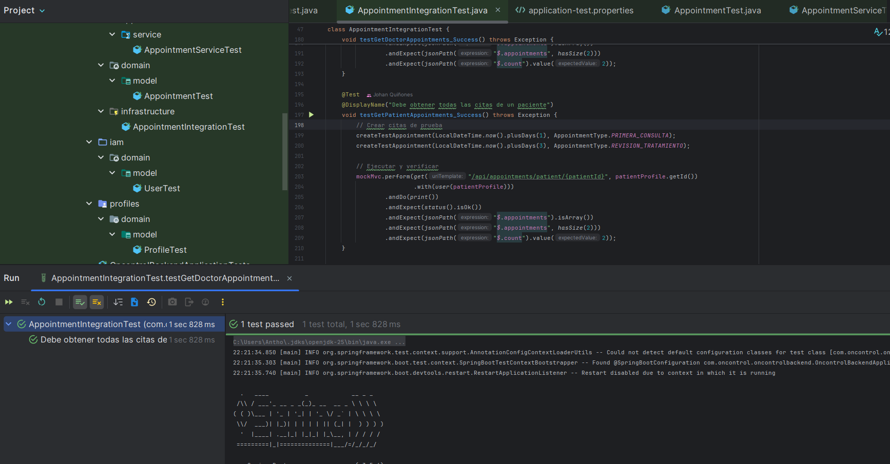
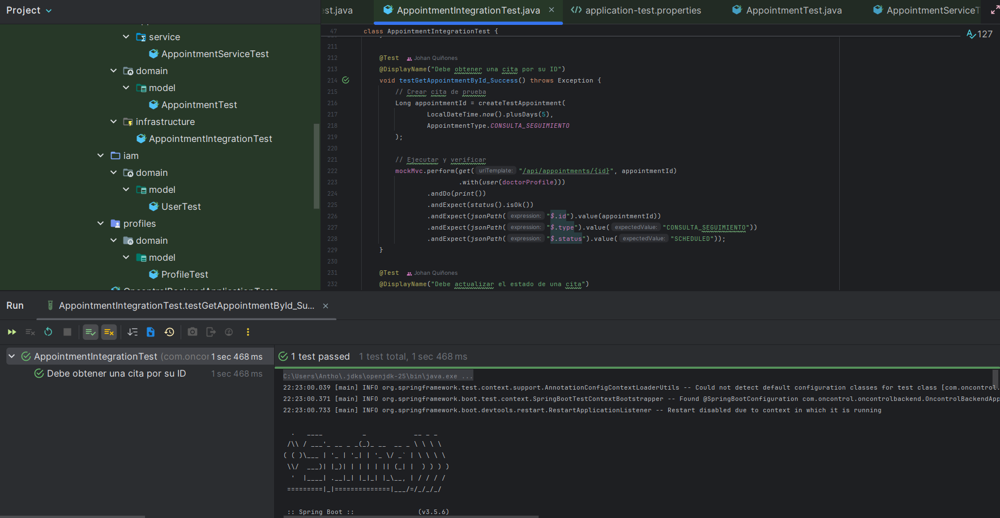
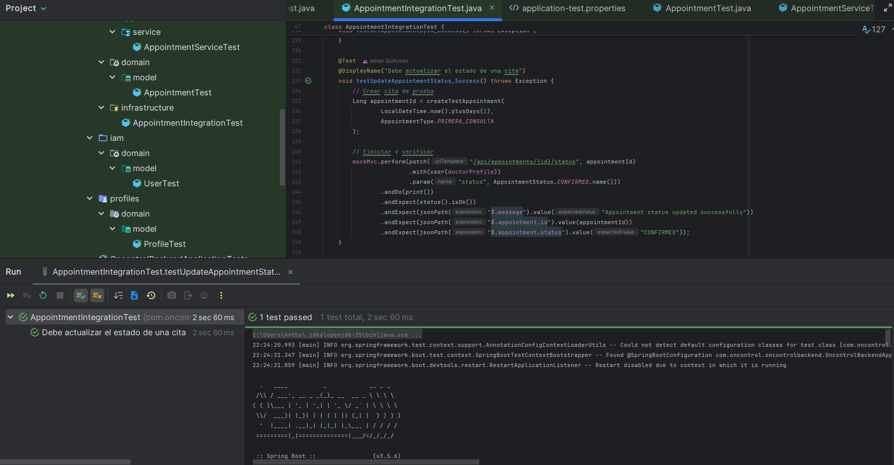
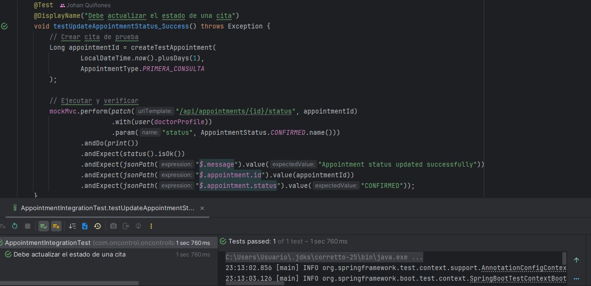

<div id='6.'><h2>Capítulo VI: Product Verification & Validation</h2></div>

<div id='6.1.'><h3>6.1. Testing Suites & Validation</h3></div>

<div id='6.1.1.'><h4>6.1.1. Core Entities Unit Tests</h4></div>
En esta sección se detallan las pruebas unitarias realizadas sobre las entidades principales del sistema, verificando que sus atributos, métodos y reglas de negocio funcionen correctamente de forma aislada. Estas pruebas aseguran que la lógica interna de cada componente cumple con los requisitos definidos y no presenta errores, contribuyendo a la solidez y confiabilidad de la aplicación.

1. **testCreateAppointment_Success**(AppointmentServiceTest)

Esta prueba verifica que el servicio puede crear una cita médica exitosamente cuando se proporcionan todos los datos válidos. Simula la búsqueda de perfiles de doctor y paciente en la base de datos, y valida que el objeto AppointmentResponse retornado contenga la información correcta incluyendo los nombres completos del doctor y paciente, el estado SCHEDULED, y que el método save del repositorio se haya invocado exactamente una vez.

```java
@Test
void testCreateAppointment_Success() {
    when(doctorRepository.findById(doctorId)).thenReturn(Optional.of(doctor));
    when(patientRepository.findById(patientId)).thenReturn(Optional.of(patient));
    when(appointmentRepository.save(any(Appointment.class))).thenReturn(appointment);

    AppointmentResponse response = appointmentService.createAppointment(request);

    assertEquals("SCHEDULED", response.getStatus());
    assertEquals(doctor.getFullName(), response.getDoctorName());
    assertEquals(patient.getFullName(), response.getPatientName());
    verify(appointmentRepository, times(1)).save(any(Appointment.class));
}

```
2. **testCreateAppointment_DoctorNotFound**(AppointmentServiceTest)

Esta prueba valida el manejo de errores cuando se intenta crear una cita pero el perfil del doctor no existe en la base de datos. Verifica que el sistema lance una RuntimeException apropiada y, lo más importante, que NO se intente guardar ninguna cita en el repositorio cuando faltan datos críticos, garantizando la integridad de los datos.

```java
@Test
void testCreateAppointment_DoctorNotFound() {
    when(doctorRepository.findById(doctorId)).thenReturn(Optional.empty());

    assertThrows(RuntimeException.class, () -> appointmentService.createAppointment(request));
    verify(appointmentRepository, never()).save(any());
}

```

3. **testGetAppointmentsByDoctor_Success**(AppointmentServiceTest)

Esta prueba confirma que el servicio puede recuperar correctamente todas las citas asociadas a un doctor específico. Simula una lista de citas retornadas por el repositorio y valida que la respuesta contenga el número correcto de elementos y que los datos del doctor estén presentes en cada respuesta, verificando también que se haya llamado al método del repositorio con el ID correcto.

```java
@Test
void testGetAppointmentsByDoctor_Success() {
    when(appointmentRepository.findByDoctorId(doctorId)).thenReturn(List.of(appointment1, appointment2));

    List<AppointmentResponse> responses = appointmentService.getAppointmentsByDoctor(doctorId);

    assertEquals(2, responses.size());
    responses.forEach(r -> assertEquals(doctor.getFullName(), r.getDoctorName()));
    verify(appointmentRepository).findByDoctorId(doctorId);
}

```

4. **testUpdateAppointmentStatus_ToCancelled**(AppointmentServiceTest)

Esta prueba verifica la funcionalidad de cancelación de citas, asegurando que cuando se actualiza el estado a CANCELLED, el sistema también registre correctamente la razón de cancelación y la fecha/hora en que ocurrió. Valida que todos los campos relacionados con la cancelación se actualicen apropiadamente y que los cambios se persistan en la base de datos mediante el repositorio.

```java
@Test
void testUpdateAppointmentStatus_ToCancelled() {
    when(appointmentRepository.findById(appointmentId)).thenReturn(Optional.of(appointment));
    when(appointmentRepository.save(any(Appointment.class))).thenReturn(appointment);

    appointmentService.updateAppointmentStatus(appointmentId, "CANCELLED", "Motivo de cancelación");

    assertEquals("CANCELLED", appointment.getStatus());
    assertNotNull(appointment.getCancelledAt());
    assertEquals("Motivo de cancelación", appointment.getCancellationReason());
    verify(appointmentRepository).save(appointment);
}

```

5. **testAddFollowUpNotes_Success**(AppointmentServiceTest)

Esta prueba valida que el sistema puede agregar notas de seguimiento a una cita existente después de que ha ocurrido. Verifica que las notas se almacenen correctamente en el objeto Appointment y que los cambios se guarden en la base de datos, lo cual es crucial para mantener el historial médico y las recomendaciones post-consulta.

```java
@Test
void testAddFollowUpNotes_Success() {
    when(appointmentRepository.findById(appointmentId)).thenReturn(Optional.of(appointment));
    when(appointmentRepository.save(any(Appointment.class))).thenReturn(appointment);

    appointmentService.addFollowUpNotes(appointmentId, "Notas de seguimiento");

    assertEquals("Notas de seguimiento", appointment.getFollowUpNotes());
    verify(appointmentRepository).save(appointment);
}

```

6. **testGenerateProfileId_Doctor**(ProfileTest)

Esta prueba verifica la generación automática de identificadores únicos para perfiles de doctores. Valida que cuando se crea un perfil de tipo DOCTOR, el sistema genere automáticamente un profileId que comience con el prefijo "DOC-", asegurando un sistema de identificación consistente y fácilmente reconocible en toda la aplicación.

```java
@Test
void testGenerateProfileId_Doctor() {
    Profile doctor = new Profile(ProfileType.DOCTOR, "John", "Doe");
    assertTrue(doctor.getProfileId().startsWith("DOC-"));
}

```

7. **testGenerateProfileId_Patient**(ProfileTest)

Similar a la prueba anterior pero para pacientes, esta prueba confirma que los perfiles de tipo PATIENT reciben identificadores con el prefijo "PAT-". Esto garantiza que el sistema pueda diferenciar rápidamente entre tipos de perfiles mediante sus identificadores únicos, facilitando búsquedas y validaciones.

```java
@Test
void testGenerateProfileId_Patient() {
    Profile patient = new Profile(ProfileType.PATIENT, "Jane", "Smith");
    assertTrue(patient.getProfileId().startsWith("PAT-"));
}

```

8. **testGetFullName**(ProfileTest)

Esta prueba valida un método de utilidad simple pero importante que concatena el nombre y apellido de un perfil. Aunque parece trivial, es fundamental para asegurar que la presentación de nombres en la interfaz de usuario sea consistente en toda la aplicación y que no haya problemas con espacios o formato.

```java
@Test
void testGetFullName() {
    Profile profile = new Profile(ProfileType.PATIENT, "Ana", "García");
    assertEquals("Ana García", profile.getFullName());
}

```

9. **testGetAuthorities_Organization**(UserTest)

Esta prueba verifica la implementación de Spring Security en el modelo User, específicamente que los usuarios con rol ORGANIZATION reciban las autoridades correctas. Valida que el método getAuthorities retorne una colección que contenga "ROLE_ORGANIZATION", lo cual es esencial para el control de acceso basado en roles en toda la aplicación.

```java
@Test
void testGetAuthorities_Organization() {
    User user = new User("org@example.com", "pass", Role.ORGANIZATION);
    Collection<? extends GrantedAuthority> authorities = user.getAuthorities();
    assertTrue(authorities.stream().anyMatch(a -> a.getAuthority().equals("ROLE_ORGANIZATION")));
}

```

10. **testDefaultValues**(UserTest)

Esta prueba integral verifica que cuando se crea un nuevo usuario, todos los valores predeterminados se establezcan correctamente. Valida que el rol sea ORGANIZATION por defecto, que la cuenta esté activa, que el email no esté verificado inicialmente, y que todas las banderas de seguridad de Spring (cuenta no expirada, no bloqueada, credenciales no expiradas) estén configuradas apropiadamente para un nuevo usuario.

```java
@Test
void testDefaultValues() {
    User user = new User("org@example.com", "pass");
    assertEquals(Role.ORGANIZATION, user.getRole());
    assertTrue(user.isActive());
    assertFalse(user.isEmailVerified());
    assertTrue(user.isAccountNonExpired());
    assertTrue(user.isAccountNonLocked());
    assertTrue(user.isCredentialsNonExpired());
}

```


<div id='6.1.2.'><h4>6.1.2. Core Integration Tests</h4></div>

1. **testCreateAppointment_Success**(AppointmentIntegrationTest) <br>
La prueba testCreateAppointment_Success valida el correcto funcionamiento del proceso de creación de citas médicas en el sistema. Mediante el uso de MockMvc, se simula una solicitud HTTP POST al endpoint correspondiente, verificando que la respuesta sea exitosa con el estado 201 (Created) y que los datos devueltos coincidan con los valores enviados. Esta prueba garantiza que el sistema registre adecuadamente las citas, manteniendo la coherencia y confiabilidad en la gestión de la información médica.

```java
@Test
    @DisplayName("Debe crear una cita exitosamente")
    void testCreateAppointment_Success() throws Exception {
        // Preparar datos
        CreateAppointmentRequest request = CreateAppointmentRequest.builder()
                .appointmentDate(LocalDateTime.now().plusDays(7))
                .durationMinutes(30)
                .type(AppointmentType.PRIMERA_CONSULTA)
                .location("Consultorio 101")
                .notes("Primera consulta de control")
                .preparationInstructions("Traer exámenes previos")
                .sendReminder(true)
                .build();

        // Ejecutar y verificar
        mockMvc.perform(post("/api/appointments/doctor/{doctorId}/patient/{patientId}",
                        doctorProfile.getId(), patientProfile.getId())
                        .with(user(doctorProfile))
                        .contentType(MediaType.APPLICATION_JSON)
                        .content(objectMapper.writeValueAsString(request)))
                .andDo(print())
                .andExpect(status().isCreated())
                .andExpect(jsonPath("$.message").value("Appointment created successfully"))
                .andExpect(jsonPath("$.appointment.id").exists())
                .andExpect(jsonPath("$.appointment.type").value("PRIMERA_CONSULTA"))
                .andExpect(jsonPath("$.appointment.status").value("SCHEDULED"))
                .andExpect(jsonPath("$.appointment.location").value("Consultorio 101"))
                .andExpect(jsonPath("$.appointment.durationMinutes").value(30));
    }

```


2. **testGetDoctorAppointments_Success**(AppointmentIntegrationTest) <br>
La prueba testGetDoctorAppointments_Success evalúa la capacidad del sistema para recuperar correctamente todas las citas asociadas a un médico específico. Utilizando MockMvc, se simula una solicitud HTTP GET al endpoint correspondiente y se verifica que la respuesta tenga el estado 200 (OK). Asimismo, se comprueba que el resultado contenga un arreglo con el número esperado de citas registradas, asegurando la correcta funcionalidad del módulo de consulta de citas médicas.

```java
@Test
    @DisplayName("Debe obtener todas las citas de un doctor")
    void testGetDoctorAppointments_Success() throws Exception {
        // Crear citas de prueba
        createTestAppointment(LocalDateTime.now().plusDays(1), AppointmentType.PRIMERA_CONSULTA);
        createTestAppointment(LocalDateTime.now().plusDays(2), AppointmentType.CONSULTA_SEGUIMIENTO);

        // Ejecutar y verificar
        mockMvc.perform(get("/api/appointments/doctor/{doctorId}", doctorProfile.getId())
                        .with(user(doctorProfile)))
                .andDo(print())
                .andExpect(status().isOk())
                .andExpect(jsonPath("$.appointments").isArray())
                .andExpect(jsonPath("$.appointments", hasSize(2)))
                .andExpect(jsonPath("$.count").value(2));
    }

```


3. **testGetPatientAppointments_Success**(AppointmentIntegrationTest) <br>
La prueba testGetPatientAppointments_Success verifica que el sistema pueda obtener correctamente todas las citas registradas para un paciente determinado. A través de MockMvc, se simula una solicitud HTTP GET al endpoint correspondiente, comprobando que la respuesta tenga el estado 200 (OK) y que contenga un arreglo con el número esperado de citas. Esta prueba garantiza la correcta recuperación y visualización de la información médica asociada a cada paciente dentro del sistema.

```java
@Test
    @DisplayName("Debe obtener todas las citas de un paciente")
    void testGetPatientAppointments_Success() throws Exception {
        // Crear citas de prueba
        createTestAppointment(LocalDateTime.now().plusDays(1), AppointmentType.PRIMERA_CONSULTA);
        createTestAppointment(LocalDateTime.now().plusDays(3), AppointmentType.REVISION_TRATAMIENTO);

        // Ejecutar y verificar
        mockMvc.perform(get("/api/appointments/patient/{patientId}", patientProfile.getId())
                        .with(user(patientProfile)))
                .andDo(print())
                .andExpect(status().isOk())
                .andExpect(jsonPath("$.appointments").isArray())
                .andExpect(jsonPath("$.appointments", hasSize(2)))
                .andExpect(jsonPath("$.count").value(2));
    }

```



4. **testGetAppointmentById_Success**(AppointmentIntegrationTest) <br>
La prueba testGetAppointmentById_Success comprueba que el sistema pueda recuperar correctamente una cita específica utilizando su identificador único. Mediante MockMvc, se simula una solicitud HTTP GET al endpoint correspondiente y se valida que la respuesta tenga el estado 200 (OK). Además, se verifica que los datos devueltos, como el ID, el tipo y el estado de la cita,  coincidan con los valores esperados, garantizando la fiabilidad del proceso de consulta individual de citas médicas.

```java
@Test
    @DisplayName("Debe obtener una cita por su ID")
    void testGetAppointmentById_Success() throws Exception {
        // Crear cita de prueba
        Long appointmentId = createTestAppointment(
                LocalDateTime.now().plusDays(5), 
                AppointmentType.CONSULTA_SEGUIMIENTO
        );

        // Ejecutar y verificar
        mockMvc.perform(get("/api/appointments/{id}", appointmentId)
                        .with(user(doctorProfile)))
                .andDo(print())
                .andExpect(status().isOk())
                .andExpect(jsonPath("$.id").value(appointmentId))
                .andExpect(jsonPath("$.type").value("CONSULTA_SEGUIMIENTO"))
                .andExpect(jsonPath("$.status").value("SCHEDULED"));
    }

```



5. **testUpdateAppointmentStatus_Success**(AppointmentIntegrationTest) <br>
La prueba testUpdateAppointmentStatus_Success comprueba que el sistema pueda actualizar correctamente el estado de una cita médica existente. Para ello, se crea una cita de prueba con una fecha futura y se ejecuta una solicitud HTTP PATCH al endpoint correspondiente, autenticando la acción con un perfil de doctor. Finalmente, se valida que la respuesta tenga el estado 200 (OK), contenga un mensaje de confirmación y refleje el nuevo estado CONFIRMED, garantizando el correcto funcionamiento del proceso de actualización de citas.

```java
@Test
    @DisplayName("Debe actualizar el estado de una cita")
    void testUpdateAppointmentStatus_Success() throws Exception {
        // Crear cita de prueba
        Long appointmentId = createTestAppointment(
                LocalDateTime.now().plusDays(1), 
                AppointmentType.PRIMERA_CONSULTA
        );

        // Ejecutar y verificar
        mockMvc.perform(patch("/api/appointments/{id}/status", appointmentId)
                        .with(user(doctorProfile))
                        .param("status", AppointmentStatus.CONFIRMED.name()))
                .andDo(print())
                .andExpect(status().isOk())
                .andExpect(jsonPath("$.message").value("Appointment status updated successfully"))
                .andExpect(jsonPath("$.appointment.id").value(appointmentId))
                .andExpect(jsonPath("$.appointment.status").value("CONFIRMED"));
    }
```



6. **testCancelAppointment_WithReason**(AppointmentIntegrationTest) <br>
La prueba testCancelAppointment_WithReason comprueba que el sistema permita cancelar correctamente una cita médica registrando una razón específica. Para ello, se crea una cita de prueba con una fecha futura y se ejecuta una solicitud HTTP PATCH al endpoint correspondiente, autenticando la acción con un perfil de doctor y enviando el nuevo estado CANCELLED junto con el motivo de cancelación. Finalmente, se valida que la respuesta tenga el estado 200 (OK), un mensaje de confirmación y el estado actualizado, asegurando el correcto funcionamiento del proceso de cancelación de citas.

```java
@Test
    @DisplayName("Debe cancelar una cita con razón")
    void testCancelAppointment_WithReason() throws Exception {
        // Crear cita de prueba
        Long appointmentId = createTestAppointment(
                LocalDateTime.now().plusDays(2), 
                AppointmentType.PRIMERA_CONSULTA
        );

        // Ejecutar y verificar
        mockMvc.perform(patch("/api/appointments/{id}/status", appointmentId)
                        .with(user(doctorProfile))
                        .param("status", AppointmentStatus.CANCELLED.name())
                        .param("reason", "El paciente solicitó reprogramar"))
                .andDo(print())
                .andExpect(status().isOk())
                .andExpect(jsonPath("$.message").value("Appointment status updated successfully"))
                .andExpect(jsonPath("$.appointment.status").value("CANCELLED"));
    }
```


7. **testAddFollowUpNotes_Success**(AppointmentIntegrationTest) <br>
La prueba testAddFollowUpNotes_Success comprueba que el sistema permita agregar correctamente notas de seguimiento a una cita previamente completada. Para ello, se crea una cita de prueba con fecha pasada, se actualiza su estado a COMPLETED y posteriormente se envía una solicitud HTTP PATCH al endpoint correspondiente con las notas de seguimiento en formato JSON. Finalmente, se valida que la respuesta tenga el estado 200 (OK), incluya un mensaje de confirmación y los datos de la cita actualizada, garantizando el correcto registro del seguimiento médico.

```java
@Test
    @DisplayName("Debe agregar notas de seguimiento a una cita completada")
    void testAddFollowUpNotes_Success() throws Exception {
        // Crear y completar cita de prueba
        Long appointmentId = createTestAppointment(
                LocalDateTime.now().minusDays(1), 
                AppointmentType.PRIMERA_CONSULTA
        );

        // Completar la cita primero
        mockMvc.perform(patch("/api/appointments/{id}/status", appointmentId)
                        .with(user(doctorProfile))
                        .param("status", AppointmentStatus.COMPLETED.name()))
                .andExpect(status().isOk());

        // Agregar notas de seguimiento
        String notesJson = objectMapper.writeValueAsString(
                java.util.Map.of("notes", "El paciente presenta mejoría significativa")
        );

        mockMvc.perform(patch("/api/appointments/{id}/follow-up", appointmentId)
                        .with(user(doctorProfile))
                        .contentType(MediaType.APPLICATION_JSON)
                        .content(notesJson))
                .andDo(print())
                .andExpect(status().isOk())
                .andExpect(jsonPath("$.message").value("Follow-up notes added successfully"))
                .andExpect(jsonPath("$.appointment.id").value(appointmentId));
    }
```


8. **testCreateAppointment_MissingDate**(AppointmentIntegrationTest) <br>
La prueba testCreateAppointment_MissingDate comprueba que el sistema valide correctamente los datos obligatorios al intentar crear una cita médica sin especificar una fecha. Para ello, se construye una solicitud con información incompleta y se envía mediante una petición HTTP POST al endpoint correspondiente. Finalmente, se verifica que la respuesta tenga el estado 400 (Bad Request), asegurando que el sistema rechace apropiadamente solicitudes con datos inválidos.

```java
@Test
    @DisplayName("Debe fallar al crear una cita sin fecha")
    void testCreateAppointment_MissingDate() throws Exception {
        // Preparar datos inválidos (sin fecha)
        CreateAppointmentRequest request = CreateAppointmentRequest.builder()
                .durationMinutes(30)
                .type(AppointmentType.PRIMERA_CONSULTA)
                .location("Consultorio 101")
                .build();

        // Ejecutar y verificar que falla la validación
        mockMvc.perform(post("/api/appointments/doctor/{doctorId}/patient/{patientId}",
                        doctorProfile.getId(), patientProfile.getId())
                        .with(user(doctorProfile))
                        .contentType(MediaType.APPLICATION_JSON)
                        .content(objectMapper.writeValueAsString(request)))
                .andDo(print())
                .andExpect(status().isBadRequest());
    }
```


9. **testGetAppointmentById_NotFound**(AppointmentIntegrationTest) <br>
La prueba testGetAppointmentById_NotFound comprueba que el sistema maneje correctamente la búsqueda de una cita médica utilizando un identificador inexistente. Para ello, se realiza una solicitud HTTP GET al endpoint correspondiente con un ID no registrado en la base de datos. Finalmente, se valida que la respuesta tenga el estado 404 (Not Found) y contenga un mensaje descriptivo, garantizando el adecuado manejo de errores en consultas de citas inexistentes.

```java
@Test
    @DisplayName("Debe fallar al obtener una cita con ID inexistente")
    void testGetAppointmentById_NotFound() throws Exception {
        Long nonExistentId = 99999L;

        mockMvc.perform(get("/api/appointments/{id}", nonExistentId)
                        .with(user(doctorProfile)))
                .andDo(print())
                .andExpect(status().isNotFound())
                .andExpect(jsonPath("$.message").exists());
    }
```


<div id='6.1.3.'><h4>6.1.3. Core Behavior-Driven Development</h4></div>

En esta sección se describe cómo el equipo utiliza la metodología Behavior-Driven Development (BDD) para asegurar que el sistema cumpla con los requisitos funcionales desde la perspectiva del usuario final. Se emplean escenarios escritos en lenguaje natural, utilizando la herramienta Cucumber junto con Gherkin, para definir y automatizar pruebas que validan los flujos principales de la aplicación, como el agendamiento de citas médicas. Esto permite una mejor comunicación entre desarrolladores, testers y stakeholders, facilitando la detección temprana de errores y asegurando que el software entregue valor real al usuario.

**Acceptance Tests:**

* appointment-booking.feature:


* appointment-list.feature:


  
* landing-contact.feature:


* landing-navigation.feature:


* login.feature:


* password-change.feature:


* profile-management.feature:


* user-registration.feature:


<div id='6.1.4.'><h4>6.1.4. Core System Tests</h4></div>

En esta sección se presentan las pruebas desarrolladas para verificar el correcto funcionamiento de los componentes individuales de la aplicación. Estas pruebas aseguran que cada clase y método cumpla con su responsabilidad de manera aislada, contribuyendo a la calidad, mantenibilidad y robustez del sistema, y permitiendo detectar errores de forma temprana durante el ciclo de desarrollo.

**Verificacion de todas las pruebas**

<br>


<br><br>

* **Pruebas Unitarias:**


<br><br><br>


<br><br><br>


<br><br><br>


<br><br><br>


<br><br><br>


<br><br><br>


<br><br><br>


<br><br><br>


<br><br><br>

* **Pruebas de integración:**


<br><br><br>


<br><br><br>


<br><br><br>


<br><br><br>


<br><br><br>


<br><br><br>


<br><br><br>


<br><br><br>


<br><br><br>